# Session

一个 agent 跑一阵子之后，身上挂着一堆东西：说过的话、调过的工具、花掉的 token、当前的待办清单、这个会话叫什么名字。问题只有一个——**这些东西里，哪一样是真的？**

一种直觉的做法是每一样都直接存一份：

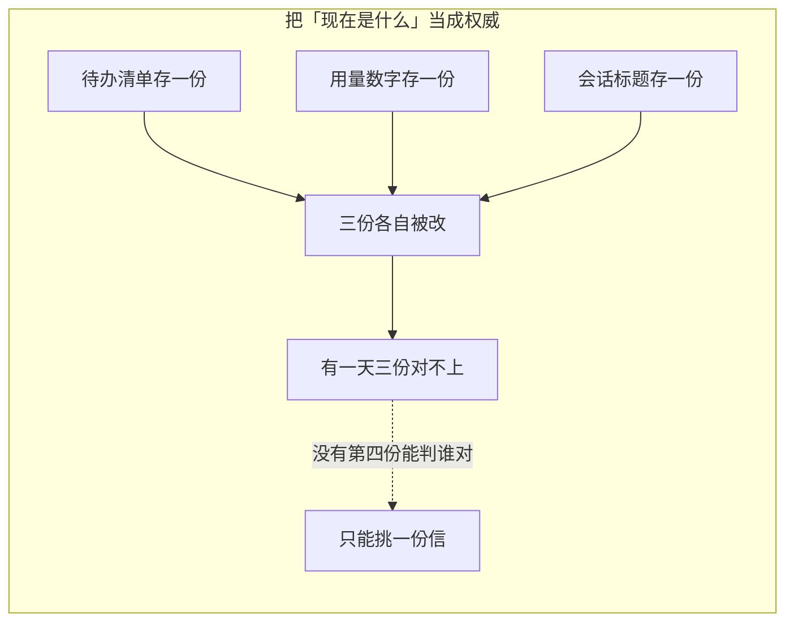

这个模块不这么做：

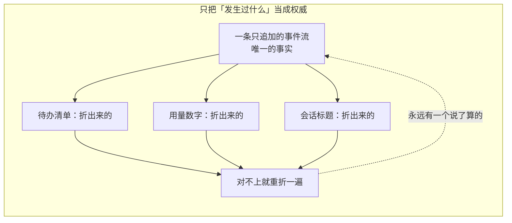

一句话：**这里只存发生过什么，别的全是算出来的。**

---

## 定位

这个模块管两件事——把发生过的事一条不落地记下来，再把它折成程序和界面直接用得上的当下状态。

它自己又分成两半，分开是刻意的：

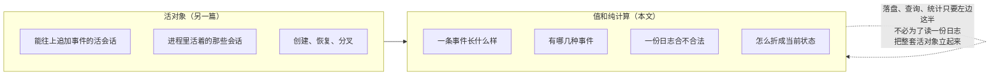

活的那一半写在[活会话](livesession.md)那篇里。

一条事件写进来之后要走四段路，**只有第一段是事实**：

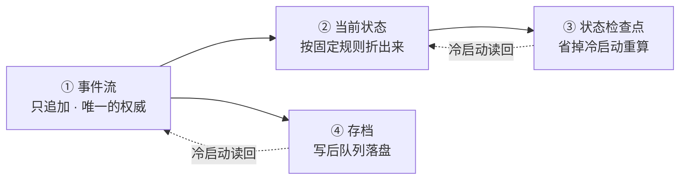

**这张图上只有那两条虚线是反向的**：冷启动时存档和检查点回填内存。除此之外一律从事实流向派生，没有一处派生结果写得回事件流。

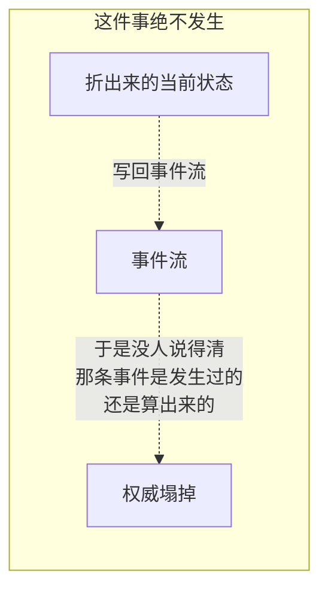

各段由一族包分担：

| 管什么 | 落在哪个包 |
|---|---|
| 事件词汇、负载、日志校验与修复 | `sessionlog` |
| 把日志折成当前状态的那套框架 | `sessionlog/projection` |
| 存档形状、写后队列、活会话编排 | `feature/persistence` |
| 什么时候必须真落盘 | `feature/checkpointpolicy` |
| 折叠中间结果的检查点 | `feature/projectioncache` |
| 整会话回合大纲 | `feature/turnoutline` |
| 数字、名字、上报 | `feature/sessionstats`、`feature/sessiontitle`、`feature/telemetry` |

---

## 架构：事实、派生、落盘

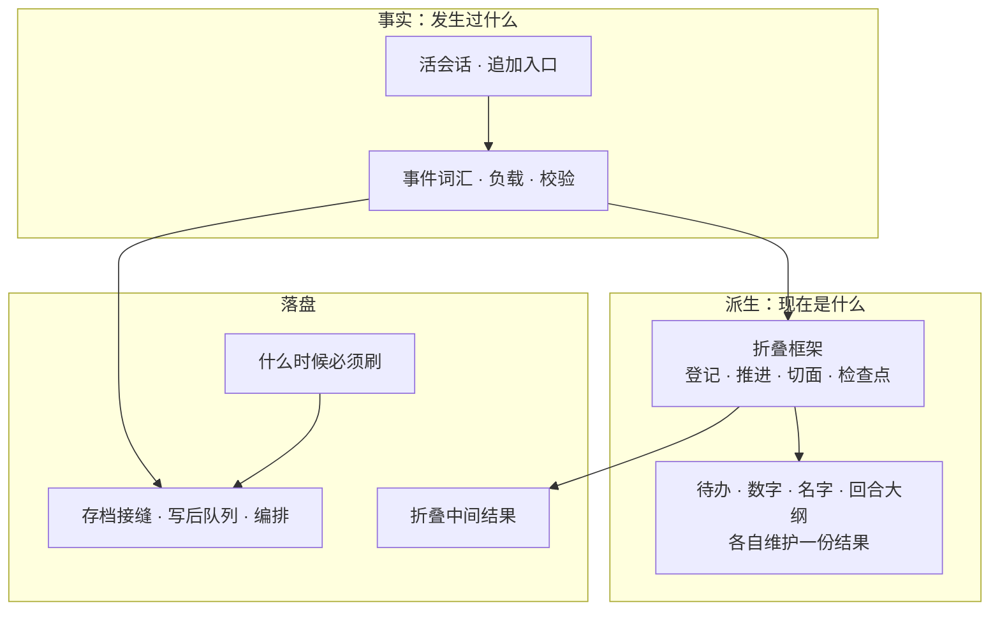

折叠这件事的分工也是单向的：

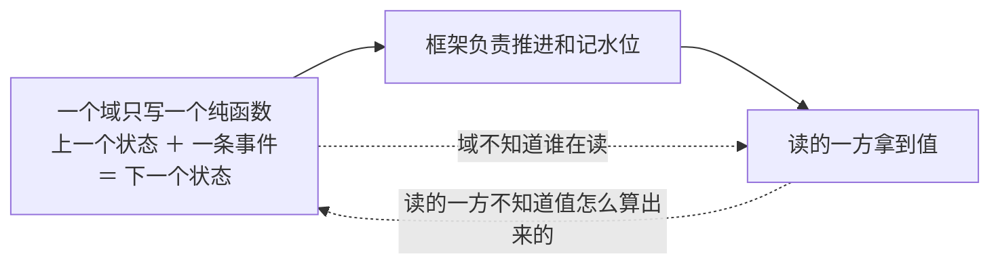

---

## 事件流：唯一的权威

日志按顺序记录发生过什么：回合开了、步骤开了、用户说了一句、模型吐了一块、模型说完一条、要调某个工具、工具给了结果、运行期上下文投了一份快照、压缩打了一个检查点。

扩展模块可以往这份词汇里添自己的事件种类：


认不出来的事件分两种走法，这是刻意的：

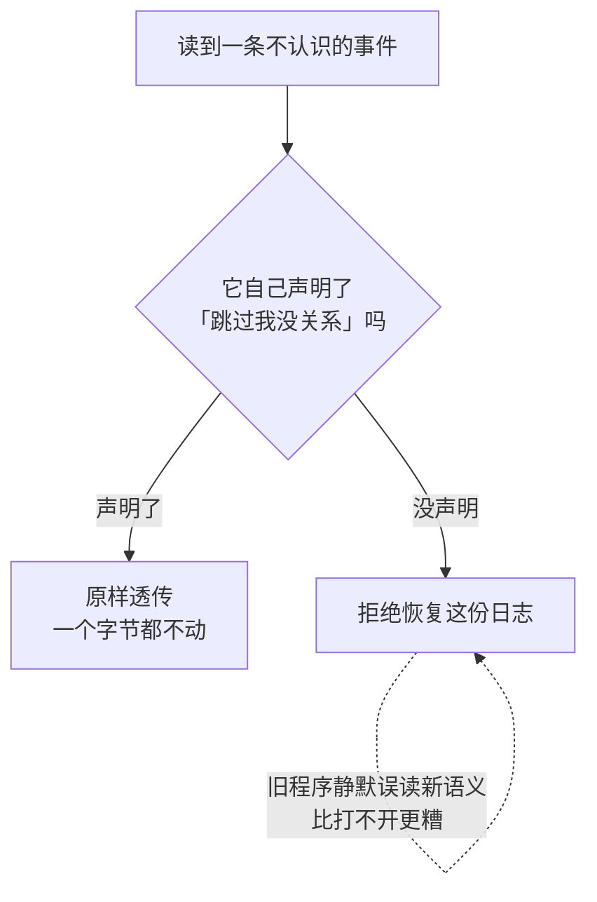

事件负载存的是原始字节，不是解好的结构：

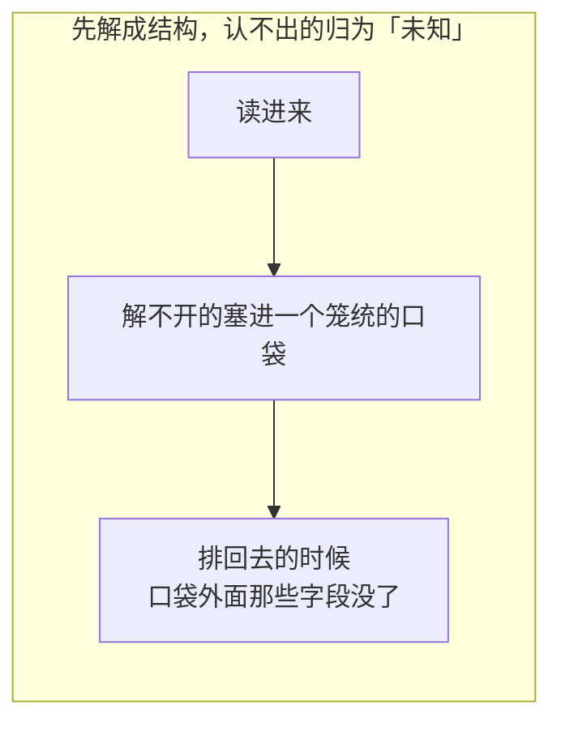

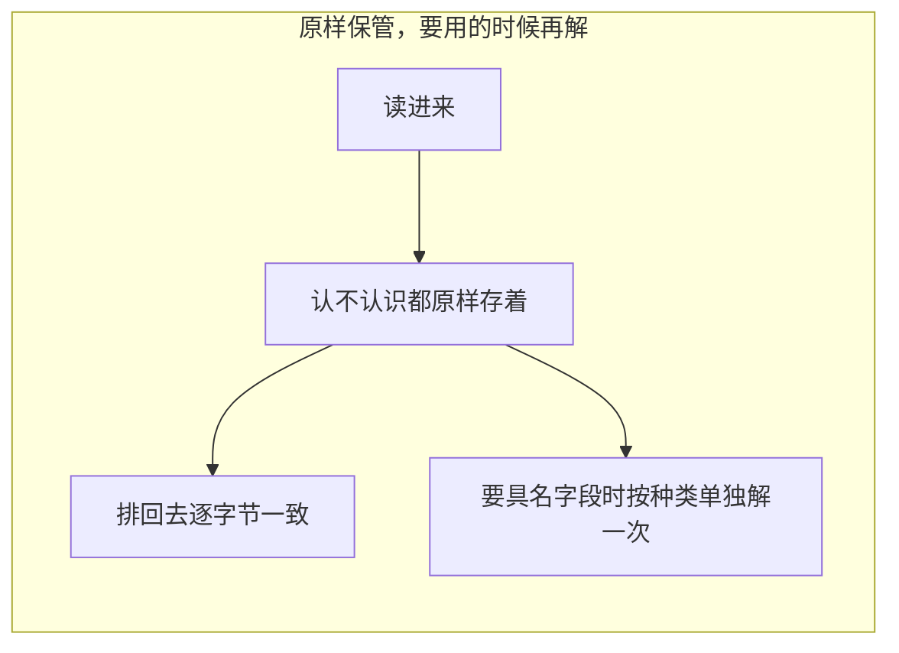

理由是日志是**耐久的**：一个只认识十几种事件的构建，读到一条新构建写下的事件时，正确的动作是原样保管，而不是把它降解成一句「不认识」再排回去。

### 序号连续，但不从零起

存档按条数封顶，满了从最老的一头先进先出地丢。所以一份日志现存最早那条的序号**是个变量**：

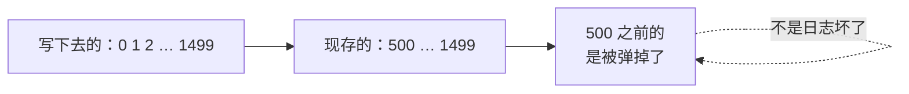

凡是拿序号去定位一条事件的地方，都要走同一条三步：

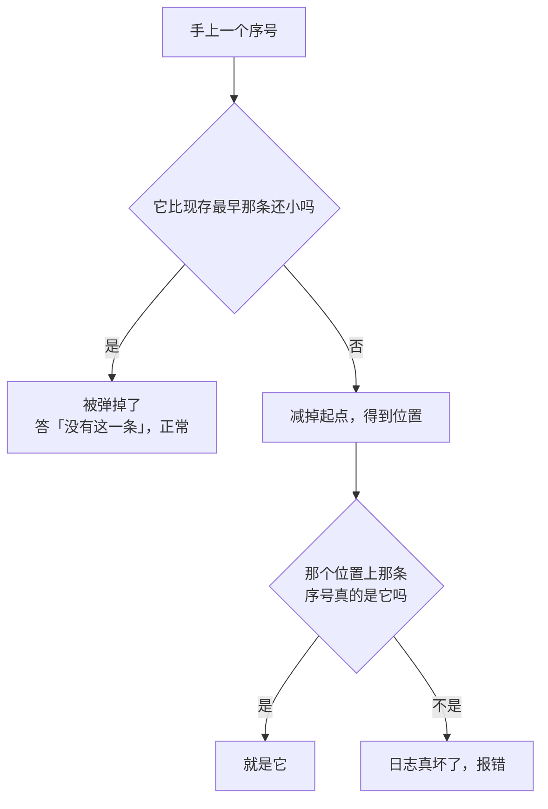

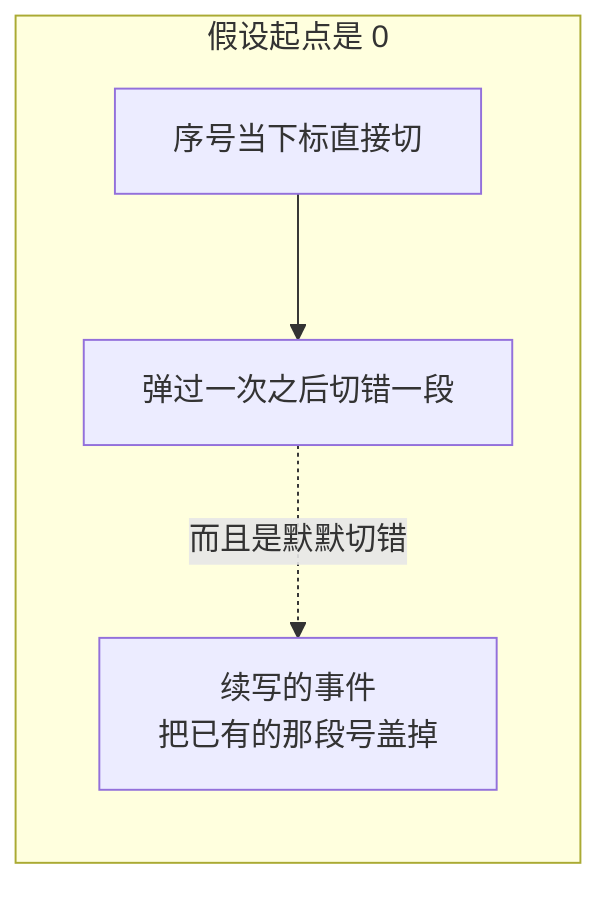

「日志的头部会被删」是这个模块的**权威前提**，不是一种可选情形。整套取舍写在[会话日志上限](../session-log-limit.md)，源码里三十来处注释指着它。

一个会话继承自父会话的那一段也因此不能用条数表达：

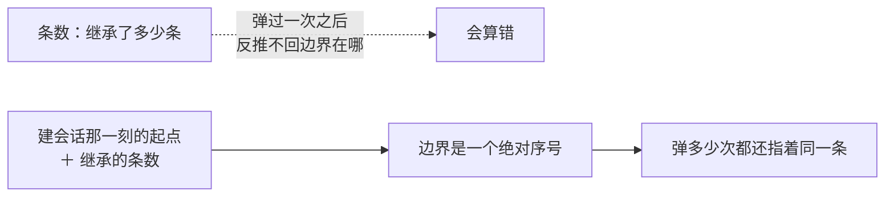

---

## 当前状态：从事实折出来

事件流记的是动作，可程序要的往往是「现在是什么」：

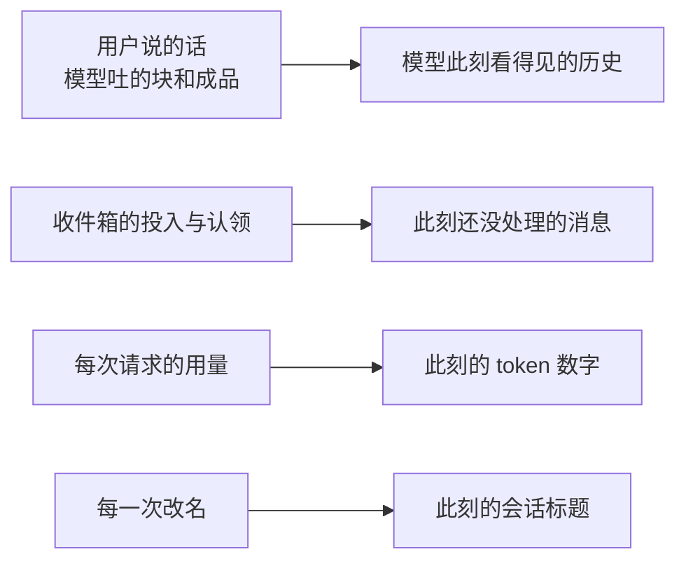

**这是一段固定的程序，不是让模型去读聊天记录做总结。** 同一份合法日志加同一版规则，必须折出同样的结果。

一个折叠单元要声明这几样：

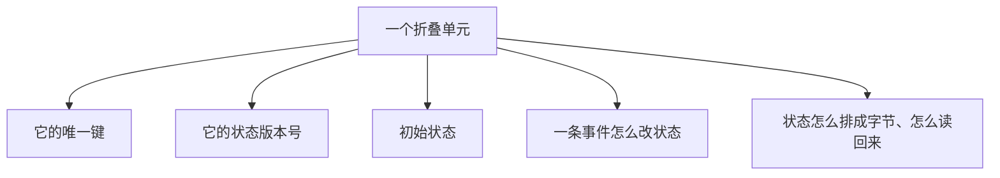

不相干的事件不会打扰它：

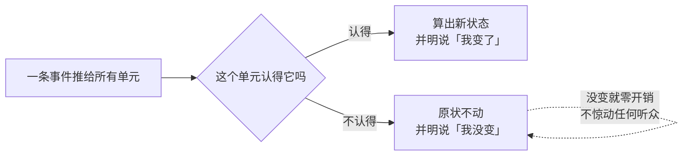

「变没变」由单元自己说，不是框架去比：一份状态里通常有切片和 map，逐层深比既贵又容易在边角上判错。

读当前状态有三级，代价一级比一级高：

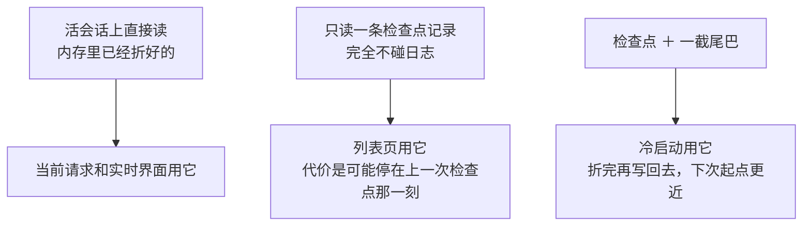

---

## 状态检查点：省掉冷启动重算

折叠的代价随日志长度线性增长。一个跑了两天的会话，每次冷启动都从最早那条重折一遍是不可接受的：

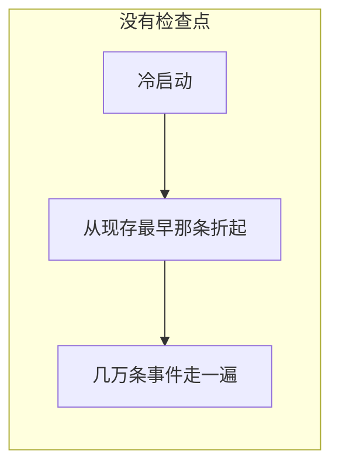

```mermaid
flowchart LR
    subgraph GOOD4["有检查点"]
        B1["冷启动"] --> B2["读一条记录：折到哪个序号、各单元当时什么状态"] --> B3["只补那截尾巴"]
    end
```

什么时候写：

```mermaid
flowchart TD
    W{"写检查点的时机"}
    W --> W1["一个回合结束"]
    W --> W2["攒够了条数"]
    W --> W3["到了时间"]
    W --> W4["会话从内存里退场<br/>——最后一次机会，同步写掉"]
    W4 -.->|"做成即发即忘<br/>等于让最重要的那次<br/>去和进程退出赛跑"| W4
```

一条不能破的次序：

```mermaid
flowchart LR
    A["日志这一段先真落盘"] --> B["再写检查点"]
    B --> C["检查点可以落后"]
    C -.->|"绝不许领先"| D["领先的检查点指着<br/>一段还不存在的日志"]
```

读不出来的时候一律退回去重折，不报错：

```mermaid
flowchart TD
    A{"这条检查点能用吗"} -->|"缺失"| X["退回重折"]
    A -->|"解不开"| X
    A -->|"状态版本对不上"| X
    A -->|"绑的是另一段日志"| X
    A -->|"记的水位落在被弹掉那一段里"| X
    X --> Y["各单元在现存这一段上从头折"]
```

版本对不上时**丢掉那一行，不做迁移**：迁移要求这一层读得懂每一个单元的状态语义，而它一个都不认识。

绑日志身份这一条容易被忽略：

```mermaid
flowchart LR
    A["会话 id 是一个槽位<br/>不是一段生命"] --> B["删掉再建同一个 id"]
    A --> C["或者把存档整个换一份"]
    B --> D["一条旧记录会通过所有水位检查"]
    C --> D
    D -.->|"然后端出一段<br/>和这份日志毫无关系的状态"| D
```

在一份被弹过头部的日志上重折，结果是**残缺的**：

```mermaid
flowchart LR
    A["某个单元最后一次更新<br/>恰好落在被弹掉那一段里"] --> B["重折之后它是空的"]
    B --> C["照样把这份残缺的交出去"]
    C -.->|"读得到一份残缺的<br/>好过读不出来"| C
```

解不开的那一条和过期的那一条走同一条退路，但**必须留下一条告警**：过期是设计内的，解不开说明这个构建自己写坏了那一行，而它的症状只是「每次冷启动慢一点」，不留痕迹就永远没人去查。

---

## 写进去的规矩

```mermaid
flowchart TD
    A["一个会话"] --> B["只许一个写者"]
    B --> C["正常情况下就是驱动它的那个循环"]
    D["第二个写者"] -.->|"当场拒绝"| B
```

```mermaid
flowchart TD
    A["追加一条事件"] --> B["先进日志"]
    B --> C["松开锁"]
    C --> D["再通知观察者"]
    D --> E{"观察者回头又追加一条"}
    E -->|"被挡下"| F["重入追加一律拒绝"]
```

```mermaid
flowchart LR
    A["交给外面的事件切片"] --> B["是一份副本"]
    B --> C["拿到的人当只读用"]
    D["进程里的任何对象"] -.->|"绕不过追加入口<br/>直接改日志"| A
```

日志本身要过一遍校验：序号、回合与步骤的配对、工具调用和工具结果的配对、每条负载的形状。

### 创建、恢复、分叉

```mermaid
flowchart LR
    C1["新建"] --> C2["写下会话身份、建立时刻、父会话、<br/>继承边界、来路、委派深度、预设"]
    R1["恢复"] --> R2["读回存档，过格式、词汇、结构三道校验<br/>再重建活对象"]
    F1["分叉"] --> F2["按一段合法的历史前缀开新会话<br/>记住父会话和继承边界"]
```

分叉对「合法前缀」的要求很硬：

```mermaid
flowchart TD
    A{"切在哪里"} -->|"回合完整、步骤完整、没有悬空的工具调用"| B["可以切"]
    A -->|"切在一个开着的回合中间"| C["拒绝"]
    A -->|"切在一次没有结果的工具调用后面"| C
    C -.->|"孩子重放出来的历史不合法<br/>而错误会在它第一次上模型时才露头"| C
```

分叉要的是那些事件本身，不是从它们折出来的状态，所以这条路上**没有「残缺着往下走」这个选项**。

---

## 落盘

```mermaid
sequenceDiagram
    participant S as 活会话
    participant H as 编排那一侧
    participant Q as 写后队列
    participant B as 存档后端

    S->>H: 建了、来了一条事件、要求刷盘、退场了
    H->>H: 按会话身份排成一条队
    H->>Q: 交一批连续的事件
    Q->>B: 到点写下去
    B-->>Q: 落没落
    Q-->>H: 失败就把缓冲留着
    H-->>S: 完成屏障 / 交回失败
```

```mermaid
flowchart LR
    A["写不进去"] --> B["把失败交回编排那一侧"]
    B -.->|"绝不许记条日志<br/>就当提交成功了"| B
```

存档带一个修订令牌，用来判断同一份日志在两次观察之间变没变过。

### 裁剪是独立的一道缝

```mermaid
flowchart LR
    subgraph BAD5["把「丢多少」做成追加的副作用"]
        A1["一个只想追加的调用方"] -.->|"被迫连着丢东西"| A2["而丢多少<br/>是编排层的策略<br/>不是介质的事"]
    end
```

```mermaid
flowchart LR
    subgraph GOOD5["单开一道缝"]
        B1["追加就只是追加"] --> B2["要裁剪的后端另外满足一道窄接缝"]
        B2 --> B3["满足不了的后端<br/>存档永远从最初那条起"]
        B3 -.->|"读的一侧本来就不许假设起点是 0<br/>所以两种后端读起来没有分别"| B3
    end
```

```mermaid
flowchart LR
    A["条数上限"] -.->|"没有一个「关掉它」的取值"| B["留一个开关<br/>就等于留一条路<br/>退回「日志一条不删」那个旧前提"]
```

```mermaid
flowchart TD
    A["裁剪必须丢连续的一头"] --> B["从中间挖走一条会怎样"]
    B --> C["「被弹掉了」和「日志真坏了」<br/>再也分不开"]
    C -.->|"而整个模块的错误分类<br/>都压在这个判断上"| C
```

### 什么时候必须真落盘

三处，共同点是**再往前一步，后果就跑到日志管不着的地方去了**：

```mermaid
flowchart TD
    A["模型请求发出前"] --> A1["发出去就开始花钱<br/>模型也开始产出<br/>此后进程挂掉<br/>恢复出来的会话缺掉这次请求"]
    B["顶层工具调用执行前"] --> B1["工具是唯一能改到会话之外的地方<br/>写文件、发请求、跑命令"]
    C["每个步骤开始前"] --> C1["刷的是上一步提交的那一批"]
```

第三处放在下一步开头而不是上一步结尾，是有理由的：

```mermaid
flowchart LR
    A["一个步骤的结尾<br/>未必有下文"] --> B["挂在那儿就得<br/>为「跑完了」再找一个收尾钩子"]
    C["而下一次请求<br/>一定会发生"] --> D["挂在必然发生的那件事上"]
    D --> E["第一个步骤上那一下空转<br/>是有意的"]
```

```mermaid
flowchart LR
    A["一次工具调用<br/>在自己体内又调了工具"] --> B["不再刷"]
    B --> C["外层进来时已经刷过<br/>那条记录早就耐久了"]
    C -.->|"再刷一遍是拿一次落盘换零收获"| C
```

```mermaid
flowchart TD
    A["刷不下去"] --> B["关门"]
    B --> C["模型适配器一次都不起步"]
    B --> D["工具体一次都不起步"]
    B --> E["这个步骤不往下走"]
    B -.->|"刷不下去说明日志已经不可信<br/>此时放行等于亲手制造<br/>一段没人记得的历史"| B
```

---

## 查询与回合大纲

[会话查询](sessionquery.md)那一侧提供按身份、父会话、建立时刻、可用性挑会话，按文字、种类、序号、时刻找事件，读当前表面或原始事件，追溯一条事件的来龙去脉和一个会话的血统，以及对多个会话做受控并发的折叠。

```mermaid
flowchart LR
    A["把查询能力开给模型"] --> B["必须由宿主先做权限检查"]
    B -.->|"否则模型凭一个会话身份<br/>就能读到别人的会话"| B
```

一个几千回合的会话，客户端不可能把事件全装在手里。大纲折出的是**一份只有目录的清单**：

```mermaid
flowchart LR
    subgraph L["日志（几千条事件）"]
        E1["回合开始"] --> E2["用户消息"] --> E3["助手消息 ×N"] --> E4["回合结束"]
    end
    L --> F["折成大纲"]
    F --> O["一行：回合号 · 跳转坐标<br/>提示词预览 · 回复预览"]
    O --> C["客户端把没加载的回合也列得出来<br/>点哪一行就照坐标去取那一段"]
```

```mermaid
flowchart TD
    A{"跳转坐标记哪一条"}
    A -->|"回合开始那一条"| B["往回翻到它<br/>整个回合都在窗口里"]
    A -->|"那句提示词"| C["回合边界本身<br/>漏在窗口外面"]
    C -.->|"所以锚在回合开始上"| C
```

```mermaid
flowchart TD
    A["一个回合最多推三次"] --> B["回合边界落下 → 追一条空记录"]
    A --> C["第一条用户消息 → 填上提示词预览"]
    A --> D["回合结束 → 把草稿定稿成回复预览"]
    E["中途每一条助手消息"] -.->|"只改草稿，不惊动听众"| A
    E -.->|"一个回合里助手可能说很多次<br/>列表要的是最后那次"| E
```

```mermaid
flowchart LR
    A["预览按字收"] --> B["量的是列表卡片上<br/>放得下几行字"]
    C["按字节收"] -.->|"一行中文会在三分之一处被砍断"| B
```

大纲不给回合起名字：预览就是原文的前几十个字，不是摘要。

---

## 数字、名字和上报

三样能力读的是同一份事实，各自维护自己的结果和生命周期。

```mermaid
flowchart LR
    A["同一份事件流"] --> B["数字：回合数、步骤数、消息数、token、各段耗时"]
    A --> C["名字：这个会话叫什么"]
    A --> D["上报：脱敏之后交给宿主的接收器"]
```

数字这一侧有一个容易做错的选择：

```mermaid
flowchart TD
    A{"数步骤该数哪一种事件"}
    A -->|"数装配好的助手消息"| B["撞上 token 上限那条<br/>内容是空的、根本不上表面 → 多数了"]
    A -->|"数装配好的助手消息"| C["被取消的步骤<br/>消息还没装出来就断了 → 少数了"]
    A -->|"数步骤结束"| D["跑完的、失败的、被取消的、撞上限的<br/>一律各留一条"]
    D -.->|"它才是步骤生命周期的权威"| D
```

```mermaid
flowchart LR
    A["它数的是日志里的事件"] --> B["不是模型表面上的节点"]
    B --> C["翻页翻了多少、压缩掉了多少<br/>都改不了它的答案"]
```

名字这一侧最反直觉的一条是：**标题也是一条事件，不是会话头上的一个可变字段。**

```mermaid
flowchart LR
    subgraph BAD6["存成一个可变字段"]
        A1["谁起的？"] -.->|"答不上来"| A2["一个字符串"]
        A3["从哪几句话起的？"] -.->|"答不上来"| A2
        A4["换了模型、改了提示词之后<br/>为什么变成这样？"] -.->|"答不上来"| A2
    end
```

```mermaid
flowchart LR
    subgraph GOOD6["写成日志上的一条事件"]
        B1["来路、依据、时刻全都在里面"] --> B2["回放一份日志<br/>照样答得上话"]
    end
```

```mermaid
flowchart TD
    S{"三种来路"}
    S -->|"兜底"| S1["截第一条人话的前几个词<br/>不花钱、不上模型<br/>让列表行立刻有名字"]
    S -->|"生成"| S2["登记进来的提供方产出<br/>异步、会被取代"]
    S -->|"用户改的"| S3["钉住这个名字"]
    S3 --> S4["在途的自动生成当场作废<br/>后面的用户消息也不再排期"]
    S4 --> S5["解开只有一条路：一次显式的重来"]
```

上报这一侧只做采集，不做投递：

```mermaid
flowchart LR
    A["采集：有哪些记录、带什么、什么时候采、交出去之前谁能改"] --> B["交给宿主的接收器"]
    B --> C["攒批、重试、排队、丢弃<br/>全在接收器那一侧"]
    A -.->|"采集跑在循环的热路径上<br/>而攒批天生是要等的<br/>混在一起早晚会拖住不能等的那个"| A
```

```mermaid
flowchart LR
    A["交接游标记的是<br/>「已经交出去的最高序号」"] --> B["不是「已经送到了」"]
    B --> C["再往下发生什么<br/>采集这一侧看不见"]
```

---

## 生命周期与并发

```mermaid
flowchart TD
    A["活会话有自己的锁<br/>会话名册也有自己的锁"] --> B["绝不同时握着两把去调外面的代码"]
    C["所有观察者回调"] --> D["一律在锁外跑"]
    D -.->|"回调里反手调回来<br/>会当场把自己锁死"| C
```

```mermaid
flowchart LR
    A["写后落盘和状态检查点<br/>可以在后台跑"] --> B["但水位必须守住"]
    B --> C["日志先真落盘，检查点才写"]
```

```mermaid
flowchart LR
    A["会话存档走一条接缝"] --> C["两条互不相干"]
    B["状态检查点走另一条"] --> C
    C -.->|"填了一条不等于另一条也有了"| C
```

```mermaid
flowchart LR
    A["刷盘"] --> B["是一道耐久屏障"]
    C["普通的内存更新"] --> D["不是"]
    B -.->|"两者不能混为一谈"| D
```

---

## 失败语义

失败分成两类，处理方式正好相反：

```mermaid
flowchart TB
    A["读不出来<br/>检查点缺失 · 解不开 · 版本不符<br/>水位落在被弹掉那一段里"] --> A2["退回去重折<br/>折不全就交出残缺的那份<br/>不报错"]
    B["写不进去<br/>刷盘没成功"] --> B2["当场拦住<br/>模型请求、工具、步骤都不许往下走"]
```

分开的理由是**副作用有没有发生**：

```mermaid
flowchart LR
    A["读失败时<br/>什么都还没做"] --> B["交一份残缺状态<br/>好过让会话打不开"]
    C["写失败时<br/>下一步就要发请求或跑工具"] --> D["放行等于让副作用<br/>落在一份没落盘的日志上"]
```

其余几条：

```mermaid
flowchart TD
    A["不认识的事件"] --> A1["声明可跳过的：透传"]
    A --> A2["没声明的：拒绝恢复"]
    B["崩溃尾巴"] --> B1["只修能安全判断的那一段"]
    B --> B2["判断不了就失败，不猜"]
    C["重入追加"] --> C1["直接拒绝"]
    D["检查点写失败"] --> D1["只影响下次冷启动的速度<br/>不改变已经提交的事实"]
```

```mermaid
flowchart LR
    A["落在起点之前的序号"] --> B["是被弹掉了"]
    A -.->|"不是日志坏了"| C["两者的处置完全不同<br/>混在一起会让正常状态报成故障"]
```

---

## 能力边界

```mermaid
flowchart TD
    Y["这个模块做的"] --> Y1["事件格式、校验、活会话"]
    Y --> Y2["创建、恢复、分叉、生命周期通知"]
    Y --> Y3["存档接缝与写后原语"]
    Y --> Y4["折叠、检查点、查询、数字、名字、上报"]
```

```mermaid
flowchart TD
    N["不做的"] --> N1["不决定模型怎么回答、工具怎么执行"]
    N --> N2["不做鉴权和租户权限"]
    N --> N3["不提供具体的对外接口"]
    N --> N4["不把状态检查点当成权威"]
    N --> N5["不自动修复所有语义损坏<br/>判断不了就必须失败"]
    N --> N6["不知道底下是什么介质<br/>数据库那一摊整个在别处"]
```

## 对应的 DSH 能力

下表由 [`docs/packages.md`](../packages.md) 与 [能力覆盖表](../portmap/capability-coverage.tsv) 机器 join 得到：本篇覆盖的 Go 包，承接的是上游 DSH 的哪几条能力，以及各自还缺什么。落点列由源码里的 `// 源:` 注释反查，不是手写的。

| 上游能力 | DSH 包 | 裁决 | 落在哪个 Go 包 | 这里缺什么 |
|---|---|---|---|---|
| 事件溯源的会话日志和内存存储，为agent保留全部交互历史 | `core/session` | 需要 | `sessionlog` | — |
| 在模型适配器前与工具正文前为事件溯源会话创建检查点，持久化前一响应与工具结果 | `session/session-checkpoint-policy` | 需要 | `feature/checkpointpolicy` | — |
| 会话持久化能力接缝，定义会话事件存储、加载与列表接口 | `session/session-persistence` | 需要 | `feature/persistence` | — |
| 会话投影Service Definition与驱动注册表，对已提交事件驱动客户端读模型 | `session/session-projection` | 需要 | `sessionlog/projection` | — |
| 持久投影缓存，把投影单元状态保存为检查点 | `session/session-projection-cache` | 需要 | `feature/projectioncache` | — |
| 折叠会话日志事件为step计数、轮数、LLM时间、工具时间等数字 | `session/session-stats` | 需要 | `feature/sessionstats` | — |
| 遥测Service Definition，捕获会话记录传给上报后端 | `session/session-telemetry` | 需要 | `feature/telemetry` | — |
| 日志支持的会话标题，提供确定性回退与可选异步提供方 | `session/session-title` | 需要 | `feature/sessiontitle` | — |
| 通过LLM总结所有用户消息的会话标题提供方 | `session/session-title-all-prompts-llm` | 需要 | `feature/sessiontitle/sessiontitlellm` | — |
| 通过LLM总结第一条用户消息的会话标题提供方 | `session/session-title-first-prompt-llm` | 需要 | `feature/sessiontitle/sessiontitlellm` | — |
| 模型支持的会话标题提供方共享实现 | `session/session-title-llm` | 需要 | `feature/sessiontitle/sessiontitlellm` | — |
| turnOutline 投影单元，给出全日志每个已开始轮次的 turn/start seq 与有界提示词、最终回复预览，支撑整会话轮次导航与向后分页定位 | `session/session-turn-outline` | 需要 | `feature/turnoutline` | — |
| 无损 JSON 校验、分离式快照、深度冻结、JSON 结构相等与封闭联合的穷尽失败 | `util/values` | Go 已有等价物 | `sessionlog` | 整包在防 JS 对象图的危险（伪造原型、取值器、稀疏数组、环、-0、非有限数），Go 里要么不存在要么 encoding/json 自己就拒。逐条对照写在 sessionlog/doc.go |

## 相关源码

| 路径 | 内容 |
|---|---|
| `sessionlog/` | 事件词汇、负载、日志校验与修复 |
| [`harness/session/`](livesession.md) | 活 Session 和 Store |
| `feature/persistence/` | Backend/Store 接缝、Coordinator、写后队列、准备池和恢复原语 |
| `sessionlog/projection/` | 当前状态计算注册表 |
| `feature/projectioncache/` | 当前状态检查点缓存 |
| `feature/checkpointpolicy/` | 持久化时机 |
| `feature/turnoutline/` | 整会话回合大纲 |
| [`feature/sessionquery/`](sessionquery.md) | 会话与事件查询 |

## 深入阅读

[Session 查询](sessionquery.md) · [Workspace](workspace.md) · [上下文压缩](compaction.md)
