# 会话读侧（`sessionquery/`）

本文只讲 `sessionquery` 这一个包，和它下面唯一的子包 `sessionquery/querytool`。会话日志本身怎么记、怎么落盘、怎么折成当前状态（`session/` 那棵树）不在本文范围内，只在需要说明接缝时点到名字。

**怎么读这篇文档**

| 你是 | 读哪几节 |
|---|---|
| 产品 / 设计 | 「定位」整节 + 「架构」的全景图、活的优先、三种表面位置 + 「工具层」的工作区边界。这几处不需要读代码就能看懂 |
| 研发（要改这个包） | 全文。「引擎层」和「工具层」两节是主体，「生命周期与并发」是装配手册 |
| 研发（只是用它） | 「架构」+ 「生命周期与并发」的装配顺序 + 「失败语义」 |

---

## 定位

### 一句话

这个包回答一件事：**已经发生过的会话，怎么被安全地看回去。**

### 用产品的话说

会话历史是这个产品最值钱的那份资产——它记着做过什么决定、跑过什么工具、模型说过什么。但一份只能追加、不能修改的流水账，直接摊开来是没法用的。这个包做的就是把它变成人和模型都能用的东西：

| 要做到的事 | 靠这个包的哪一块 |
|---|---|
| 列出所有会话，并且**每次列出来的顺序都一样** | 引擎的语料列举 |
| 一个会话「还开着」还是「已经存档」，甚至两者同时成立 | 逻辑会话的两个状态位 |
| 按时间段、按父会话、按事件类型这些条件筛会话和事件 | 引擎的纯谓词过滤 |
| 「这个会话是谁派出来的，它又派出了谁」这棵树 | 血统追溯 |
| 「模型现在还看得见哪些话，哪些已经被后来的内容盖掉了」 | 表面定位 |
| 按关键词搜整个历史 | 检索挂点（需要另外挂后端，本包不自带） |
| **让模型自己去查历史** | `querytool` 那五件工具 |

最后一行是这个包存在的主要理由，也是它最危险的地方：让模型能查历史，等于把一份跨会话的资料库交到一个会被提示词左右的东西手上。所以工具层有一条硬边界——**模型只看得见和它自己同一个工作目录的会话**，别的一律当作不存在。不是「拒绝访问」，是连「有没有这个会话」都不告诉它。

### 用研发的话说

这个包切成两层，分界线只有一条：**认不认识「谁在调用」。**

| 层 | 包 | 一句话 |
|---|---|---|
| 读引擎 | `sessionquery` | 一次观察里，一份会话是什么、一条事件在哪、哪些字算可检索的文字 |
| 工具面 | `sessionquery/querytool` | 把引擎摆到模型面前，并且只摆出这个调用方看得见的那一部分 |

引擎层**完全不认识调用方**：它没有「当前用户」「当前 agent」的概念，谁问它都答同样的话。工具层则**一行读取逻辑都没有**：读、过滤、检索、追溯全部转手给引擎，它只管三件引擎故意不管的事——画边界、洗错误、排版文字。

这条分界是全包设计的起点。反过来说，凡是在引擎里看见「权限」两个字，或者在工具层里看见「解析日志」，就是这一层写错了地方。

### 术语对照

| 产品会说 | 代码里叫 | 是什么 |
|---|---|---|
| 一个会话 | 逻辑会话（`LogicalSession`） | 同一个 id 底下，内存里活着的那份和存储里落地的那份，合起来算**一个** |
| 还开着 / 已存档 | `Live` / `Persisted` | 记录上的两个布尔，可以**同时为真** |
| 模型现在还看得见的话 | 当前表面（`current`） | |
| 被后来的内容盖掉的话 | 被遮蔽（`shadowed`） | 还在流水账里，但模型看不见了 |
| 只在流水账里、界面上不出现的 | 只在日志里（`log-only`） | 回合边界、流式分块、请求信封这些 |
| 会话是谁派出来的 | 血统（lineage） | 父会话链往上，后代树往下 |
| 第几条 | `seq` | 每条事件的序号，**不是数组下标**，见下文 |
| 工作目录 | `WorkspaceRoot` | 工具层那条边界，就是这一个字段 |
| 观察 | observation | 「在某个瞬间看到的那一份」，本包的核心概念 |

### 一条贯穿全包的原则

**一次调用只看一次，看到什么就一直用那一份。**

读侧的每一个答案都是好几张表拼出来的：会话头一张、事件流一张、血统关系一张、标题一张。拼的过程中，世界还在动——会话可能正被推进、可能刚被挂起、可能刚被挪出工作区。如果每张表各看各的，拼出来的东西可能哪一份现实都对不上。

所以整个包反复出现同一个动作：**先定一份观察，然后所有判断都对着它做。**

- 精确读：`Corpus.Load` 一次性定下这次用活的还是用存档的，头和事件必然来自同一份。
- 授权：工具层把调用方的 id、头、事件摘成一份快照，边界判断从头到尾用它。
- 追溯：表面折叠只做一次，三个追溯函数共用同一份结果——各折一遍不只是慢，还可能给出互相矛盾的答案。
- 事后复核：引擎交回来的观察要再验一次，证明它就是当初批准的那一个。

这一句话决定了下文几乎每一处设计。

---

## 架构

### 全景

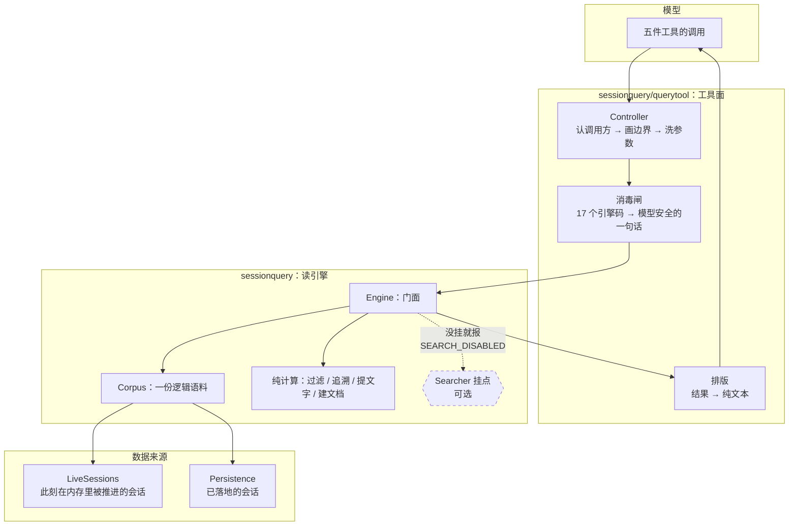

**图怎么看**：

- **三个方向的箭头都是单向的。**工具层调引擎，引擎调语料，语料读来源。没有一条反向的线——引擎不知道工具层的存在，`session/` 那棵树里也没有任何一个文件 import 这个包。
- **`Searcher` 是虚线。**它是这张图上唯一可选的东西。没挂的时候，两个检索方法报「没挂检索后端」，**其余方法全部照常工作**——精确读、过滤、追溯是纯计算，不依赖任何后端。
- **`Persistence` 也是可选的。**只挂活会话表也能跑，那样语料里就只有此刻活着的那些会话。

### 两层的分工

| | 引擎层做 | 引擎层**不**做 |
|---|---|---|
| | 决定这次读活的还是读存档的 | 判断调用方有没有权限 |
| | 保证头和事件来自同一次观察 | 隐藏任何东西 |
| | 把事件分成三种表面位置 | 执行全文检索 |
| | 提取可检索的语义文字 | 建索引、排序、发游标 |
| | 血统与事件关系追溯 | 排版给人或模型看 |

| | 工具层做 | 工具层**不**做 |
|---|---|---|
| | 认出调用方是谁、他的工作目录是什么 | 读日志、解事件、折表面 |
| | 每一个 id 在被读之前先过授权 | 过滤、追溯、检索的任何一行逻辑 |
| | 把引擎的失败翻成不泄密的一句话 | 自己计时（超时归工具运行时） |
| | 把结果排成模型直接能读的文本 | 定义任何事件类型 |

### 一次工具调用的全过程

五件工具的骨架是同一个，顺序不能换：

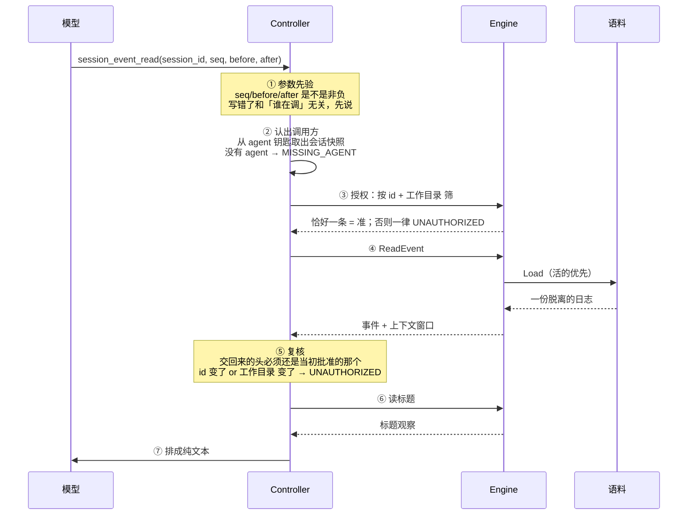

**图怎么看**：

- **③ 在 ④ 之前，⑤ 在 ④ 之后。**授权必须在调用之前——先读了再判断，日志已经读出来了，泄不泄密只剩下「返不返回」这一道，那不够。复核必须在调用之后——授权和调用之间会话可能被挪出工作区，或者引擎答非所问。
- **① 排在 ② 之前是有意的。**一个写错的 `seq` 和这次调用是谁发的没关系，先说出来能省掉一整趟授权。
- **⑥ 也要过边界。**一次批量标题观察同样可能捞回一个不该看见的会话，所以标题结果里的每一份头也要复核。

### 活的优先：一份逻辑会话是怎么定下来的

同一个会话 id 可能同时有两份东西：内存里正在被推进的那份，和存储里已经落地的那份。选哪一份，规则是固定的：

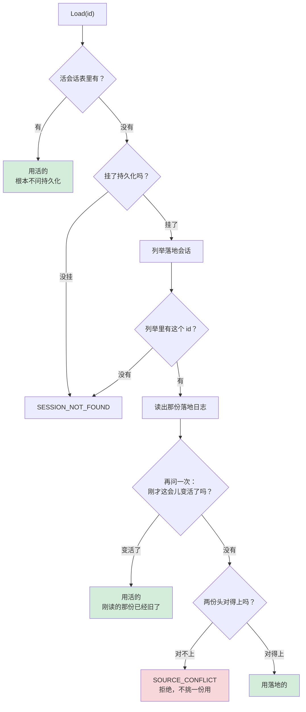

**图怎么看**，三处要点：

1. **认出是活的就根本不问持久化。**这不是性能优化，是可用性契约：一个**可选**后端的故障，不该让此刻在内存里的历史读不出来。
2. **读完落地的还要再问一次。**会话在读取期间被挂起来是平常事，那时候刚读出来的那份已经过时了。
3. **两份对不上只能拒。**对比的是七个身份字段：格式版本、id、建会话时间、工作目录、父会话、seed 长度、派发深度。对不上说明同一个 id 底下其实是两个不同的会话——那是配置事故（比如两个进程连着同一份介质各写各的:同一个库、同一个命名空间）。挑一份用等于把一次事故变成一份看起来正常的假历史。

会话头上那条「工作目录」（`WorkspaceRoot`）是一条**执行世界**里的绝对路径。别的包（`workspace`、`context/instructions`）拿它当解析基准去问 `fs` 接缝；**本包不碰盘**——这里它只参与身份比对和工作区边界那两次字符串相等，仅此而已。

**故意不比**的两个字段：来源分类（那是展示用的）和 agent 预设（恢复时可以换掉）。它们不是身份。

### seq 不是数组下标

这是本仓库和上游 DSH 最要紧的一处差别，读代码第一次最容易在这里栽。

上游全篇拿 `seq` 直接索引事件数组，靠的是「日志从 0 开始、连续、一条不删」。**本仓库的日志会从最老的一头弹出事件**（见 `docs/session-log-limit.md`），所以一份日志的起始 `seq` 是个变量：

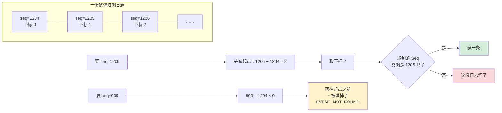

三条规则由此而来，全包一致遵守：

- **定位一律先减起点**，减完当场校验取到的还是不是同一条。
- **落在起点之前 = 被弹掉了**，答「没有这条事件」。
- **落在现存范围内却对不上 = 这份日志真坏了**，报表面/日志损坏。

事件精读的上下文窗口两端也是 `seq` 不是下标，夹取按 `seq` 做，切片的时候当场减起点。

取事件那个底层函数交回「没有」时，**不区分**是被弹掉了还是压根没有过。这是有意的：要不要报错取决于这个 `seq` 是谁给的——用户点名的一条找不到，那是「找不到」；而从这份日志自己折出来的表面节点找不到，那是「日志坏了」。所以判断留给调用方。

### 一条事件在表面上的三种位置

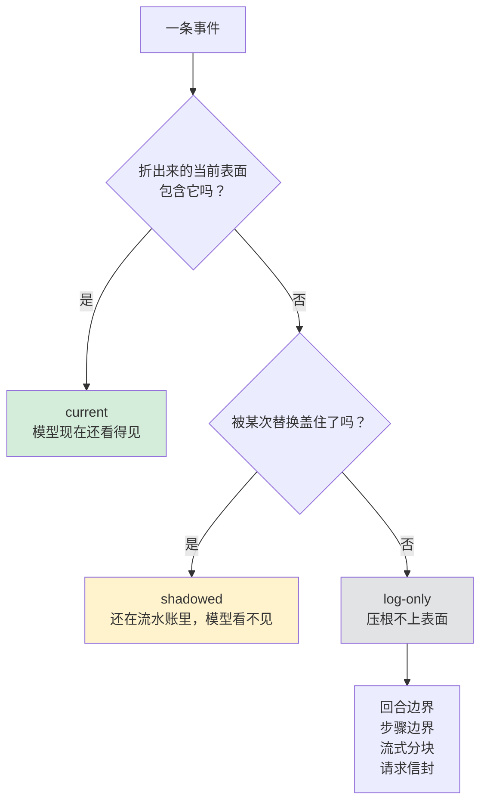

这三种位置是本包对外的一个封闭词汇，模型可以拿它当过滤条件用（「只搜当前表面上的」）。

**log-only 的那几类不产出可检索文字**，理由是它们的内容在别的事件里已经完整——流式分块的内容在装配好的助手消息里，重复索引会让同一句话命中两次。

---

## 引擎层：能力与能力边界

### 先看全貌

| 能力 | 入口 | 依赖检索后端吗 |
|---|---|---|
| 列举整份语料 | `ListSessions` | 否 |
| 纯谓词筛会话 | `FilterSessions` | 否 |
| 读完整日志（带重放校验） | `ReadSession` | 否 |
| 读当前表面 | `ReadSurface` | 否 |
| 列举一个会话的事件 | `ListEvents` | 否 |
| 纯谓词筛事件 | `FilterEvents` | 否 |
| 精确读一条事件 + 上下文窗口 | `ReadEvent` | 否 |
| 血统追溯 | `TraceSession` | 否 |
| 事件关系追溯 | `TraceEvent` | 否 |
| 批量读标题 | `ReadTitleSnapshots` | 否 |
| 任意一种批量投影 | `ProjectMany`（包级函数） | 否 |
| 跨会话全文检索 | `SearchSessions` | **是** |
| 会话内全文检索 | `SearchEvents` | **是** |

十一件不依赖后端，两件依赖。这个比例本身就是设计意图：检索是**加进来的**，不是这一层的基础。

### 语料：两处观察合成一份

语料只认两个来源，都是**窄接口**，只声明本包真正要调的方法：

- 活会话表：按 id 取一份、列举全部。必填。
- 持久化：列举所有落地会话头、读出一份验过的落地日志。可选（`nil` 表示这次装配没挂）。

**「落地」落在哪，这个包不知道也不该知道。**本包看见的只有那两个读方法。本仓库当下唯一的落地介质是一个关系数据库：`datastore/sessionstore` 把会话日志接到 `datastore` 的日志集上，一个会话就是一条流——会话 id 是流名，会话头是流的头，一条事件是一条条目，事件的序号就是条目的序号。所有会话装在**同一份介质**里（同一个连接池、同一个命名空间），所以「这个会话那份存档」这种东西不存在。文件式的那个后端已经从仓库里删掉了。

这件事对本包的影响只有一处：**「按会话分区」是存储那一侧的事，不是这一侧的能力边界。**本包的语料天生是跨会话的——列举、过滤、血统追溯都在整份语料上做。工具层那条工作区边界之所以必须存在，正是因为下面这一层根本没有分区。

窄接口不是洁癖。持久化那个接口上**只有两个读方法，一个写方法都没有**——「读侧永远写不了会话」因此是一个编译期事实，不是一条纪律。真正的持久化服务在结构上天然满足它，源码里有一行编译期断言钉住这件事。

**列举出来的顺序是确定的**：建得晚的在前，同刻按 id 排。确定的顺序不是审美——这个结果会进对外协议，一个随枚举顺序漂移的列表会让同一份数据的两次查询给出不同的字节。

**语料不拥有任何东西。**活会话表、持久化后端、检索后端的生命周期全归装配方管，本包只认「有」或者「没有」。

### 精确读的三个层次

| 方法 | 交出什么 | 校验到什么程度 |
|---|---|---|
| `ListEvents` | 每条事件的轻量记录（序号、类型、时间、表面位置） | 折一次表面 |
| `ReadSurface` | 当前表面上的完整事件，脱离的副本 | 折一次表面 |
| `ReadSession` | 整份原始日志 | **重放校验**：关系约束 + 表面折得出来 |

`ReadSession` 那一步在上游是靠「拿这份日志建一个活会话」顺带完成的。本仓库的活会话类型还没到，但校验的两半都已经有了，所以这里两半都做——少掉的只是「建出一个活会话」这个副产品，而这个方法本来也不需要它。

`ReadEvent` 的上下文窗口有上限（默认 50，装配时可调）。上限是**每一侧**分别算的，超了报「窗口不合法」。

### 过滤：纯谓词，全部是「与」

过滤器是一组封好的类型，外面造不出新的变体：

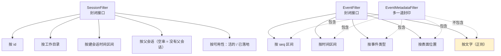

**为什么要有 `EventMetadataFilter` 这个更窄的集合**：有些调用点只接受「不看正文」的过滤条件。上游用 TypeScript 的类型排除表达这件事；Go 这边靠第二个未导出的封印方法——文字过滤器**故意不实现**它，于是它在编译期就进不去那些位置。

三处细节值得单独说：

- **跨异步边界之前复制一份。**调用方交出来的过滤器切片归调用方所有，它随时可以在我们等持久化列举的空档里改掉自己那份，那样「验过的」和「用上的」就不是一回事了。所以定下来的时候复制。
- **文字过滤器是防注入那一步。**查询串被按空白切成若干段，**每一段都过正则元字符转义**，然后段与段之间接上「一个或多个空白」。结果：查询里的 `.` `*` `(` 一律当普通字符，而查询里的空白怎么打都能对上文本里的换行和多空格。
- **区间校验只剩一条**（下界不能大于上界）。上游还要检查「是不是有限数」，因为它的数字类型装得下 NaN 和无穷；这边的端点是 64 位整数，装不下。

还有一个走不到的分支被**故意留着**：所有过滤器的两处分派各有一个「不认识的变体」出口。封印接口保证外面进不来，留着是为了接住「本包自己加了新变体却忘了在两处分派里接住」——那种疏忽会让一条过滤条件被静默忽略，查询悄悄返回比预期多的结果。

### 追溯：两种关系

**血统追溯**（会话之间）：

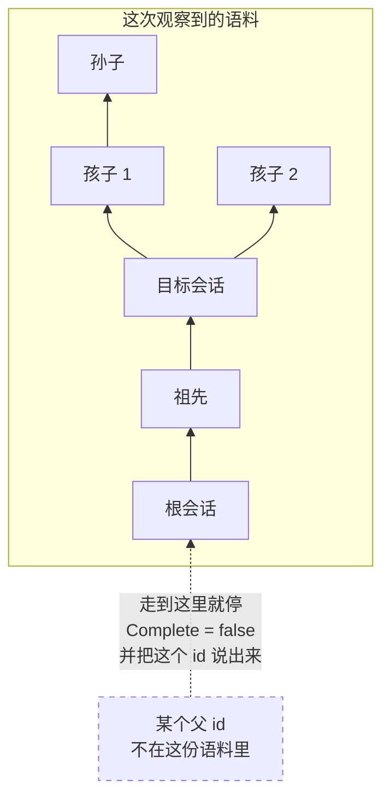

父链走出语料就停下，并且**把停下的那个父 id 说出来**。「查不到」和「到顶了」是两件事，混成一件会让调用方把一棵被截断的树当成完整的。

兄弟排序是「建得早的在前，同刻按 id」。同样不是审美：追溯结果进对外协议，随枚举顺序漂移的次序会让同一份数据两次查询给出不同字节。

**往下走也带防环集合。**一份语料里「A 的父亲是 B、B 的父亲是 A」只可能是存储被写坏了。上游只在祖先那一侧防了环，遇到这种输入会**无限循环**；这边往下走时也带已访问集合，遇到环剪掉那一枝——不把一个坏掉的存储变成一次挂死。

**事件关系追溯**（一个会话内部）交出五种关系：谁直接盖住了它、一路盖到最后是哪条、它自己盖住了谁、它的来源是哪几条、后来哪几条把它列进了自己的来源。

**表面只折一次。**三个追溯函数共用同一份折叠结果——各折一遍既慢，又可能给出互相矛盾的答案。

### 什么算「可检索的语义文字」

这是本包定义的、不属于任何检索后端的一件事：

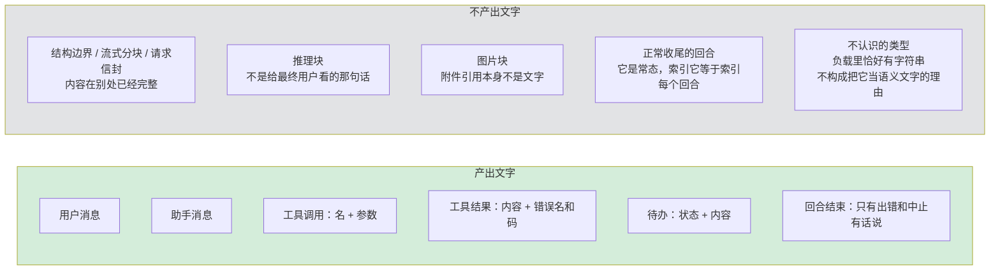

两处和上游不一样，都值得记住：

- **解不回来要报错，不能压成空串。**上游拿到的是已经带好类型的负载，读不坏，所以它不返回错误；这边负载是原始字节，解不开说明日志坏了。压成空串会让一份坏日志**安静地检索不出东西**——比报错难查得多。
- **上游落在默认分支的那几种，这里显式列出来**（请求上下文、种子结束、被阻断的回合、图片块），给同样的空结果。行为一样，差别是下一个读代码的人能看出这是想清楚了的，不是漏掉了。

建检索文档的时候，**提不出文字的事件直接不建文档**——一条空文档在任何查询下都不会命中，留着只会让「总共几条」这个数字骗人。

建文档要求日志是**完整连续**的一整份：表面位置是整份日志折出来的，喂一段中间的碎片会得到一份看起来正常、实际全错的分类。

### 标题：一层薄壳

三个标题方法自己一行读取逻辑都没有，是「批量投影」加「标题折叠」的拼接。放在这个包是因为「跨活会话和落地日志、按一批 id 一次观察出标题」只有语料这一侧做得到；标题本身怎么折完全归标题那个包。

「有没有标题」由一个**布尔**说，不由零值说。用一份空快照表达「没有标题」会把它和「标题是空串」混成一件，而那两件事在界面上不一样。

一条读不回来的标题事件让**这一个**会话的投影失败，而不是跳过去露出更早那个标题。

### 检索：只有一个挂点

这一层对全文检索的全部贡献是：定义挂点接口，定义请求和结果的形状。索引、排序、游标世代、查询执行全归实现方。

**本仓库当下没有任何一个实现。**整个仓库里只有这个接口的声明、引擎那两个转手方法、以及工具层门面上的同名方法——一个实现方都没有。也就是说按今天的装配，两件检索工具一定报「没挂检索后端」，而另外三件读工具照常可用。这不是缺陷，是上面那条分界的直接后果：检索是加进来的，不是这一层的基础。

**为什么用组合不用继承**：上游那边引擎是抽象类，检索由子类继承实现。换成接口不是因为「Go 没有继承」，是这两件事本来就该分开——精确读、过滤、追溯是不依赖任何后端的确定行为，继承会让后端有机会覆盖前一半，那正是这一层不想给出去的权力。

十七个错误码里有**五个本包自己从不报**，是留给挂上来的后端的：建索引失败、游标不合法、分页大小不合法、检索文本不合法、游标世代过期。留着是因为后端需要属于本契约的码来报这类失败，而且要和「压根没挂检索」分得开。

### 引擎层不负责什么

- **不判断权限。**它没有「调用方」这个概念。
- **不隐藏任何东西。**它能看见整份语料，全部如实交出。
- **不执行检索。**没有索引、没有排序算法、没有向量库。
- **不写会话。**接口层面就写不了。
- **不修复日志。**校验不过就报，不猜、不补。
- **不排版。**交出去的是结构化的值。
- **不自己计时。**取消靠调用方传进来的上下文。

---

## 工具层：能力与能力边界

### 五件工具

| 工具名 | 干什么 | 并发安全 |
|---|---|---|
| `session_search` | 跨会话检索 | 否 |
| `session_event_search` | 会话内检索 | 否 |
| `session_trace` | 血统追溯 | 是 |
| `session_event_trace` | 事件关系追溯 | 是 |
| `session_event_read` | 事件精读 | 是 |

三件读工具标了并发安全，两件检索工具**故意不标**——检索要走外部后端，那不是本包能替它保证的事。

五件工具的输出 schema **全是字符串**。模型要的是能直接读的一段话，不是一份要它自己再解一遍的结构。

### 工作区边界：只有一条 工作目录

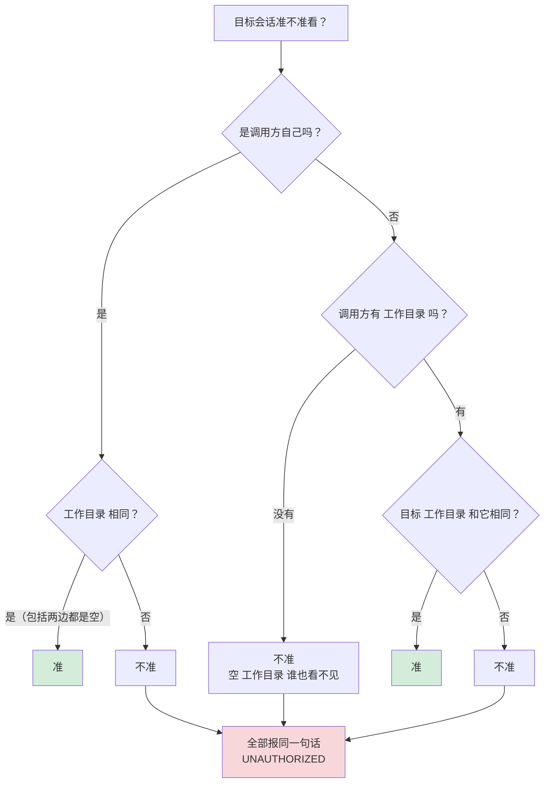

**两支为什么要分开写**：调用方自己那个会话即使**没有**工作目录也看得见自己（两边都是空串，相等）；而一个没有工作目录的调用方看不见任何**别人**——否则一个空 工作目录 会和所有别的空 工作目录 相等，边界就整个化掉了。

**所有越界目标报同一句话。**「不在这个工作区」和「根本没有这个会话」共用一个码、共用一句话。分开报等于告诉模型别的工作区里有哪些会话存在。

**跨会话检索时调用方 工作目录 为空 → 直接拒**，不退化成一次无边界的全库检索。

### 三段式：授权 → 调用 → 复核

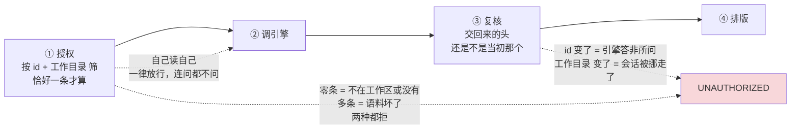

- **自己读自己一律放行，连问都不问。**调用方对自己那份日志本来就有全部权限，而且那一问会在一个还没落地的新会话上失败。
- **别人的会话要求引擎恰好返回一条。**零条和多条都拒。
- **复核不是多余的。**授权发生在调用之前，中间这段时间会话可能被挪出工作区。会话内检索**每一页都复核一次**，不是只查第一页——翻页之间同样会变。

两处这条边界不那么直观的应用：

- **父会话 id 在交给引擎之前先过一遍授权。**一个越界的父 id 如果原样交下去，引擎筛出来的结果会反过来**证实那个会话存在**。授权之后一个值都不剩，就直接排一份空结果，连引擎都不调——跑一趟只是白白告诉后端我们在找什么。
- **越界的血统子树换成占位，不是删掉。**删掉会让树看起来是完整的，模型据此以为这个会话没有更多孩子。留一个占位，画成「这里有东西，你看不到」。而且越界的节点**整支剪掉不再往下走**：它的孩子即使碰巧同 工作目录 也不该露出来，那会把那个不可见的父节点的存在反推出来。

还有一处：**标题读不到时降级成占位名，但「越界」这一种例外，要抛出去。**别的失败（日志坏了、后端挂了）只是这一行读不出名字；越界却说明这次调用整个不该发生，把它降级成一行「未命名」等于确认了那个会话存在。

### 会话内检索还有一条边界：当前这一步

模型在自己的会话里检索时，可见范围被钉在**当前这一步开始之前**：

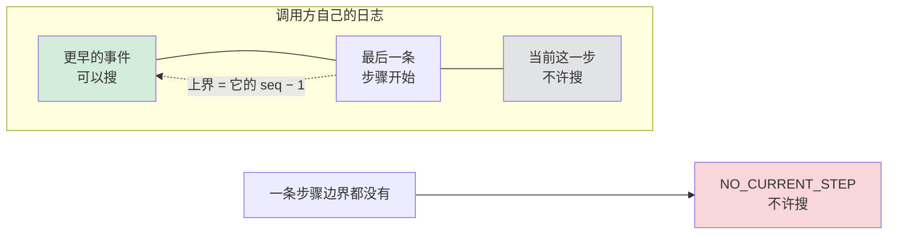

理由：模型已经看得见当前步骤里的东西，把它们再检索一遍等于让模型读自己刚写的字，还会把真正在找的旧事件挤出结果。

**给不出这条边界就不许检索。**一个还没开过步骤的会话没有这条线可用，这时候退化成「全都能搜」正好是上面那条要防的事。

上界被钉到下界之前是完全正常的（比如模型指定了一段全在当前步骤里的序号）。这时候一条都不可能命中，直接排一份空结果，不去打扰引擎。

### 参数清洗

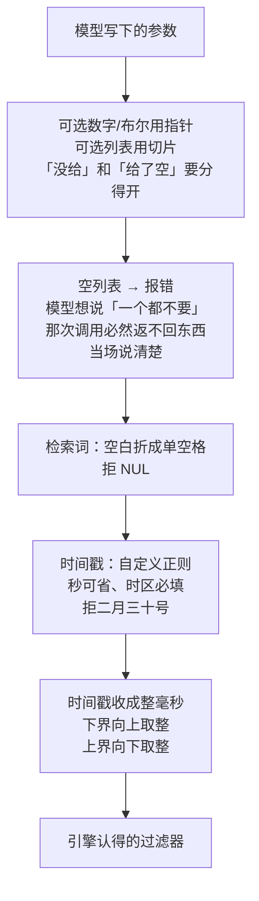

几处理由：

- **空白折成单空格**是为了让「同一句话、换行方式不同」的两次调用命中同一份缓存、也命中同一批结果。
- **单独拦 NUL**：它在若干检索后端里是字符串终止符，混进去会让查询在半路被截断，而截断之后那句话仍然是**合法**的，没人会发现。
- **时区必填**：一个没有时区的时间戳要靠宿主的本地时区才解得出来，那意味着同一句参数在两台机器上筛出不同的事件。
- **没走标准库解析**：标准库那一套要求秒必须在，而上游这道语法允许省掉秒；换过去会让一批模型本来写得出来的参数突然被拒。手写这一道顺带把「二月三十号」挡在外面——标准库会把它规范成三月，那意味着一个明显写错的参数被默默地当成了另一个日子。
- **上下界取整**：上游在浮点数的位表示上找相邻可表示值，因为那边范围端点是浮点毫秒。这边端点是 64 位整数毫秒，压根表示不了亚毫秒，所以换成整数取整——事件时间戳本身也是整毫秒，筛出来的集合和上游逐个事件一致。

**这些参数错误故意绕过消毒闸**，而且带的是**引擎的**码不是本包的码。它们说的全是模型自己刚写下的参数哪里不对，是模型下一步唯一的依据，藏起来等于让它瞎改。

### 消毒闸：引擎的内情一个字都不出去

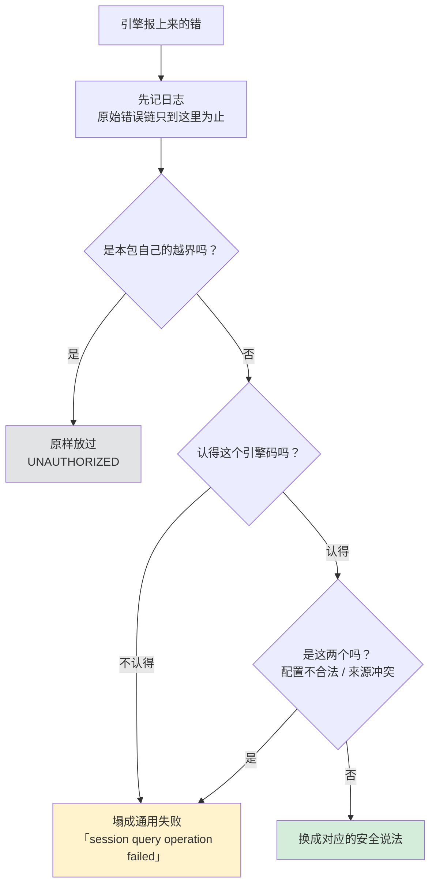

十七个引擎码逐一映到模型安全的句子。只有**两个**塌成通用失败：配置不合法、两份来源冲突——它们说的都是装配和运维的事，模型知道了也没有用，只会拿去猜后端长什么样。

映射表的完整性**由测试守，不由类型守**：有一条测试专门检查这张表覆盖了每一个引擎码。引擎加了新码而这里忘了接，测试当场红。

每次调引擎前后**各查一次取消**，事后的取消覆盖调用报上来的任何东西——一次被取消的调用，它报什么已经不重要了。

### 排版：字符串本身就是契约

排出来的每一个字符串都是模型契约的一部分，**不许翻译**。

父会话有三种写法，分别对应三种事实：「根会话」/ 真正的 id / 「在工作区外」。血统树用两种占位画边界：往上走用一种，往下走用另一种、并按层数缩进。

事件精读把目标事件按缩进 JSON 放进围栏块——那一条是模型明确点名要看的，给它原貌。

**提文字报错要往上抛，不能降级成「没有语义文字」。**降级会让一条坏事件看起来像一条正常的、只是没话说的事件。

时间格式是手写的固定版式，不是标准库那个变长格式——后者在整秒时会把小数位丢掉，同一批数据排出来的字符串长短不一。

撞上结果上限时追一句提示，告诉模型「还有更多，收窄条件」。上限数的是**收下来的**那些，不是引擎返回的那些：被边界筛掉的越界命中不占额度，否则一个工作区外的大会话能把整页额度吃光，模型什么都看不到。

**游标重复一律当引擎坏了报出去**，不是默默停下。默默停下交出去的是一份看起来完整、实际上少了一截的结果，模型没有任何办法察觉。

### 工具层不负责什么

- **不读日志、不解事件、不折表面。**一行都没有。
- **不做过滤、追溯、检索的任何逻辑。**全部转手。
- **不自己计时。**两件检索工具有默认截止时间（30 秒），但那是交给工具运行时统一执行的，也统一不发给模型。
- **不定义任何事件类型。**它在不变量注册表上登记的是一个**空壳**——直接返回「没问题」。五件工具全只读，真正要验的（工具名不撞、schema 根是对象、指引段落名不撞）在各自注册那一刻就验完了。登记只为**占住包名**：注册表按包名分区，占住之后「检查过了、结论是无需检查」和「这个包被漏掉了」才区分得开。

---

## 生命周期与并发

### 装配顺序

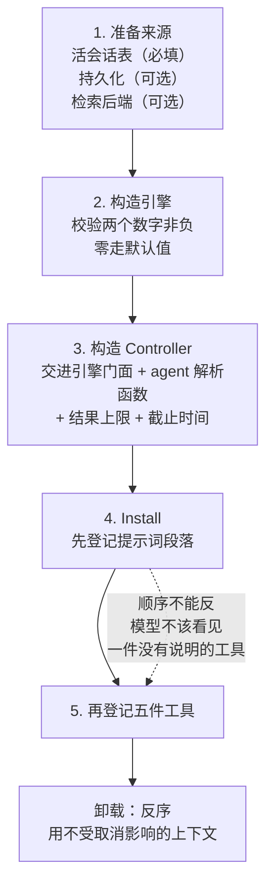

**先段落后工具**这个顺序是有意的：模型不该看见一件没有说明的工具。卸载反序，并且用一个**不受取消影响**的上下文——一次被取消的装载，它的清理不该也被取消掉，那会留下半登记的状态。

四个可调的数字，零值一律走默认：

| 参数 | 默认 | 管什么 |
|---|---|---|
| 读窗口上限 | 50 | 事件精读每一侧最多带多少条上下文 |
| 落地读并发 | 4 | 一次批量读里同时读几份落地日志 |
| 检索结果上限 | 100 | 一次检索最多交回多少条**已授权**的命中 |
| 检索截止时间 | 30 秒 | 两件检索工具的协作式截止 |

读窗口上限这里和上游有一处取舍：上游写 0 表示「一条上下文都不许带」，这边零值就是「没填」、走默认 50。代价是「禁掉上下文窗口」这个配置表达不出来——那是上游也只是顺带允许、没人会用的配置，换来的是装配方不必为了拿默认值而把 50 抄一遍。

### 谁在哪条 goroutine 上

只有批量投影这一处有并发：

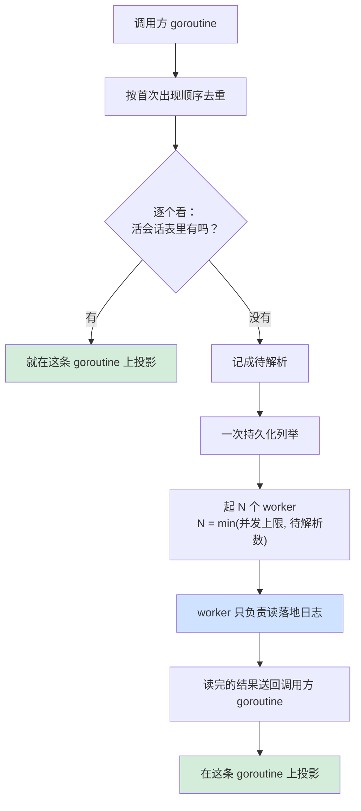

**worker 只读，投影留在调用方这一条 goroutine 上。**上游是单线程的，它的投影天然不会并发；这边不做这一步的话，一个捕获了 map 的折叠闭包会当场竞争。让 worker 只负责读，行为才和上游一致，调用方也不必为投影函数额外加锁。

「一次最多几份完整日志同时活着」这个内存上界没变：worker 数，加上手上正在投影的那一份。

**借用还是脱离，分得很清楚**：

| 交出去的东西 | 谁负责 |
|---|---|
| 精确读的那份 | 完全脱离，调用方怎么改都碰不到语料 |
| 批量投影拿到的那份 | **借用**，只在这一次投影调用里有效；想留住什么自己克隆 |

批量投影用借用是有意的：一次批量投影要过整份日志，每份都先克隆一遍等于把整个语料复制进内存。

### 取消

取消一律翻成本包的一个码，原来那条留在错误链底下——调用方只需要认一套码，不必同时认两种表达。取消点落在每一个可能让出执行权的位置：列举前后、装载前后、投影前后、调引擎前后、翻页每一轮。

后端把取消原样报上来也算（它自己内部的超时也走这条）。

### 失败隔离 vs 整个调用失败

批量投影里这两件事分得很清：

- **单个源读不了** → 记在它自己那条结果上，别的结果照常。
- **持久化列举整个失败** → 摊到每一条待解析的结果上，**仍然不让整个调用失败**——已经从活会话表投影出来的那些结果是好的，扔掉它们没有道理。
- **取消** → 整个调用失败。

前者是「这一个会话读不了」，后者是「这次观察不作数了」。混成一件会让调用方把半份结果当全份用。

---

## 失败语义

### 引擎的十七个码

| 码说的事 | 谁会报 | 调用方该怎么办 |
|---|---|---|
| 调用被取消 | 引擎各处 | 不用管 |
| 落地日志坏了 | 语料 | **重试没用**，这份存档没救 |
| 后端列举或装载失败 | 语料 | 重试**可能**有用 |
| 找不到这个会话 | 语料 | 换一个 id |
| 两份来源对不上 | 语料 | 运维的事：两个进程连着同一份介质 |
| 装配参数不合法 | 构造时 | 改装配 |
| 过滤器不合法 | 过滤 | 改参数 |
| 窗口大小不合法 | 事件精读 | 改参数 |
| 没有那条事件 | 精确读 / 追溯 | 换一个序号 |
| 表面折不出来 | 追溯 / 表面 | 日志坏了 |
| 血统里有环 | 血统追溯 | 存储被写坏了 |
| 没挂检索后端 | 两个检索方法 | 装配没挂 |
| 建索引失败 | **检索后端** | 后端的事 |
| 游标不合法 | **检索后端** | 后端的事 |
| 分页大小不合法 | **检索后端** | 后端的事 |
| 检索文本不合法 | **检索后端** | 后端的事 |
| 游标世代过期 | **检索后端** | 重新发起检索 |

**「坏了」和「读不了」是两个码，不是一个。**前者说这份存档本身没救，重试没用；后者说这一次没读成，重试可能有用。合成一个码会让调用方无从判断该不该重试。

**码本身就是错误值。**判断一次失败属于哪一类，直接用标准库的错误比较，不必先取出结构体再比字段——这是标准库里 `syscall.Errno` 用了几十年的写法。

**分类**和**底下究竟出了什么事**是两条分开的链：前者说「调用方该怎么处置」，后者说「原始的失败是什么」。

**这些码的字符串取值一个字都没改上游的。**它们会出现在对外协议里，换个写法就等于换一份契约。

### 两条路：消毒的和不消毒的

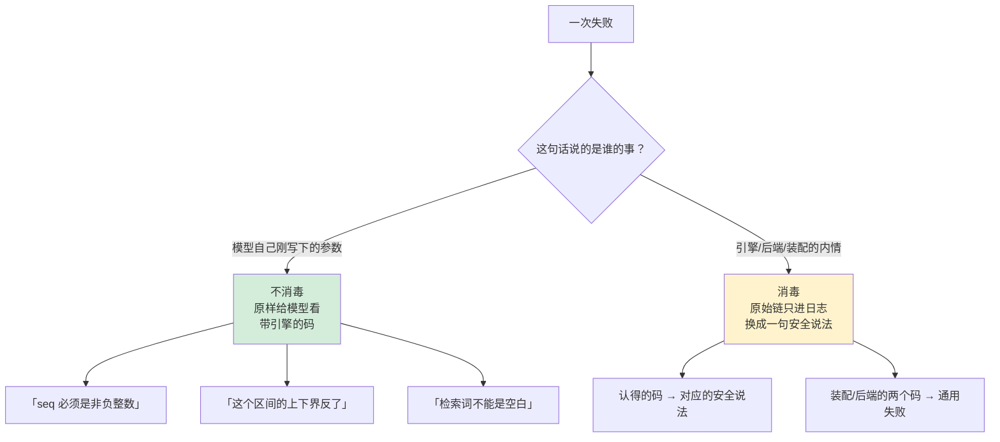

分界线只有一条：**这句话是不是模型下一步唯一的依据。**

参数错误是——藏起来模型只能瞎改。引擎内情不是——模型知道了也做不了什么，只会拿去猜后端长什么样。

### 关门的与尽力而为的

| 关门的（失败就不许往下走） | 尽力而为的（失败只影响这一处） |
|---|---|
| 两份来源的头对不上 | 一个会话的标题读不出来 → 显示占位名 |
| 授权不通过 | 一个源在批量投影里失败 → 只影响这一条结果 |
| 复核发现观察对不上 | 持久化列举失败 → 摊到待解析的那些结果上 |
| 日志重放不过 / 表面折不出来 | |
| 血统里有环 | |
| 游标重复 | |
| 越界（哪怕是在读标题时发现的） | |

判断标准：**会不会让调用方拿到一份「看起来对、实际不对」的东西。**会的一律关门。

---

## 能力边界

这个包负责：

- 在一次观察里把「活的」和「落地的」解析成一份逻辑会话，并保证头和事件同源。
- 按序号精确读事件，带一段有界的原始日志上下文。
- 把事件分成当前 / 被遮蔽 / 只在日志里三种表面位置。
- 定义什么算可检索的语义文字，并按此建检索文档。
- 不依赖任何后端的纯谓词过滤。
- 会话之间的血统追溯、会话内部的事件关系追溯。
- 批量标题观察，以及任意一种批量投影。
- 把以上能力摆到模型面前，并且**只摆出调用方工作区内的那一部分**。

这个包不负责：

- **不实现全文检索。**没有索引、没有排序算法、没有向量库、没有游标世代。这一层只有一个挂点和一套请求/结果形状。
- **不写、不改、不修会话。**接口层面就写不了；日志坏了只报，不猜、不补。
- **不管来源的生命周期。**活会话表、持久化后端、检索后端的挂载与卸载全归装配方。
- **不提供跨节点一致性。**「活的优先」是本进程此刻的可见性规则，不是分布式协议。
- **不做用户鉴权、租户隔离。**工具层那条边界是**工作目录**，仅此一条；它防的是模型越界，不是防人。
- **不自己计时。**取消和超时靠调用方传进来的上下文，以及工具运行时统一执行的截止时间。
- **不保证工具交给模型的结果是全量。**结果上限和工作区边界都会把它裁小；裁到了会明说。

---

## 相关源码

| 路径 | 内容 |
|---|---|
| `sessionquery/corpus.go` | 两处观察合成一份逻辑语料、「活的优先」、批量投影与并发 |
| `sessionquery/engine.go` | 对外门面、装配参数、检索挂点 |
| `sessionquery/sources.go` | 同一 id 底下两份观察的身份比对 |
| `sessionquery/types.go` | 全部对外形状：记录、快照、追溯结果、封闭过滤器、检索请求与分页 |
| `sessionquery/filters.go` | 纯谓词过滤、跨异步边界的复制、文字过滤器的元字符转义 |
| `sessionquery/tracing.go` | 表面折一次、血统追溯与截断、事件关系追溯、按序号定位 |
| `sessionquery/extraction.go` | 什么算可检索的语义文字，以及每一种「不算」的理由 |
| `sessionquery/documents.go` | 事件到检索文档的投影 |
| `sessionquery/titles.go` | 批量标题观察 |
| `sessionquery/error.go` | 十七个分类码、错误值、取消翻译 |
| `sessionquery/querytool/config.go` | 装配参数、引擎门面的窄接口、agent 解析 |
| `sessionquery/querytool/tools.go` | 五件工具的 schema、指引段落、装载与卸载 |
| `sessionquery/querytool/operations.go` | 五趟活的骨架、翻页与结果上限 |
| `sessionquery/querytool/access.go` | 工作区边界、三段式授权、标题占位、血统裁剪 |
| `sessionquery/querytool/boundary.go` | 消毒闸：十七个引擎码到模型安全说法的映射 |
| `sessionquery/querytool/input.go` | 参数 schema、清洗、时间戳解析与取整 |
| `sessionquery/querytool/presentation.go` | 纯文本排版，字符串即契约 |
| `sessionquery/querytool/error.go` | 工具层自己那四个码 |
| `sessionquery/querytool/invariant.go` | 空壳登记，只为占住包名 |
