# 会话读侧（`feature/sessionquery/`）

本文讲这一个包，和它下面唯一的子包 `feature/sessionquery/querytool`。会话日志本身怎么记、怎么存住、怎么折成当前状态不在本文范围内，只在需要说明接缝时点到名字。

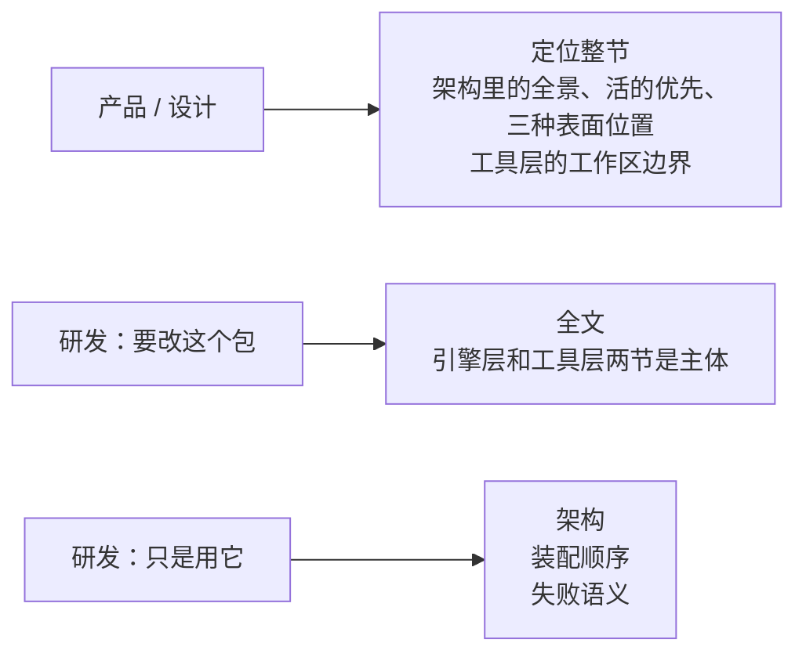

---

## 定位

### 为什么需要这个东西

会话历史是这个产品最值钱的那份资产——它记着做过什么决定、跑过什么工具、模型说过什么。但一份只能追加、不能修改的流水账，直接摊开来是没法用的。

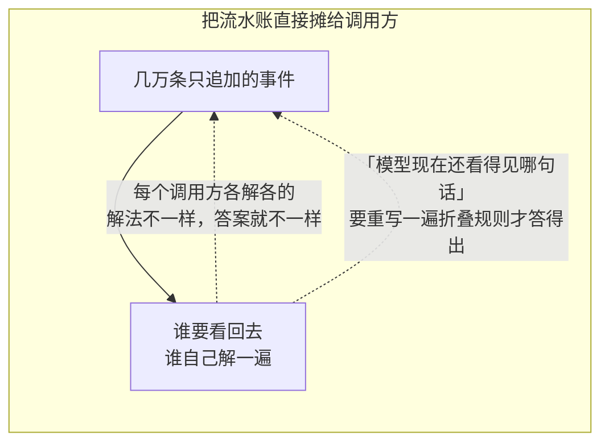

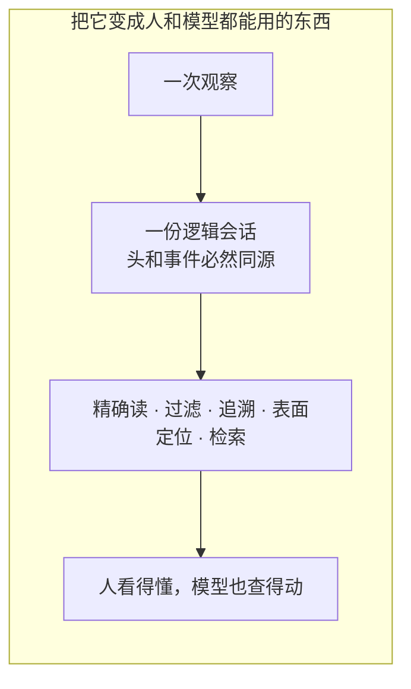

这个包回答一件事：**已经发生过的会话，怎么被安全地看回去。**

### 产品要做到的七件事

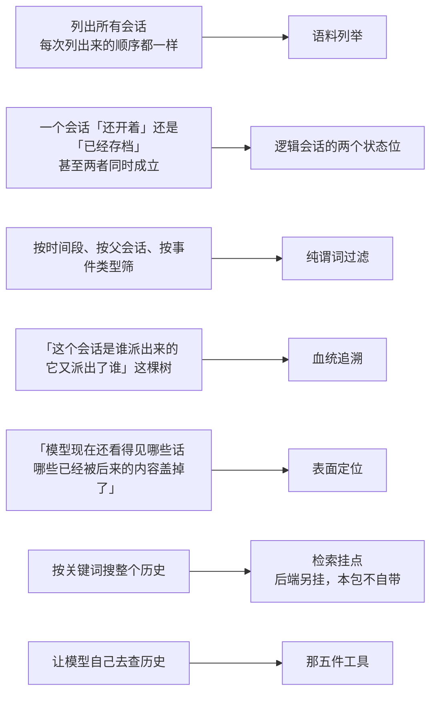

### 最后一件也是最危险的那一件

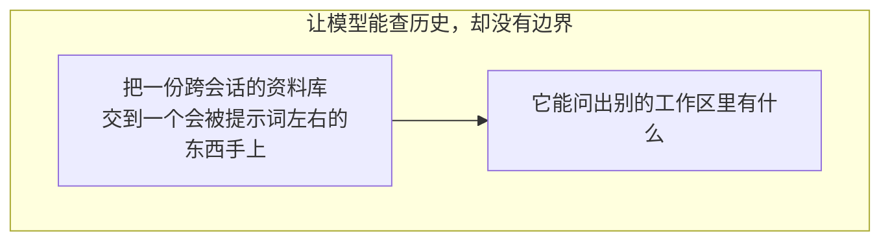

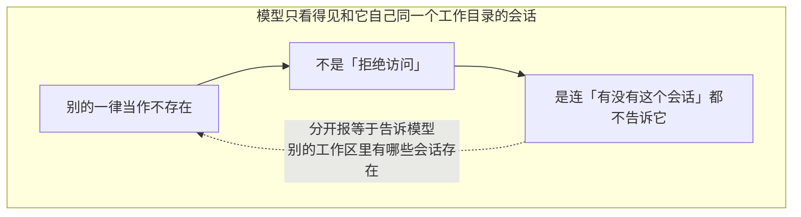

### 两层，分界线只有一条

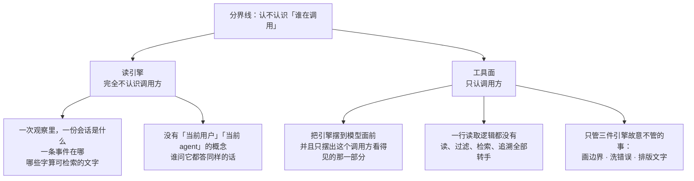


### 术语对照

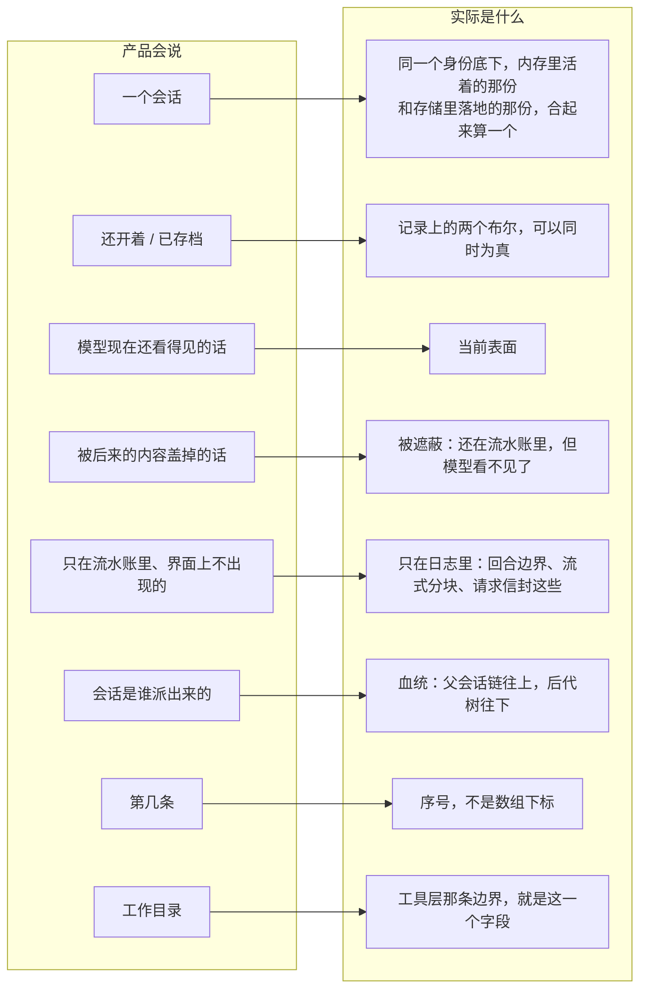

「观察」是本包的核心概念：在某个瞬间看到的那一份。

### 一条贯穿全包的原则

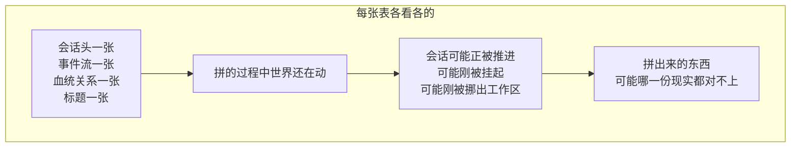

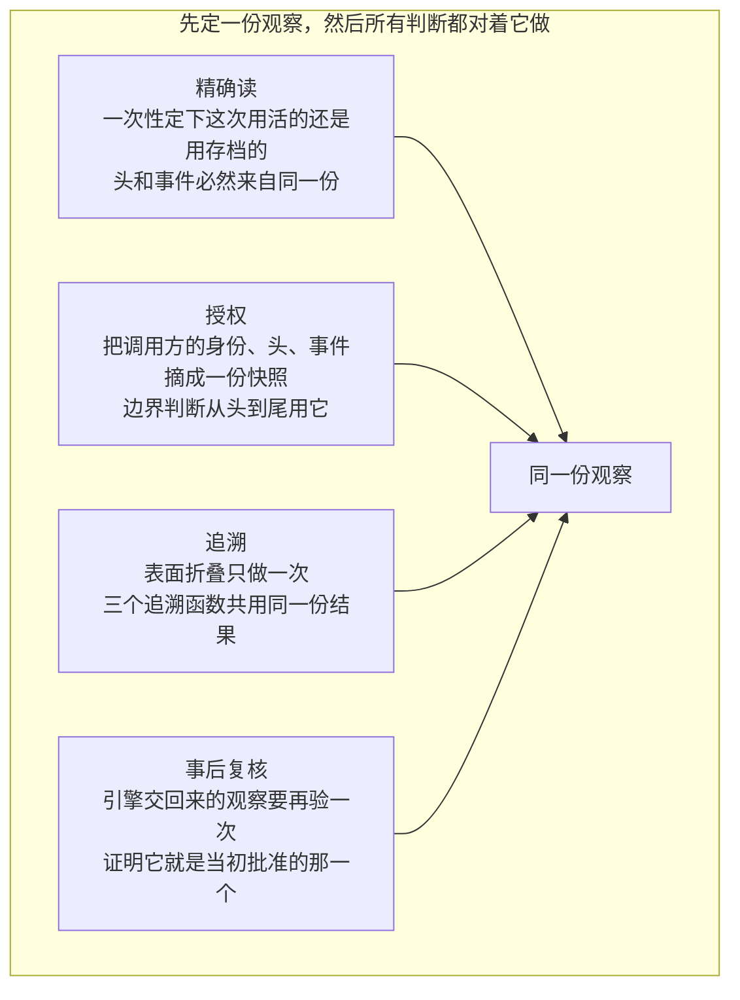

各折一遍不只是慢，还可能给出互相矛盾的答案。这一句话决定了下文几乎每一处设计。

---

## 架构

### 全景

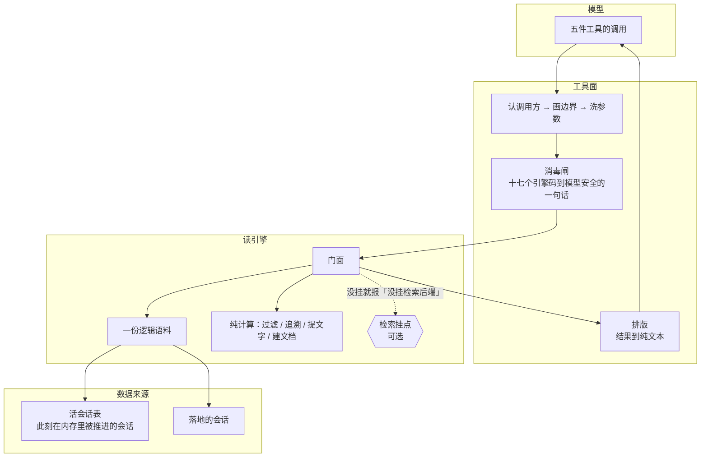

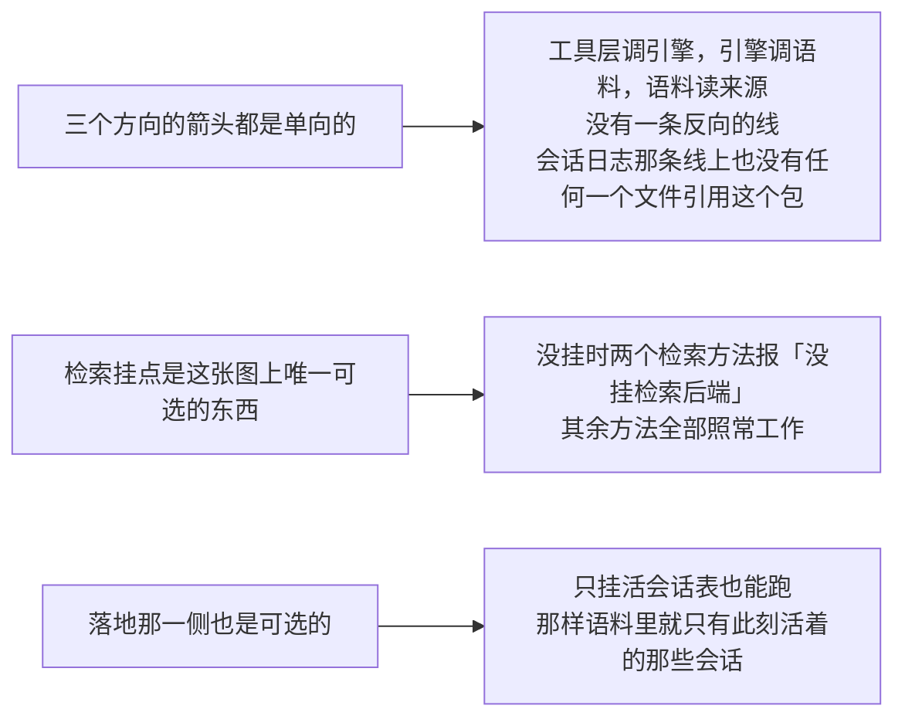

### 两层各自做什么、不做什么

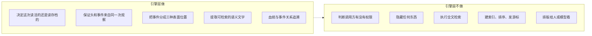

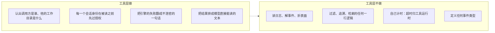

### 一次工具调用的全过程

五件工具的骨架是同一个，顺序不能换：

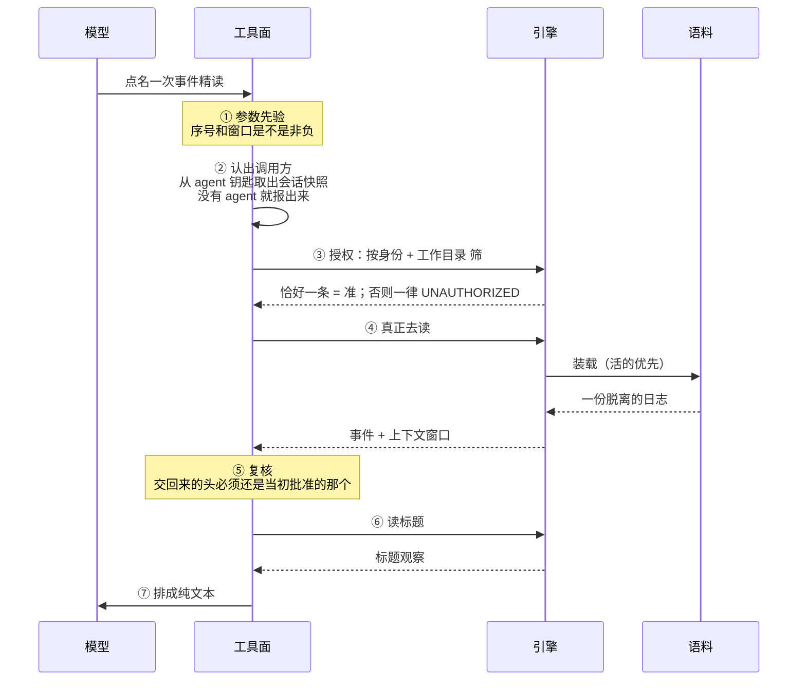

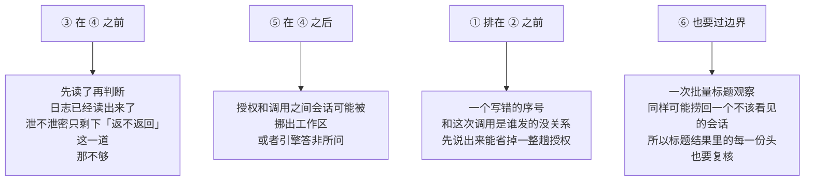

### 活的优先：一份逻辑会话是怎么定下来的

同一个会话身份可能同时有两份东西：内存里正在被推进的那份，和存储里已经落地的那份。

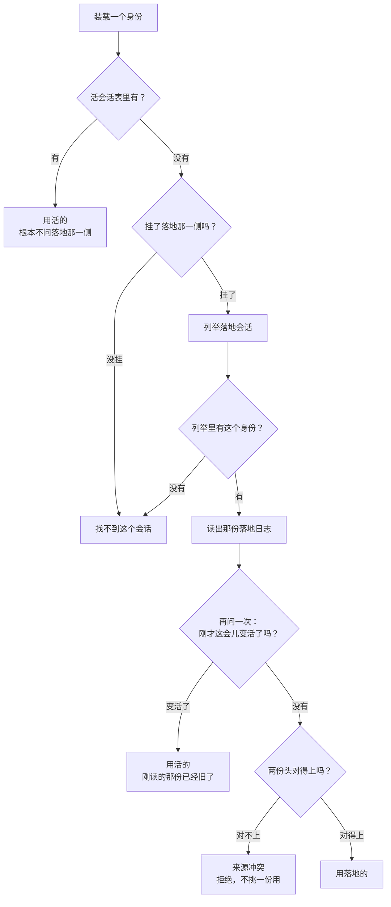

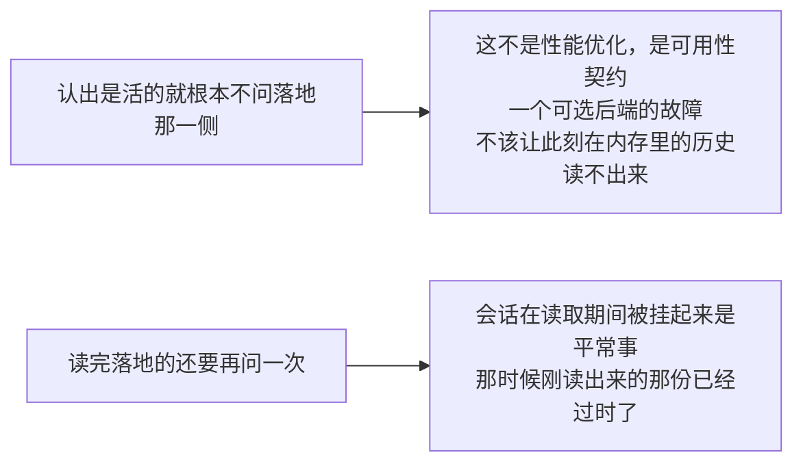

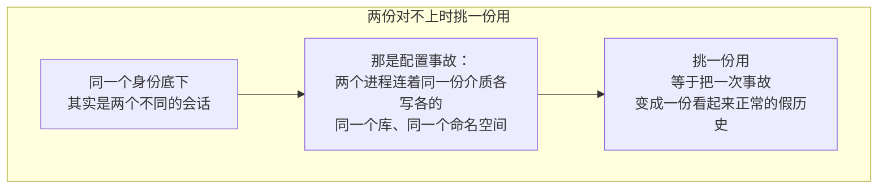

```mermaid
flowchart LR
    subgraph GOOD4["对不上只能拒"]
        B1["比七个身份字段：<br/>格式版本 · 身份 · 建会话时间 · 工作目录<br/>父会话 · 构造种子长度 · 派发深度"] --> B2["有一个对不上就拒"]
    end
    subgraph SKIP["故意不比的两个"]
        C1["来源分类：那是展示用的"]
        C2["agent 预设：恢复时可以换掉"]
        C1 -.->|"它们不是身份"| C2
    end
```

会话头上那条工作目录是一条**执行世界**里的绝对路径。别的包拿它当解析基准去问文件接缝；**本包不碰任何存储**——这里它只参与身份比对和工作区边界那两次字符串相等，仅此而已。

### 序号不是数组下标

这是本仓库和 DSH 最要紧的一处差别，读代码第一次最容易在这里栽。

```mermaid
flowchart LR
    subgraph BAD5["拿序号直接索引事件数组"]
        A1["靠的是「日志从 0 开始、连续、一条不删」"] --> A2["而本仓库的日志<br/>会从最老的一头弹出事件"]
        A2 --> A3["一份日志的起始序号是个变量"]
        A3 --> A4["直接索引取到的是另一条事件"]
    end
```

```mermaid
flowchart LR
    subgraph disk["一份被弹过的日志"]
        direction LR
        E1["序号 1204<br/>下标 0"] --- E2["序号 1205<br/>下标 1"] --- E3["序号 1206<br/>下标 2"] --- EN["……"]
    end

    Q["要 1206"] --> SUB["先减起点：1206 − 1204 = 2"]
    SUB --> IDX["取下标 2"]
    IDX --> VER{"取到的序号<br/>真的是 1206 吗？"}
    VER -->|"是"| OK["这一条"]
    VER -->|"否"| BAD6["这份日志坏了"]

    Q2["要 900"] --> NEG["900 − 1204 < 0"]
    NEG --> POP["落在起点之前<br/>= 被弹掉了<br/>「没有这条事件」"]
```

```mermaid
flowchart TD
    R["三条规则，全包一致遵守"] --> R1["定位一律先减起点<br/>减完当场校验取到的还是不是同一条"]
    R --> R2["落在起点之前 = 被弹掉了<br/>答「没有这条事件」"]
    R --> R3["落在现存范围内却对不上 = 这份日志真坏了<br/>报表面或日志损坏"]
    R --> R4["事件精读的上下文窗口两端也是序号不是下标<br/>夹取按序号做，切片的时候当场减起点"]
```

```mermaid
flowchart TD
    N["取事件那个底层函数交回「没有」时<br/>不区分是被弹掉了还是压根没有过"] --> Q1{"这个序号是谁给的"}
    Q1 -->|"用户点名的"| A1["那是「找不到」"]
    Q1 -->|"从这份日志自己折出来的表面节点"| A2["那是「日志坏了」"]
    A1 -.->|"所以判断留给调用方"| A2
```

### 一条事件在表面上的三种位置

```mermaid
flowchart TD
    LOG["一条事件"] --> Q1{"折出来的当前表面<br/>包含它吗？"}
    Q1 -->|"是"| CUR["当前<br/>模型现在还看得见"]
    Q1 -->|"否"| Q2{"被某次替换盖住了吗？"}
    Q2 -->|"是"| SHA["被遮蔽<br/>还在流水账里，模型看不见"]
    Q2 -->|"否"| LO["只在日志里<br/>压根不上表面"]
    LO --> EX["回合边界<br/>步骤边界<br/>流式分块<br/>请求信封"]
```

这三种位置是本包对外的一个封闭词汇，模型可以拿它当过滤条件用，比如「只搜当前表面上的」。

```mermaid
flowchart LR
    A["只在日志里的那几类不产出可检索文字"] --> B["它们的内容在别的事件里已经完整"]
    B --> C["流式分块的内容<br/>在装配好的助手消息里"]
    C --> D["重复索引会让同一句话命中两次"]
```

---

## 引擎层：能力与能力边界

### 十三件能力，十一件不依赖任何后端

```mermaid
flowchart LR
    subgraph FREE["不依赖检索后端"]
        F1["列举整份语料"]
        F2["纯谓词筛会话"]
        F3["读完整日志，带重放校验"]
        F4["读当前表面"]
        F5["列举一个会话的事件"]
        F6["纯谓词筛事件"]
        F7["精确读一条事件 + 上下文窗口"]
        F8["血统追溯"]
        F9["事件关系追溯"]
        F10["批量读标题"]
        F11["任意一种批量投影"]
    end
    subgraph NEED["依赖检索后端"]
        G1["跨会话全文检索"]
        G2["会话内全文检索"]
    end
    FREE -.->|"这个比例本身就是设计意图：<br/>检索是加进来的，不是这一层的基础"| NEED
```

### 语料：两处观察合成一份

```mermaid
flowchart TD
    C["语料只认两个来源，都是窄接口<br/>只声明本包真正要调的方法"] --> C1["活会话表<br/>按身份取一份、列举全部<br/>必填"]
    C --> C2["落地那一侧<br/>列举所有落地会话头、读出一份验过的落地日志<br/>可选"]
    C1 --> C3["语料不拥有任何东西<br/>三个来源的生命周期全归装配方管<br/>本包只认「有」或者「没有」"]
    C2 --> C3
```

```mermaid
flowchart LR
    subgraph BAD7["如果落地那一侧的接口上有写方法"]
        A1["「读侧永远写不了会话」<br/>只能是一条纪律"] --> A2["纪律靠人守"]
    end
```

```mermaid
flowchart LR
    subgraph GOOD7["接口上只有两个读方法，一个写方法都没有"]
        B1["「读侧永远写不了会话」<br/>是一个编译期事实"] --> B2["真正的落地服务<br/>在结构上天然满足它<br/>源码里有一行编译期断言钉住这件事"]
    end
```

**落地落在哪，这个包不知道也不该知道。**本包看见的只有那两个读方法。本仓库当下唯一的落地介质是一个关系数据库：一个会话就是一条流——会话身份是流名，会话头是流的头，一条事件是一条条目，事件的序号就是条目的序号。所有会话装在同一份介质里，同一个连接池、同一个命名空间，所以「这个会话那份存档」这种东西不存在。文件式的那个后端已经从仓库里删掉了。

```mermaid
flowchart LR
    A["「按会话分区」是存储那一侧的事<br/>不是这一侧的能力边界"] --> B["本包的语料天生是跨会话的<br/>列举、过滤、血统追溯都在整份语料上做"]
    B --> C["工具层那条工作区边界之所以必须存在<br/>正是因为下面这一层根本没有分区"]
```

```mermaid
flowchart LR
    subgraph BAD8["列举顺序随枚举顺序漂移"]
        X1["这个结果会进对外协议"] --> X2["同一份数据的两次查询<br/>给出不同的字节"]
    end
```

```mermaid
flowchart LR
    subgraph GOOD8["列举顺序是确定的"]
        Y1["建得晚的在前"] --> Y2["同刻按身份排"]
        Y2 -.->|"确定的顺序不是审美"| Y1
    end
```

### 精确读的三个层次

```mermaid
flowchart LR
    L1["每条事件的轻量记录<br/>序号 · 类型 · 时间 · 表面位置"] --> V1["折一次表面"]
    L2["当前表面上的完整事件<br/>脱离的副本"] --> V1
    L3["整份原始日志"] --> V2["重放校验：<br/>关系约束 + 表面折得出来"]
```

那一步重放校验在 DSH 那边是靠「拿这份日志建一个活会话」顺带完成的。本仓库的活会话类型还没到，但校验的两半都已经有了，所以这里两半都做——少掉的只是「建出一个活会话」这个副产品，而这个方法本来也不需要它。

上下文窗口有上限，默认 50，装配时可调。上限是**每一侧**分别算的，超了报「窗口不合法」。

### 过滤：纯谓词，全部是「与」

```mermaid
flowchart TD
    SF["会话过滤器<br/>封闭接口，外面造不出新的变体"] --> S1["按身份"]
    SF --> S2["按工作目录"]
    SF --> S3["按建会话时间区间"]
    SF --> S4["按父会话，空串表示没有父会话"]
    SF --> S5["按可用性：活的 / 已落地"]

    EF["事件过滤器<br/>封闭接口"] --> E1["按序号区间"]
    EF --> E2["按时间区间"]
    EF --> E3["按事件类型"]
    EF --> E4["按表面位置"]
    EF --> E5["按文字，正则"]
```

有些调用点只接受「不看正文」的过滤条件，所以还有一个更窄的集合：

```mermaid
flowchart LR
    subgraph BAD9["靠约定：这些位置请不要传文字过滤器"]
        A1["写错了要到运行时才发现"]
    end
```

```mermaid
flowchart LR
    subgraph GOOD9["第二个未导出的封印方法"]
        B1["序号 · 时间 · 类型 · 表面位置<br/>四种实现它"] --> B3["于是进得去那些位置"]
        B2["文字过滤器故意不实现它"] --> B4["于是它在编译期就进不去"]
    end
```

DSH 那边用 TypeScript 的类型排除表达这件事，Go 这边靠这道封印。

三处细节值得单独说：

```mermaid
flowchart TD
    subgraph BAD10["直接留着调用方那份过滤器切片"]
        A1["切片归调用方所有"] --> A2["它随时可以在我们等落地列举的空档里<br/>改掉自己那份"]
        A2 --> A3["「验过的」和「用上的」就不是一回事了"]
    end
```

```mermaid
flowchart LR
    subgraph GOOD10["跨异步边界之前复制一份"]
        B1["定下来的时候复制"] --> B2["之后调用方怎么改<br/>都影响不到这次观察"]
    end
```

```mermaid
flowchart TD
    T["文字过滤器是防注入那一步"] --> T1["查询串按空白切成若干段"]
    T1 --> T2["每一段都过正则元字符转义"]
    T2 --> T3["段与段之间接上「一个或多个空白」"]
    T3 --> T4["查询里的 . * ( 一律当普通字符"]
    T3 --> T5["查询里的空白怎么打<br/>都能对上文本里的换行和多空格"]
```

```mermaid
flowchart LR
    A["区间校验只剩一条：下界不能大于上界"] --> B["DSH 还要检查「是不是有限数」"]
    B --> C["因为它的数字类型装得下 NaN 和无穷"]
    C --> D["这边的端点是 64 位整数，装不下"]
```

还有一个走不到的分支被**故意留着**：

```mermaid
flowchart TD
    A["所有过滤器的两处分派<br/>各有一个「不认识的变体」出口"] --> B{"封印接口保证外面进不来<br/>那留着干什么"}
    B --> C["接住「本包自己加了新变体<br/>却忘了在两处分派里接住」"]
    C --> D["那种疏忽会让一条过滤条件被静默忽略<br/>查询悄悄返回比预期多的结果"]
```

### 追溯：两种关系

```mermaid
flowchart BT
    subgraph corpus["这次观察到的语料"]
        R["根会话"] --> A2["祖先"]
        A2 --> T["目标会话"]
        T --> C1["孩子 1"]
        T --> C2["孩子 2"]
        C1 --> G1["孙子"]
    end
    OUT["某个父会话<br/>不在这份语料里"] -.->|"走到这里就停<br/>标成「不完整」<br/>并把这个身份说出来"| R
```

```mermaid
flowchart LR
    A["「查不到」和「到顶了」是两件事"] --> B["混成一件会让调用方<br/>把一棵被截断的树当成完整的"]
    C["兄弟排序是「建得早的在前，同刻按身份」"] --> D["追溯结果进对外协议<br/>随枚举顺序漂移的次序<br/>会让同一份数据两次查询给出不同字节"]
```

```mermaid
flowchart TD
    subgraph BAD11["只在祖先那一侧防环"]
        A1["一份语料里<br/>「甲的父亲是乙、乙的父亲是甲」"] --> A2["只可能是存储被写坏了"]
        A2 --> A3["往下走时遇到这种输入<br/>会无限循环"]
    end
```

```mermaid
flowchart LR
    subgraph GOOD11["往下走也带已访问集合"]
        B1["遇到环剪掉那一枝"] --> B2["不把一个坏掉的存储<br/>变成一次挂死"]
    end
```

事件关系追溯（一个会话内部）交出五种关系：

```mermaid
flowchart LR
    E["一条事件"] --> E1["谁直接盖住了它"]
    E --> E2["一路盖到最后是哪条"]
    E --> E3["它自己盖住了谁"]
    E --> E4["它的来源是哪几条"]
    E --> E5["后来哪几条把它列进了自己的来源"]
```

```mermaid
flowchart LR
    subgraph BAD12["三个追溯函数各折一遍表面"]
        A1["既慢"] --> A2["又可能给出互相矛盾的答案"]
    end
```

```mermaid
flowchart LR
    subgraph GOOD12["表面只折一次，三个函数共用"]
        B1["一份结果"] --> B2["三处判断必然一致"]
    end
```

### 什么算「可检索的语义文字」

这是本包定义的、不属于任何检索后端的一件事：

```mermaid
flowchart LR
    subgraph yes["产出文字"]
        Y1["用户消息"]
        Y2["助手消息"]
        Y3["工具调用：名 + 参数"]
        Y4["工具结果：内容 + 错误名和码"]
        Y5["待办：状态 + 内容"]
        Y6["回合结束：只有出错和中止有话说"]
    end
    subgraph no["不产出文字"]
        N1["结构边界 / 流式分块 / 请求信封<br/>内容在别处已经完整"]
        N2["推理块<br/>不是给最终用户看的那句话"]
        N3["图片块<br/>附件引用本身不是文字"]
        N4["正常收尾的回合<br/>它是常态，索引它等于索引每个回合"]
        N5["不认识的类型<br/>负载里恰好有字符串<br/>不构成把它当语义文字的理由"]
    end
```

两处和 DSH 不一样，都值得记住：

```mermaid
flowchart TD
    subgraph BAD13["解不回来就压成空串"]
        A1["DSH 拿到的是已经带好类型的负载<br/>读不坏，所以它不返回错误"] --> A2["这边负载是原始字节<br/>解不开说明日志坏了"]
        A2 --> A3["压成空串会让一份坏日志<br/>安静地检索不出东西"]
        A3 --> A4["比报错难查得多"]
    end
```

```mermaid
flowchart LR
    subgraph GOOD13["解不回来要报错"]
        B1["坏日志当场暴露"]
    end
    subgraph LIST2["DSH 落在默认分支的那几种，这里显式列出来"]
        C1["请求上下文 · 种子结束 · 被阻断的回合 · 图片块"] --> C2["给同样的空结果<br/>行为一样"]
        C2 --> C3["差别是下一个读代码的人<br/>能看出这是想清楚了的，不是漏掉了"]
    end
```

```mermaid
flowchart TD
    D["建检索文档"] --> D1{"这条事件提得出文字吗"}
    D1 -->|"提不出"| D2["直接不建文档"]
    D2 -.->|"一条空文档在任何查询下都不会命中<br/>留着只会让「总共几条」这个数字骗人"| D2
    D1 -->|"提得出"| D3["建一条"]
    D --> D4["要求日志是完整连续的一整份"]
    D4 -.->|"表面位置是整份日志折出来的<br/>喂一段中间的碎片会得到<br/>一份看起来正常、实际全错的分类"| D4
```

### 标题：一层薄壳

```mermaid
flowchart LR
    A["三个标题方法<br/>自己一行读取逻辑都没有"] --> B["「批量投影」加「标题折叠」的拼接"]
    B --> C["放在这个包<br/>是因为「跨活会话和落地日志、<br/>按一批身份一次观察出标题」<br/>只有语料这一侧做得到"]
    C --> D["标题本身怎么折<br/>完全归标题那个包"]
```

```mermaid
flowchart LR
    subgraph BAD14["用一份空快照表达「没有标题」"]
        A1["「没有标题」和「标题是空串」<br/>混成一件"] --> A2["而那两件事在界面上不一样"]
    end
```

```mermaid
flowchart LR
    subgraph GOOD14["「有没有标题」由一个布尔说"]
        B1["零值不再兼职表达「没有」"]
    end
    subgraph FAIL2["一条读不回来的标题事件"]
        C1["让这一个会话的投影失败"] --> C2["而不是跳过去<br/>露出更早那个标题"]
    end
```

### 检索：只有一个挂点

```mermaid
flowchart TD
    A["这一层对全文检索的全部贡献"] --> A1["定义挂点接口"]
    A --> A2["定义请求和结果的形状"]
    B["全归实现方"] --> B1["索引"]
    B --> B2["排序"]
    B --> B3["游标世代"]
    B --> B4["查询执行"]
```

生产实现把落地的会话折成文档存进一份介质，活着的那些在本进程里当场折，两侧算出同一个分再并起来排。挂不挂由装配方决定。不挂的时候，两件检索工具报「没挂检索后端」，另外三件读工具照常可用——这不是缺陷，是上面那条分界的直接后果。

```mermaid
flowchart LR
    subgraph BAD15["引擎做成抽象类，检索由子类继承实现"]
        A1["继承会让后端<br/>有机会覆盖精确读、过滤、追溯"] --> A2["那正是这一层不想给出去的权力"]
    end
```

```mermaid
flowchart LR
    subgraph GOOD15["用组合：检索是挂上来的一个接口"]
        B1["精确读、过滤、追溯<br/>是不依赖任何后端的确定行为"] --> B2["换成接口不是因为「Go 没有继承」<br/>是这两件事本来就该分开"]
    end
```

```mermaid
flowchart LR
    A["十七个错误码里有五个本包自己从不报"] --> B["建索引失败 · 游标不合法 · 分页大小不合法<br/>检索文本不合法 · 游标世代过期"]
    B --> C["留着是因为后端需要属于本契约的码<br/>来报这类失败"]
    C --> D["而且要和「压根没挂检索」分得开"]
```

### 引擎层不负责什么

```mermaid
flowchart TD
    N["引擎层不做"] --> N1["不判断权限<br/>它没有「调用方」这个概念"]
    N --> N2["不隐藏任何东西<br/>它能看见整份语料，全部如实交出"]
    N --> N3["不执行检索<br/>没有索引、没有排序算法、没有向量库"]
    N --> N4["不写会话<br/>接口层面就写不了"]
    N --> N5["不修复日志<br/>校验不过就报，不猜、不补"]
    N --> N6["不排版<br/>交出去的是结构化的值"]
    N --> N7["不自己计时<br/>取消靠调用方传进来的上下文"]
```

---

## 工具层：能力与能力边界

### 五件工具

```mermaid
flowchart LR
    subgraph SAFE["标了并发安全"]
        A1["session_trace：血统追溯"]
        A2["session_event_trace：事件关系追溯"]
        A3["session_event_read：事件精读"]
    end
    subgraph UNSAFE["故意不标并发安全"]
        B1["session_search：跨会话检索"]
        B2["session_event_search：会话内检索"]
    end
    UNSAFE -.->|"检索要走外部后端<br/>那不是本包能替它保证的事"| SAFE
```

```mermaid
flowchart LR
    A["五件工具的输出形状全是字符串"] --> B["模型要的是能直接读的一段话"]
    B --> C["不是一份要它自己再解一遍的结构"]
```

### 工作区边界：只有一条工作目录

```mermaid
flowchart TD
    Q["目标会话准不准看？"] --> SELF{"是调用方自己吗？"}
    SELF -->|"是"| SAME{"工作目录相同？"}
    SAME -->|"是，包括两边都是空"| OK1["准"]
    SAME -->|"否"| NO1["不准"]
    SELF -->|"否"| HASCWD{"调用方有工作目录吗？"}
    HASCWD -->|"没有"| NO2["不准<br/>空工作目录谁也看不见"]
    HASCWD -->|"有"| EQ{"目标工作目录和它相同？"}
    EQ -->|"是"| OK2["准"]
    EQ -->|"否"| NO3["不准"]
    NO1 --> MSG["全部报同一句话<br/>UNAUTHORIZED"]
    NO2 --> MSG
    NO3 --> MSG
```

```mermaid
flowchart TD
    subgraph BAD16["两支合成一条：只比工作目录相等"]
        A1["一个没有工作目录的调用方"] --> A2["它的空工作目录<br/>会和所有别的空工作目录相等"]
        A2 --> A3["边界就整个化掉了"]
    end
```

```mermaid
flowchart LR
    subgraph GOOD16["两支分开写"]
        B1["调用方自己那个会话<br/>即使没有工作目录也看得见自己<br/>两边都是空串，相等"] --> B3["分开"]
        B2["一个没有工作目录的调用方<br/>看不见任何别人"] --> B3
    end
```

```mermaid
flowchart LR
    A["跨会话检索时调用方工作目录为空"] --> B["直接拒"]
    B --> C["不退化成一次无边界的全库检索"]
```

### 三段式：授权 → 调用 → 复核

```mermaid
flowchart LR
    A["① 授权<br/>按身份 + 工作目录 筛<br/>恰好一条才算"] --> B["② 调引擎"]
    B --> C["③ 复核<br/>交回来的头<br/>还是不是当初那个"]
    C --> D["④ 排版"]
    A -.->|"自己读自己<br/>一律放行，连问都不问"| B
    A -.->|"零条 = 不在工作区或没有<br/>多条 = 语料坏了<br/>两种都拒"| X["UNAUTHORIZED"]
    C -.->|"身份变了 = 引擎答非所问<br/>工作目录变了 = 会话被挪走了"| X
```

```mermaid
flowchart TD
    R1["自己读自己一律放行"] --> R11["调用方对自己那份日志本来就有全部权限<br/>而且那一问会在一个还没落地的新会话上失败"]
    R2["复核不是多余的"] --> R21["授权发生在调用之前<br/>中间这段时间会话可能被挪出工作区"]
    R3["会话内检索每一页都复核一次"] --> R31["不是只查第一页<br/>翻页之间同样会变"]
```

两处这条边界不那么直观的应用：

```mermaid
flowchart TD
    subgraph BAD17["把模型给的父会话身份原样交给引擎"]
        A1["一个越界的父会话身份"] --> A2["引擎筛出来的结果<br/>会反过来证实那个会话存在"]
    end
```

```mermaid
flowchart LR
    subgraph GOOD17["父会话身份在交给引擎之前先过一遍授权"]
        B1["授权之后一个值都不剩"] --> B2["就直接排一份空结果<br/>连引擎都不调"]
        B2 -.->|"跑一趟只是白白告诉后端我们在找什么"| B1
    end
```

```mermaid
flowchart TD
    subgraph BAD18["把越界的血统子树删掉"]
        A1["树看起来是完整的"] --> A2["模型据此以为<br/>这个会话没有更多孩子"]
    end
```

```mermaid
flowchart LR
    subgraph GOOD18["换成占位"]
        B1["画成「这里有东西，你看不到」"] --> B2["而且越界的节点整支剪掉不再往下走"]
        B2 -.->|"它的孩子即使碰巧同工作目录也不该露出来<br/>那会把那个不可见的父节点的存在反推出来"| B1
    end
```

```mermaid
flowchart TD
    T["读标题读不到"] --> Q{"是哪一种失败"}
    Q -->|"日志坏了 / 后端挂了"| A["降级成占位名<br/>只是这一行读不出名字"]
    Q -->|"越界"| B["抛出去<br/>这次调用整个不该发生"]
    B -.->|"把它降级成一行「未命名」<br/>等于确认了那个会话存在"| B
```

### 会话内检索还有一条边界：当前这一步

```mermaid
flowchart LR
    subgraph log["调用方自己的日志"]
        direction LR
        OLD["更早的事件<br/>可以搜"] --- SS["最后一条<br/>步骤开始"] --- NOW["当前这一步<br/>不许搜"]
    end
    SS -.->|"上界 = 它的序号 − 1"| OLD
    NONE["一条步骤边界都没有"] --> REJ["不许搜"]
```

```mermaid
flowchart TD
    W["为什么要钉这条线"] --> W1["模型已经看得见当前步骤里的东西<br/>再检索一遍等于让模型读自己刚写的字"]
    W --> W2["还会把真正在找的旧事件挤出结果"]
    W3["给不出这条边界就不许检索"] --> W4["一个还没开过步骤的会话没有这条线可用<br/>这时候退化成「全都能搜」<br/>正好是上面那条要防的事"]
```

```mermaid
flowchart LR
    A["上界被钉到下界之前是完全正常的"] --> B["比如模型指定了一段<br/>全在当前步骤里的序号"]
    B --> C["这时候一条都不可能命中<br/>直接排一份空结果，不去打扰引擎"]
```

### 参数清洗

```mermaid
flowchart TD
    IN["模型写下的参数"] --> P1["可选数字和布尔用指针<br/>可选列表用切片<br/>「没给」和「给了空」要分得开"]
    P1 --> P2["空列表就报错"]
    P2 --> P3["检索词：空白折成单空格<br/>拒空字节"]
    P3 --> P4["时间戳：自定义语法<br/>秒可省、时区必填<br/>拒二月三十号"]
    P4 --> P5["时间戳收成整毫秒<br/>下界向上取整，上界向下取整"]
    P5 --> OUT["引擎认得的过滤器"]
```

```mermaid
flowchart TD
    Y["几处理由"] --> Y1["空列表报错：<br/>模型想说「一个都不要」<br/>那次调用必然返不回东西，当场说清楚"]
    Y --> Y2["空白折成单空格：<br/>让「同一句话、换行方式不同」的两次调用<br/>命中同一份缓存、也命中同一批结果"]
    Y --> Y3["单独拦空字节：<br/>它在若干检索后端里是字符串终止符<br/>混进去会让查询在半路被截断<br/>而截断之后那句话仍然是合法的，没人会发现"]
    Y --> Y4["时区必填：<br/>没有时区的时间戳要靠宿主的本地时区才解得出来<br/>那意味着同一句参数在两台机器上筛出不同的事件"]
```

```mermaid
flowchart TD
    subgraph BAD19["直接用标准库解析时间戳"]
        A1["标准库那一套要求秒必须在<br/>而 DSH 这道语法允许省掉秒"] --> A2["一批模型本来写得出来的参数<br/>突然被拒"]
        A3["标准库会把二月三十号规范成三月"] --> A4["一个明显写错的参数<br/>被默默地当成了另一个日子"]
    end
```

```mermaid
flowchart LR
    subgraph GOOD19["手写这一道"]
        B1["秒可省，和 DSH 那道语法一致"] --> B3["顺带把二月三十号挡在外面"]
        B2["时区必填"] --> B3
    end
    subgraph ROUND["上下界取整"]
        C1["DSH 在浮点数的位表示上找相邻可表示值<br/>因为那边范围端点是浮点毫秒"] --> C2["这边端点是 64 位整数毫秒<br/>压根表示不了亚毫秒"]
        C2 --> C3["换成整数取整<br/>事件时间戳本身也是整毫秒<br/>筛出来的集合和 DSH 逐个事件一致"]
    end
```

```mermaid
flowchart LR
    A["这些参数错误故意绕过消毒闸<br/>而且带的是引擎的码，不是本包的码"] --> B["它们说的全是<br/>模型自己刚写下的参数哪里不对"]
    B --> C["是模型下一步唯一的依据<br/>藏起来等于让它瞎改"]
```

### 消毒闸：引擎的内情一个字都不出去

```mermaid
flowchart TD
    ERR["引擎报上来的错"] --> LOG["先记日志<br/>原始错误链只到这里为止"]
    LOG --> Q1{"是本包自己的越界吗？"}
    Q1 -->|"是"| PASS["原样放过<br/>UNAUTHORIZED"]
    Q1 -->|"否"| Q2{"认得这个引擎码吗？"}
    Q2 -->|"认得"| MAP{"是这两个吗？<br/>装配不合法 / 来源冲突"}
    MAP -->|"是"| GEN["塌成通用失败"]
    MAP -->|"否"| SAFE2["换成对应的安全说法"]
    Q2 -->|"不认得"| GEN
```

```mermaid
flowchart LR
    A["十七个引擎码逐一映到模型安全的句子"] --> B["只有两个塌成通用失败：<br/>装配不合法、两份来源冲突"]
    B --> C["它们说的都是装配和运维的事<br/>模型知道了也没有用<br/>只会拿去猜后端长什么样"]
```

```mermaid
flowchart LR
    subgraph BAD20["映射表的完整性靠人守"]
        A1["引擎加了新码<br/>这里忘了接"] --> A2["那个码悄悄走通用失败那条路<br/>没人发现"]
    end
```

```mermaid
flowchart LR
    subgraph GOOD20["由测试守"]
        B1["有一条测试专门检查<br/>这张表覆盖了每一个引擎码"] --> B2["忘了接，测试当场红"]
    end
```

```mermaid
flowchart LR
    A["每次调引擎前后各查一次取消"] --> B["事后的取消<br/>覆盖调用报上来的任何东西"]
    B --> C["一次被取消的调用<br/>它报什么已经不重要了"]
```

### 排版：字符串本身就是契约

```mermaid
flowchart TD
    S["排出来的每一个字符串<br/>都是模型契约的一部分，不许翻译"] --> S1["父会话有三种写法<br/>分别对应三种事实：<br/>「根会话」/ 真正的身份 / 「在工作区外」"]
    S --> S2["血统树用两种占位画边界：<br/>往上走用一种<br/>往下走用另一种、并按层数缩进"]
    S --> S3["事件精读把目标事件<br/>按缩进 JSON 放进围栏块<br/>那一条是模型明确点名要看的，给它原貌"]
```

```mermaid
flowchart LR
    subgraph BAD21["提文字报错时降级成「没有语义文字」"]
        A1["一条坏事件"] --> A2["看起来像一条正常的、<br/>只是没话说的事件"]
    end
```

```mermaid
flowchart LR
    subgraph GOOD21["提文字报错要往上抛"]
        B1["坏事件当场暴露"]
    end
    subgraph TIME["时间格式是手写的固定版式"]
        C1["标准库那个变长格式<br/>在整秒时会把小数位丢掉"] --> C2["同一批数据排出来的字符串长短不一"]
    end
```

```mermaid
flowchart TD
    subgraph BAD22["结果上限数引擎返回的那些"]
        A1["被边界筛掉的越界命中也占额度"] --> A2["一个工作区外的大会话<br/>能把整页额度吃光"]
        A2 --> A3["模型什么都看不到"]
    end
```

```mermaid
flowchart LR
    subgraph GOOD22["上限数的是收下来的那些"]
        B1["越界命中不占额度"] --> B2["撞上上限时追一句提示<br/>告诉模型「还有更多，收窄条件」"]
    end
```

```mermaid
flowchart TD
    C["翻页时游标重复了"] --> Q{"怎么办"}
    Q -->|"默默停下"| A["交出去的是一份<br/>看起来完整、实际上少了一截的结果<br/>模型没有任何办法察觉"]
    Q -->|"当引擎坏了报出去"| B["当前做法"]
```

### 工具层不负责什么

```mermaid
flowchart TD
    N["工具层不做"] --> N1["不读日志、不解事件、不折表面<br/>一行都没有"]
    N --> N2["不做过滤、追溯、检索的任何逻辑<br/>全部转手"]
    N --> N3["不自己计时<br/>两件检索工具有默认截止时间 30 秒<br/>但那是交给工具运行时统一执行的<br/>也统一不发给模型"]
    N --> N4["不定义任何事件类型"]
```

```mermaid
flowchart LR
    A["它在不变量注册表上登记的是一个空壳<br/>直接返回「没问题」"] --> B["五件工具全只读<br/>真正要验的在各自注册那一刻就验完了：<br/>工具名不撞、参数形状根是对象、指引段落名不撞"]
    B --> C["登记只为占住包名"]
    C --> D["注册表按包名分区<br/>占住之后「检查过了、结论是无需检查」<br/>和「这个包被漏掉了」才区分得开"]
```

---

## 生命周期与并发

### 装配顺序

```mermaid
flowchart TD
    A["1. 准备来源<br/>活会话表（必填）<br/>落地那一侧（可选）<br/>检索后端（可选）"] --> B["2. 构造引擎<br/>校验两个数字非负，零走默认值"]
    B --> C["3. 构造工具面<br/>交进引擎门面 + agent 解析函数<br/>+ 结果上限 + 截止时间"]
    C --> D["4. 先登记提示词段落"]
    D --> E["5. 再登记五件工具"]
    E --> F["卸载：反序<br/>用不受取消影响的上下文"]
    D -.->|"顺序不能反<br/>模型不该看见一件没有说明的工具"| E
```

```mermaid
flowchart LR
    subgraph BAD23["卸载时沿用那个已经被取消的上下文"]
        A1["一次被取消的装载"] --> A2["它的清理也被取消掉"]
        A2 --> A3["留下半登记的状态"]
    end
```

```mermaid
flowchart LR
    subgraph GOOD23["卸载用一个不受取消影响的上下文"]
        B1["清理一定跑完"]
    end
```

四个可调的数字，零值一律走默认：

```mermaid
flowchart LR
    P1["读窗口上限：默认 50"] --> Q1["事件精读每一侧最多带多少条上下文"]
    P2["落地读并发：默认 4"] --> Q2["一次批量读里同时读几份落地日志"]
    P3["检索结果上限：默认 100"] --> Q3["一次检索最多交回多少条已授权的命中"]
    P4["检索截止时间：默认 30 秒"] --> Q4["两件检索工具的协作式截止"]
```

```mermaid
flowchart LR
    subgraph TRADE["读窗口上限这里和 DSH 有一处取舍"]
        A1["DSH 写 0 表示<br/>「一条上下文都不许带」"] --> A2["这边零值就是「没填」，走默认 50"]
        A2 --> A3["代价：「禁掉上下文窗口」<br/>这个配置表达不出来"]
        A3 --> A4["换来的是装配方<br/>不必为了拿默认值而把 50 写一遍"]
        A3 -.->|"那是 DSH 也只是顺带允许、<br/>没人会用的配置"| A4
    end
```

### 谁在哪条协程上

只有批量投影这一处有并发：

```mermaid
flowchart TD
    CALL["调用方协程"] --> DEDUP["按首次出现顺序去重"]
    DEDUP --> SPLIT{"逐个看：<br/>活会话表里有吗？"}
    SPLIT -->|"有"| PROJ1["就在这条协程上投影"]
    SPLIT -->|"没有"| PEND["记成待解析"]
    PEND --> LIST["一次落地列举"]
    LIST --> W["起 N 个 worker<br/>N = 并发上限和待解析数的较小者"]
    W --> READ["worker 只负责读落地日志"]
    READ --> BACK["读完的结果送回调用方协程"]
    BACK --> PROJ2["在这条协程上投影"]
```

```mermaid
flowchart TD
    subgraph BAD24["让 worker 顺手把投影也做了"]
        A1["DSH 是单线程的<br/>它的投影天然不会并发"] --> A2["这边一个捕获了 map 的折叠闭包<br/>会当场竞争"]
    end
```

```mermaid
flowchart LR
    subgraph GOOD24["worker 只读，投影留在调用方这一条协程上"]
        B1["行为才和 DSH 一致"] --> B2["调用方也不必为投影函数额外加锁"]
        B2 --> B3["「一次最多几份完整日志同时活着」<br/>这个内存上界没变：<br/>worker 数，加上手上正在投影的那一份"]
    end
```

```mermaid
flowchart TD
    subgraph BORROW["借用还是脱离，分得很清楚"]
        A1["精确读的那份：<br/>完全脱离<br/>调用方怎么改都碰不到语料"]
        A2["批量投影拿到的那份：<br/>借用，只在这一次投影调用里有效<br/>想留住什么自己克隆"]
        A2 -.->|"一次批量投影要过整份日志<br/>每份都先克隆一遍<br/>等于把整个语料复制进内存"| A1
    end
```

### 取消

```mermaid
flowchart LR
    A["取消一律翻成本包的一个码"] --> B["原来那条留在错误链底下"]
    B --> C["调用方只需要认一套码<br/>不必同时认两种表达"]
    D["取消点落在每一个可能让出执行权的位置"] --> D1["列举前后 · 装载前后 · 投影前后<br/>调引擎前后 · 翻页每一轮"]
    E["后端把取消原样报上来也算"] --> E1["它自己内部的超时也走这条"]
```

### 失败隔离与整个调用失败

```mermaid
flowchart TD
    F["批量投影里的三种失败"] --> F1["单个源读不了<br/>→ 记在它自己那条结果上，别的结果照常"]
    F --> F2["落地列举整个失败<br/>→ 摊到每一条待解析的结果上<br/>仍然不让整个调用失败"]
    F --> F3["取消<br/>→ 整个调用失败"]
    F2 -.->|"已经从活会话表投影出来的那些结果是好的<br/>扔掉它们没有道理"| F2
    F1 -.->|"前者是「这一个会话读不了」<br/>后者是「这次观察不作数了」<br/>混成一件会让调用方把半份结果当全份用"| F3
```

---

## 失败语义

### 引擎的十七个码

| 码说的事 | 谁会报 | 调用方该怎么办 |
|---|---|---|
| 调用被取消 | 引擎各处 | 不用管 |
| 落地日志坏了 | 语料 | **重试没用**，这份存档没救 |
| 后端列举或装载失败 | 语料 | 重试**可能**有用 |
| 找不到这个会话 | 语料 | 换一个身份 |
| 两份来源对不上 | 语料 | 运维的事：两个进程连着同一份介质 |
| 装配参数不合法 | 构造时 | 改装配 |
| 过滤器不合法 | 过滤 | 改参数 |
| 窗口大小不合法 | 事件精读 | 改参数 |
| 没有那条事件 | 精确读 / 追溯 | 换一个序号 |
| 表面折不出来 | 追溯 / 表面 | 日志坏了 |
| 血统里有环 | 血统追溯 | 存储被写坏了 |
| 没挂检索后端 | 两个检索方法 | 装配没挂 |
| 建索引失败 | **检索后端** | 后端的事 |
| 游标不合法 | **检索后端** | 后端的事 |
| 分页大小不合法 | **检索后端** | 后端的事 |
| 检索文本不合法 | **检索后端** | 后端的事 |
| 游标世代过期 | **检索后端** | 重新发起检索 |

```mermaid
flowchart LR
    subgraph BAD25["「坏了」和「读不了」合成一个码"]
        A1["调用方无从判断<br/>该不该重试"]
    end
```

```mermaid
flowchart LR
    subgraph GOOD25["两个码"]
        B1["坏了：这份存档本身没救，重试没用"] --> B3["分得开"]
        B2["读不了：这一次没读成，重试可能有用"] --> B3
    end
```

```mermaid
flowchart TD
    A["码本身就是错误值"] --> B["判断一次失败属于哪一类<br/>直接用标准库的错误比较"]
    B --> C["不必先取出结构体再比字段"]
    C -.->|"这是标准库里那个系统调用错误号<br/>用了几十年的写法"| C
    D["分类和底下究竟出了什么事<br/>是两条分开的链"] --> D1["前者说「调用方该怎么处置」"]
    D --> D2["后者说「原始的失败是什么」"]
```

```mermaid
flowchart LR
    A["这些码的字符串取值<br/>一个字都没改 DSH 的"] --> B["它们会出现在对外协议里"]
    B --> C["换个写法就等于换一份契约"]
```

### 两条路：消毒的和不消毒的

```mermaid
flowchart TD
    F["一次失败"] --> WHO{"这句话说的是谁的事？"}
    WHO -->|"模型自己刚写下的参数"| RAW["不消毒<br/>原样给模型看<br/>带引擎的码"]
    WHO -->|"引擎、后端或装配的内情"| CLEAN["消毒<br/>原始链只进日志<br/>换成一句安全说法"]
    RAW --> R1["「序号必须是非负整数」"]
    RAW --> R2["「这个区间的上下界反了」"]
    RAW --> R3["「检索词不能是空白」"]
    CLEAN --> C1["认得的码 → 对应的安全说法"]
    CLEAN --> C2["装配和后端那两个码 → 通用失败"]
```

分界线只有一条：**这句话是不是模型下一步唯一的依据。**参数错误是——藏起来模型只能瞎改。引擎内情不是——模型知道了也做不了什么。

### 关门的与尽力而为的

```mermaid
flowchart TD
    Q["某件事失败了"] --> A{"会不会让调用方拿到一份<br/>「看起来对、实际不对」的东西"}
    A -->|"会"| FC["关门：失败就不许往下走"]
    A -->|"不会"| FS["尽力而为：失败只影响这一处"]
    FC --> C1["两份来源的头对不上"]
    FC --> C2["授权不通过"]
    FC --> C3["复核发现观察对不上"]
    FC --> C4["日志重放不过 / 表面折不出来"]
    FC --> C5["血统里有环"]
    FC --> C6["游标重复"]
    FC --> C7["越界，哪怕是在读标题时发现的"]
    FS --> S1["一个会话的标题读不出来 → 显示占位名"]
    FS --> S2["一个源在批量投影里失败 → 只影响这一条结果"]
    FS --> S3["落地列举失败 → 摊到待解析的那些结果上"]
```

---

## 能力边界

```mermaid
flowchart TD
    Y["这个包负责"] --> Y1["在一次观察里把「活的」和「落地的」<br/>解析成一份逻辑会话，并保证头和事件同源"]
    Y --> Y2["按序号精确读事件<br/>带一段有界的原始日志上下文"]
    Y --> Y3["把事件分成当前 / 被遮蔽 / 只在日志里<br/>三种表面位置"]
    Y --> Y4["定义什么算可检索的语义文字<br/>并按此建检索文档"]
    Y --> Y5["不依赖任何后端的纯谓词过滤"]
    Y --> Y6["会话之间的血统追溯<br/>会话内部的事件关系追溯"]
    Y --> Y7["批量标题观察，以及任意一种批量投影"]
    Y --> Y8["把以上能力摆到模型面前<br/>并且只摆出调用方工作区内的那一部分"]
```

```mermaid
flowchart TD
    N["这个包不负责"] --> N1["不实现全文检索<br/>没有索引、没有排序算法、没有向量库、没有游标世代<br/>这一层只有一个挂点和一套请求与结果的形状"]
    N --> N2["不写、不改、不修会话<br/>接口层面就写不了；日志坏了只报，不猜、不补"]
    N --> N3["不管来源的生命周期<br/>三个来源的挂载与卸载全归装配方"]
    N --> N4["不提供跨节点一致性<br/>「活的优先」是本进程此刻的可见性规则<br/>不是分布式协议"]
    N --> N5["不做用户鉴权、租户隔离<br/>工具层那条边界是工作目录，仅此一条<br/>它防的是模型越界，不是防人"]
    N --> N6["不自己计时<br/>取消和超时靠调用方传进来的上下文<br/>以及工具运行时统一执行的截止时间"]
    N --> N7["不保证工具交给模型的结果是全量<br/>结果上限和工作区边界都会把它裁小；裁到了会明说"]
```

## 对应的 DSH 能力

下表由 [`docs/packages.md`](../packages.md) 与 [能力覆盖表](../portmap/capability-coverage.tsv) 机器 join 得到：本篇覆盖的 Go 包，承接的是上游 DSH 的哪几条能力，以及各自还缺什么。落点列由源码里的 `// 源:` 注释反查，不是手写的。

| 上游能力 | DSH 包 | 裁决 | 落在哪个 Go 包 | 这里缺什么 |
|---|---|---|---|---|
| 会话查询Service Definition，提供精确读取、关系跟踪与过滤 | `session-query/session-query` | 需要 | `feature/sessionquery` | — |
| SQLite全文搜索会话查询提供方实现 | `session-query/session-query-sqlite` | 取形重写 | `feature/sessionquery` | 缺口：feature/sessionquery 只定义了 Searcher 挂点，全仓库没有任何实现，两个检索方法一律返回 CodeSearchDisabled。要取的查询表结构与索引形状还没落成 Postgres 版 |
| 经工作区授权的会话查询模型工具 | `session-query/tool-session-query` | 需要 | `feature/sessionquery/querytool` | — |

## 相关源码

| 路径 | 内容 |
|---|---|
| `feature/sessionquery/corpus.go` | 两处观察合成一份逻辑语料、「活的优先」、批量投影与并发 |
| `feature/sessionquery/engine.go` | 对外门面、装配参数、检索挂点 |
| `feature/sessionquery/sources.go` | 同一 id 底下两份观察的身份比对 |
| `feature/sessionquery/types.go` | 全部对外形状：记录、快照、追溯结果、封闭过滤器、检索请求与分页 |
| `feature/sessionquery/filters.go` | 纯谓词过滤、跨异步边界的复制、文字过滤器的元字符转义 |
| `feature/sessionquery/tracing.go` | 表面折一次、血统追溯与截断、事件关系追溯、按序号定位 |
| `feature/sessionquery/extraction.go` | 什么算可检索的语义文字，以及每一种「不算」的理由 |
| `feature/sessionquery/documents.go` | 事件到检索文档的投影 |
| `feature/sessionquery/titles.go` | 批量标题观察 |
| `feature/sessionquery/error.go` | 十七个分类码、错误值、取消翻译 |
| `feature/sessionquery/querytool/config.go` | 装配参数、引擎门面的窄接口、agent 解析 |
| `feature/sessionquery/querytool/tools.go` | 五件工具的 schema、指引段落、装载与卸载 |
| `feature/sessionquery/querytool/operations.go` | 五趟活的骨架、翻页与结果上限 |
| `feature/sessionquery/querytool/access.go` | 工作区边界、三段式授权、标题占位、血统裁剪 |
| `feature/sessionquery/querytool/boundary.go` | 消毒闸：十七个引擎码到模型安全说法的映射 |
| `feature/sessionquery/querytool/input.go` | 参数 schema、清洗、时间戳解析与取整 |
| `feature/sessionquery/querytool/presentation.go` | 纯文本排版，字符串即契约 |
| `feature/sessionquery/querytool/error.go` | 工具层自己那四个码 |
| `feature/sessionquery/querytool/invariant.go` | 空壳登记，只为占住包名 |
