# 运行时设置

对应包：`settings`

## 定位

这套装置里有几十个模块，每个都带着几个旋钮：超时多少秒、默认用哪个模型、某个功能开不开。这些旋钮的值得有个统一的来路，否则只有两条退路，两条都不好走：

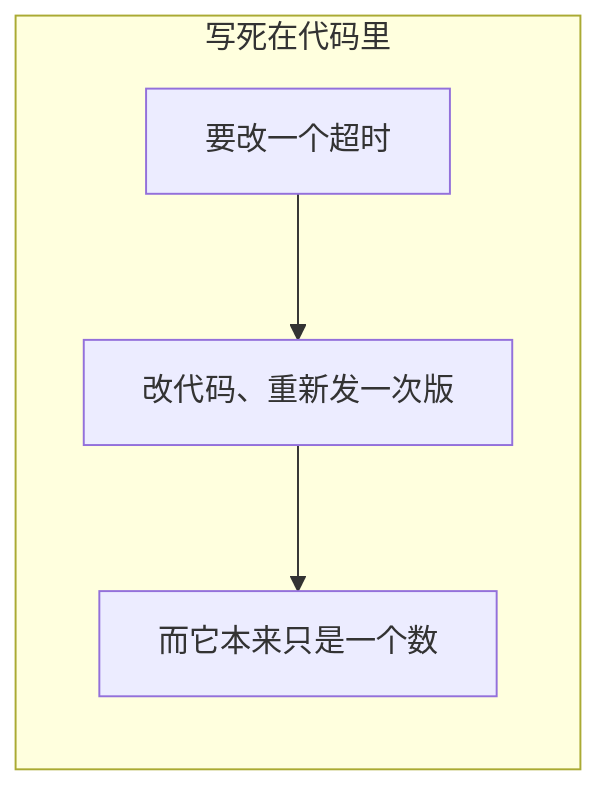

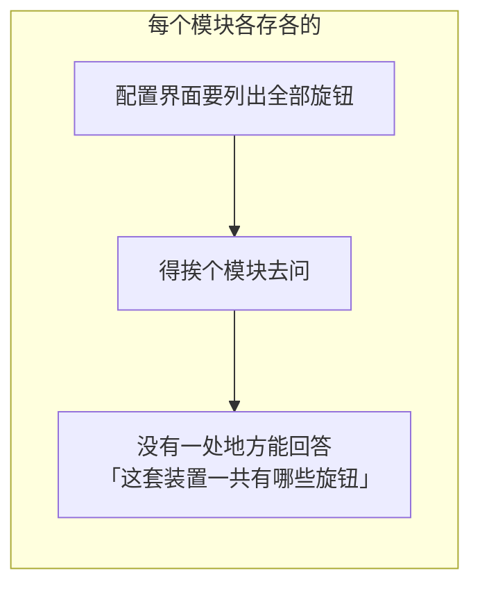

这个包是那条统一的来路：谁拥有哪一段配置、当前值是多少、谁能改、改完谁知道。

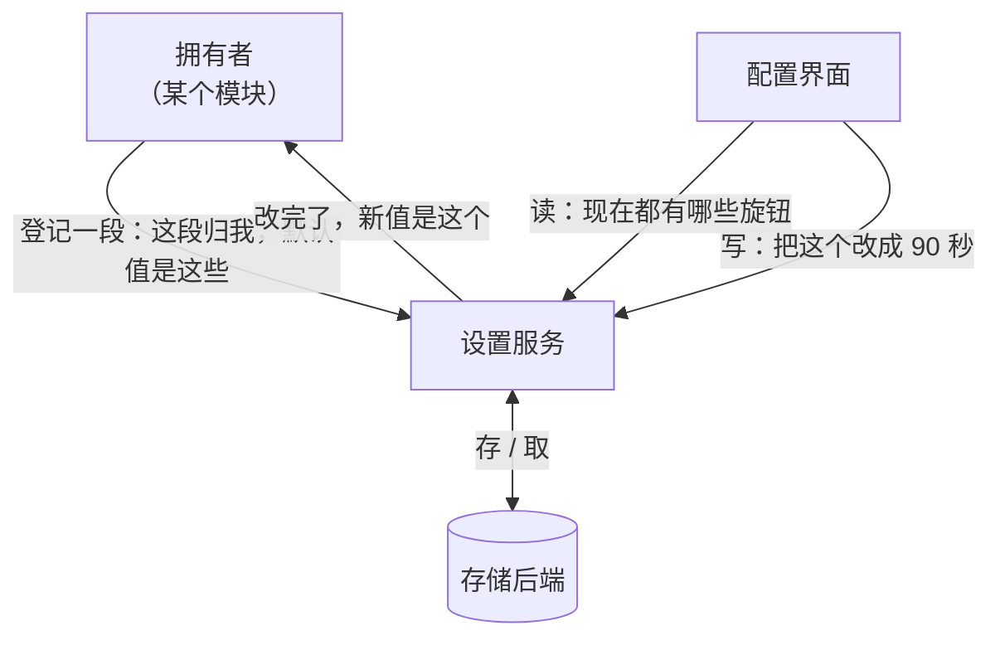

---

## 架构

### 一个值是三层叠出来的

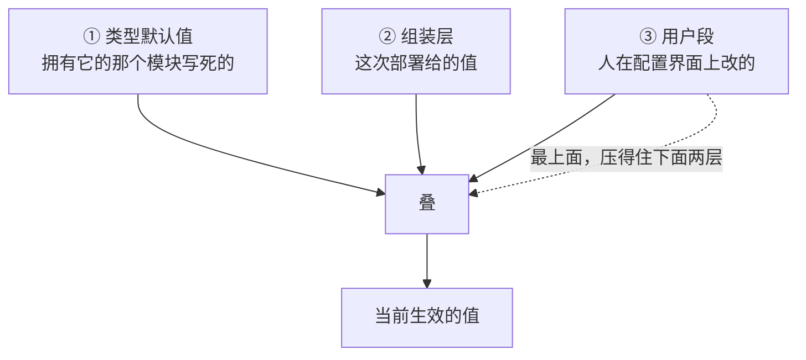

三层各有各的作者，谁都不能替谁做主。压成一层的后果是「重置」这个动作没有落点：

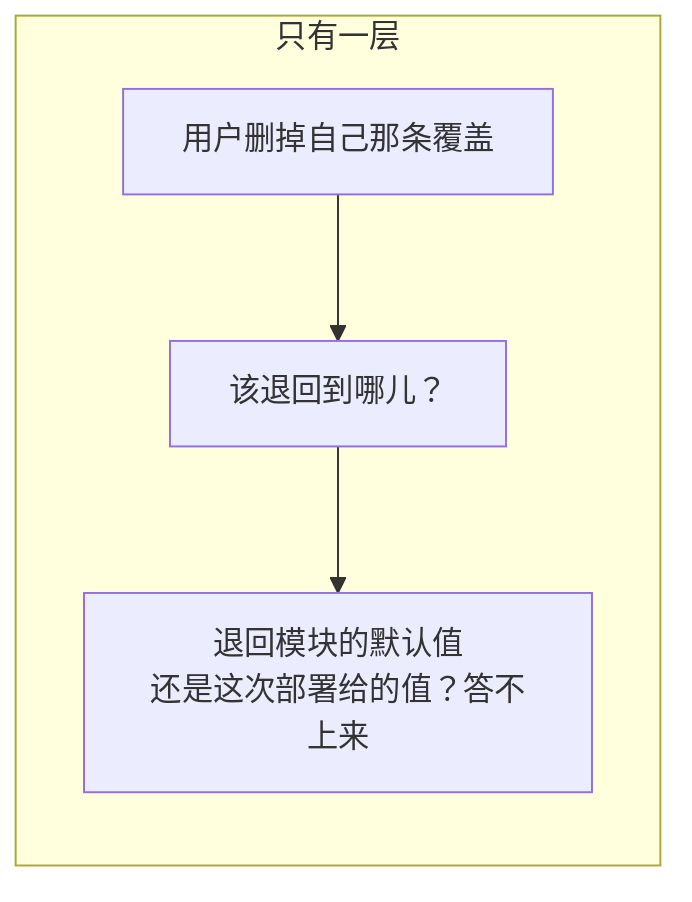

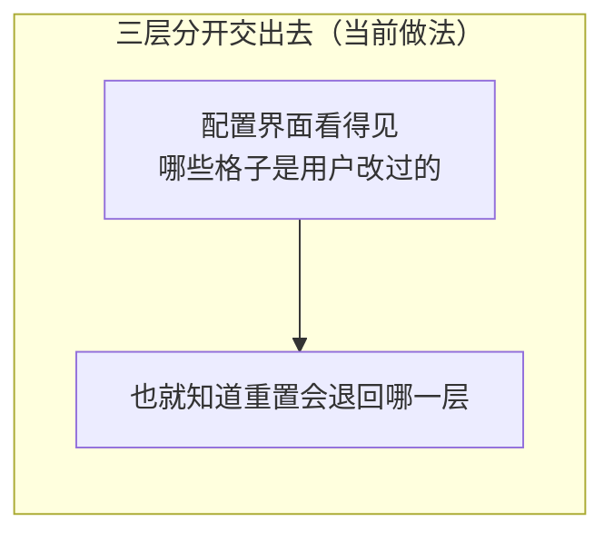

「用户改过」这件事怎么判：**一个字段出现在用户那一层里，它就是被覆盖过的**。不需要拿值去和下层比。

### 一段配置只有一个主人

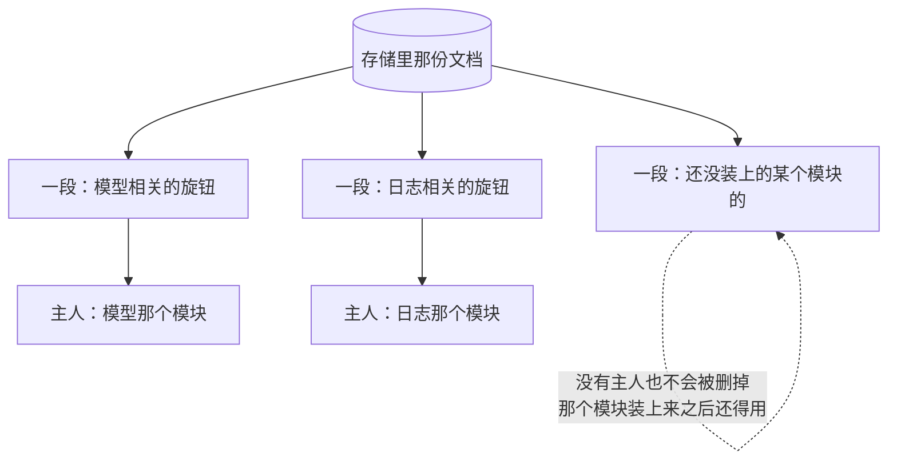

两个模块把同一段当成自己的，会立刻报错。这条不能宽容：


### 存在哪儿：没有硬盘，也没有目录

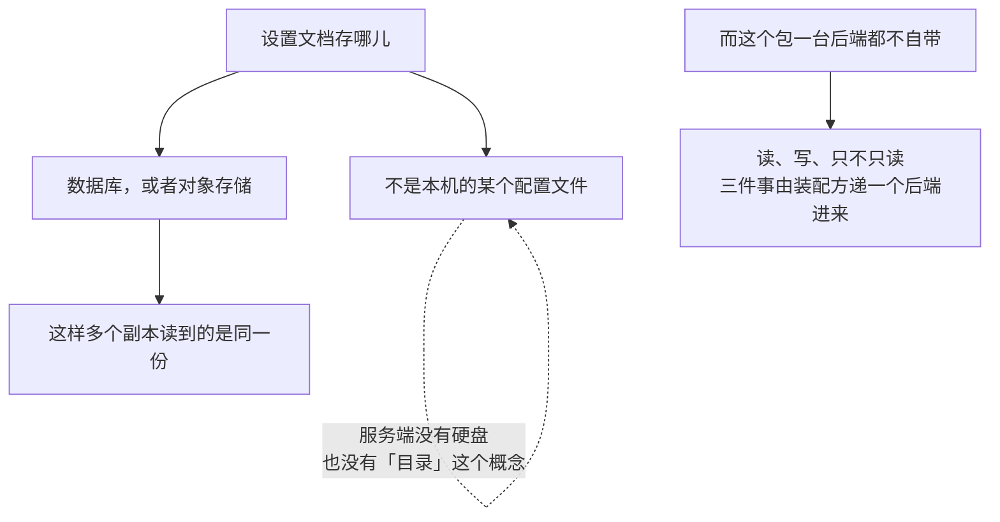

不自带后端不是偷懒：桌面场景想落在本地、集群场景要落在数据库、有的部署整个是只读的——这三种在这个包眼里是同一个形状，分不开的只有装配方自己知道。

### 读的两条路

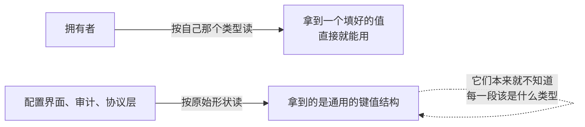

---

## 写：三条路，各有各的用处

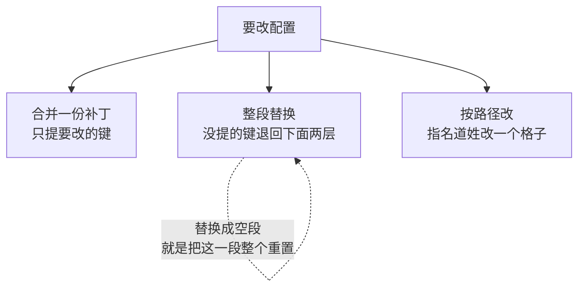

第三条路不是锦上添花，它是必需的：

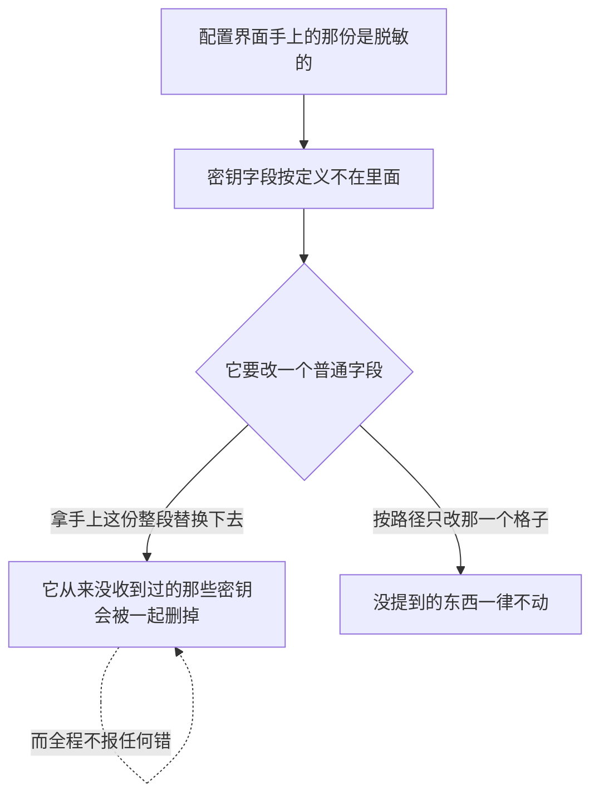

### 一次写从头到尾

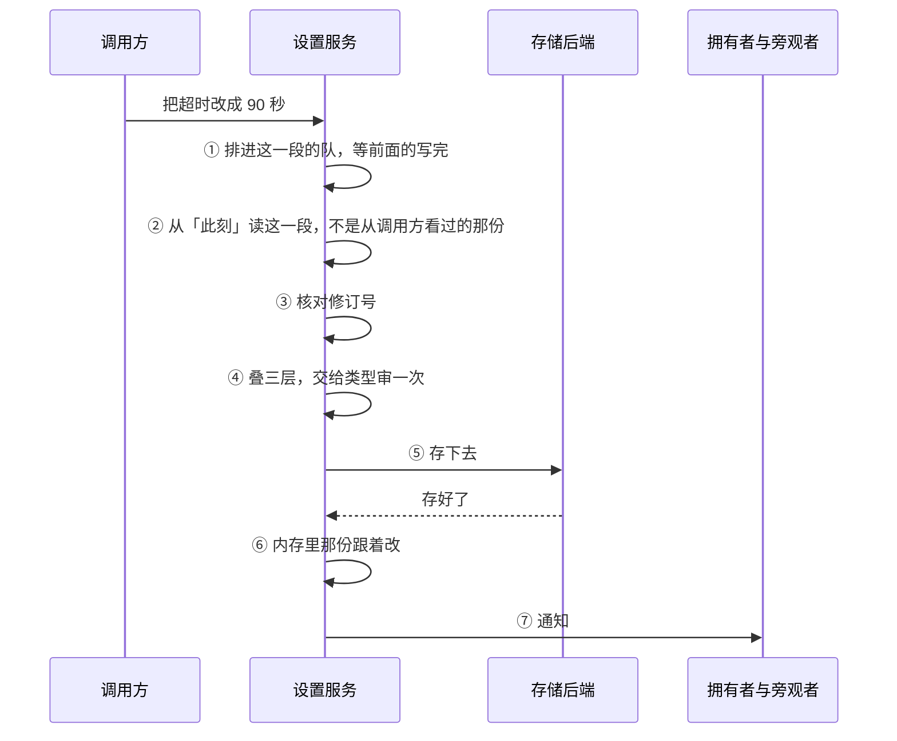

次序里有三处是拿代价换来的：

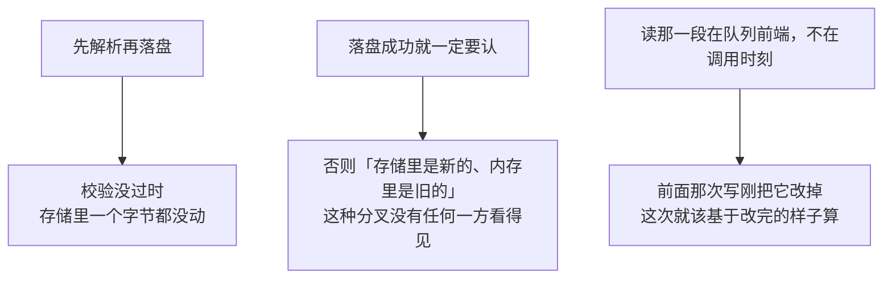

### 修订号：拦住基于过期快照的写

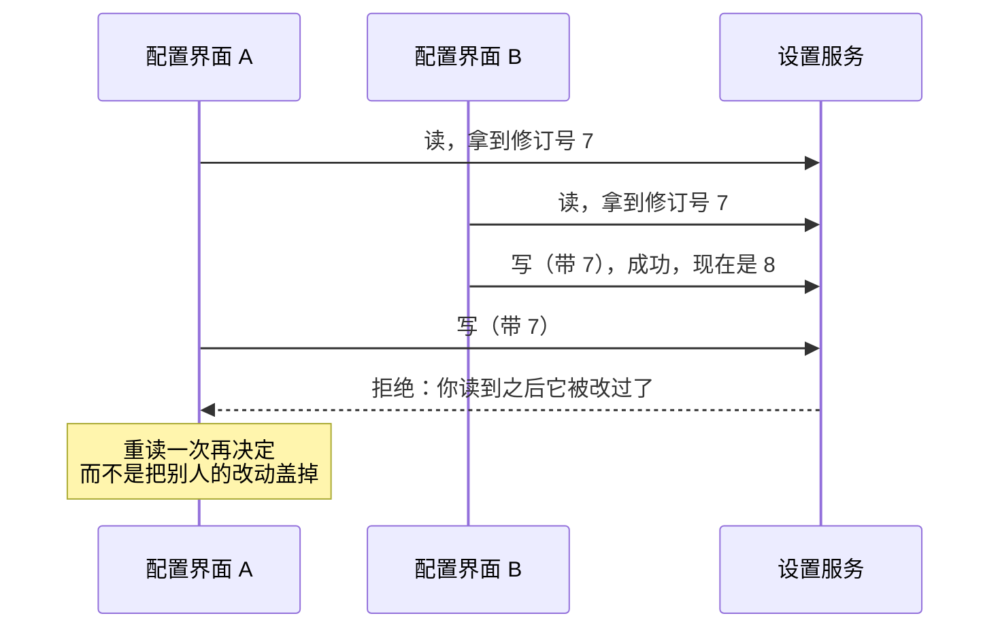

核对必须发生在队列前端，不能在调用那一刻：


### 修订号数的是存下来的那一段，不是生效值

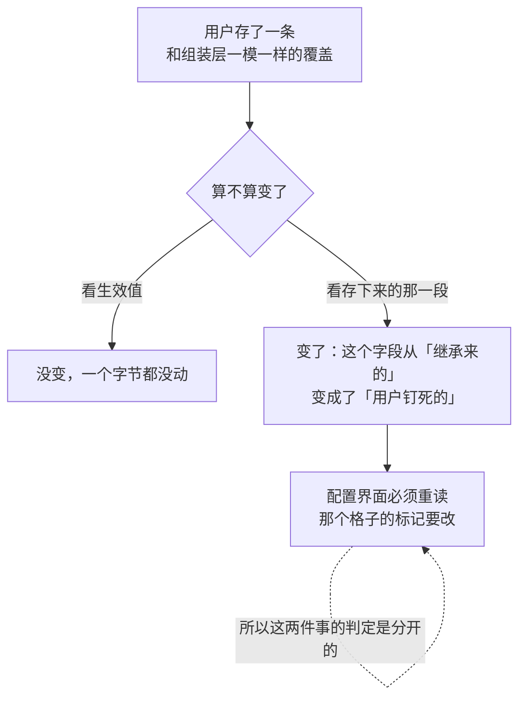

---

## 脱敏：能显示「已配置」，但从来不给出值

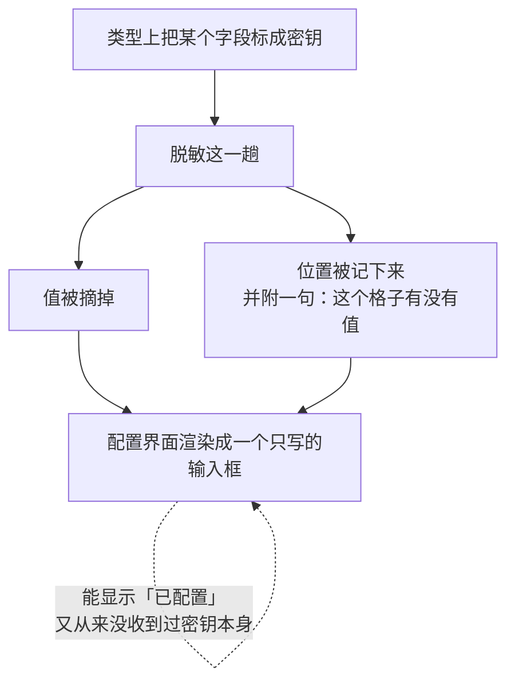

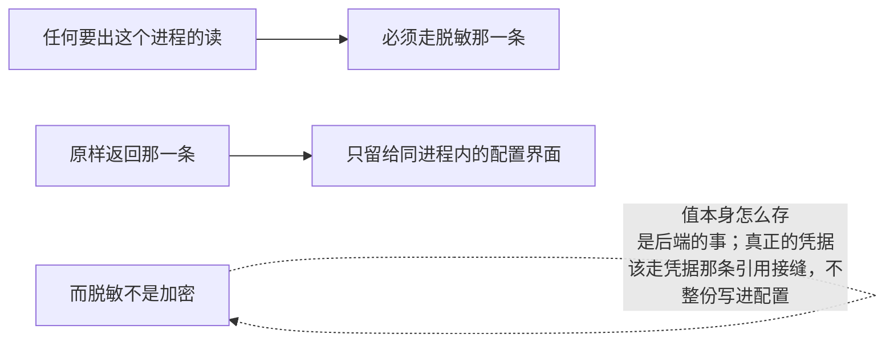

有一个口子必须说清楚：密钥只有在类型明着声明的位置上才摘得掉。藏在一个没有形状的字段底下的密钥，这一趟走不进去，也就摘不掉——所以不要那样建模。

---

## 有人绕过这个包直接改了存储

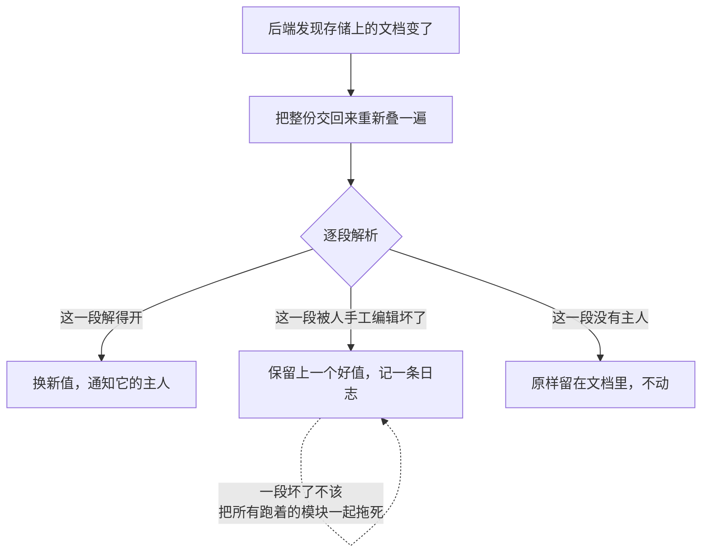

---

## 生命周期与并发

```mermaid
flowchart TD
    A["服务起来时先把文档读进来<br/>再交给别人用"] --> A1["否则第一个登记方拿到的是默认值"]
    A1 --> A2["然后被一次「变更」悄悄换掉<br/>——一个没人改过的启动过程里凭空多出一次变更"]
    B["关闭"] --> B1["不再收新的写<br/>等在途的那些走完"]
    C["注销一段之后"] --> C1["它就不能再被写了<br/>而且注销认的是这一次登记本身"]
    C1 -.->|"重复注销不会把继任者摘掉"| C1
```

```mermaid
flowchart LR
    A["同一段上的写是串行的"] --> B["不同段之间互不挡着"]
    C["通知是就地同步发的"] --> D["调用顺序就是提交顺序"]
    D -.->|"代价：一个慢的观察者<br/>会把整条提交路径拖住"| D
    E["所以观察者的约定是<br/>不许阻塞、不许回头调写"] --> D
```

```mermaid
flowchart TD
    A["读到的值是只读的"] --> B["标量各是各的"]
    A --> C["里面的列表和键值结构是共享的"]
    C -.->|"改它们会影响每一个读到过这个值的人"| C
    D["没有为每次读做一份深拷贝"] --> E["生效值在两次提交之间根本不变<br/>而读落在每一次操作的路径上"]
```

还有一条检查一直挂在提交路径上，它查的是通知本身说的话成不成立：

```mermaid
flowchart TD
    N["一条「已提交」的通知"] --> Q1["服务还活着吗"]
    N --> Q2["这一段此刻还有主人吗"]
    N --> Q3["通知里的值就是服务此刻的权威值吗"]
    N --> Q4["生效值真的变了吗"]
    Q3 -.->|"对不上意味着通知和状态分了叉<br/>而收到通知的一方会照着通知走"| Q3
    Q4 -.->|"一次「其实没变」的通知<br/>会把「变更」这个词的含义稀释掉"| Q4
```

---

## 失败语义

```mermaid
flowchart TD
    A["出了岔子"] --> B{"哪一类"}
    B -->|"段名不合法 / 重名登记 / 这一段没有主人"| C["当场拒绝<br/>不留下半个状态"]
    B -->|"叠出来的值类型对不上，或过不了主人自己的检查"| D["这次写不成立<br/>调用方当场就知道，而不是存下一个会让主人失能的值"]
    B -->|"修订号对不上"| E["拒绝，要求重读<br/>绝不自动覆盖"]
    B -->|"后端是只读的"| F["当场拒绝<br/>不能写完了不生效"]
    B -->|"落盘失败"| G["内存里那份保持旧值"]
    B -->|"某个观察者自己炸了"| H["其余观察者照样跑到<br/>已经落盘的写不因此报失败"]
```

两条各补一句：

```mermaid
flowchart LR
    A["只读后端上的写要当场拒"] --> B["写完了不生效的症状是<br/>「我改了但它没变」"]
    B -.->|"而用户没有任何理由<br/>怀疑是存储不收"| B
    C["一个观察者炸掉不许掐断后面的"] --> D["变更已经提交了"]
    D --> E["没跑到的那几个从此和存储不一致<br/>而它们永远不会知道"]
```

---

## 能力边界

```mermaid
flowchart TD
    Y["这个包做的"] --> Y1["按段登记、三层叠加、算出生效值"]
    Y --> Y2["三条写入路径，加上修订号这道乐观并发"]
    Y --> Y3["脱敏展示，和变更通知"]
    N["不做的"] --> N1["不自带任何存储后端<br/>文件、数据库、远程配置都由装配方递进来"]
    N --> N2["不加密<br/>脱敏只保护展示这条路"]
    N --> N3["不解释形状描述<br/>原样搬给配置界面，也不替登记方生成一份"]
    N --> N4["不提供跨进程共识<br/>队列只串本进程的写，跨副本挡不挡得住取决于后端"]
    N --> N5["不替主人定义业务上的合理性<br/>类型对不对由解码判，值合不合理由主人自己判"]
```

建在它上面的部署级默认模型选择另有一篇：[部署级默认模型](agentdefaultmodel.md)。

## 对应的 DSH 能力

下表由 [`docs/packages.md`](../packages.md) 与 [能力覆盖表](../portmap/capability-coverage.tsv) 机器 join 得到：本篇覆盖的 Go 包，承接的是上游 DSH 的哪几条能力，以及各自还缺什么。落点列由源码里的 `// 源:` 注释反查，不是手写的。

| 上游能力 | DSH 包 | 裁决 | 落在哪个 Go 包 | 这里缺什么 |
|---|---|---|---|---|
| 浏览器配置界面的 Host Remote 属主，提供脱敏 settings 与凭据元数据读取、不回传密钥的写入，并在 Host 桌面打开 settings 或 preset 位置 | `api/settings-controller` | 取形重写 | `settings` | 缺口：credentials 有归属校验，没有「凭据可列出、可引用、读回来打码」这条脱敏读路径 |
| 用户设置Service Definition，管理按namespace分节的schema默认值、组合base与用户层解析 | `settings/settings` | 需要 | `settings` | — |

## 相关源码

- `settings/settings.go`
- `settings/provider.go`
- `settings/json.go`
- `settings/redact.go`

## 深入阅读

[部署级默认模型](agentdefaultmodel.md) · [凭据](credentials.md)
