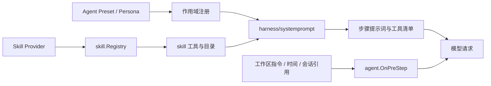

# Skill、提示词与预设

本模块把可复用指令、系统提示词、Agent 预设和运行时上下文组织成模型每一步真正看到的能力集合。

## 定位

Skill 是模型阅读后遵循的任务说明，不是可调用函数。工具回答“模型能执行什么”，Skill 回答“这类任务应该怎么做”。本页覆盖 `skill`、`feature/skill/skilltool`，并串起它们与 `harness/systemprompt`、`preset/*`、`context/*` 的关系；这三处各有各的文档。

## 架构

`context/*` 那三个包不经过 `harness/systemprompt`：它们挂的是 `agent.OnPreStep`，直接往那一步的消息里塞。

所有贡献都显式挂在作用域上。全局能力位于外层，预设和 Agent 能力位于内层；同名能力由更近的一层覆盖，同层重名直接报错。

## Skill 注册与发现

`skill.Registry` 聚合多个 Provider，统一完成发现、同名仲裁、目录生成和正文加载。

- Provider 决定 Skill 来源，可以是本地目录、内置集合或远端服务。
- 排序按层级、rank、Provider 注册顺序和 Provider 内顺序稳定执行。
- 发现结果按工作目录、作用域链和 revision 缓存；注册变化会提升 revision 并清缓存。
- 不完整的发现结果不会覆盖上一份完整缓存，调用方可在后续请求重试。
- 名称、描述和 Provider 身份在进入目录前校验，不能依靠模型容错。

## 模型如何使用 Skill

`feature/skill/skilltool` 提供三条通路：

1. 在每个步骤前发布当前可用 Skill 的名称和描述。
2. 模型调用 `skill` 工具，按准确名称读取最新正文和资源。
3. 用户明确指定某个 Skill 时，把正文注入当前步骤。

目录只在本模块注册的 `skill` 工具对当前 Agent 可见时出现。工具被限制或被同名工具覆盖时，目录也同步消失，避免提示模型调用一个不存在的入口。目录被上下文压缩隐藏后，后续步骤会重新建立；损坏的旧目录不会让会话失败。

## 系统提示词

`harness/systemprompt.Registry` 组合四类登记——段落、动态上下文、变量、工具提供方——装配成模型这一步的全部输入。Persona 占用固定段落 `deployment:persona`；预设里的 Persona 遮蔽掉部署方那份，不改变部署全局身份。

细节见[系统提示词装配](systemprompt.md)。

## Agent 预设

`feature/preset/agentpresets` 从部署指定目录发现组合清单。Go 版本不在运行时动态导入代码；宿主必须在编译期登记具名 Composer，预设只引用已登记的 Composer 和配置。

- 一份预设只装载一次，并由选择它的 Agent 共享常驻作用域。
- 任一组合项安装失败时，整份预设回滚。
- 文件变化通过文件戳触发换代，新 Agent 使用新装载，旧作用域按生命周期退出。
- 展示信息损坏不阻止预设被发现；能力清单损坏则禁止装载。
- 创作只允许把完整预设复制到明确配置的用户根目录，不接受任意代码或任意目标路径。

## 运行时上下文

| 包 | 能力 |
|---|---|
| `feature/context/instructions` | 从工作目录到项目根发现指令文件，建立基线并增量报告变化 |
| `feature/context/timecontext` | 注入当前时间、时区和经过时间，时间来源可替换 |
| `feature/context/sessionref` | 把会话引用解析为受预算限制的模型上下文 |

工作区指令通过 `fs.FileSystem` 读取执行环境，不回退到宿主机文件系统。渲染受字节预算限制，优先保留离工作目录更近的指令。会话引用读取的是目标会话的模型可见状态，不直接拼接原始事件日志。

## 生命周期与并发

- Registry 和提示词注册表允许多个 Agent 并发读取与注册。
- Provider I/O 响应 `context.Context`；调用方取消后不继续等待不合作的 Provider。
- 注册返回撤销函数，作用域释放时自动撤销，避免预设换代后残留能力。
- 一次提示词装配使用快照；并发注册只影响下一次装配，不会让当前请求看到半套配置。

## 能力边界

本模块不负责：

- 执行工具或驱动 Agent Loop。
- 从网络自动下载、编译或加载 Go 插件。
- 信任 Skill 正文；宿主仍需限制工具和数据权限。
- 绕过模型上下文预算无限注入文本。
- 把宿主机目录默认暴露给 Agent。

## 相关源码

| 路径 | 内容 |
|---|---|
| `feature/skill/skill.go`、`feature/skill/registry.go` | Skill 定义、Provider、分层注册与缓存 |
| `feature/skill/skilltool/` | Skill 目录、读取工具和显式调用处理 |
| `harness/systemprompt/` | 提示词段落、变量、工具清单和装配规则 |
| `feature/preset/agentpresets/` | 预设发现、Composer 装配、换代与会话选择 |
| `feature/preset/persona/` | 作用域化 Persona 覆盖 |
| `feature/context/instructions/` | 工作区指令发现、预算和增量对账 |
| `feature/context/timecontext/` | 时间上下文 |
| `feature/context/sessionref/` | 会话引用与上下文生成 |

## 深入阅读

[运行时上下文](context.md) · [Agent 预设与 Persona](presets.md) · [运行时设置](settings.md)
