# Skill、提示词与预设

对应包：`feature/skill`、`feature/skill/skilltool`

## 定位

同一件事，交给一个没被教过的模型和一个被教过的模型，做出来差得很远。「先跑一遍构建再改」「这个仓库的提交信息不许出现某几个词」「结账之前先跑一次对账」——这类话不是函数，是**做法**。

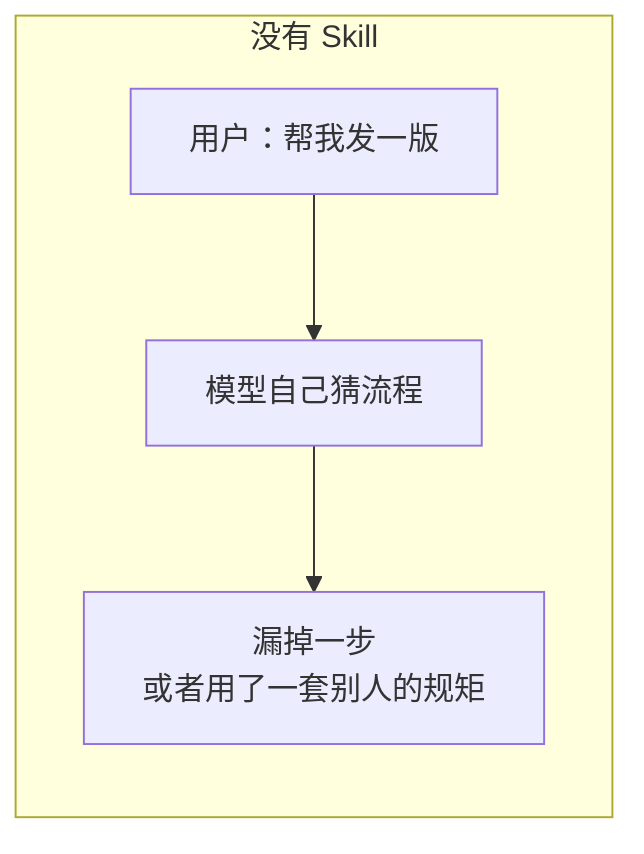
```mermaid
flowchart LR
    subgraph N["没有 Skill"]
        A1["用户：帮我发一版"] --> A2["模型自己猜流程"] --> A3["漏掉一步<br/>或者用了一套别人的规矩"]
    end
```

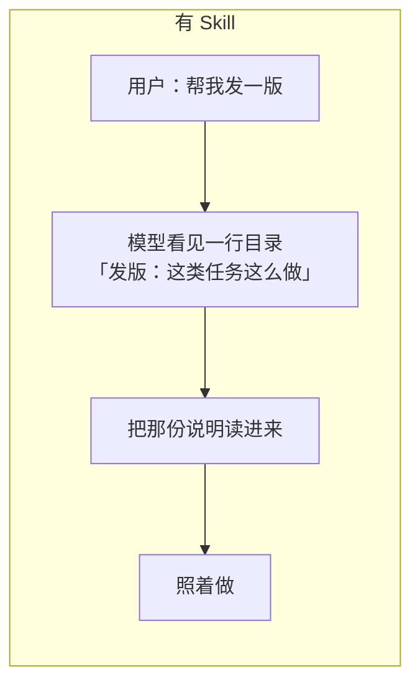
```mermaid
flowchart LR
    subgraph Y["有 Skill"]
        B1["用户：帮我发一版"] --> B2["模型看见一行目录<br/>「发版：这类任务这么做」"]
        B2 --> B3["把那份说明读进来"] --> B4["照着做"]
    end
```

工具和技能回答的是两个不同的问题：

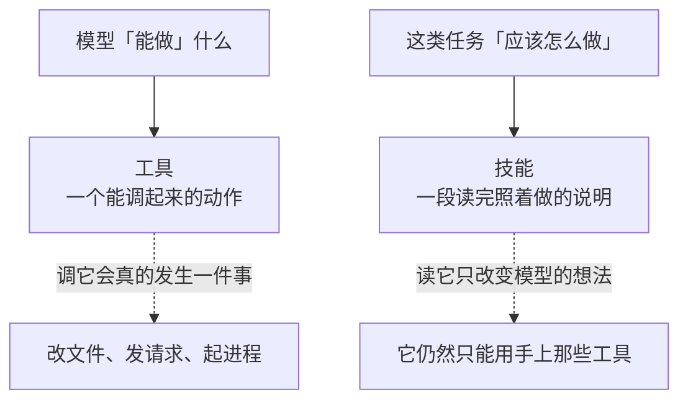
```mermaid
flowchart TD
    Q1["模型「能做」什么"] --> T["工具<br/>一个能调起来的动作"]
    Q2["这类任务「应该怎么做」"] --> S["技能<br/>一段读完照着做的说明"]
    T -.->|"调它会真的发生一件事"| T2["改文件、发请求、起进程"]
    S -.->|"读它只改变模型的想法"| S2["它仍然只能用手上那些工具"]
```

这一篇讲的是那段说明怎么被找到、谁看得见它、以及它什么时候出现在模型眼前。它顺带串起系统提示词、Agent 预设和运行时上下文这三处——那三处各自另有文档，这里只说它们和技能的关系。

---

## 架构

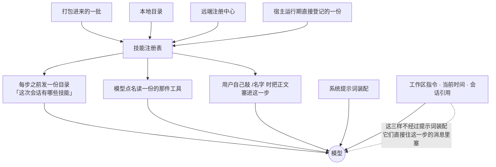
```mermaid
flowchart TD
    P1["打包进来的一批"] --> REG["技能注册表"]
    P2["本地目录"] --> REG
    P3["远端注册中心"] --> REG
    P4["宿主运行期直接登记的一份"] --> REG
    REG --> C1["每步之前发一份目录<br/>「这次会话有哪些技能」"]
    REG --> C2["模型点名读一份的那件工具"]
    REG --> C3["用户自己敲 /名字 时把正文塞进这一步"]
    C1 --> M(("模型"))
    C2 --> M
    C3 --> M
    PR["系统提示词装配"] --> M
    CX["工作区指令 · 当前时间 · 会话引用"] --> M
    CX -.->|"这三样不经过提示词装配<br/>它们直接往这一步的消息里塞"| M
```

两个包的分工：

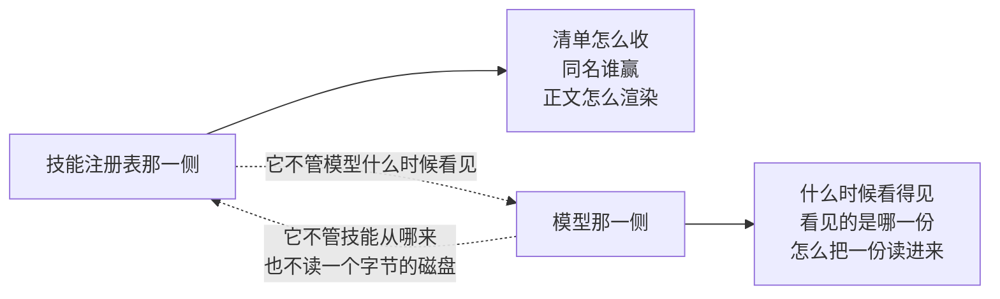
```mermaid
flowchart LR
    A["技能注册表那一侧"] --> A1["清单怎么收<br/>同名谁赢<br/>正文怎么渲染"]
    B["模型那一侧"] --> B1["什么时候看得见<br/>看见的是哪一份<br/>怎么把一份读进来"]
    A -.->|"它不管模型什么时候看见"| B
    B -.->|"它不管技能从哪来<br/>也不读一个字节的磁盘"| A
```

### 谁的技能盖谁的：先看层，再看层内

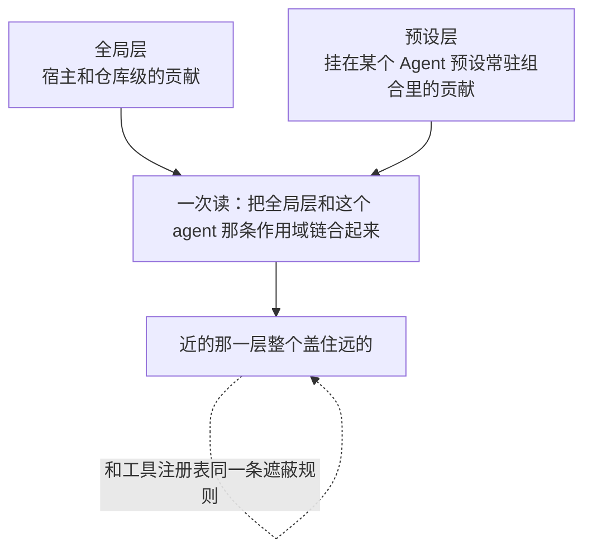
```mermaid
flowchart TD
    G["全局层<br/>宿主和仓库级的贡献"] --> V["一次读：把全局层和这个 agent 那条作用域链合起来"]
    L["预设层<br/>挂在某个 Agent 预设常驻组合里的贡献"] --> V
    V --> R["近的那一层整个盖住远的"]
    R -.->|"和工具注册表同一条遮蔽规则"| R
```

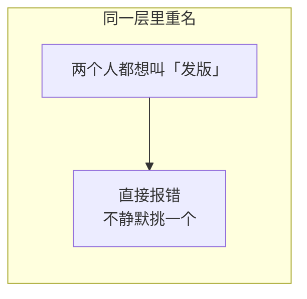
```mermaid
flowchart LR
    subgraph X["同一层里重名"]
        X1["两个人都想叫「发版」"] --> X2["直接报错<br/>不静默挑一个"]
    end
```

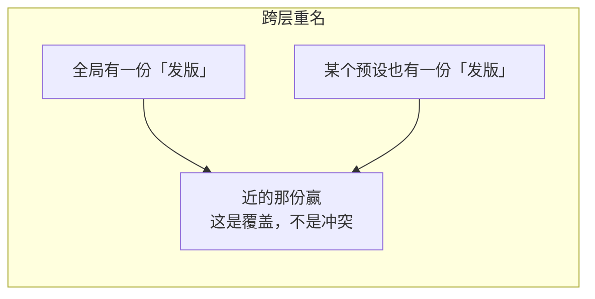
```mermaid
flowchart LR
    subgraph Z["跨层重名"]
        Z1["全局有一份「发版」"] --> Z3["近的那份赢<br/>这是覆盖，不是冲突"]
        Z2["某个预设也有一份「发版」"] --> Z3
    end
```

### 一层之内谁排前面，三级都定死

```mermaid
flowchart LR
    K1["① 优先级数值<br/>小的在前"] --> K2["② 提供方登记进来的先后"] --> K3["③ 提供方自己报出来的顺序"]
    K3 --> S["三个键合起来在一层之内唯一<br/>所以结果不随机"]
    D["约定的两档：<br/>打包进来的那批用一个大数<br/>运行期登记的用一个中间数"] -.->|"于是「项目里的 > 运行期的 > 用户全局的」<br/>这条次序自然成立"| K1
```

### 问一遍所有提供方是真 I/O，所以要记住

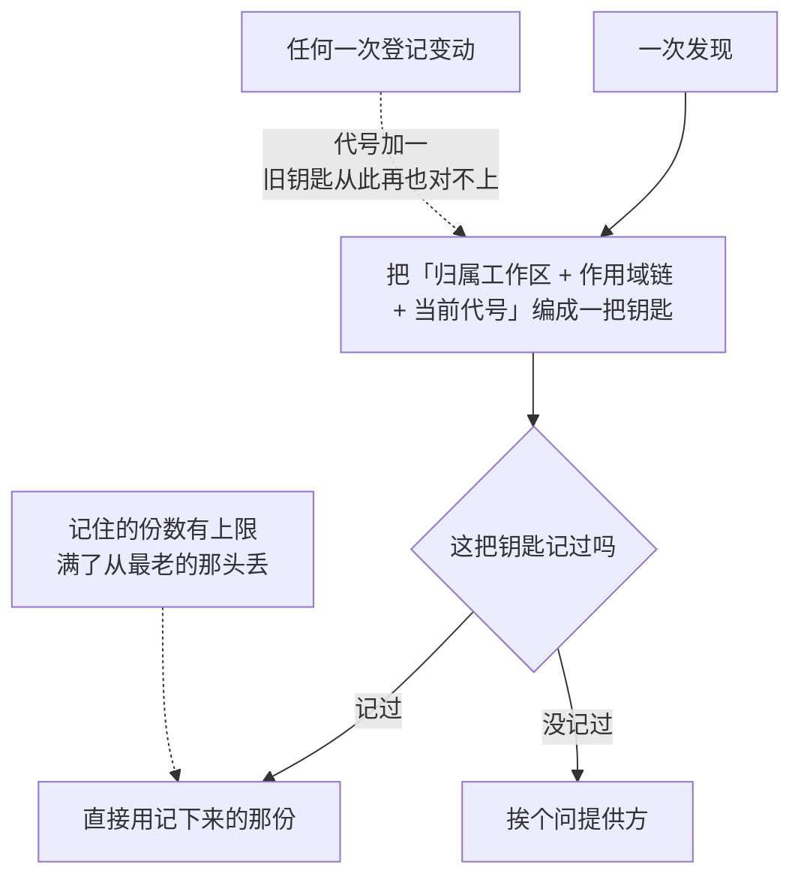
```mermaid
flowchart TD
    A["一次发现"] --> B["把「归属工作区 + 作用域链 + 当前代号」编成一把钥匙"]
    B --> C{"这把钥匙记过吗"}
    C -->|"记过"| D["直接用记下来的那份"]
    C -->|"没记过"| E["挨个问提供方"]
    F["任何一次登记变动"] -.->|"代号加一<br/>旧钥匙从此再也对不上"| B
    G["记住的份数有上限<br/>满了从最老的那头丢"] -.-> D
```

### 少了东西的目录不许被记住

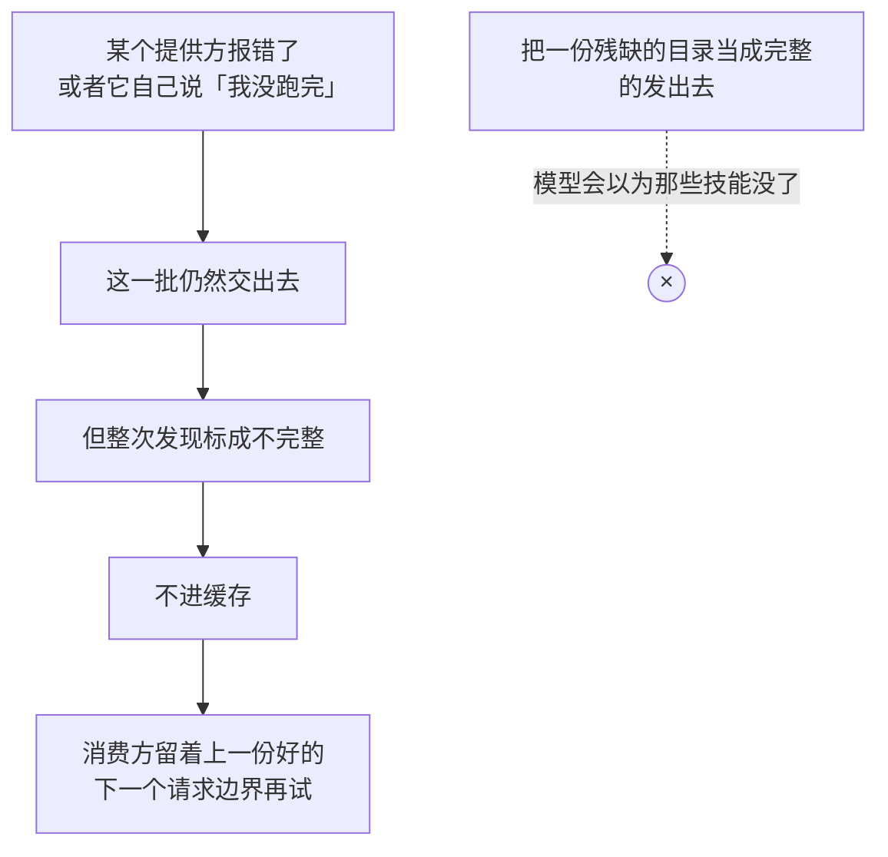
```mermaid
flowchart TD
    A["某个提供方报错了<br/>或者它自己说「我没跑完」"] --> B["这一批仍然交出去"]
    B --> C["但整次发现标成不完整"]
    C --> D["不进缓存"]
    D --> E["消费方留着上一份好的<br/>下一个请求边界再试"]
    F["把一份残缺的目录当成完整的发出去"] -.->|"模型会以为那些技能没了"| G(("×"))
```

---

## 模型这一侧的三条通路

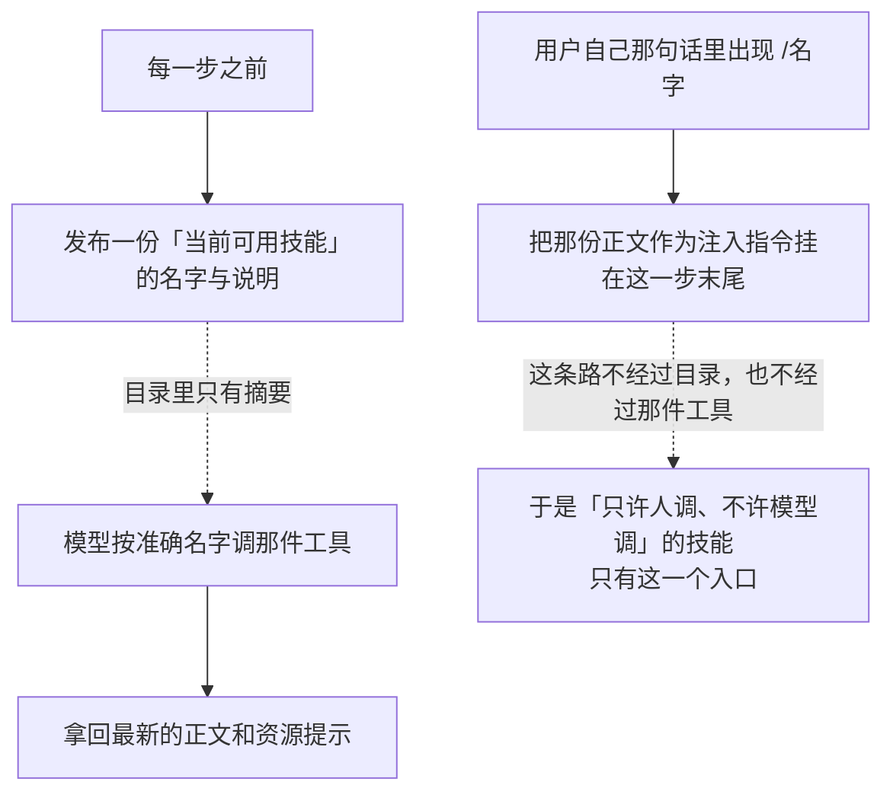
```mermaid
flowchart TD
    A["每一步之前"] --> A1["发布一份「当前可用技能」的名字与说明"]
    B["模型按准确名字调那件工具"] --> B1["拿回最新的正文和资源提示"]
    C["用户自己那句话里出现 /名字"] --> C1["把那份正文作为注入指令挂在这一步末尾"]
    A1 -.->|"目录里只有摘要"| B
    C1 -.->|"这条路不经过目录，也不经过那件工具"| C2["于是「只许人调、不许模型调」的技能<br/>只有这一个入口"]
```

### 目录跟着那件工具的可见性走

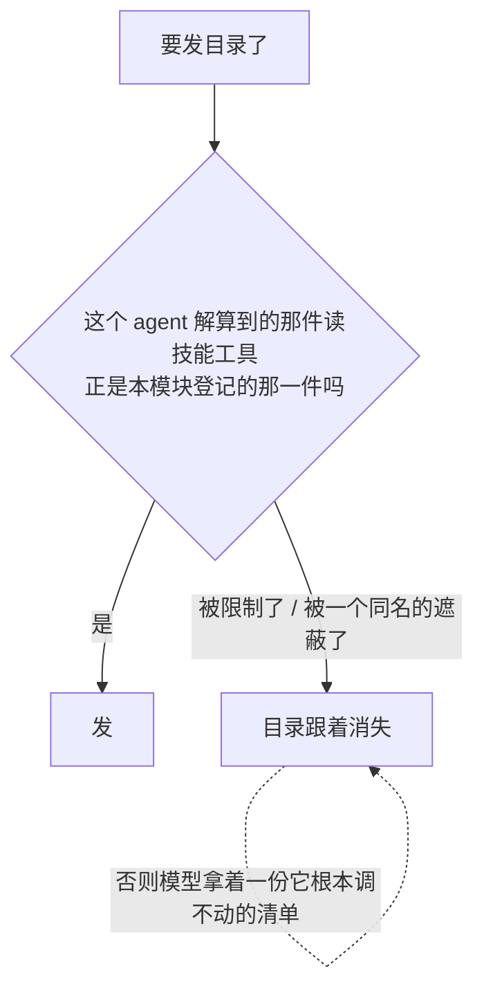
```mermaid
flowchart TD
    A["要发目录了"] --> B{"这个 agent 解算到的那件读技能工具<br/>正是本模块登记的那一件吗"}
    B -->|"是"| C["发"]
    B -->|"被限制了 / 被一个同名的遮蔽了"| D["目录跟着消失"]
    D -.->|"否则模型拿着一份它根本调不动的清单"| D
```

### 发不发、发第一版还是发替换版

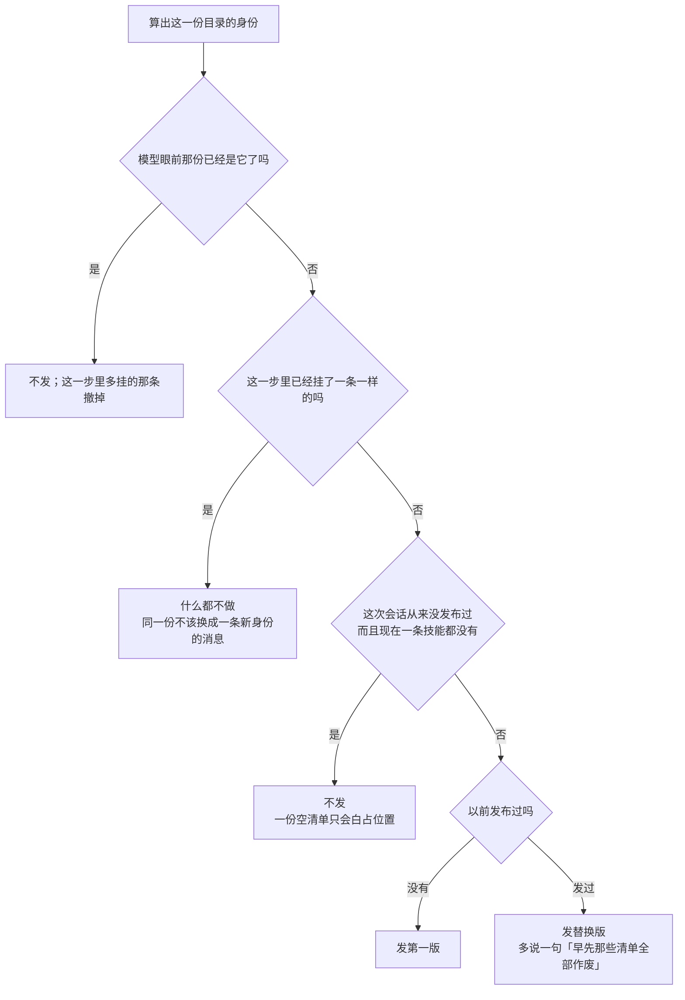
```mermaid
flowchart TD
    S["算出这一份目录的身份"] --> Q1{"模型眼前那份已经是它了吗"}
    Q1 -->|"是"| K1["不发；这一步里多挂的那条撤掉"]
    Q1 -->|"否"| Q2{"这一步里已经挂了一条一样的吗"}
    Q2 -->|"是"| K2["什么都不做<br/>同一份不该换成一条新身份的消息"]
    Q2 -->|"否"| Q3{"这次会话从来没发布过<br/>而且现在一条技能都没有"}
    Q3 -->|"是"| K3["不发<br/>一份空清单只会白占位置"]
    Q3 -->|"否"| Q4{"以前发布过吗"}
    Q4 -->|"没有"| K4["发第一版"]
    Q4 -->|"发过"| K5["发替换版<br/>多说一句「早先那些清单全部作废」"]
```

### 「变没变」看条目，不看那段散文

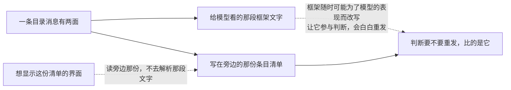
```mermaid
flowchart LR
    A["一条目录消息有两面"] --> B["给模型看的那段框架文字"]
    A --> C["写在旁边的那份条目清单"]
    C --> D["判断要不要重发，比的是它"]
    B -.->|"框架随时可能为了模型的表现而改写<br/>让它参与判断，会白白重发"| D
    E["想显示这份清单的界面"] -.->|"读旁边那份，不去解析那段文字"| C
```

### 一次读取，许可查两遍

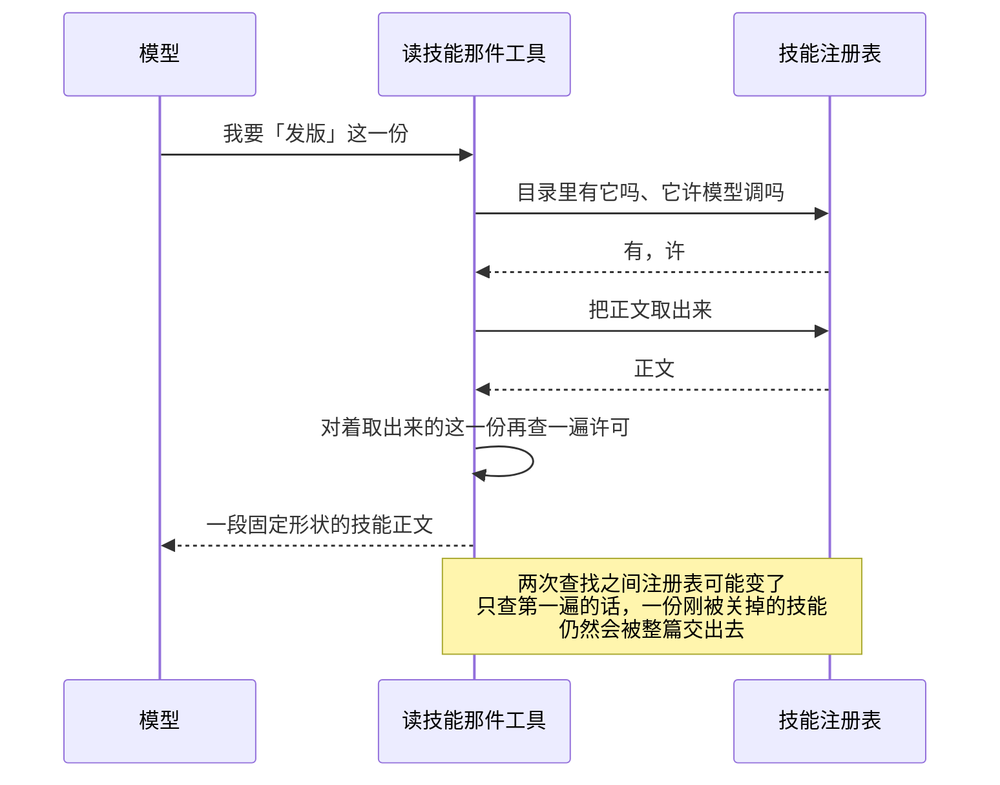
```mermaid
sequenceDiagram
    participant M as 模型
    participant T as 读技能那件工具
    participant R as 技能注册表
    M->>T: 我要「发版」这一份
    T->>R: 目录里有它吗、它许模型调吗
    R-->>T: 有，许
    T->>R: 把正文取出来
    R-->>T: 正文
    T->>T: 对着取出来的这一份再查一遍许可
    T-->>M: 一段固定形状的技能正文
    Note over T,R: 两次查找之间注册表可能变了<br/>只查第一遍的话，一份刚被关掉的技能<br/>仍然会被整篇交出去
```

### `/名字` 这个手势只认人自己说的话

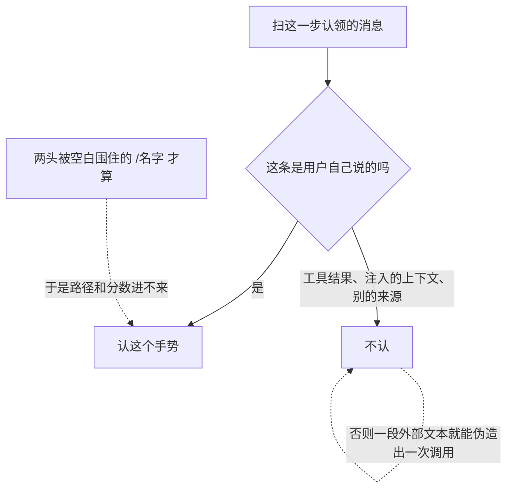
```mermaid
flowchart TD
    A["扫这一步认领的消息"] --> B{"这条是用户自己说的吗"}
    B -->|"是"| C["认这个手势"]
    B -->|"工具结果、注入的上下文、别的来源"| D["不认"]
    D -.->|"否则一段外部文本就能伪造出一次调用"| D
    E["两头被空白围住的 /名字 才算"] -.->|"于是路径和分数进不来"| C
```

### 注入的次序：背景在前，要照着做的在最后

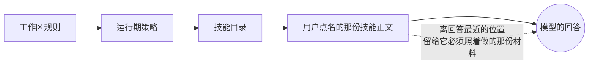
```mermaid
flowchart LR
    A["工作区规则"] --> B["运行期策略"] --> C["技能目录"] --> D["用户点名的那份技能正文"] --> E(("模型的回答"))
    D -.->|"离回答最近的位置<br/>留给它必须照着做的那份材料"| E
```

这个位置不是靠约定维持的，是靠装配次序钉死的：

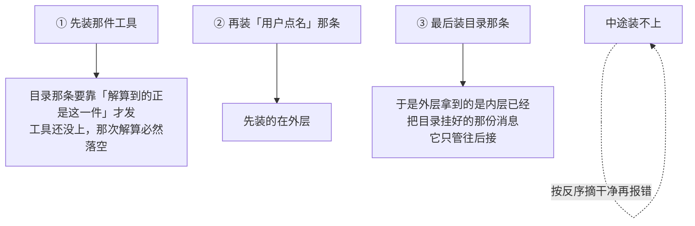
```mermaid
flowchart TD
    A["① 先装那件工具"] --> A1["目录那条要靠「解算到的正是这一件」才发<br/>工具还没上，那次解算必然落空"]
    B["② 再装「用户点名」那条"] --> B1["先装的在外层"]
    C["③ 最后装目录那条"] --> C1["于是外层拿到的是内层已经把目录挂好的那份消息<br/>它只管往后接"]
    D["中途装不上"] -.->|"按反序摘干净再报错"| D
```

### 那份正文长什么样，两条路一模一样

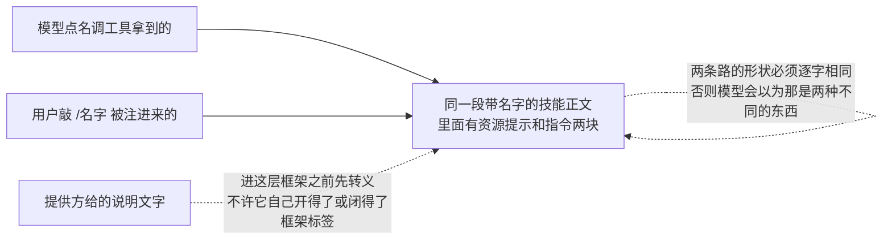
```mermaid
flowchart LR
    A["模型点名调工具拿到的"] --> C["同一段带名字的技能正文<br/>里面有资源提示和指令两块"]
    B["用户敲 /名字 被注进来的"] --> C
    C -.->|"两条路的形状必须逐字相同<br/>否则模型会以为那是两种不同的东西"| C
    D["提供方给的说明文字"] -.->|"进这层框架之前先转义<br/>不许它自己开得了或闭得了框架标签"| C
```

---

## 挨着的三处

### 系统提示词

```mermaid
flowchart TD
    A["段落"] --> Z["这一步给模型的全部输入"]
    B["动态上下文"] --> Z
    C["变量"] --> Z
    D["工具清单"] --> Z
    E["部署方那份人设"] --> P["人设占一个固定段落"]
    F["某个预设里的人设"] -.->|"遮蔽掉部署方那份<br/>但不改变部署的全局身份"| P
    P --> Z
```

### Agent 预设

```mermaid
flowchart LR
    subgraph BAD["运行时把代码拉下来装上"]
        A1["从网络下载"] --> A2["编译"] --> A3["动态加载"]
    end
```

```mermaid
flowchart LR
    subgraph GOOD["当前做法"]
        B1["宿主在编译期登记一批具名的组合方式"] --> B2["预设只能引用已经登记的那些<br/>外加一份配置"]
    end
```

```mermaid
flowchart TD
    A["一份预设开始装载"] --> B{"每一项都装上了吗"}
    B -->|"是"| C["装载一次，选它的那些 agent 共享同一份常驻作用域"]
    B -->|"任一项失败"| D["整份回滚"]
    D -.->|"半套能力会让模型拿到一组互相矛盾的动作"| D
    E["文件变了"] --> F["按文件戳换代<br/>新 agent 用新的，旧作用域按自己的生命周期退出"]
    G["创作一份新预设"] --> H["只允许把完整预设复制到明确配置的用户根目录"]
    H -.->|"不接受任意代码，也不接受任意目标路径"| H
```

### 运行时上下文

```mermaid
flowchart TD
    A["工作区指令"] --> A1["从工作目录一路找到项目根<br/>建立基线，之后只报变化"]
    A1 --> A2["读的是执行环境那条文件接缝<br/>绝不回退到宿主机的盘"]
    A1 --> A3["渲染有字节预算<br/>装不下时先保住离工作目录近的那些"]
    B["当前时间"] --> B1["时间、时区、过了多久<br/>时间来源可以换"]
    C["会话引用"] --> C1["读的是目标会话里模型看得见的那份状态"]
    C1 -.->|"不是把原始事件日志拼起来"| C1
```

---

## 生命周期与并发

```mermaid
flowchart TD
    A["技能注册表和提示词注册表"] --> A1["多个 agent 可以同时读、同时登记"]
    B["提供方的 I/O 认取消"] --> B1["调用方一撤，立刻交回<br/>不吊在一个不合作的提供方身上"]
    C["每次登记都交回一个撤销函数"] --> C1["作用域一释放自动撤销<br/>预设换代之后不留残余能力"]
    D["一次提示词装配用的是快照"] --> D1["并发登记只影响下一次装配<br/>这一次请求看不到半套配置"]
```

```mermaid
flowchart LR
    A["一次读取正文可能活得比它选中的那次登记还久"] --> B{"读回来的名字和当初那条对不上"}
    B -->|"对不上：目录过期了"| C["作废缓存，并且当作没找到"]
    C --> D{"产出它的那次登记现在还活着吗"}
    D -->|"还活着"| E["真的作废"]
    D -->|"已经撤了"| F["什么都不做<br/>撤销那一刻缓存早就废过一次了"]
```

---

## 失败语义

这里的东西全都是**喂给模型看的材料**，所以失败处理有一条统一取向：**宁可少给，不给错的**。

```mermaid
flowchart TB
    A["发现结果不完整"] --> A2["不覆盖上一份完整缓存<br/>下次请求再试"]
    B["预设里有一项装不上"] --> B2["整份预设回滚<br/>不留半套能力"]
    C["那件读技能的工具当前不可见"] --> C2["目录跟着消失<br/>不提示模型去调一个不存在的入口"]
    D["日志里旧的目录记录读不回来"] --> D2["当成「不是本模块发的」<br/>下一步重新建，不让会话失败"]
```

分界在于**这一次失败会不会让模型据以行动**：

```mermaid
flowchart LR
    A["目录少一条"] --> A1["模型顶多不知道有这个技能"] --> A2["可以容忍"]
    B["预设装了一半"] --> B1["模型拿到一组互相矛盾的能力"] --> B2["必须整体回滚"]
```

```mermaid
flowchart TD
    E["其余几条"] --> E1["名字、说明、提供方自称的身份<br/>在进目录之前就校验，不指望模型容错"]
    E --> E2["同层重名直接报错；跨层重名才按「近的盖远的」解释"]
    E --> E3["给人看的那几行说明坏了，不阻止预设被发现<br/>能力清单坏了，禁止装载"]
    E --> E4["在步骤监听器里抛错，会让这个会话之后每个回合都失败<br/>所以那里只降级，不抛"]
```

---

## 能力边界

```mermaid
flowchart TD
    Y["这两个包做的"] --> Y1["把各处报来的清单合起来、定同名的赢家"]
    Y --> Y2["按作用域圈出「这个 agent 看得见哪些」"]
    Y --> Y3["在三条通路上把说明送到模型眼前"]
    N["不做的"] --> N1["不执行技能，也不驱动那圈对话循环<br/>技能是读完照着做的话，不是能调的函数"]
    N --> N2["不产出技能，也不读一个字节的磁盘<br/>从哪来是提供方要回答的"]
    N --> N3["不下载、不编译、不动态加载代码"]
    N --> N4["不为技能正文作保<br/>它能干成什么仍由宿主给的工具与数据权限决定"]
    N --> N5["不管这些文字占掉多少预算<br/>计量和压缩各有各的归属"]
    N --> N6["不把宿主机目录默认摊给 agent"]
```

## 对应的 DSH 能力

下表由 [`docs/packages.md`](../packages.md) 与 [能力覆盖表](../portmap/capability-coverage.tsv) 机器 join 得到：本篇覆盖的 Go 包，承接的是上游 DSH 的哪几条能力，以及各自还缺什么。落点列由源码里的 `// 源:` 注释反查，不是手写的。

| 上游能力 | DSH 包 | 裁决 | 落在哪个 Go 包 | 这里缺什么 |
|---|---|---|---|---|
| 纯agent skill提供方注册表，Service Definition与策略框架 | `skill/skill` | 需要 | `feature/skill` `feature/skill/skilltool` | — |
| 面向模型的skill目录与skill工具，展示可用skill并加载完整指令 | `skill/tool-skill` | 需要 | `feature/skill/skilltool` | — |

## 相关源码

| 路径 | 内容 |
|---|---|
| `feature/skill/skill.go`、`feature/skill/registry.go` | Skill 定义、Provider、分层注册与缓存 |
| `feature/skill/skilltool/` | Skill 目录、读取工具和显式调用处理 |
| `harness/systemprompt/` | 提示词段落、变量、工具清单和装配规则 |
| `feature/preset/agentpresets/` | 预设发现、Composer 装配、换代与会话选择 |
| `feature/preset/persona/` | 作用域化 Persona 覆盖 |
| `feature/context/instructions/` | 工作区指令发现、预算和增量对账 |
| `feature/context/timecontext/` | 时间上下文 |
| `feature/context/sessionref/` | 会话引用与上下文生成 |

## 深入阅读

[运行时上下文](context.md) · [Agent 预设与 Persona](presets.md) · [运行时设置](settings.md)
