# 大结果外置

对应包：`spill`、`feature/spillpolicy`、`adapter/textstore`

## 定位

工具是会吐出巨物的。抓一个网页回来两百 KB，列一遍构建产物三千行，查一次数据库几万条记录。这些东西**原样塞进模型的上下文**，会一次吃掉本来能装下几十轮对话的额度。

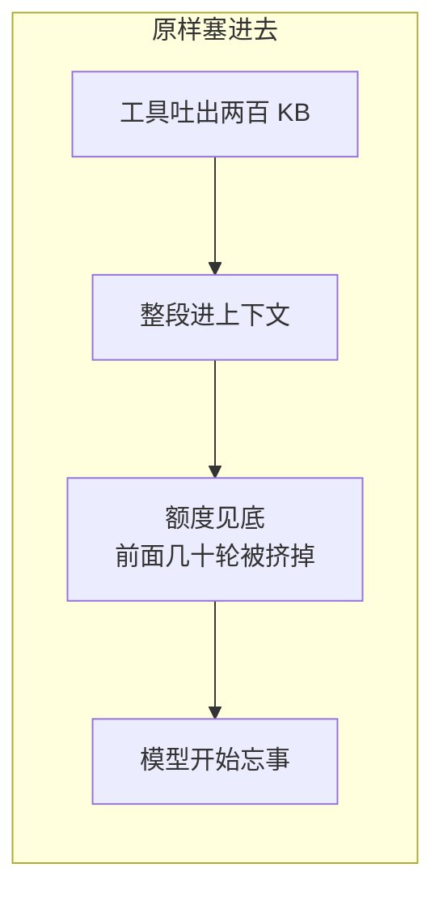

另一种偷懒的做法更糟：直接截断，只留前面一小段。

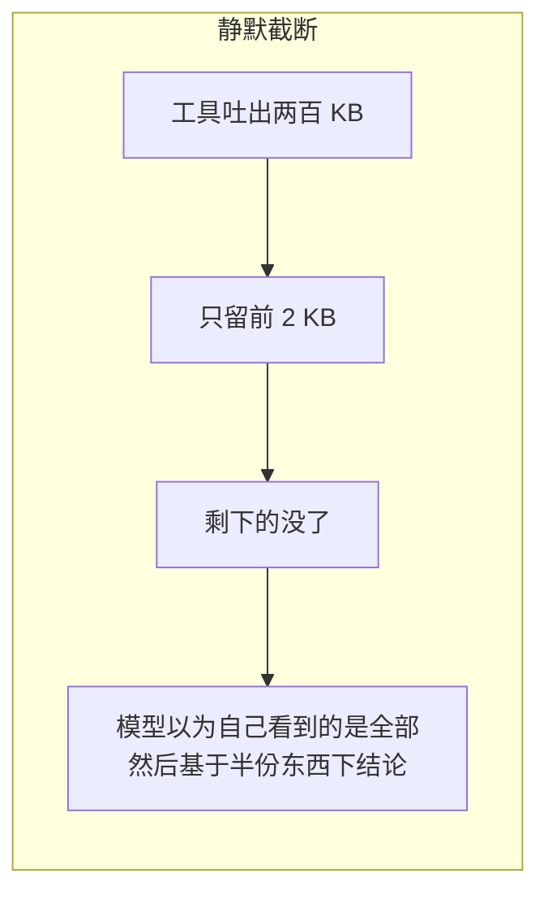

这三个包做的是第三条路：**全文挪到别处存着，原地留一段预览、一个句柄、一句「怎么把它取回来」**。

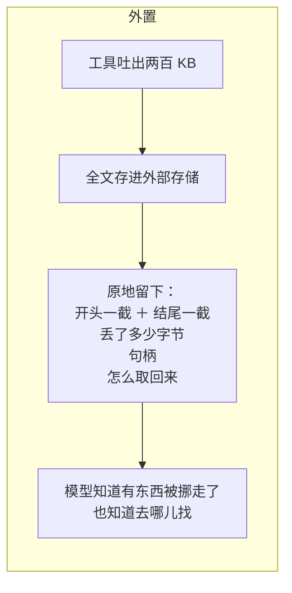

关键差别只有一句：**模型必须知道内容被移走了**。截断是骗它，外置是告诉它。

---

## 架构

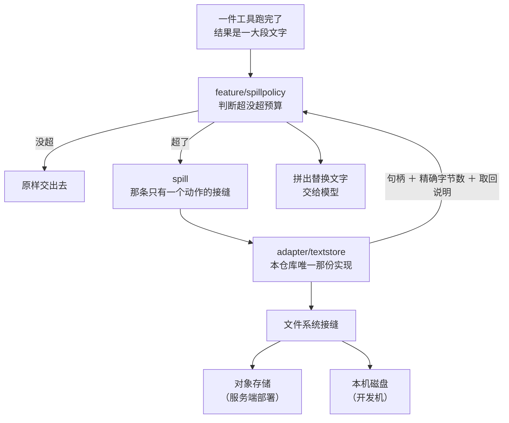

三个包各管一段，边界卡得很死：

| 包 | 它管的 | 它明确不管的 |
|---|---|---|
| `spill` | 一个动作的约定：交出全文，换回句柄 | 什么时候该外置、内容留多久、怎么读回来 |
| `feature/spillpolicy` | 多大算大、挪走之后原地留什么话 | 全文存到哪儿、怎么切预览 |
| `adapter/textstore` | 起名、归拢、不覆盖地写下去 | 判断该不该写、取回、清理 |

### 这条接缝只能写，没有读

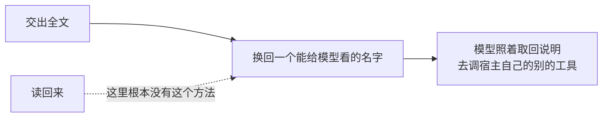

**为什么不加一个读**：加上去，这条接缝就变成了第二套存储——而每个后端本来就各自有自己的读取通道（对象存储有它的 SDK，检索系统有它的查询）。多一个读方法，等于要求每个后端把自己已有的读能力再从这个洞里穿一遍。

### 句柄一律不解析

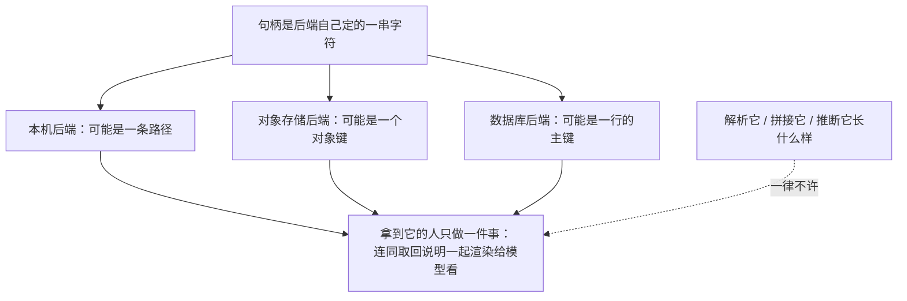

---

## 全文落到哪儿去：不是临时文件

这一节是本篇和 DSH 分岔最大的地方。

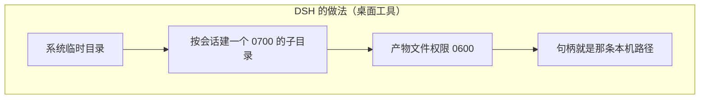

这套办法在一台开发者自己的机器上完全正确。放到本仓库要服务的形态上，它每一条前提都不成立：

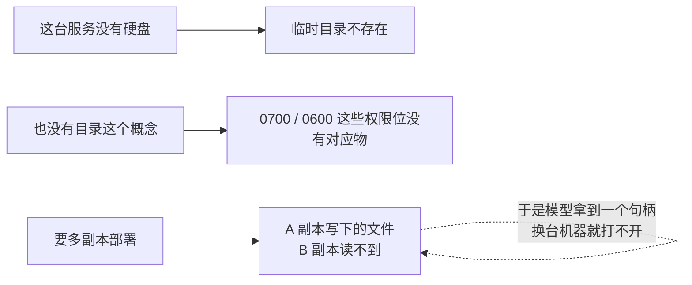

所以 `adapter/textstore` 换的是介质，不是语义：

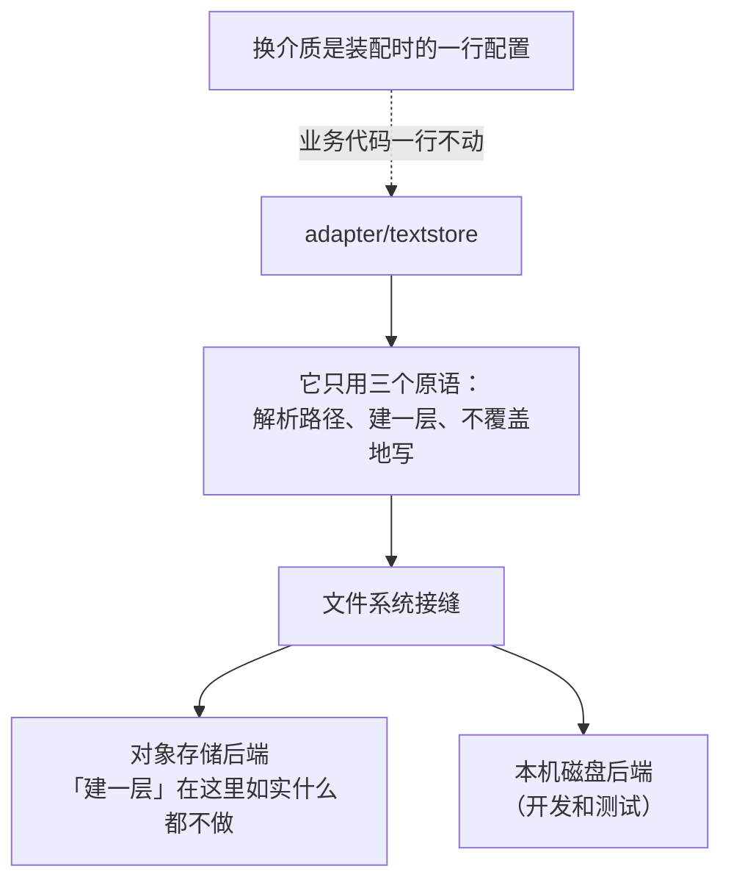

「起名和归拢」这套办法照其原样取自 DSH 那个本机实现；换掉的只是它落到哪儿。

### 一个键分三段，每段各有各的活

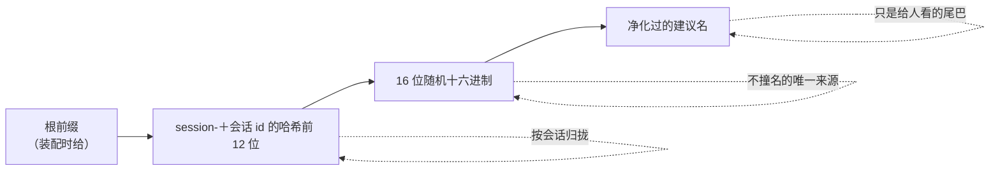

### 会话 id 取哈希，不取原文

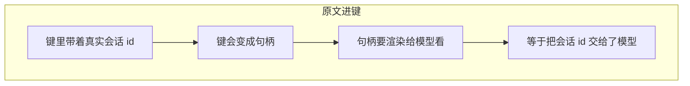

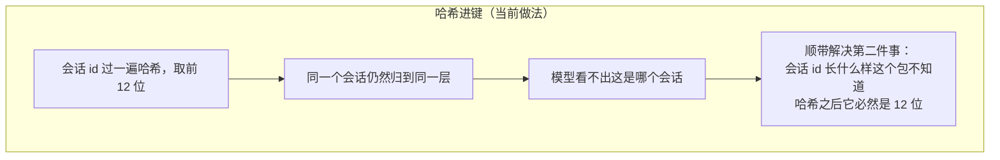

### 建议名永远不是路径

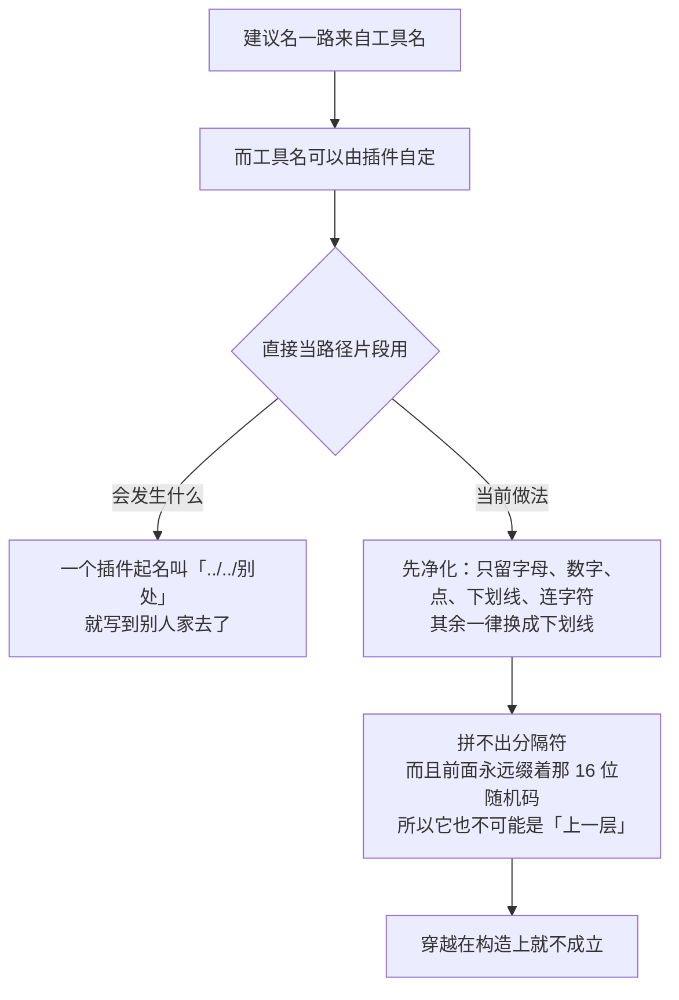

DSH 那边这一段做的是**可逆**编码，能从键反推回原来那个名字。这里故意不要可逆——没有任何一条路需要反推，而不可逆的映射让净化后的名字读起来更像原来那个。至于会不会撞名，那是随机那一段的活，不是这一段的活。

### 撞名就报错，绝不覆盖

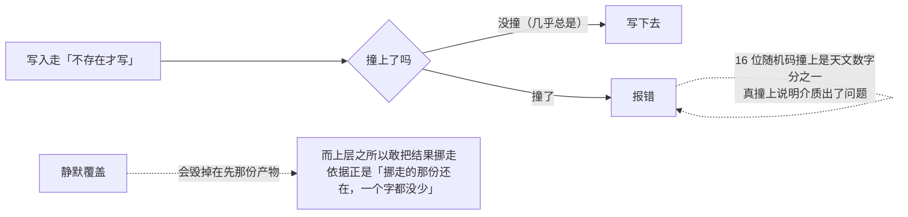

同一条道理的另一半：取不到随机字节的时候**不写**。退回一个猜得出来的名字，等于让后来的一次写有机会顶掉在先那一份。

### 取回说明由装配方给，不写死

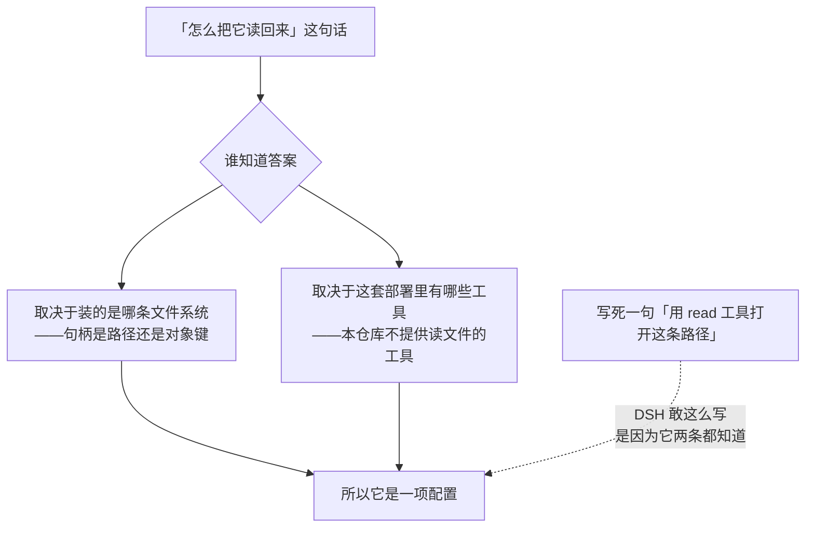

### 不做启动清扫

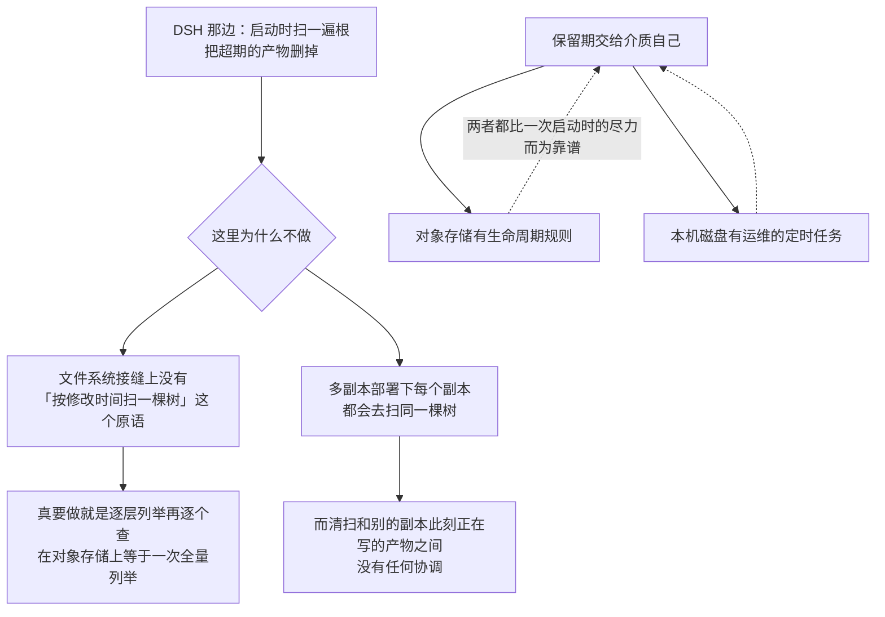

---

## 策略：什么时候动手，动手之后留什么话

### 一次判断的全过程

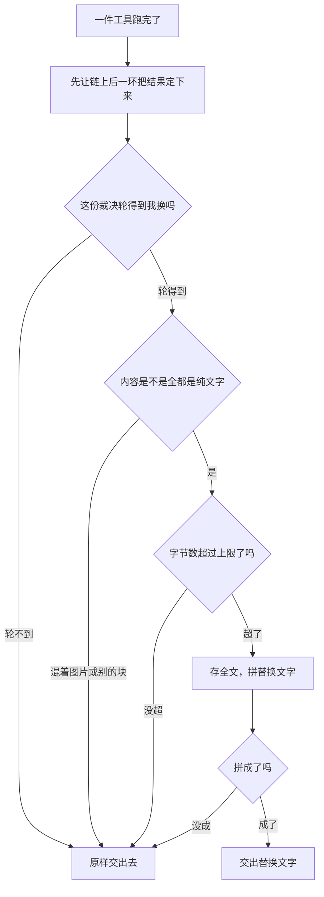

**为什么先让后一环定下来再判**：这一层约束的是**最终会呈现给模型的那份东西**。工具自己那些特有的加工先跑完，然后才轮到这条通用的封顶；一个被别人换过内容的结果，换上去的那份同样会被封顶。

### 四种轮不到它换的情况

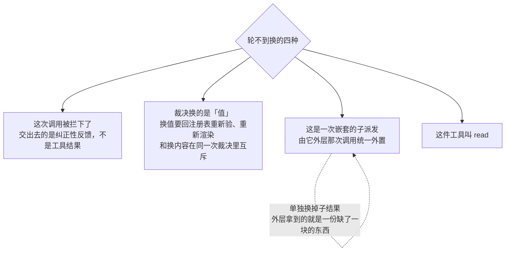

### 为什么单独放过 read

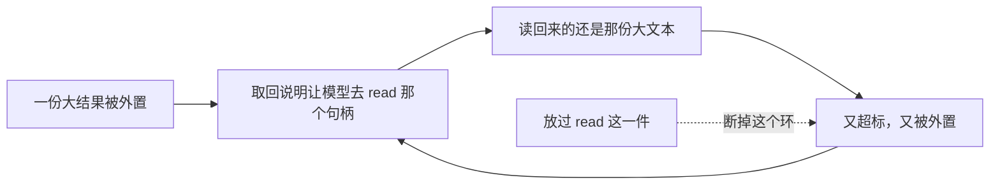

### 只认纯文字

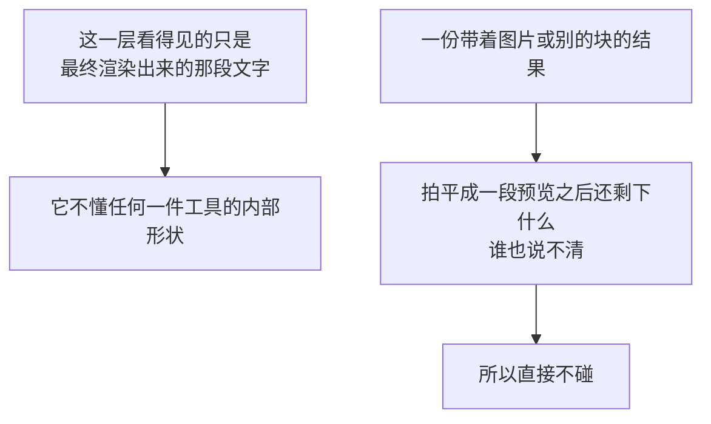

---

## 上限是**替换之后**的上限

这是这一层最容易写错、也最要紧的一条，所以单开一节。

```mermaid
flowchart TD
    subgraph BAD["天真的做法"]
        A1["拿满上限切一段预览"] --> A2["再把那句说明接在后面"]
        A2 --> A3["替换出来的东西比上限大"]
        A3 --> A4["对一份刚刚超标的结果<br/>甚至比原文还大"]
        A4 --> A5["为了省上下文而多花上下文"]
    end
```

```mermaid
flowchart TD
    subgraph GOOD["当前做法"]
        B1["先按最坏情况给那句说明留出位置"] --> B2["预览只能用剩下的那点预算"]
        B2 --> B3["预览 ＋ 空行 ＋ 说明<br/>合起来一定在上限之内"]
    end
```

「最坏情况」怎么估：那句说明里唯一会变长的是「丢了多少字节」这个数，于是拿「全丢」去估它——真实的丢弃数一定不大于全文字节数，位数也就不会更多，留出来的位置一定够。

### 剩下的预算怎么分给预览

```mermaid
flowchart LR
    A["剩余预算"] --> B["对半分"]
    B --> C["头：一半，多出来的那个字节归它"]
    B --> D["尾：一半"]
    C -.->|"一份结果的开头<br/>通常比结尾更能说明它是什么"| C
```

### 连说明都塞不下的时候，不换

```mermaid
flowchart TD
    A["上限给得极小<br/>或者后端的句柄特别长"] --> B["拼出来的替换文字还是超过上限"]
    B --> C["放弃这次外置，原样保留内联内容"]
    C -.->|"换了就破了「上限」这个承诺"| C
    D["全文已经写下去了怎么办"] --> E["它是一份无害的孤儿<br/>清理归介质自己的保留期管"]
```

---

## 尽力而为：绝不把一次成功的调用变成失败

```mermaid
flowchart TD
    X{"三件可能出岔子的事"} --> X1["这次调用没有会话归属"]
    X --> X2["后端存不下（没权限、盘满、连不上）"]
    X --> X3["说明本身就超过了上限"]
    X1 --> Y["处置全都一样：<br/>记一条日志，原样把内联结果交出去"]
    X2 --> Y
    X3 --> Y
    Y -.->|"绝不判成工具失败"| Y
    Z["也绝不把内容藏起来"] -.-> Y
```

**为什么没有会话归属就不外置**：一份没有归属的产物，后端没法把它归拢到任何一个会话名下，日后也没人认领——那不如就留在上下文里。

### 后端也不许自作主张降级

```mermaid
flowchart LR
    A["后端遇上存储故障"] --> B["如实报错"]
    B --> C["怎么退让由调用方定"]
    D["后端自己返回一个假句柄"] -.->|"模型会照着它<br/>去取一份不存在的东西"| E["比报错坏得多"]
```

---

## 一次完整的外置

```mermaid
sequenceDiagram
    participant T as 一件工具
    participant P as 外置策略
    participant S as 文本存储
    participant F as 文件系统接缝
    participant M as 模型
    T->>P: 结果：两百 KB 纯文字
    P->>P: 超过上限，且轮得到我换
    P->>S: 存下这段全文<br/>（带会话归属、工具名、这次调用的编号）
    S->>S: 取 8 个随机字节<br/>会话 id 取哈希<br/>建议名净化
    S->>F: 不覆盖地写下去
    F-->>S: 写成了
    S-->>P: 句柄 ＋ 精确字节数 ＋ 取回说明
    P->>P: 留出说明的位置，切头尾预览
    P-->>M: 开头一截 … 结尾一截<br/>（丢了多少字节。全文存在这里：句柄。取回说明）
```

### 字节数必须是精确值

```mermaid
flowchart LR
    A["后端交出去的字节数"] --> B["精确值，不是估计值"]
    B --> C["保留策略拿它算<br/>「这次省下了多少上下文」"]
    D["一个估出来的数"] -.->|"会让那个决策悄悄地偏"| C
```

### 归属：分叉出来的会话不复制产物

```mermaid
flowchart TD
    A["一个会话分叉出一个子会话"] --> B["种子日志里已有的句柄<br/>原样继承"]
    B --> C["那些产物既不复制，也不改归属"]
    A --> D["分叉之后新产生的外置"] --> E["才用子会话的名义存"]
```

### 工具名和调用编号是纯描述性的

```mermaid
flowchart LR
    A["产物身上记着：<br/>哪件工具、哪一次调用、一句短标签"] --> B["用途：拼一个人能读懂的名字<br/>排查时看得出这块字节从哪来"]
    C["拿它们当权限凭据"] -.->|"任何能编出一个调用编号的人<br/>就读到了别人的东西"| D["谁读得到是介质自己的事"]
```

---

## 生命周期与并发

```mermaid
flowchart TD
    A["策略不拥有存储"] --> A1["卸载时只撤掉挂在工具注册表上的那一环<br/>存储和已经写下去的产物一概不动"]
    B["每次工具调用各发各的保存请求"] --> B1["存储可以并发调用<br/>它本身不持有任何可变状态"]
    C["并发安全由文件系统接缝负责"] --> C1["「不存在才写」这条由后端保证"]
```

### 存全文用的是一个独立的背景取消上下文

```mermaid
flowchart TD
    A["执行后这一环跑的时候<br/>那次工具调用已经收敛了"] --> B["签名里根本没有那次调用的取消信号"]
    B --> C["所以存全文用一个独立的背景上下文"]
    C --> D["它不该被一次已经结束的调用连累"]
    E["中途被撤掉"] -.->|"只会留下一个存了一半的句柄"| D
```

存储那一侧仍然是收取消上下文的——外置的正是「大到装不下」的那种结果，一次传不完又停不下来的写入，恰恰是这条接缝最容易出的问题。

### 配置错了就让部署起不来

```mermaid
flowchart LR
    A["装载的时候一次性验完"] --> A1["上限是负数：拒"]
    A --> A2["没给存储后端：拒"]
    A --> A3["没给「这次调用属于哪个会话」的映射：拒"]
    B["留到每次调用再验"] -.->|"一份写错的配置<br/>会变成每一次超标调用都失败"| C["该让部署起不来的事<br/>不该让工具挂掉"]
```

存储那一侧同理：没给文件系统、没给根前缀、没给取回说明，三样缺一样就装不出来。

---

## 失败语义

```mermaid
flowchart TD
    A["出了岔子"] --> B{"哪一类"}
    B -->|"没有会话归属"| C["记日志，原样保留内联内容<br/>这次调用照常算成功"]
    B -->|"后端存不下"| C
    B -->|"说明本身超过上限"| C
    B -->|"后端遇上存储故障"| D["如实报错<br/>绝不返回一个假句柄"]
    B -->|"取不到随机字节"| E["不写<br/>宁可失败也不用一个猜得出来的名字"]
    B -->|"键撞上了"| F["报错，不覆盖<br/>在先那份产物一个字都不能少"]
    G["外置成功了，但那句替换文字拼不出来"] --> H["放弃这次替换<br/>已写下的全文成为无害的孤儿"]
```

一条贯穿的规矩：**任何一次退让都不许让模型以为自己看到的是全部**。要么原样给全，要么明说挪走了多少、挪到哪儿去了。

---

## 能力边界

```mermaid
flowchart TD
    Y["这几个包做的"] --> Y1["判断一份纯文字结果超没超预算"]
    Y --> Y2["把全文逐字存到外部存储"]
    Y --> Y3["原地留下预览、句柄、取回说明"]
    N["不做的"] --> N1["不是键值存储<br/>这条接缝只能写，没有读的方法"]
    N --> N2["不是会话持久化，也不是通用文件上传"]
    N --> N3["不管访问控制、加密、句柄怎么解析"]
    N --> N4["不定保留期，也不做启动清扫"]
    N --> N5["不切预览<br/>头尾截断是保留策略那一层的活"]
    N --> N6["不碰本机磁盘<br/>服务端部署下面接的是对象存储"]
```

最后再说一句最容易被误读的：**外置换来的是更少的上下文占用，不是一份永久对象**。存进去的东西什么时候消失，取决于介质那一侧的保留规则，这几个包一个字都不承诺。

## 对应的 DSH 能力

下表由 [`docs/packages.md`](../packages.md) 与 [能力覆盖表](../portmap/capability-coverage.tsv) 机器 join 得到：本篇覆盖的 Go 包，承接的是上游 DSH 的哪几条能力，以及各自还缺什么。落点列由源码里的 `// 源:` 注释反查，不是手写的。

| 上游能力 | DSH 包 | 裁决 | 落在哪个 Go 包 | 这里缺什么 |
|---|---|---|---|---|
| spill能力Service Definition，定义后端存储过大工具文本并返回定位信息与取回指引 | `spill/spill` | 需要 | `spill` | — |
| 本地文件系统spill实现，将工具结果保存到会话级私有文件，定位信息是文件路径 | `spill/spill-local` | 不需要 | `adapter/textstore` | 服务端替代实现见 adapter/textstore；缺前置：本机文件系统 |
| 工具结果spill策略，对过大纯文本结果执行spill并替换为有界预览与取回指引 | `spill/spill-policy` | 需要 | `feature/spillpolicy` | — |

## 相关源码

- `spill/spill.go`
- `adapter/textstore/`
- `feature/spillpolicy/`
- `tools/pipeline.go`
