# 存储、文件与附件

运行的时候有四类东西要存下来：程序自己的那些持久状态、agent 在它那个执行世界里读写的文件、模型收发的图片、以及调外部服务要用的密钥。

一个省事的做法是给它们一个统一的存取入口：

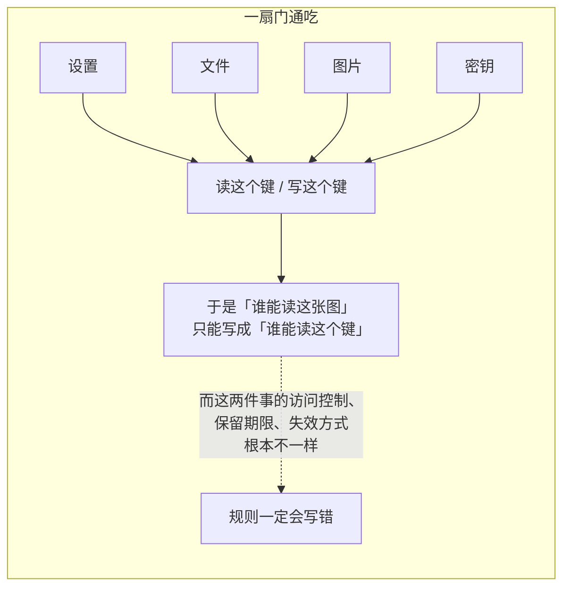

所以拆成四条：

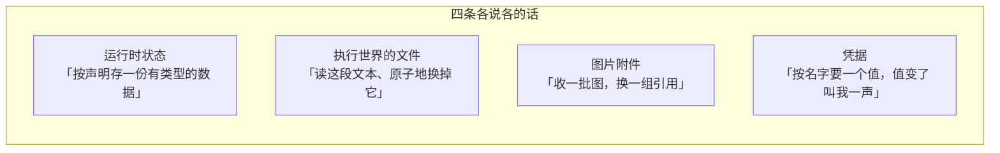

底下可能都落在同一个数据库或同一套对象存储上。**那也不能合成一个接口**——介质相同不等于语义相同。

---

## 定位

这个模块给的是那四条接缝本身：调用方只声明「我要读出什么、写进什么」，挂哪种介质是宿主装配时的选择。

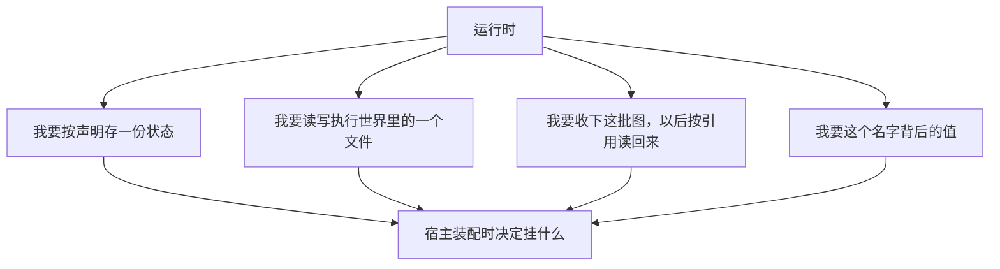

有一条前提贯穿全篇：

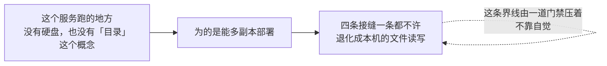

所以凡是提到「文件」「路径」的地方，说的都是**执行世界里由后端解释的坐标**，不是本进程所在机器上的位置。

同样，数据库这三个字在这棵树里一次都不出现：


细节见[持久化抽象层](datastore.md)。

---

## 架构

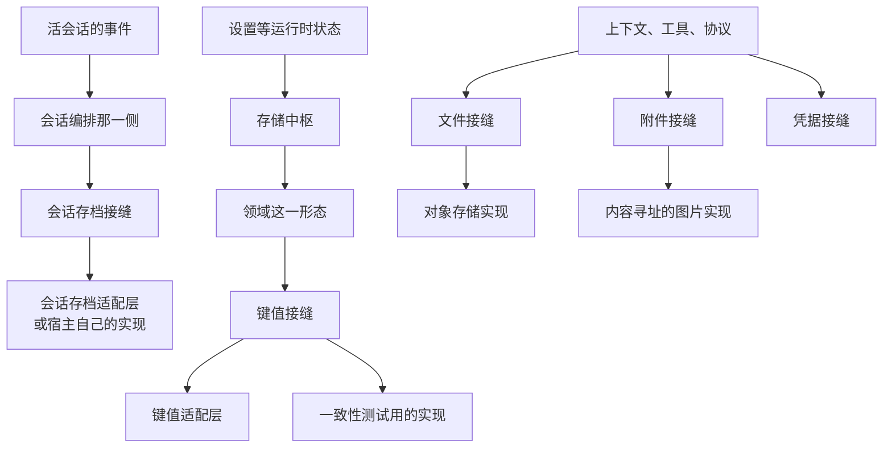

两条后端接缝长得像，但不是同一条：

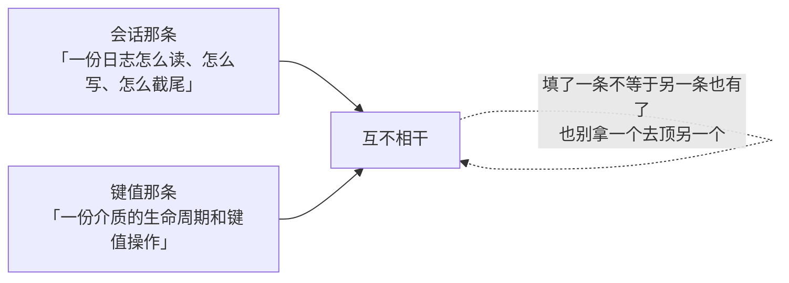

---

## 存储中枢：只登记，不动手

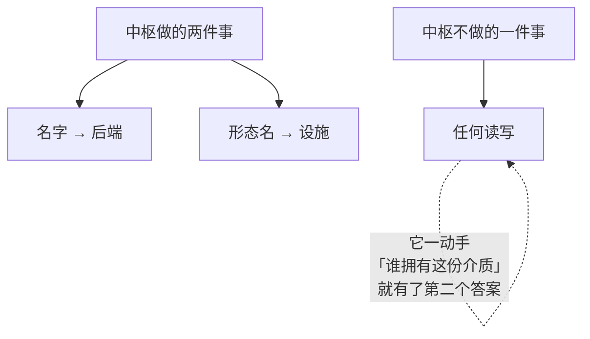


键值这一形态是**可选的**，而且缺席要在解析的那一刻就说清楚：

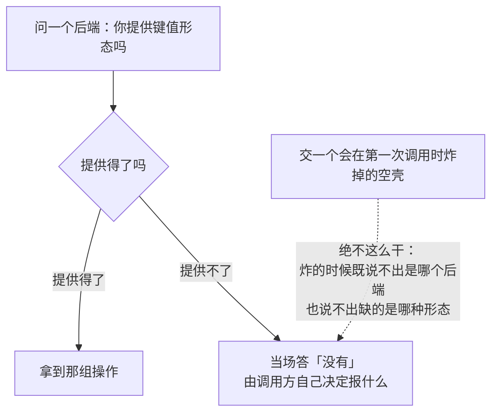

一个键值单元要声明这几样：

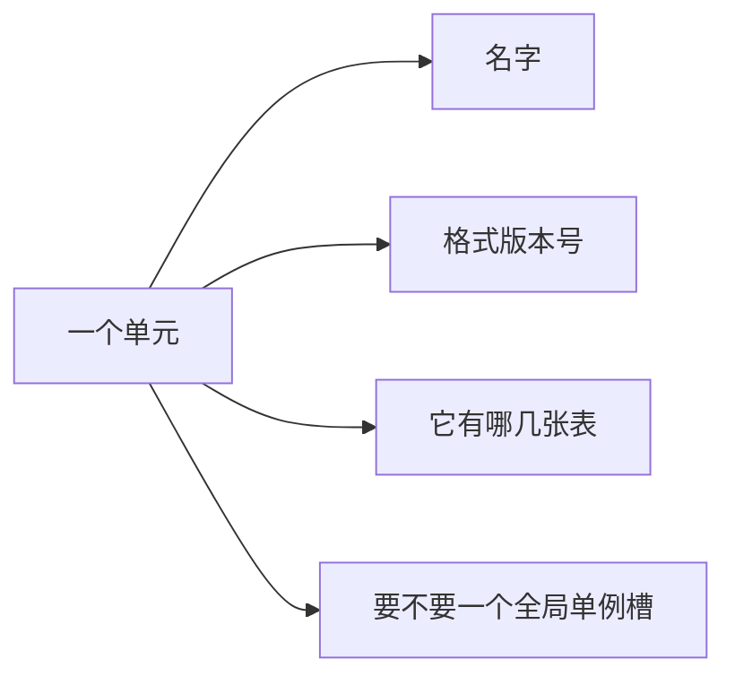

读的时候可以整份快照读，也可以单条读；写的时候可以带一个前置条件。

---

## 读穿介质，写带守卫

这一段是这个模块最容易被误读的地方。

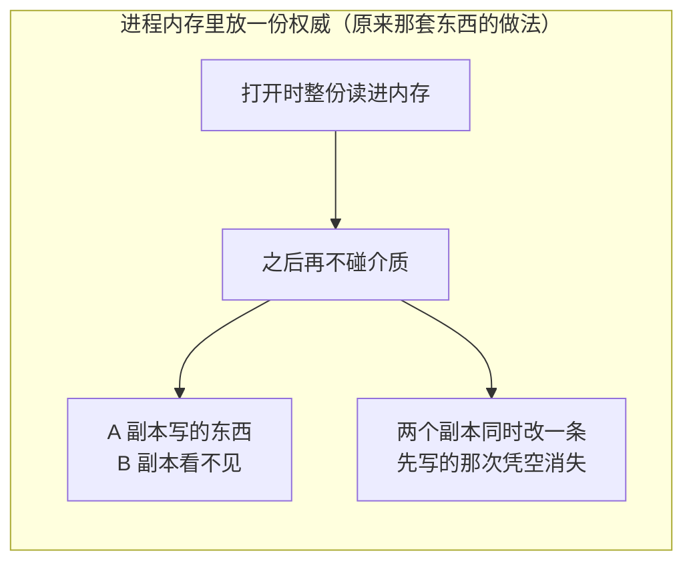

原来那套东西是个单进程的桌面工具，进程内存就是权威，没有第二个写者，这么做是对的。这个服务不是：

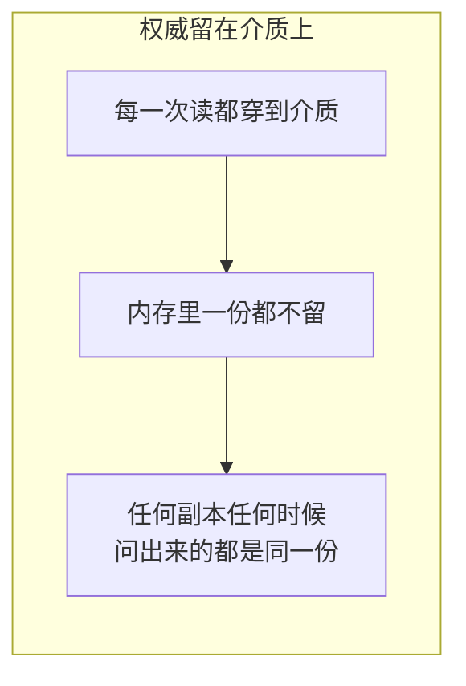

代价写在接口上：每一次读都是一次往返，所以读会失败、会超时、会被取消，取消链必须传得进去。

一次带守卫的更新长这样：

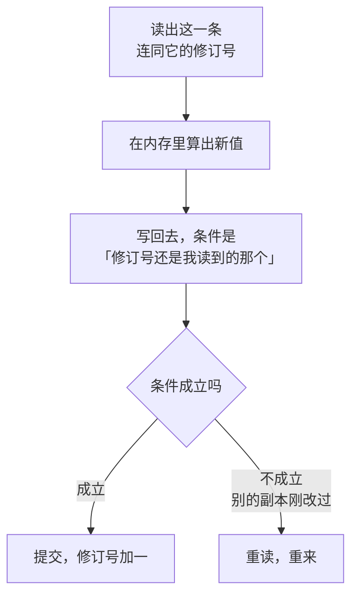

前置条件一共三种：

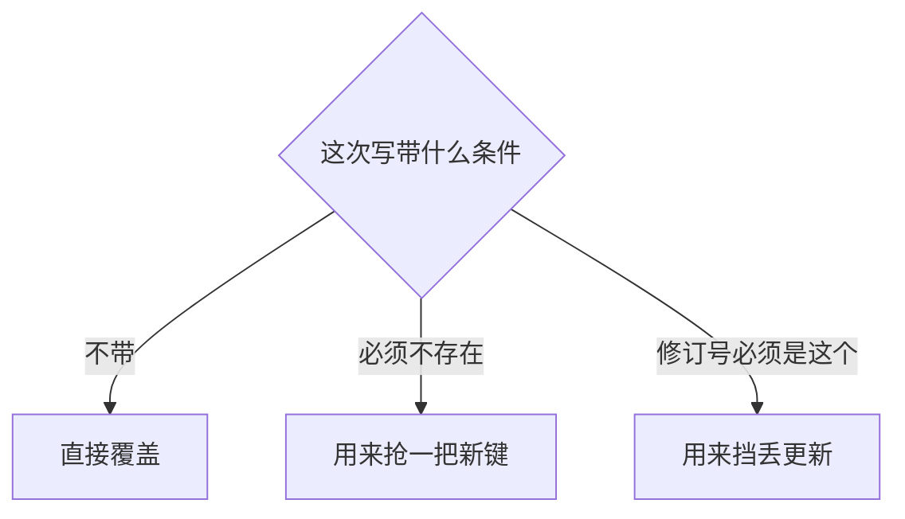

重来是有上限的：

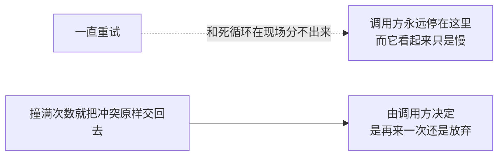

打开一个域的时候，介质上已有的每一条都要过一遍声明的校验：

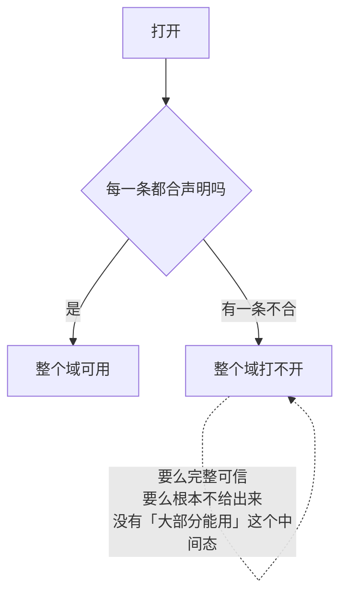

这一趟是**提前一步，不是一条保证**：打开之后别的副本照样写得进一条坏的，兜住它的是每次读路径上的解码。

本副本自己的写串成一条链：


次序不能换：

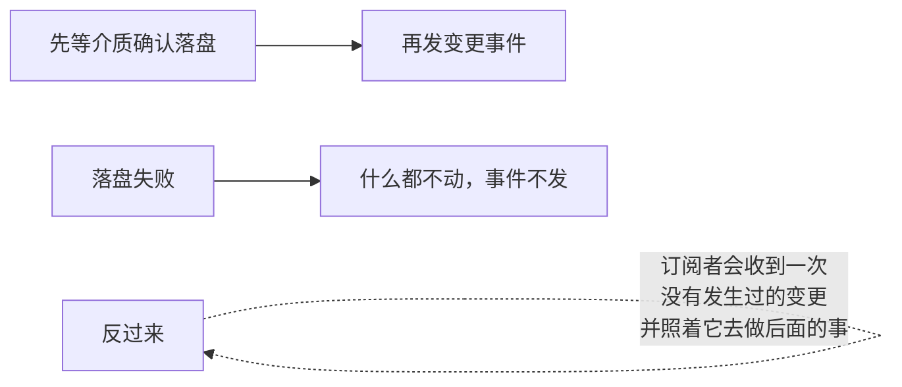

变更事件的范围是一条**画出来的**边界，不是遗漏：

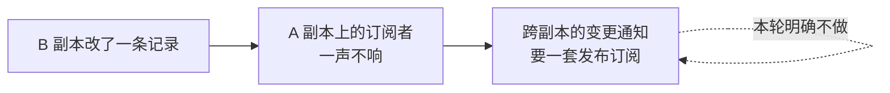

不做迁移也是同一个立场：

```mermaid
flowchart LR
    A["打开时校验不过"] --> B["就是打不开"]
    C["自动改写老记录去迁就新声明"] -.->|"不做"| B
```

路由是一行配置的事：

```mermaid
flowchart LR
    A["某一类数据要搬到另一份介质上"] --> B["只改一行路由配置"]
    C["改所有登记方的代码"] -.->|"不该是这样"| B
```

---

## 一份共用的一致性测试

```mermaid
flowchart LR
    A["契约只写在注释里"] -.->|"两个后端的行为<br/>会在没人察觉的时候分叉"| B["而症状出现在换后端之后的某个远处<br/>看起来完全不像是存储的问题"]
    C["所以每一条都由一份共用测试压着"] --> D["每个后端各跑一遍"]
```

```mermaid
flowchart LR
    A["套件里有一个「在同一份介质上重开」的动作"] --> B["它模拟的是进程重启"]
    C["没有它"] -.->|"「写完就能读到」<br/>只证明了写进内存"| B
```

```mermaid
flowchart TD
    A["有两条不放进共用套件"] --> B["它们要先把介质弄坏"]
    B --> C["而「弄坏」在每个后端上<br/>是完全不同的动作"]
    C -.->|"放进来会逼所有后端<br/>接受同一种破坏方式"| D["各后端在自己的用例里压"]
```

---

## 会话存档那条缝

```mermaid
sequenceDiagram
    participant S as 活会话
    participant H as 编排那一侧
    participant P as 存档接缝
    participant B as 具体介质

    S->>H: 建了、来了事件、要求刷盘、退场了
    H->>P: 读回一份、追加一批、提交一次修复
    P->>B: 真读真写
    B-->>P: 提交结果
    P-->>H: 成了还是没成
    H-->>S: 完成屏障，或者交出一份待恢复的会话
```

```mermaid
flowchart TD
    A["读回一份存档时"] --> B["先校验格式和事件前缀"]
    B --> C{"尾巴崩在半路上"}
    C -->|"能安全判断怎么补"| D["补上"]
    C -->|"判断不了"| E["失败，不猜"]
    F["已经提交的语义损坏"] -.->|"一律不猜"| E
```

```mermaid
flowchart LR
    A["写后队列"] --> B["把连续的批次串行写出"]
    B --> C["按窗口和条数节流"]
    C --> D["刷盘是一道屏障"]
    D --> E["关闭时排空"]
    F["写失败"] --> G["缓冲留着，失败交回去"]
```

存档带一个修订令牌，用来判断同一份日志在两次观察之间变没变过。更多在[Session](session.md)那篇。

---

## 执行世界里的文件

```mermaid
flowchart LR
    subgraph BAD3["把路径当成本机路径"]
        A1["拼一个字符串"] --> A2["直接交给操作系统"]
        A2 -.->|"而这台机器上根本没有那棵树"| A3["要么找不到<br/>要么找到了别人的东西"]
    end
```

```mermaid
flowchart LR
    subgraph GOOD3["路径是一段由后端解释的坐标"]
        B1["统一用斜杠分隔的世界绝对路径"] --> B2["由后端翻成它自己的东西"]
        B2 --> B3["对象存储上翻成键"]
        B2 --> B4["远端工作区上翻成一个地址或编号"]
    end
```

两个标识对调用方是**不透明**的：

```mermaid
flowchart TD
    A["目标标识"] --> A1["某些后端上像是一条规范化路径<br/>另一些上是一个工作区地址或编号"]
    B["版本标识"] --> B1["某些后端上是一组状态字段<br/>另一些上是一个修订号"]
    C["调用方"] -.->|"不许解析、不许从里面推断任何东西"| A
    C -.->|"同上"| B
```

要一条真能交给子进程用的路径，得单独问——而且**不是每个后端都答得上**。

编辑一段文本这件事看着像策略，实际上不能拆：

```mermaid
flowchart TD
    A["校验版本"] --> B["匹配那段字面文本"]
    B --> C["重写"]
    D["三步必须在同一个临界区里做完"] --> A
    E["拆到上层去"] -.->|"三步之间任何一次外部写入<br/>都会让编辑落在一份<br/>已经不存在的内容上"| D
```

守卫和原子性是两件事：

```mermaid
flowchart LR
    A["守卫可以省掉"] --> B["省掉的是<br/>「你写之前看过的还是现在这一份」"]
    C["原子性省不掉"] --> D["一次无守卫的写<br/>照样是原子发布的"]
    E["「无条件写」"] -.->|"很容易被读成<br/>「随便写，写坏了算了」"| C
```

能力按「是不是每个后端都做得到」分了两层：

```mermaid
flowchart LR
    A["人人做得到的那些<br/>读、写、编辑、目录、状态"] --> B["留在主接缝上"]
    C["只有「目标在操作系统里也有名字」<br/>的后端做得到的那两样"] --> D["挪进一个可选接缝"]
    D -.->|"恒返回「不支持」的能力位<br/>比没有这个位更容易骗人"| D
```

写之前的守卫、编辑之前的守卫、以及一次权威观察的登记，是三条挂在这条缝上的策略通道：

```mermaid
flowchart TD
    A["一次观察的登记"] --> B{"登记失败了怎么办"}
    B -->|"当场让这次调用失败"| C["正确"]
    B -->|"记一条日志，继续"| D["错误"]
    D -.->|"后面那次带守卫的写会以「没观察过」被拒<br/>而现场早就过去了<br/>没人还答得上它为什么没被观察到"| D
```

仓库里**不提供**一个「默认读写服务器本机磁盘」的生产实现。执行环境和隔离策略必须由宿主明确选。

---

## 图片附件

```mermaid
flowchart TD
    A["收一批图"] --> B["先把整批都验完"]
    B --> C{"全过了吗"}
    C -->|"是"| D["再开始写第一张"]
    C -->|"否"| E["一张都不写"]
    F["边验边写"] -.->|"第三张不合格时<br/>前两张已经落盘了<br/>而它们永远不会被任何消息引用"| E
```

一批图属于同一条消息：操作者要么整条发出去，要么整条不发。

写这一段**没有事务**，这一层也不假装能回滚：

```mermaid
flowchart LR
    A["写到第三张失败"] --> B["前两张确实已经在存储里了"]
    B --> C["但这一批不返回任何引用"]
    C --> D["没有引用<br/>就没有人指得到它们"]
    D --> E["那些字节等保留策略来收"]
```

准入这一头对编码收得很紧：

```mermaid
flowchart TD
    A["上传进来的一段 base64"] --> B{"是规范形吗"}
    B -->|"是"| C["解成字节"]
    B -->|"否：多打了换行、少了填充、有余位"| D["拒绝"]
    D -.->|"宽松解码下同一张图有多种写法<br/>而去重、缓存、配额<br/>全压在「这两条是不是同一张图」上"| D
```

收紧之后那个判断退化成一次字节比较。存下来的图是内容寻址的：

```mermaid
flowchart LR
    A["字节的摘要"] --> B["既是名字，也是唯一判据"]
    B --> C["同一张图存多少次都只占一份"]
    C --> D["读回来时逐字节核对"]
```

按某条模型路由的预算重新编码一份，是一项**可选能力**：

```mermaid
flowchart LR
    A["它要一个图像处理库"] --> B["不是每个实现方都装得起"]
    B --> C["实现方支持就走它"]
    B --> D["不支持就得到一个稳定的错误码"]
    D -.->|"实现方不必为了「我不支持」<br/>去写一个只会报错的方法"| D
```

图片取不到时给的是稳定错误码：**拒绝这次请求还是降级成一句文本诊断，不在存储这一层决定。** 细节见[附件与图片](attachment.md)。

---

## 凭据

```mermaid
flowchart LR
    subgraph BAD4["配置里直接写值"]
        A1["换一次密钥"] --> A2["改配置"] --> A3["重启相关的那些东西"]
        A1 -.->|"而且配置界面一渲染<br/>值就跑到界面上去了"| A4["值到处都是"]
    end
```

```mermaid
flowchart LR
    subgraph GOOD4["配置里只写引用"]
        B1["每次操作都重新解析一遍引用"] --> B2["换掉密钥之后<br/>下一次操作就用上新值"]
        B2 --> B3["不重启任何东西"]
        B4["配置界面描述的是引用<br/>配没配、来自哪层、能不能改"] --> B5["全程见不到值本身"]
    end
```

两套键空间回答两个不同的问题：

```mermaid
flowchart TD
    Q1["这个名字背后是什么"] --> A1["分层：进程环境、自己的存储、配置文件<br/>一层压一层"]
    Q2["某个模块为这个身份持有什么凭据"] --> A2["没有分层可言<br/>记录在不在就是全部事实"]
    A2 --> A3["所以改它只有一条路：<br/>读—决定—替换，在一把锁里做完"]
    A3 -.->|"刷新一个令牌<br/>本来就依赖它的当前值"| A3
```

一条贯穿接缝的规则：

```mermaid
flowchart LR
    A["存下来的空值"] --> B["等于没有"]
    C["少了这条"] -.->|"一个被清空但没删掉的条目<br/>会冒充一个配好的密钥"| D["症状是「界面说配好了、<br/>调用时报未授权」<br/>最难查的那一类"]
```

值在这条路上是**单向**的：

```mermaid
flowchart LR
    A["写：送进去"] --> B["提供方"]
    B -.->|"没有任何一条读路径<br/>把值送回来"| C["配置界面"]
    B --> C
```

界面上一屏凭据是一次问完的：

```mermaid
flowchart TD
    A["一屏若干行，每行一个引用"] --> B["一次全问完"]
    C["拆成一个个问"] -.->|"先回来的行先渲染<br/>后回来的行在旁边空着<br/>而它们描述的本该是同一时刻的同一份配置"| B
    B --> D["带两道关：名字得合法（有一个不合就整次拒绝）<br/>数量有上限"]
    D -.->|"第二道挡的是「一次通过鉴权的请求<br/>让提供方开始一段没有上界的活」"| D
```

```mermaid
flowchart LR
    A["凭据不进工具的参数声明"] --> E["运行时只在<br/>真要调外部服务的那一刻<br/>才解析它"]
    B["不进模型消息"] --> E
    C["不进会话事件"] --> E
    D["不进普通日志"] --> E
```

访问控制和租户隔离由宿主实现。内存里那个实现是给测试和单进程装配用的，**不是一套密钥管理系统**。细节见[凭据](credentials.md)。

---

## 生命周期与并发

```mermaid
flowchart LR
    A["同一份状态在同一个副本内<br/>由那条写链串行"] --> C["两道防线各管一段"]
    B["跨副本靠记录上的修订号守"] --> C
    C -.->|"后者是乐观的，不是互斥"| C
```

```mermaid
flowchart LR
    A["每一个可能阻塞的调用<br/>都带着取消链"] --> B["取消就报取消"]
    B -.->|"绝不许翻译成<br/>「这条记录不存在」"| B
```

```mermaid
flowchart TD
    A["关闭有次序"] --> B["① 先停掉新的写"]
    B --> C["② 再把排着的那批刷出去"]
    C --> D["③ 最后关后端"]
    E["反过来"] -.->|"会丢掉队列里那一批"| B
```

```mermaid
flowchart LR
    A["关闭必须幂等"] --> B["正常收尾和错误清理<br/>常常同时走到这里"]
    B --> C["而谁先到是不确定的"]
```

```mermaid
flowchart LR
    A["对象存储客户端、凭据提供方的连接"] --> B["生命周期归宿主"]
    B --> C["运行时不擅自关掉共享的客户端"]
    D["登记和订阅都返回一个撤销函数"] --> E["谁登记谁负责撤"]
```

---

## 失败语义

四条接缝共用一条总规矩：**存不成就说存不成，不许自己降级。**

```mermaid
flowchart TB
    A["修订号对不上<br/>别的副本刚改过"] --> A2["重读重来<br/>这是正常路径，不是故障"]
    B["快照解不开 · 版本不符"] --> B2["整个域打不开<br/>不交半合法的状态出去"]
    C["写入没成功"] --> C2["把失败交回编排那一侧<br/>不许记条日志就当提交了"]
    D["取消"] --> D2["报取消<br/>不许翻译成「这条不存在」"]
```

几条容易写错的：

```mermaid
flowchart TD
    A["半合法状态"] --> A1["一次都不许露出去<br/>宁可打不开"]
    B["一批图"] --> B1["先整批验、再逐个提交<br/>参数错在第三张上<br/>不该留下前两张"]
    C["崩溃的尾巴"] --> C1["只修能安全判断的那一段<br/>判断不了就失败"]
    D["图片取不到"] --> D1["给一个稳定错误码<br/>拒绝还是降级由协议层定"]
```

```mermaid
flowchart LR
    A["一次观察登记失败"] --> B["当场让这次调用失败"]
    C["一个变更订阅者炸了"] --> D["那次写照样是好的<br/>记一条日志，不回滚"]
    A -.->|"两者相反，因为一个是<br/>「后面会去查的前置事实」"| C
    C -.->|"另一个是「已经提交的事」<br/>收不到的人自己不一致"| A
```

---

## 能力边界

```mermaid
flowchart TD
    Y["这个模块做的"] --> Y1["四条接缝的词汇、次序规则和错误语义"]
    Y --> Y2["领域数据的类型、校验、变更通知和生命周期"]
    Y --> Y3["一份压着所有键值后端的共用一致性测试"]
```

```mermaid
flowchart TD
    N["不做的"] --> N1["不建库、不备份、不编排迁移、不做跨区域复制"]
    N --> N2["不替宿主定租户键、保留期限、加密和访问控制"]
    N --> N3["不提供分布式锁<br/>跨副本只靠记录上的修订号，那是乐观的"]
    N --> N4["不广播跨副本的变更<br/>事件只反映本副本写下去的那些"]
    N --> N5["不把路径映射成本机路径"]
    N --> N6["不为了「恢复得了」<br/>把凭据写进会话"]
    N --> N7["不知道底下是什么介质<br/>库表、事务、连接池全在别处"]
```

## 对应的 DSH 能力

下表由 [`docs/packages.md`](../packages.md) 与 [能力覆盖表](../portmap/capability-coverage.tsv) 机器 join 得到：本篇覆盖的 Go 包，承接的是上游 DSH 的哪几条能力，以及各自还缺什么。落点列由源码里的 `// 源:` 注释反查，不是手写的。

| 上游能力 | DSH 包 | 裁决 | 落在哪个 Go 包 | 这里缺什么 |
|---|---|---|---|---|
| 非会话数据存储中心，具名后端注册表加数据形式设施 | `storage/storage` | 需要 | `storage` `storage/storagetest` | — |
| 存储中心领域数据形式，在后端上暴露可注入的storageDomain服务 | `storage/storage-domain` | 需要 | `storage/domain` | — |

## 相关源码

| 路径 | 内容 |
|---|---|
| `storage/backend.go`、`storage/storage.go` | 通用 Backend 契约与错误语义 |
| `storage/domain/` | 领域 Facility、串行提交和领域事件 |
| `storage/storagetest/` | Backend 一致性测试套件 |
| `adapter/datastore/kvstore/` | 把 KV Backend 接到持久化抽象层 |
| `adapter/datastore/sessionstore/` | 把会话 Backend 接到持久化抽象层 |
| `feature/persistence/` | 会话 Backend/Store、Coordinator、准备池、修复和写入协调 |
| `fs/` | 执行世界文件接口、路径与策略 |
| `adapter/objectstore/` | 对象存储文件实现 |
| `attachment/` | 图片准入、保存和请求表示 |
| `adapter/imagestore/` | 建在文件系统接缝上的内容寻址图片实现 |
| `credentials/` | 凭据 Provider、记录和变化通知 |

## 深入阅读

[持久化抽象层](datastore.md) · [文件系统](filesystem.md) · [附件与图片](attachment.md) · [凭据](credentials.md) · [大结果外置](spill.md)
