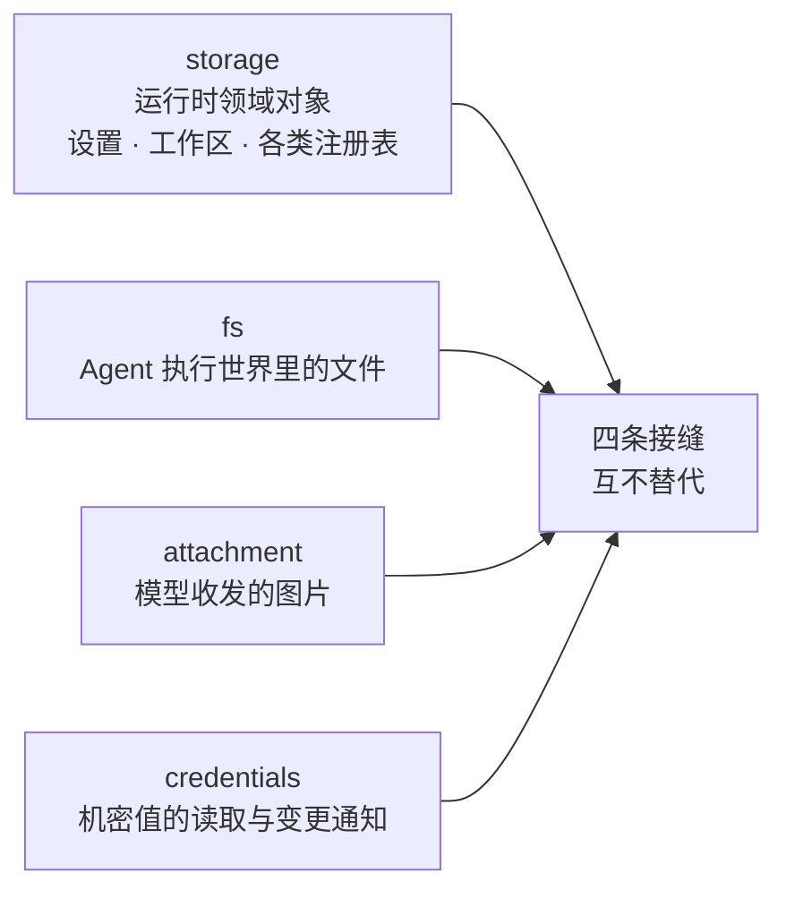
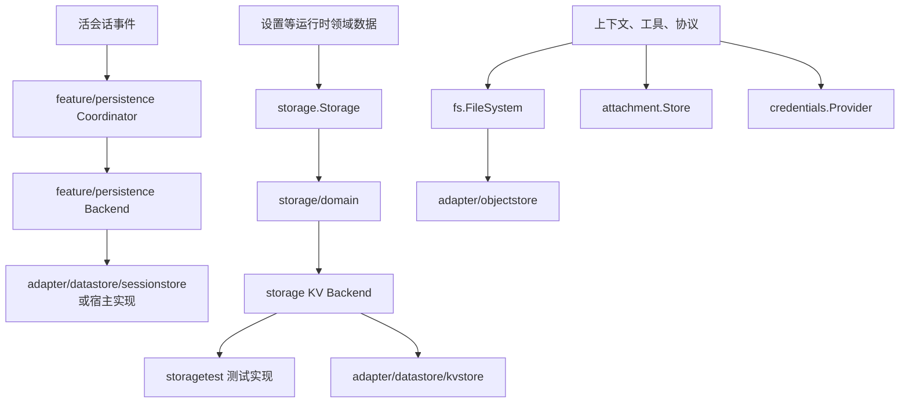
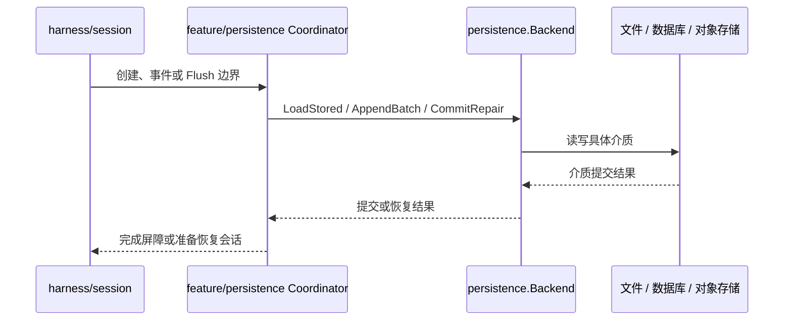
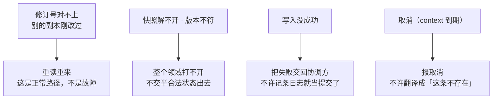

# 存储、文件与附件

本模块把运行时的耐久数据、执行环境文件、图片附件和凭据拆成独立接口，避免任何业务后端成为核心运行时的固定依赖。

## 定位

这里管的是**运行时要存的四类东西，以及它们各自的那道接缝**。四类分开是刻意的：



**底下可能都是同一套对象存储或同一个库，但接口不能合成一个。** 合并之后，一条「谁能读这张图」的规则就会被迫写成一条「谁能读这个键」的规则，而这两件事的访问控制、保留期和失效方式根本不一样。

运行时只声明「我要读出什么、写进什么」，挂哪种介质是宿主装配时的选择——这个服务跑的地方没有可用硬盘，所以四条接缝一条都不许退化成本机文件 I/O，界线由 `internal/devtools/oscheck` 把着。

## 架构：分层



`storage` 保存运行时领域对象；`fs` 表示 Agent 执行环境中的文件世界；`attachment` 保存模型输入输出中的图片；`credentials` 只提供机密值的读取和变化通知。这四类数据不能因为底层都可能使用对象存储或数据库而混为一个接口。

## 通用存储接口

`storage.Backend` 拥有一份介质和统一关闭入口；支持键值形态的实现另外提供 `KVFacet`。键值单元按名称、格式版本、表和可选全局槽声明，能读全量快照、也能单条读，写入可以附一个前置条件。

### 读穿介质，写带守卫

这一段是这个模块最容易被误读的地方，所以单独说明。

领域层**不在进程内存里保存权威状态**。每一次读都落到介质上，每一次改都带着一个修订号写回去：

```text
Get  ──> 直接问介质要这一条

Update ──> 读出这一条，连同它的修订号
            |
            v
          在内存里算出新值
            |
            v
          写回去，条件是「修订号还是我读到的那个」
            |
            +-- 条件成立 -> 提交，修订号 +1
            |
            +-- 条件不成立 -> 别的副本刚改过 -> 重读重来
```

为什么必须这样：这套代码继承自一个单进程桌面工具，那边开域时把整份数据读进内存、之后再不碰介质是成立的。而这个服务要**多副本部署**——一份进程内的权威状态会让 A 副本写的东西 B 副本看不见，而两个副本同时改一条记录会让先写的那次凭空消失。

写入的前置条件有三种：不带条件（直接覆盖）、「必须不存在」（用来抢一把新键）、「修订号必须是这个」（用来防丢更新）。

`storage/domain` 在这套词汇之上提供领域级 Facility：

- 按配置把不同领域路由到指定 Backend。
- 打开时解码并校验完整快照，避免半合法状态对外可见。
- 把**本副本**的写入串成唯一写链，所以一个副本不会自己和自己抢；重试只用来处理别的副本。
- 统一处理不存在、类型错误、格式版本不匹配、修订号过期和损坏介质等稳定错误。

**变更事件只反映本副本的写。** B 副本改了一条记录，A 副本上的订阅者一声不响。跨副本的变更通知要一套发布订阅，本轮明确不做——这是一条画出来的边界，不是遗漏。

`adapter/datastore/kvstore` 是生产后端之一。接口不要求宿主使用关系数据库；其他实现应通过 `storage/storagetest` 的契约测试。

本模块**不知道**下面是什么介质，也不该知道：schema、事务、连接池这些词一个都不出现在 `storage` 这棵树里，全在 [持久化抽象层](datastore.md) 底下，界线由 `internal/devtools/dbcheck` 把着。

## 会话持久化

`feature/persistence` 定义会话存档、`Store` / `Backend` 接口、恢复与修复原语、`WriteBehind` 队列和活会话 `Coordinator`。Coordinator 监听 `harness/session.Store` 的创建、事件、Flush 和释放边界，负责按会话串行、攒批、准备缓存和关闭排干。



- `Store` 创建会话头、追加连续事件、读取完整存档或指定 Seq 之后的尾部，并列出轻量快照。
- `Load` 校验格式和事件前缀，修复可安全识别的崩溃尾部；不可解释的已提交损坏会失败。
- `WriteBehind` 把调用方交入的连续批次串行写出，支持节流、Flush 屏障和关闭排空。
- `Coordinator` 管理活会话游标、按身份串行、准备池、退场和后端关闭顺序。
- 存档 revision 用于判断同一份物理日志在两次观察之间是否变化。
- 写入失败必须返回协调方，不能只记录日志后假装提交成功。

`feature/persistence.Backend` 与 `storage.Backend` 是两条不同接口，各有各的适配层：`adapter/datastore/kvstore` 填通用 KV 那条，`adapter/datastore/sessionstore` 填会话这条。填了一条不等于另一条也有了，宿主也可以自己实现 `feature/persistence.Backend` 或完整 `Store`。使用 Backend 时可以复用内置 Coordinator，但具体介质和顶层接线仍由宿主负责。

## 文件系统

`fs.FileSystem` 描述 Agent 所在执行世界的文件能力，路径统一使用斜杠分隔的世界绝对路径。它不等于 Go 服务进程的本地磁盘。

接口覆盖读取、写入、目录、状态和受策略约束的操作。`adapter/objectstore` 把目录与文件映射到对象存储键，适合 S3、MinIO 等后端。路径清理、根目录限制和策略校验在访问后端前完成，不能把模型输入直接拼成存储键。

仓库不提供“默认访问服务器本地磁盘”的生产实现。宿主需要明确选择执行环境和隔离策略。

## 图片附件

`attachment.Store` 保存图片原始字节和元数据，并按请求需要生成模型可用引用。

- 批量写入先验证所有成员，再开始提交，避免参数错误造成部分成功。
- 校验媒体类型、尺寸、数量和总字节数。
- 读取可以通过 Projector 生成特定模型或协议需要的表示。
- 图片不可用时返回稳定错误码，由协议层决定拒绝请求还是降级为文本诊断。

`adapter/imagestore` 是它建在 `fs.FileSystem` 上的实现：内容寻址，哈希既是名字也是唯一判据，同一张图存多少次都只占一份，读回时逐字节核对。细节见[附件与图片](attachment.md)。

附件引用可以进入会话事件，敏感原始数据的保留期限、访问控制和删除策略由 Store 背后那套介质及宿主决定。

## 凭据

`credentials.Provider` 按稳定标识读取凭据，`Notifier` 通知凭据变化。运行时只在真正调用外部服务时解析凭据：

- 凭据不进入工具 Schema、模型消息、会话事件或普通日志。
- Provider 的访问控制和租户隔离由宿主实现。
- 内存实现适合测试和单进程装配，不是持久密钥管理系统。

## 生命周期与并发

- Backend 必须满足接口定义的并发契约；同一领域实体在**同一个副本内**由 `storage/domain` 串行写入，跨副本靠修订号守卫。
- 会话后端的 revision 用于检测存档在读取后是否已变化；通用 KV 的丢更新由记录级修订号挡住。
- 持久化写入响应 `context.Context`，取消不能被转换成“记录不存在”。
- 注册和订阅返回撤销函数；关闭时先停止新写入，再刷出待提交数据，最后关闭 Backend。
- 对象存储和凭据 Provider 的连接生命周期由宿主拥有，运行时不擅自关闭共享客户端。

## 失败语义

四条接缝共用一条总规矩：**存不成就说存不成，不许自己降级**。



几条容易写错的：

- **半合法状态一次都不许露出去。** 领域打开时先解码并校验完整快照，宁可打不开。
- **附件批量写是先整批验、再逐个提交。** 参数错在第三张图上，不该留下前两张。
- **崩溃尾部只修能安全判断的那一段**，判断不了就失败；已提交的损坏不猜。
- **图片取不到时返回稳定错误码**，由协议层决定是拒绝请求还是降级成一句文本诊断——这个决定不在存储层做。
- **关闭有次序**：先停新写入，再刷出待提交的，最后关 Backend。反过来会丢掉队列里那一批。

## 能力边界

本模块不负责：

- 数据库建库、备份、迁移编排和跨区域复制。
- 替宿主决定租户键、保留期限、加密和访问控制。
- 提供分布式锁。跨副本的并发只靠记录级修订号，那是乐观的，不是互斥。
- 跨副本的变更通知。事件只反映本副本的写。
- 将文件路径自动映射到宿主机路径。
- 把凭据写入会话以便恢复。

## 对应的 DSH 能力

下表由 [`docs/packages.md`](../packages.md) 与 [能力覆盖表](../portmap/capability-coverage.tsv) 机器 join 得到：本篇覆盖的 Go 包，承接的是上游 DSH 的哪几条能力，以及各自还缺什么。落点列由源码里的 `// 源:` 注释反查，不是手写的。

| 上游能力 | DSH 包 | 裁决 | 落在哪个 Go 包 | 这里缺什么 |
|---|---|---|---|---|
| 非会话数据存储中心，具名后端注册表加数据形式设施 | `storage/storage` | 需要 | `storage` `storage/storagetest` | — |
| 存储中心领域数据形式，在后端上暴露可注入的storageDomain服务 | `storage/storage-domain` | 需要 | `storage/domain` | — |

## 相关源码

| 路径 | 内容 |
|---|---|
| `storage/backend.go`、`storage/storage.go` | 通用 Backend 契约与错误语义 |
| `storage/domain/` | 领域 Facility、串行提交和领域事件 |
| `storage/storagetest/` | Backend 一致性测试套件 |
| `adapter/datastore/kvstore/` | 把 KV Backend 接到持久化抽象层 |
| `adapter/datastore/sessionstore/` | 把会话 Backend 接到持久化抽象层 |
| `feature/persistence/` | 会话 Backend/Store、Coordinator、准备池、修复和写入协调 |
| `fs/` | 执行世界文件接口、路径与策略 |
| `adapter/objectstore/` | 对象存储文件实现 |
| `attachment/` | 图片准入、保存和请求表示 |
| `adapter/imagestore/` | 建在文件系统接缝上的内容寻址图片实现 |
| `credentials/` | 凭据 Provider、记录和变化通知 |

## 深入阅读

[持久化抽象层](datastore.md) · [文件系统](filesystem.md) · [附件与图片](attachment.md) · [凭据](credentials.md) · [大结果外置](spill.md)
