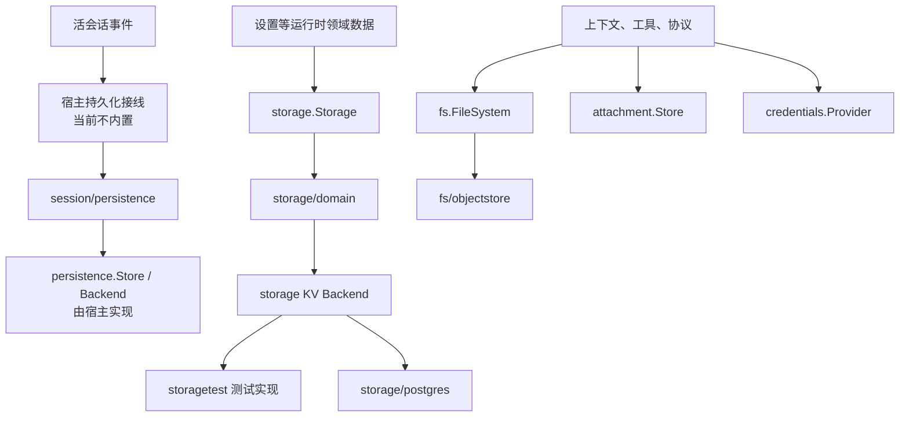
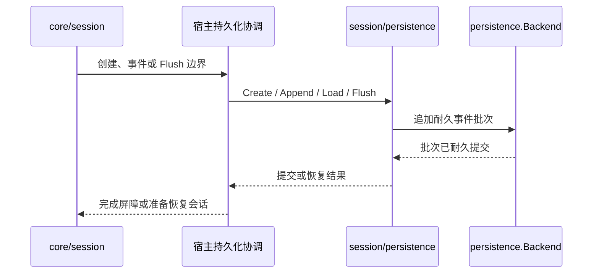

# 存储、文件与附件

本模块把运行时的耐久数据、执行环境文件、图片附件和凭据拆成独立接口，避免任何业务后端成为核心运行时的固定依赖。

## 分层

`storage` 保存运行时领域对象；`fs` 表示 Agent 执行环境中的文件世界；`attachment` 保存模型输入输出中的图片；`credentials` 只提供机密值的读取和变化通知。这四类数据不能因为底层都可能使用对象存储或数据库而混为一个接口。

## 通用存储接口

`storage.Backend` 拥有一份介质和统一关闭入口；支持键值形态的实现另外提供 `KVFacet`。键值单元按名称、格式版本、表和可选全局槽声明，支持完整快照读取以及单条记录和全局值的原子耐久写入。

`storage.Registry` 管理具名 Backend，`storage/domain` 在其上提供领域级 Facility：

- 按配置把不同领域路由到指定 Backend。
- 打开时解码并校验完整快照，避免半合法状态对外可见。
- 把同一领域的写入串成唯一写链。
- 严格按“介质提交、更新内存、发布事件”的顺序完成一次变更。
- 统一处理不存在、类型错误、格式版本不匹配和损坏介质等稳定错误。

`storage/postgres` 是生产后端之一，负责 schema、事务和 revision 比较。接口不要求宿主使用 PostgreSQL；其他实现应通过 `storage/storagetest` 的契约测试。

## 会话持久化

`session/persistence` 定义会话存档、`Store` / `Backend` 接口、恢复与修复原语，以及独立的 `WriteBehind` 队列。它不包含监听活 Session 并自动落盘的完整协调器；宿主必须把 `core/session` 的创建、事件、Flush 和释放边界接到具体 `Store`。

- `Store` 创建会话头、追加连续事件、读取完整存档或指定 Seq 之后的尾部，并列出轻量快照。
- `Load` 校验格式和事件前缀，修复可安全识别的崩溃尾部；不可解释的已提交损坏会失败。
- `WriteBehind` 把调用方交入的连续批次串行写出，支持节流、Flush 屏障和关闭排空。
- 存档 revision 用于判断同一份物理日志在两次观察之间是否变化。
- 写入失败必须返回协调方，不能只记录日志后假装提交成功。

`session/persistence.Backend` 与 `storage.Backend` 是两条不同接口。当前 `storage/postgres` 实现的是通用 KV Backend，不会自动成为会话持久化后端；宿主需要提供 `session/persistence.Backend` 或直接实现其 `Store`，还要提供活会话协调接线。

## 文件系统

`fs.FileSystem` 描述 Agent 所在执行世界的文件能力，路径统一使用斜杠分隔的世界绝对路径。它不等于 Go 服务进程的本地磁盘。

接口覆盖读取、写入、目录、状态和受策略约束的操作。`fs/objectstore` 把目录与文件映射到对象存储键，适合 S3、MinIO 等后端。路径清理、根目录限制和策略校验在访问后端前完成，不能把模型输入直接拼成存储键。

仓库不提供“默认访问服务器本地磁盘”的生产实现。宿主需要明确选择执行环境和隔离策略。

## 图片附件

`attachment.Store` 保存图片原始字节和元数据，并按请求需要生成模型可用引用。

- 批量写入先验证所有成员，再开始提交，避免参数错误造成部分成功。
- 校验媒体类型、尺寸、数量和总字节数。
- 读取可以通过 Projector 生成特定模型或协议需要的表示。
- 图片不可用时返回稳定错误码，由协议层决定拒绝请求还是降级为文本诊断。

附件引用可以进入会话事件，敏感原始数据的保留期限、访问控制和删除策略由 Store 实现及宿主决定。

## 凭据

`credentials.Provider` 按稳定标识读取凭据，`Notifier` 通知凭据变化。运行时只在真正调用外部服务时解析凭据：

- 凭据不进入工具 Schema、模型消息、会话事件或普通日志。
- Provider 的访问控制和租户隔离由宿主实现。
- 内存实现适合测试和单进程装配，不是持久密钥管理系统。

## 并发与生命周期

- Backend 必须满足接口定义的并发契约；同一领域实体由 `storage/domain` 串行写入。
- 会话后端的 revision 用于检测存档在读取后是否已变化；通用 KV 写入顺序由领域写链保证。
- 持久化写入响应 `context.Context`，取消不能被转换成“记录不存在”。
- 注册和订阅返回撤销函数；关闭时先停止新写入，再刷出待提交数据，最后关闭 Backend。
- 对象存储和凭据 Provider 的连接生命周期由宿主拥有，运行时不擅自关闭共享客户端。

## 能力边界

本模块不负责：

- 数据库建库、备份、迁移编排和跨区域复制。
- 替宿主决定租户键、保留期限、加密和访问控制。
- 提供分布式锁或把单进程 Registry 变成集群协调器。
- 将文件路径自动映射到宿主机路径。
- 把凭据写入会话以便恢复。

## 相关源码

| 路径 | 内容 |
|---|---|
| `storage/backend.go`、`storage/storage.go` | 通用 Backend 契约与错误语义 |
| `storage/domain/` | 领域 Facility、串行提交和领域事件 |
| `storage/postgres/` | PostgreSQL 实现与 schema |
| `storage/storagetest/` | Backend 一致性测试套件 |
| `session/persistence/` | 会话事件、检查点和写入协调 |
| `fs/` | 执行世界文件接口、路径与策略 |
| `fs/objectstore/` | 对象存储文件实现 |
| `attachment/` | 图片准入、保存和请求表示 |
| `credentials/` | 凭据 Provider、记录和变化通知 |
