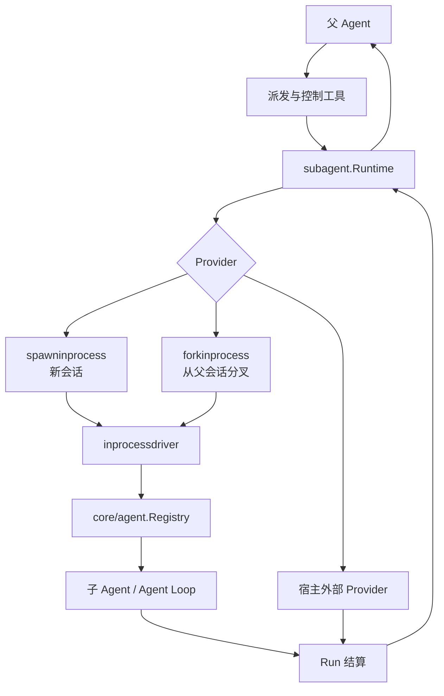
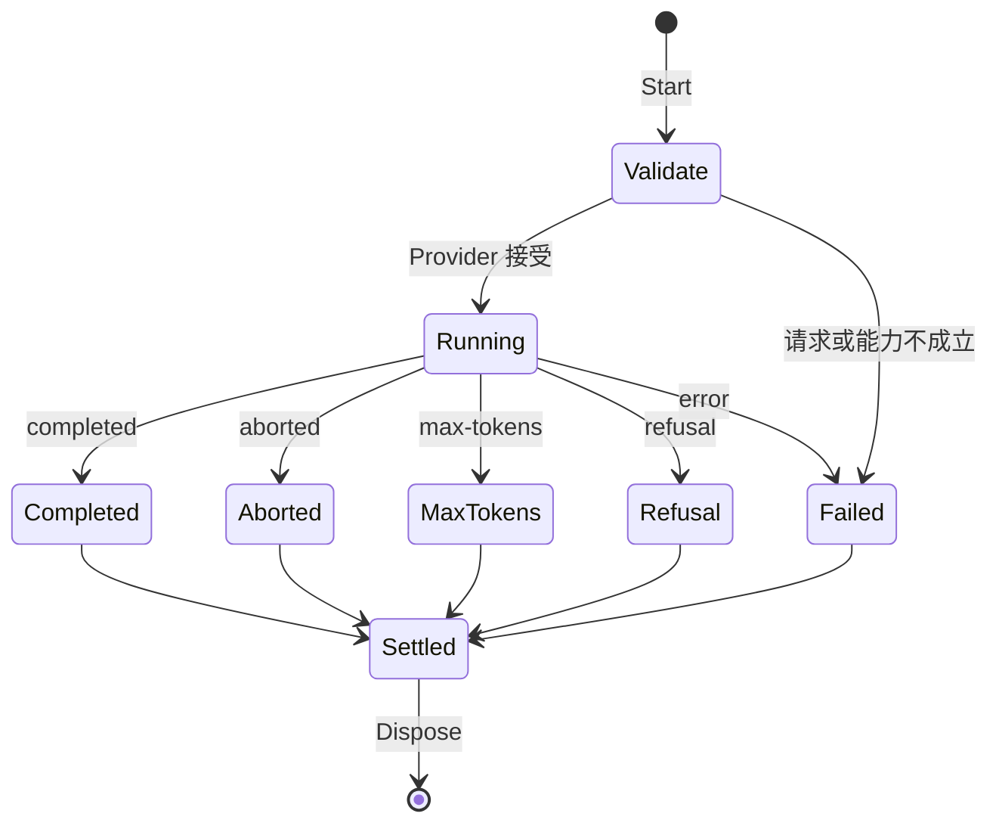

# 多 Agent

本模块管理父 Agent 如何创建、派发、观察、控制和回收子 Agent，并把本地执行与外部执行统一成同一套 `Provider` / `Run` 契约。

## 定位

`subagent/subagent` 是协调层，不实现新的 Agent Loop。进程内子 Agent 仍由 `core/agent` 和 `core/agentloop` 驱动；本模块负责选择 Provider、检查能力、建立父子关系并结算一次运行。

## 架构

## 核心对象

| 对象 | 职责 |
|---|---|
| `Runtime` | Provider 注册、能力检查、运行派发、生命周期观察和子树查询 |
| `Provider` | 把规范化请求变成一个可等待、可取消、可释放的 `Run` |
| `Run` | 暴露本次运行的身份、可选本地 Agent、结果等待和释放 |
| `Descriptor` | 持久记录父子身份、模式、Provider、来源和展示信息 |
| `Continuation` | 管理可继续子 Agent 的创建、激活、停止和排空 |

Provider 必须声明是否支持分叉、继续运行、结构化输出和其他可选能力。Runtime 在调用 Provider 前按固定顺序验证，避免请求进入实现后才发现不支持。

## 创建模式

### Spawn

`spawninprocess` 创建全新会话，父会话只提供任务、工作目录、预设和模型等显式参数。子 Agent 不自动继承父会话聊天记录。

### Fork

`forkinprocess` 从父会话的事件日志创建分叉，再在分叉上启动子 Agent。分叉保留创建点之前的耐久上下文，但后续事件与父会话彼此独立。

### 外部 Provider

公共接口允许宿主接入进程外运行。仓库只提供进程外运行的校验、结算和诊断辅助，不提供任意 Shell、子进程启动器或远程执行平台。

## 一次运行的生命周期

停止原因严格使用 `completed`、`aborted`、`error`、`max-tokens` 和 `refusal`。启动和结束 Observer 成对发送。结果与释放错误都会进入最终结算；取消调用方的等待不会跳过子运行释放。Provider 返回的诊断文本有长度上限，不能把无界外部日志带回父会话。

## 可继续子 Agent

一次性运行在结算后销毁；可继续运行保留子 Agent 和会话，允许后续追加工作。Continuation 管理器负责：

- 创建并记录可继续子 Agent。
- 为新一轮工作建立 activation epoch。
- 在父 Agent 或协议连接关闭时先排空活动，再释放子树。
- 恢复时从事件记录和当前状态检查点重建身份与运行时间。

活 Agent 注册表只代表当前进程；冷会话查询会从持久化事件重新整理父子身份。列表优先使用同一会话的活记录，并对损坏或暂不可读的冷记录给出诊断状态。

## 面向模型的工具

| 包 | 能力 |
|---|---|
| `subagent/subagenttool` | 创建或继续子 Agent，并按配置选择同步等待或后台运行 |
| `subagent/controltool` | 列出子树、发送消息、取消或控制已有子 Agent |
| `subagent/reporttool` | 子 Agent 向父 Agent提交结构化阶段报告 |

工具只暴露当前调用者拥有或可见的子 Agent。运行 ID、会话 ID 和父子归属不能由模型任意伪造跨越作用域。

## 并发与资源管理

- Runtime、Provider 表和生命周期监听器支持并发访问。
- 同一个继续运行实例的激活和结算按 epoch 配对，旧结算不能覆盖新一轮状态。
- 子 Agent 生命周期挂在父作用域；父作用域释放会停止并回收其子树。
- 用户回调在内部锁外执行，避免回调反查 Runtime 时死锁。
- 进程内 Driver 等待 Agent 真正空闲后结算，不把“已请求取消”当成“已停止”。

## 能力边界

本模块不负责：

- 实现模型循环、工具运行时或会话持久化后端。
- 保证外部 Provider 的隔离、安全或资源配额。
- 自动把父 Agent 的全部权限授予子 Agent。
- 在仓库内启动任意命令、终端或子进程。
- 把活 Agent Registry 当作跨进程分布式注册中心。

## 相关源码

| 路径 | 内容 |
|---|---|
| `subagent/subagent/` | Runtime、Provider/Run 契约、父子描述、查询和续行 |
| `subagent/inprocessdriver/` | 进程内 Agent 创建、等待、结构化结果和释放 |
| `subagent/spawninprocess/` | 新会话 Provider |
| `subagent/forkinprocess/` | 会话分叉 Provider |
| `subagent/subagenttool/` | 派发工具 |
| `subagent/controltool/` | 列表与控制工具 |
| `subagent/reporttool/` | 子 Agent 报告工具 |

## 深入阅读

[Ralph 工作流](ralph.md) · [后台作业](jobs.md) · [SDK 协议与服务端](sdk.md)
