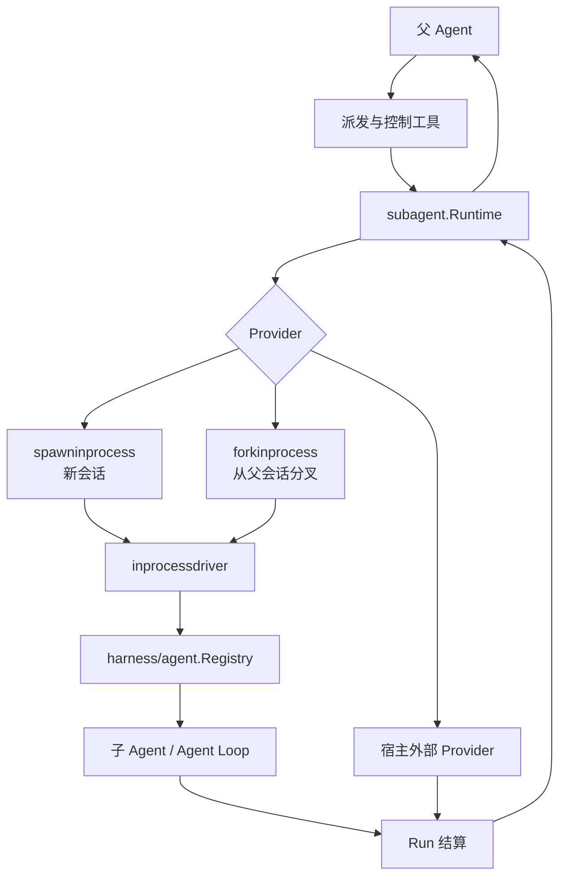
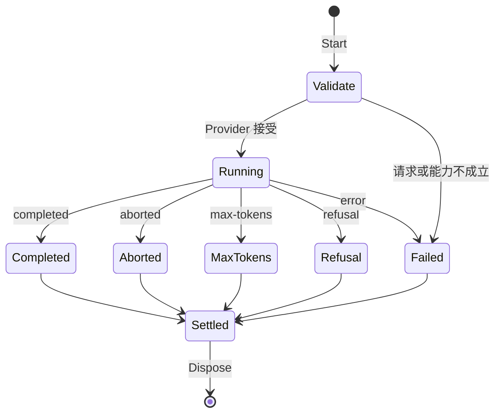
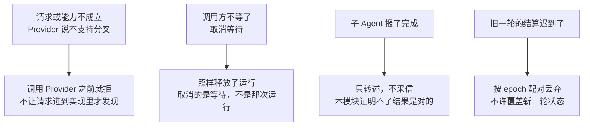

# 多 Agent

本模块管理父 Agent 如何创建、派发、观察、控制和回收子 Agent，并把本地执行与外部执行统一成同一套 `Provider` / `Run` 契约。

## 定位

`feature/subagent` 是协调层，不实现新的 Agent Loop。进程内子 Agent 仍由 `harness/agent` 和 `harness/agentloop` 驱动；本模块负责选择 Provider、检查能力、建立父子关系并结算一次运行。

## 架构

## 核心对象

| 对象 | 职责 |
|---|---|
| `Runtime` | Provider 注册、能力检查、运行派发、生命周期观察和子树查询 |
| `Provider` | 把规范化请求变成一个可等待、可取消、可释放的 `Run` |
| `Run` | 暴露本次运行的身份、可选本地 Agent、结果等待和释放 |
| `Descriptor` | 持久记录父子身份、模式、Provider、来源和展示信息 |
| `Continuation` | 管理可继续子 Agent 的创建、激活、停止和排空 |

Provider 必须声明是否支持分叉、继续运行、结构化输出和其他可选能力。Runtime 在调用 Provider 前按固定顺序验证，避免请求进入实现后才发现不支持。

## 创建模式

### Spawn

`spawninprocess` 创建全新会话，父会话只提供任务、工作目录、预设和模型等显式参数。子 Agent 不自动继承父会话聊天记录。

### Fork

`forkinprocess` 从父会话的事件日志创建分叉，再在分叉上启动子 Agent。分叉保留创建点之前的耐久上下文，但后续事件与父会话彼此独立。

### 外部 Provider

公共接口允许宿主接入进程外运行。仓库只提供进程外运行的校验、结算和诊断辅助，不提供任意 Shell、子进程启动器或远程执行平台。

## 一次运行的生命周期

停止原因严格使用 `completed`、`aborted`、`error`、`max-tokens` 和 `refusal`。启动和结束 Observer 成对发送。结果与释放错误都会进入最终结算；取消调用方的等待不会跳过子运行释放。Provider 返回的诊断文本有长度上限，不能把无界外部日志带回父会话。

## 可继续子 Agent

一次性运行在结算后销毁；可继续运行保留子 Agent 和会话，允许后续追加工作。Continuation 管理器负责：

- 创建并记录可继续子 Agent。
- 为新一轮工作建立 activation epoch。
- 在父 Agent 或协议连接关闭时先排空活动，再释放子树。
- 恢复时从事件记录和当前状态检查点重建身份与运行时间。

活 Agent 注册表只代表当前进程；冷会话查询会从持久化事件重新整理父子身份。列表优先使用同一会话的活记录，并对损坏或暂不可读的冷记录给出诊断状态。

## 面向模型的工具

| 包 | 能力 |
|---|---|
| `feature/subagent/subagenttool` | 创建或继续子 Agent，并按配置选择同步等待或后台运行 |
| `feature/subagent/controltool` | 列出子树、发送消息、取消或控制已有子 Agent |
| `feature/subagent/reporttool` | 子 Agent 向父 Agent提交结构化阶段报告 |

工具只暴露当前调用者拥有或可见的子 Agent。运行 ID、会话 ID 和父子归属不能由模型任意伪造跨越作用域。

## 生命周期与并发

- Runtime、Provider 表和生命周期监听器支持并发访问。
- 同一个继续运行实例的激活和结算按 epoch 配对，旧结算不能覆盖新一轮状态。
- 子 Agent 生命周期挂在父作用域；父作用域释放会停止并回收其子树。
- 用户回调在内部锁外执行，避免回调反查 Runtime 时死锁。
- 进程内 Driver 等待 Agent 真正空闲后结算，不把“已请求取消”当成“已停止”。

## 失败语义

一次子 Agent 运行横跨两个进程边界（父子、可能还有进程内外），所以总规矩是**每一次派发都必须有结算**：

其余几条：

- **停止原因只有五个**：`completed`、`aborted`、`error`、`max-tokens`、`refusal`。启动和结束 Observer 成对发送，一次派发不会只留下半条记录。
- **结果和释放错误都进最终结算**，不是「跑完了就算成功、释放失败记条日志」。
- **诊断文本有长度上限**。外部 Provider 的日志可以是无界的，把它整段捎回父会话等于让一个失败的子任务撑爆父会话的上下文。
- **「已请求取消」不等于「已停止」**。进程内 Driver 等 Agent 真正空闲才结算。
- **冷记录读不出来时给诊断状态，不让整个列表失败**。活记录优先，坏掉的那条标出来。

## 能力边界

本模块不负责：

- 实现模型循环、工具运行时或会话持久化后端。
- 保证外部 Provider 的隔离、安全或资源配额。
- 自动把父 Agent 的全部权限授予子 Agent。
- 在仓库内启动任意命令、终端或子进程。
- 把活 Agent Registry 当作跨进程分布式注册中心。

## 对应的 DSH 能力

下表由 [`docs/packages.md`](../packages.md) 与 [能力覆盖表](../portmap/capability-coverage.tsv) 机器 join 得到：本篇覆盖的 Go 包，承接的是上游 DSH 的哪几条能力，以及各自还缺什么。落点列由源码里的 `// 源:` 注释反查，不是手写的。

| 上游能力 | DSH 包 | 裁决 | 落在哪个 Go 包 | 这里缺什么 |
|---|---|---|---|---|
| 提供子agent运行的接缝抽象，管理provider注册、启动、持久化子agent描述符及可继续子级编排 | `subagent/subagent` | 需要 | `feature/subagent` `feature/subagent/internal/childseed` | — |
| 在当前进程创建子agent，以父agent已完成的对话轮次作为初始内容 | `subagent/subagent-fork-in-process` | 需要 | `feature/subagent/forkinprocess` | — |
| 两个进程内provider共用的运行驱动器，处理深度、创建、定制、结果读取、取消和dispose | `subagent/subagent-in-process-driver` | 需要 | `feature/subagent/inprocessdriver` | — |
| 在当前进程创建全新子agent，有自己的会话但以空对话开始运行 | `subagent/subagent-spawn-in-process` | 需要 | `feature/subagent/spawninprocess` | — |
| 基于已配置provider的面向模型委派工具，前台或后台执行subagent任务 | `subagent/tool-subagent` | 需要 | `feature/subagent/subagenttool` | 缺一角：子 agent 的模型选择授权表。descriptor.go 的 AgentProvider／AgentModel 是装配期定死的，模型自己挑不了，也没有「许挑哪几条路由」的授权表。补的入口：工具 schema 加 provider／model／reasoning_effort，授权表以 subagent/model-selection-policy 事件进日志（只进日志不进模型历史），配一个投影单元读回来 |
| 全局具名send_message、interrupt_agent与list_agents工具，控制可继续subagent的生命周期 | `subagent/tool-subagent-control` | 需要 | `feature/subagent/controltool` | — |
| 可选的子级作用域report工具，为可继续进程内子级提供向父agent的返回通道 | `subagent/tool-subagent-report` | 需要 | `feature/subagent/reporttool` | — |
| 子 agent 提供方的契约夹具 | （无上游出处） | 本仓库自有 | `feature/subagent/internal/providertest` | 只有 subagent 子树用，收进 internal |

## 相关源码

| 路径 | 内容 |
|---|---|
| `feature/subagent/` | Runtime、Provider/Run 契约、父子描述、查询和续行 |
| `feature/subagent/inprocessdriver/` | 进程内 Agent 创建、等待、结构化结果和释放 |
| `feature/subagent/spawninprocess/` | 新会话 Provider |
| `feature/subagent/forkinprocess/` | 会话分叉 Provider |
| `feature/subagent/subagenttool/` | 派发工具 |
| `feature/subagent/controltool/` | 列表与控制工具 |
| `feature/subagent/reporttool/` | 子 Agent 报告工具 |
| `feature/subagent/internal/childseed/` | 派发策略怎么落到孩子那条日志上，续行激活和进程内驱动共用 |
| `feature/subagent/internal/providertest/` | Provider 契约夹具，只给本子树的测试用 |

## 深入阅读

[工作流与 Ralph](ralph.md) · [后台作业](jobs.md) · [SDK 协议与服务端](sdk.md)
