# 多 Agent

对应包：`feature/subagent`、`feature/subagent/spawninprocess`、`feature/subagent/forkinprocess`、`feature/subagent/inprocessdriver`、`feature/subagent/subagenttool`、`feature/subagent/controltool`、`feature/subagent/reporttool`、`feature/agentteam`、`feature/agentteam/agentteamtool`

## 定位

一个 agent 接了件大活：读二十个文件、试三次搜索、跑两遍构建。这些中间过程一句不落全留在它自己的对话里。

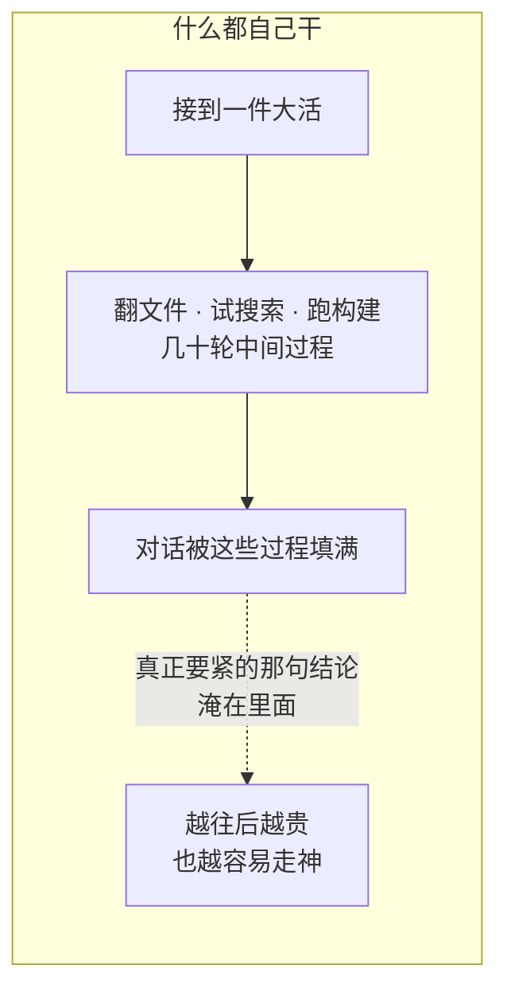
```mermaid
flowchart LR
    subgraph BAD["什么都自己干"]
        A1["接到一件大活"] --> A2["翻文件 · 试搜索 · 跑构建<br/>几十轮中间过程"]
        A2 --> A3["对话被这些过程填满"]
        A3 -.->|"真正要紧的那句结论<br/>淹在里面"| A4["越往后越贵<br/>也越容易走神"]
    end
```

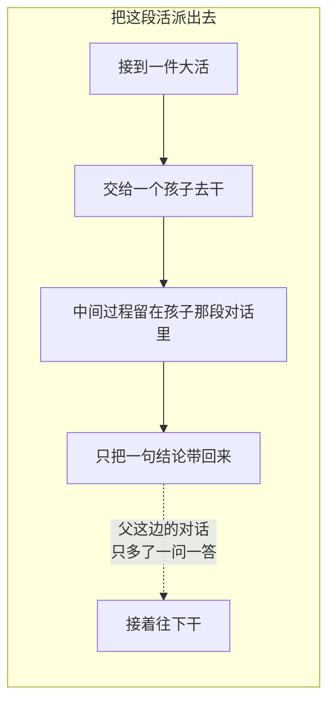
```mermaid
flowchart LR
    subgraph GOOD["把这段活派出去"]
        B1["接到一件大活"] --> B2["交给一个孩子去干"]
        B2 --> B3["中间过程留在孩子那段对话里"]
        B3 --> B4["只把一句结论带回来"]
        B4 -.->|"父这边的对话<br/>只多了一问一答"| B5["接着往下干"]
    end
```

所以这一族包回答的是同一个问题：**怎么把一段活交给另一个 agent，还能看得住它、停得掉它、收得回它。**

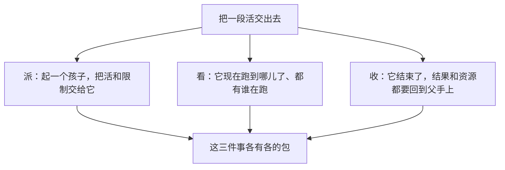
```mermaid
flowchart TD
    Q["把一段活交出去"] --> Q1["派：起一个孩子，把活和限制交给它"]
    Q --> Q2["看：它现在跑到哪儿了、都有谁在跑"]
    Q --> Q3["收：它结束了，结果和资源都要回到父手上"]
    Q1 --> R["这三件事各有各的包"]
    Q2 --> R
    Q3 --> R
```

它**不是**第二套模型循环。孩子和父跑的是同一套东西：

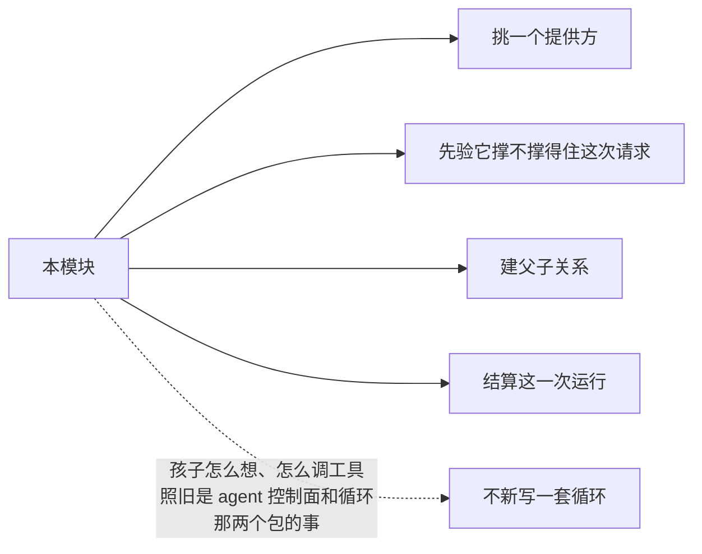
```mermaid
flowchart LR
    S["本模块"] --> S1["挑一个提供方"]
    S --> S2["先验它撑不撑得住这次请求"]
    S --> S3["建父子关系"]
    S --> S4["结算这一次运行"]
    S -.->|"孩子怎么想、怎么调工具<br/>照旧是 agent 控制面和循环那两个包的事"| S5["不新写一套循环"]
```

---

## 架构

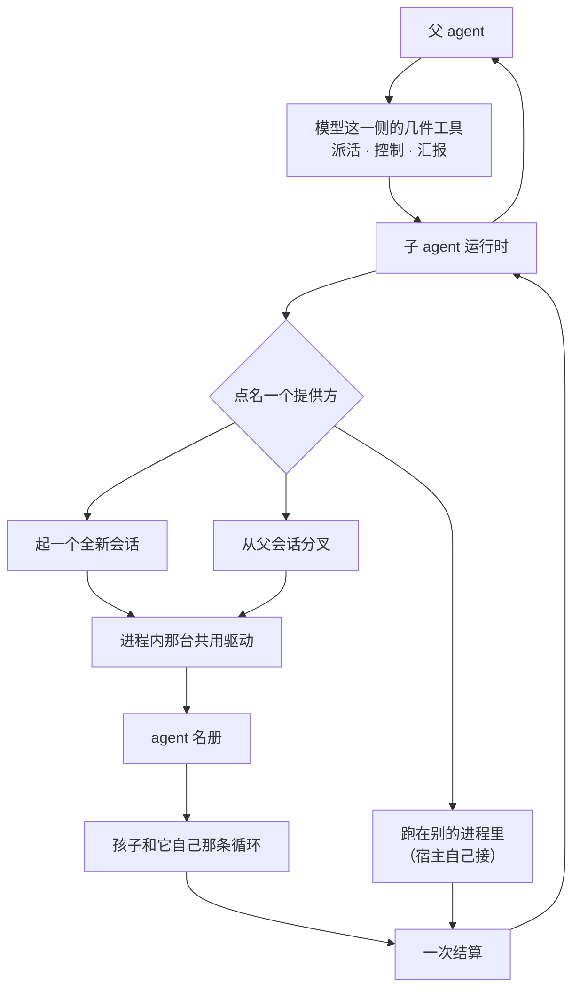
```mermaid
flowchart TB
    P["父 agent"] --> T["模型这一侧的几件工具<br/>派活 · 控制 · 汇报"]
    T --> RT["子 agent 运行时"]
    RT --> PV{"点名一个提供方"}
    PV --> SP["起一个全新会话"]
    PV --> FK["从父会话分叉"]
    PV --> EX["跑在别的进程里<br/>（宿主自己接）"]
    SP --> DR["进程内那台共用驱动"]
    FK --> DR
    DR --> REG["agent 名册"]
    REG --> C["孩子和它自己那条循环"]
    C --> ST["一次结算"]
    EX --> ST
    ST --> RT
    RT --> P
```

### 提供方是按名字并存的，不是只能有一个

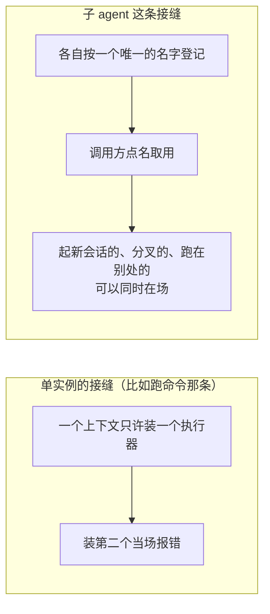
```mermaid
flowchart LR
    subgraph ONE["单实例的接缝（比如跑命令那条）"]
        O1["一个上下文只许装一个执行器"] --> O2["装第二个当场报错"]
    end
    subgraph MANY["子 agent 这条接缝"]
        M1["各自按一个唯一的名字登记"] --> M2["调用方点名取用"]
        M2 --> M3["起新会话的、分叉的、跑在别处的<br/>可以同时在场"]
    end
```

### 两种形态，从头到尾是两条路

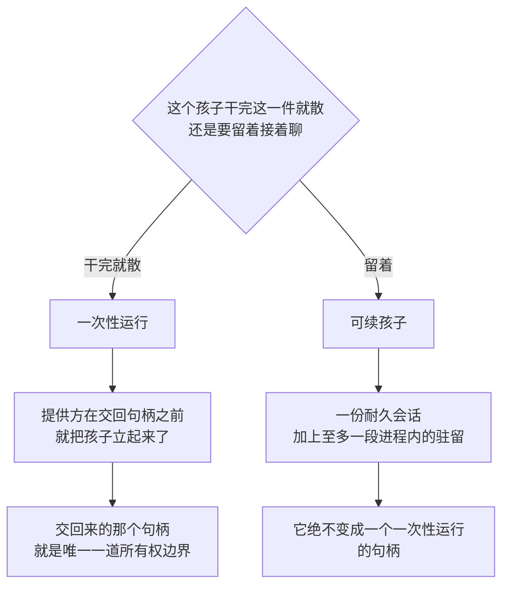
```mermaid
flowchart TD
    K{"这个孩子干完这一件就散<br/>还是要留着接着聊"}
    K -->|"干完就散"| ONCE["一次性运行"]
    K -->|"留着"| CONT["可续孩子"]
    ONCE --> ONCE1["提供方在交回句柄之前<br/>就把孩子立起来了"]
    ONCE1 --> ONCE2["交回来的那个句柄<br/>就是唯一一道所有权边界"]
    CONT --> CONT1["一份耐久会话<br/>加上至多一段进程内的驻留"]
    CONT1 --> CONT2["它绝不变成一个一次性运行的句柄"]
```

可续孩子那条路上，管理它的那一侧直接攥着孩子的 agent 句柄，每一轮活都从孩子自己的收件箱排队进去。提供方只贡献「这个孩子该怎么被造出来」那份输入，看不到句柄、看不到回合、也不参与拆解。

### 各包分工

| 包 | 它管的 | 它明确不管的 |
|---|---|---|
| `feature/subagent` | 提供方登记、能力校验、派发、父子关系、结算、只读列举、可续编排 | 谁去跑、怎么跑 |
| `feature/subagent/inprocessdriver` | 进程内那条「建孩子 → 投提示词 → 等静止 → 读结果 → 处置」 | 它自己不是提供方 |
| `feature/subagent/spawninprocess` | 起一个全新会话的那份差别 | 上面那条路 |
| `feature/subagent/forkinprocess` | 从父会话分叉的那份差别 | 上面那条路 |
| `feature/subagent/subagenttool` | 模型这一侧的派活工具 | 孩子本身 |
| `feature/subagent/controltool` | 列举、投递、打断这三件全局命名的工具 | 创建孩子 |
| `feature/subagent/reporttool` | 只装进孩子那个作用域的一条返回通道 | 投递本身 |
| `feature/agentteam` | 花名册、共享任务板、队友之间的收件箱 | 队友的寿命 |

---

## 三种起法

### 起一个全新会话

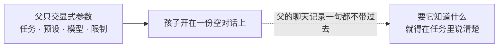
```mermaid
flowchart LR
    A["父只交显式参数<br/>任务 · 预设 · 模型 · 限制"] --> B["孩子开在一份空对话上"]
    B -.->|"父的聊天记录一句都不带过去"| C["要它知道什么<br/>就得在任务里说清楚"]
```

### 从父会话分叉

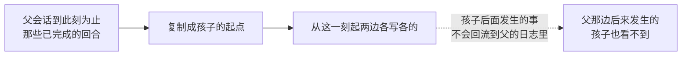
```mermaid
flowchart LR
    A["父会话到此刻为止<br/>那些已完成的回合"] --> B["复制成孩子的起点"]
    B --> C["从这一刻起两边各写各的"]
    C -.->|"孩子后面发生的事<br/>不会回流到父的日志里"| D["父那边后来发生的<br/>孩子也看不到"]
```

### 跑在别的进程里

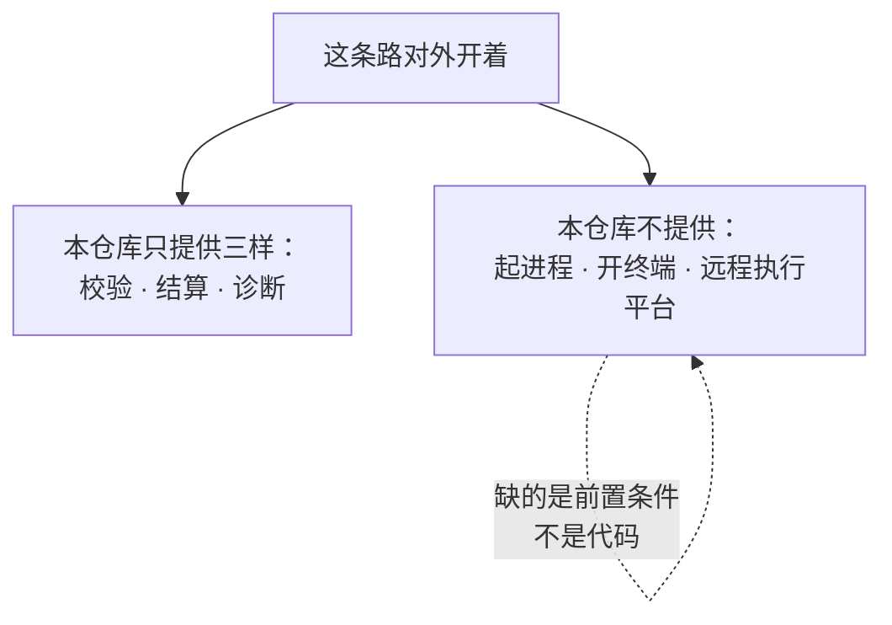
```mermaid
flowchart TD
    A["这条路对外开着"] --> B["本仓库只提供三样：<br/>校验 · 结算 · 诊断"]
    A --> C["本仓库不提供：<br/>起进程 · 开终端 · 远程执行平台"]
    C -.->|"缺的是前置条件<br/>不是代码"| C
```

### 措辞要跟着提供方改

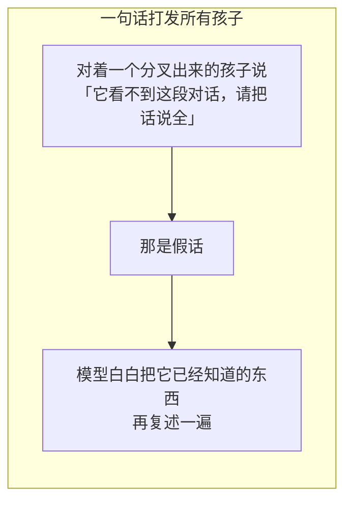
```mermaid
flowchart LR
    subgraph BAD["一句话打发所有孩子"]
        X1["对着一个分叉出来的孩子说<br/>「它看不到这段对话，请把话说全」"] --> X2["那是假话"]
        X2 --> X3["模型白白把它已经知道的东西<br/>再复述一遍"]
    end
```

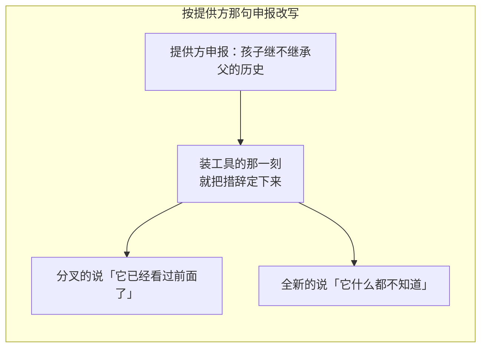
```mermaid
flowchart LR
    subgraph GOOD["按提供方那句申报改写"]
        Y1["提供方申报：孩子继不继承父的历史"] --> Y2["装工具的那一刻<br/>就把措辞定下来"]
        Y2 --> Y3["分叉的说「它已经看过前面了」"]
        Y2 --> Y4["全新的说「它什么都不知道」"]
    end
```

---

## 先验能力，再进提供方

每一个提供方要明说自己撑不撑得住分叉、能不能续着跑、给不给结构化输出、认不认工具过滤和人设。

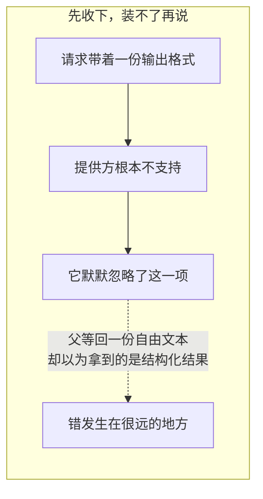
```mermaid
flowchart LR
    subgraph BAD["先收下，装不了再说"]
        A1["请求带着一份输出格式"] --> A2["提供方根本不支持"]
        A2 --> A3["它默默忽略了这一项"]
        A3 -.->|"父等回一份自由文本<br/>却以为拿到的是结构化结果"| A4["错发生在很远的地方"]
    end
```

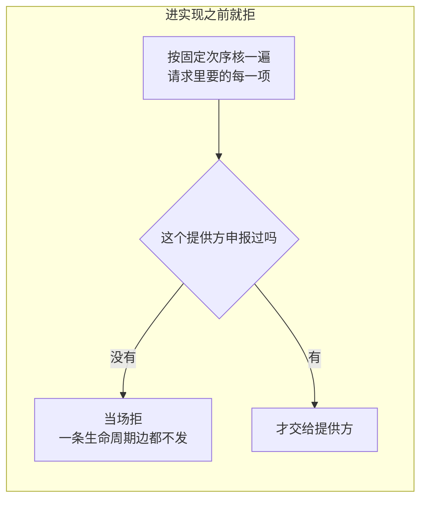
```mermaid
flowchart LR
    subgraph GOOD["进实现之前就拒"]
        B1["按固定次序核一遍<br/>请求里要的每一项"] --> B2{"这个提供方申报过吗"}
        B2 -->|"没有"| B3["当场拒<br/>一条生命周期边都不发"]
        B2 -->|"有"| B4["才交给提供方"]
    end
```

跨进程那条路上的申报是**一样都没有**：

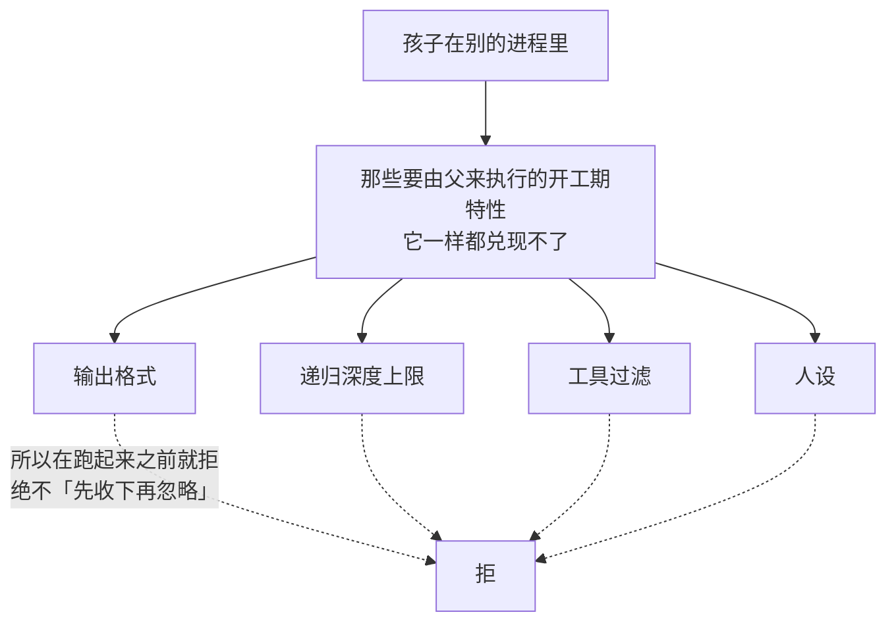
```mermaid
flowchart TD
    A["孩子在别的进程里"] --> B["那些要由父来执行的开工期特性<br/>它一样都兑现不了"]
    B --> B1["输出格式"]
    B --> B2["递归深度上限"]
    B --> B3["工具过滤"]
    B --> B4["人设"]
    B1 -.->|"所以在跑起来之前就拒<br/>绝不「先收下再忽略」"| C["拒"]
    B2 -.-> C
    B3 -.-> C
    B4 -.-> C
```

---

## 递归预算：孩子还能不能再派孩子

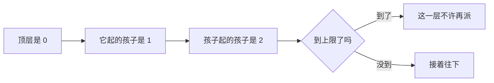
```mermaid
flowchart LR
    A["顶层是 0"] --> B["它起的孩子是 1"]
    B --> C["孩子起的孩子是 2"]
    C --> D{"到上限了吗"}
    D -->|"到了"| E["这一层不许再派"]
    D -->|"没到"| F["接着往下"]
```

这个数字写在孩子的会话头上，只有一处写得进去。

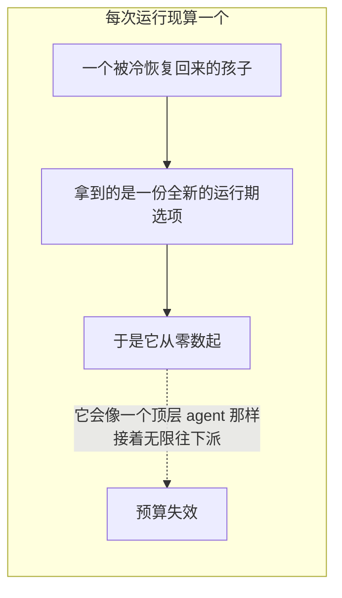
```mermaid
flowchart LR
    subgraph BAD["每次运行现算一个"]
        A1["一个被冷恢复回来的孩子"] --> A2["拿到的是一份全新的运行期选项"]
        A2 --> A3["于是它从零数起"]
        A3 -.->|"它会像一个顶层 agent 那样<br/>接着无限往下派"| A4["预算失效"]
    end
```

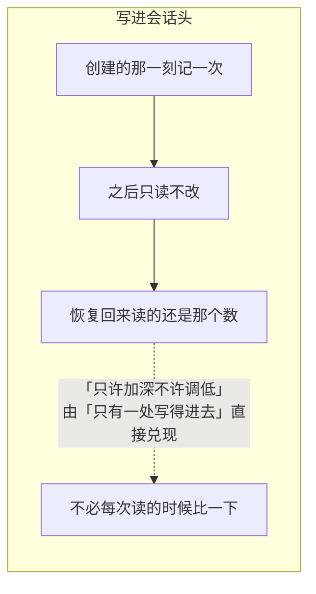
```mermaid
flowchart LR
    subgraph GOOD["写进会话头"]
        B1["创建的那一刻记一次"] --> B2["之后只读不改"]
        B2 --> B3["恢复回来读的还是那个数"]
        B3 -.->|"「只许加深不许调低」<br/>由「只有一处写得进去」直接兑现"| B4["不必每次读的时候比一下"]
    end
```

---

## 一次性运行的一生

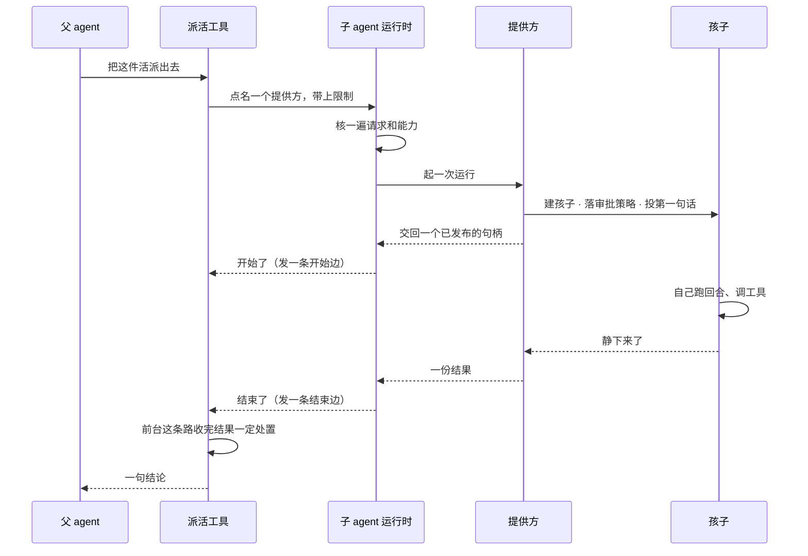
```mermaid
sequenceDiagram
    participant P as 父 agent
    participant T as 派活工具
    participant R as 子 agent 运行时
    participant V as 提供方
    participant C as 孩子

    P->>T: 把这件活派出去
    T->>R: 点名一个提供方，带上限制
    R->>R: 核一遍请求和能力
    R->>V: 起一次运行
    V->>C: 建孩子 · 落审批策略 · 投第一句话
    V-->>R: 交回一个已发布的句柄
    R-->>T: 开始了（发一条开始边）
    C->>C: 自己跑回合、调工具
    C-->>V: 静下来了
    V-->>R: 一份结果
    R-->>T: 结束了（发一条结束边）
    T->>T: 前台这条路收完结果一定处置
    T-->>P: 一句结论
```

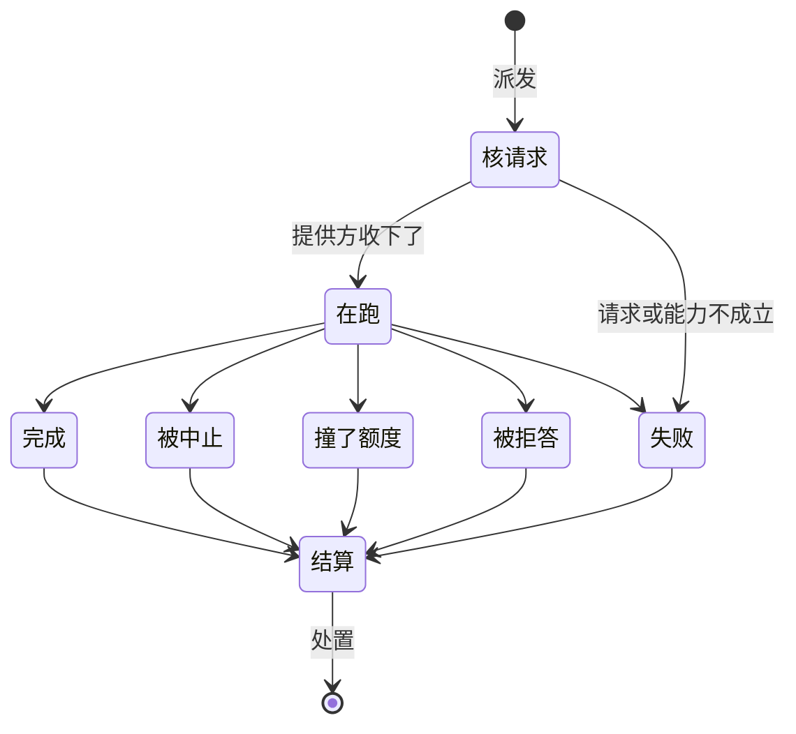
```mermaid
stateDiagram-v2
    [*] --> 核请求: 派发
    核请求 --> 在跑: 提供方收下了
    核请求 --> 失败: 请求或能力不成立
    在跑 --> 完成
    在跑 --> 被中止
    在跑 --> 撞了额度
    在跑 --> 被拒答
    在跑 --> 失败
    完成 --> 结算
    被中止 --> 结算
    撞了额度 --> 结算
    被拒答 --> 结算
    失败 --> 结算
    结算 --> [*]: 处置
```

### 收场的说法只有五种

```mermaid
flowchart LR
    A["一次运行的结局"] --> A1["完成"]
    A --> A2["被中止"]
    A --> A3["出错"]
    A --> A4["撞了输出额度"]
    A --> A5["被模型拒答"]
    A -.->|"不许再多一种<br/>看的人才分得清该不该报警"| A
```

开始和结束这两条边是**成对**发出去的，一次派发不会只留下半条记录。而且一次性运行和可续孩子的驻留用的是同一套开始／结束说法——看的人只看得见「一个孩子开始了、结清了」，管理它的那一侧究竟是新造了它、唤醒了它、还是从冷记录里恢复的，不外露。

### 三条容易搞反的规矩

```mermaid
flowchart LR
    A["调用方不等了"] --> B["取消的是这次等待"]
    B --> C["那次运行照样要被释放"]
    C -.->|"否则会留下一个<br/>没人负责收尾的孩子"| C
```

```mermaid
flowchart LR
    A["活儿跑完了"] --> B["释放的时候出了错"]
    B --> C["这两件事一起进最终结算"]
    C -.->|"不是「跑完就算成功<br/>释放失败记条日志」"| C
```

```mermaid
flowchart LR
    subgraph BAD["把提供方那段失败细节整段带回来"]
        A1["别的进程里的日志可以是无界的"] --> A2["整段捎回父会话"]
        A2 -.->|"一个失败的子任务<br/>足以撑爆父的上下文"| A3["父这边跟着完蛋"]
    end
```

所以那段文字有一个字节上限，超了就在不劈开一个字符的前提下截断，并且留一个看得见的截断标记——**不静默地假装那就是全部**。

---

## 可续孩子

一次性运行结清就散场；可续孩子留着会话和身份，随时可以再交一段活给它。

```mermaid
flowchart LR
    subgraph ONCE["一次性"]
        A1["派一次"] --> A2["等结果"] --> A3["处置"] --> A4["没了"]
    end
    subgraph CONT["可续"]
        B1["立起来"] --> B2["投一段活"] --> B3["它跑完，静下来"]
        B3 --> B4["还在那儿，等下一段"]
    end
```

### 一段驻留就是一个纪元

```mermaid
stateDiagram-v2
    [*] --> 冷着: 会话在介质上，进程里没有它
    冷着 --> 物化中: 有人投了一段新活
    物化中 --> 驻留: 立起来了，开一个新纪元
    物化中 --> 冷着: 立不起来，回滚
    驻留 --> 冷着: 这一轮跑完，收摊
    驻留 --> [*]: 整片被排干
```

一次驻留既不是一次请求，也不是一份结果，更不是一次取消或者一条任务边界——它只是「这个孩子此刻在这台机器上活着」这件事。

```mermaid
flowchart LR
    subgraph BAD["不分纪元"]
        A1["第一轮的结算迟到了"] --> A2["第二轮已经开跑"]
        A2 --> A3["迟到的那条把新一轮的状态盖掉"]
        A3 -.->|"一个正在跑的孩子<br/>在账上变成已经结束"| A4["之后全错"]
    end
```

```mermaid
flowchart LR
    subgraph GOOD["按纪元配对"]
        B1["每一轮驻留带一个纪元号"] --> B2["结算要报出自己那一号"]
        B2 --> B3{"和当下这一轮对得上吗"}
        B3 -->|"对不上"| B4["丢弃"]
        B3 -->|"对得上"| B5["才写状态"]
    end
```

### 排干的次序

```mermaid
flowchart TD
    A["父作用域要撤了"] --> B["第一步：同步关掉准入<br/>不再接受新的物化"]
    B --> C["第二步：等已经放行的那几次<br/>走到公布或者回滚"]
    C --> D["第三步：这时候拍一张快照<br/>森林已经稳定了"]
    D --> E["第四步：从根往下，孩子优先地处置"]
    E --> F["兄弟各排各的<br/>一个失败不妨碍别的被试到"]
    F --> G["全都有了结局，才把汇总的失败报出去"]
```

关闸这一步刻意排在**第一个可中断点之前**——晚一步，就会有新的物化在拍快照的间隙里挤进来，快照拍到的那片森林就不是全部。

### 同一个孩子上的动作串成一条线

```mermaid
flowchart LR
    A["投递 · 放权 · 处置"] --> B["同一个孩子上一次只放一个进去"]
    B --> C["不同的孩子互不相干"]
    C -.->|"等着的几方靠抢，先来的不一定先进"| D["所以每个临界区进去之后<br/>都把自己的前提重新核一遍"]
    D --> D1["还在不在收活"]
    D --> D2["这个身份占没占上"]
    D --> D3["驻留还在不在"]
    D --> D4["有没有开始处置"]
```

「谁先进」在这里不承载任何正确性——这一条成立，才允许用最朴素的一把按身份分的锁，而不必为了先来先到再造一套排队。

---

## 谁看得见谁

```mermaid
flowchart TD
    R["一次调用"] --> S["它所在的那个作用域"]
    S --> V1["自己派出去的孩子：看得见"]
    S --> V2["孩子的孩子：看得见"]
    S --> V3["旁边另一棵树上的：看不见"]
    X["模型报一个身份上来"] -.->|"凭它越不过这条边界"| V3
```

列举这件事只读两处：当前进程里的活会话，加上可选的会话持久化。它**不装载、也不恢复任何 agent**。

```mermaid
flowchart TD
    A["要认出一个候选是不是孩子<br/>以及它叫什么、什么模式"] --> B{"三级梯子"}
    B -->|"一"| B1["活着的：读它自己那份水位缓存"]
    B -->|"二"| B2["冷的：先试一行耐久缓存<br/>要过序号闸"]
    B -->|"三"| B3["还不行：做一次持久化探视<br/>重新折一遍"]
    B1 --> C["身份一律由那个已登记的折叠单元说了算<br/>列举这一侧自己一条都不解"]
    B2 --> C
    B3 --> C
```

```mermaid
flowchart LR
    subgraph BAD["一条读不出来就整张单子失败"]
        A1["一份日志坏了"] --> A2["整次列举报错"]
        A2 -.->|"别的十九个好好的孩子<br/>也跟着看不见了"| A3["越坏越查不动"]
    end
```

```mermaid
flowchart LR
    subgraph GOOD["坏的那一条自己占一行"]
        B1["折不出身份"] --> B2["记一行「这份数据坏了」"]
        B3["这次探视失败了"] --> B4["记一行「暂时读不到」<br/>下次列举还会再试"]
        B2 --> B5["其余的照常列出来"]
        B4 --> B5
    end
```

没有持久化的时候只列活的。**一个冷孩子在那种部署下本来就接不上，它的缺席是能力缺席，不是错误。**

---

## Agent 团队

一个会话可以带一群队友干活。队友就是可续孩子；团队这一层只多给三样东西。

```mermaid
flowchart LR
    L["队长会话<br/>团队身份 = 它的会话身份"]
    L --> R["花名册<br/>名字 · 职责 · 在岗状态"]
    L --> B["共享任务板<br/>任务 · 前置关系 · 谁认领了"]
    L --> M["队友之间的收件箱"]
    R --> T1["队友甲"]
    R --> T2["队友乙"]
    T1 -.认领.-> B
    T2 -.认领.-> B
    T1 -.发消息.-> M
    M -.送到.-> T2
```

没有单独的「建团队」这个动作：一个会话起出第一个队友的那一刻就成了队长。所以「这是哪支团队」永远有答案，不必先建一个容器再往里放人。

### 状态落在介质上，不是从队长日志里折出来的

```mermaid
flowchart LR
    subgraph BAD["折日志（DSH 那边的做法）"]
        A1["团队状态是队长日志的一份内存投影"] --> A2["每一次改动都要经过队长那一个活对象"]
        A2 -.->|"于是整支团队被钉在<br/>队长所在的那台机器上"| A3["多副本部署做不了"]
    end
```

```mermaid
flowchart LR
    subgraph GOOD["落库（本仓库的做法）"]
        B1["花名册 · 任务板 · 收件箱<br/>各占介质上的一处记录"] --> B2["认领一条任务、发一条消息<br/>都是对一把键的一次条件写"]
        B2 --> B3["谁在哪台机器上都做得了"]
    end
```

换来的和付出的：

| | 折日志（DSH） | 落库（本仓库） |
|---|---|---|
| 谁能改状态 | 只有队长所在那台机器 | 任何一个副本 |
| 状态跟着会话分叉吗 | 跟着 | 不跟着，团队状态是独立的 |
| 「这个队友活着吗」 | 一问就是全世界的答案 | 只对本副本成立，别处的队友看不见 |
| 并发冲突怎么挡 | 队长那一个对象天然串行 | 任务上的版本号 + 整块板的条件写 |

### 整块板收成一条记录

```mermaid
flowchart TD
    A["改一条任务往往要同时看它的邻居"] --> A1["认领：前置做完没有"]
    A --> A2["删除：谁还挡在它后面"]
    A --> A3["设前置：整张图要重新验一遍"]
    A1 --> B["而介质那一层不提供跨记录事务"]
    A2 --> B
    A3 --> B
    B --> C["所以整块板就是一条记录<br/>一次条件写就是一次原子改动"]
    C -.->|"代价：板越大越容易撞"| C
```

### 起一个队友分两步落盘

```mermaid
flowchart LR
    subgraph BAD["先起会话再落盘"]
        A1["会话起起来了"] --> A2["这中间进程没了"]
        A2 -.->|"一个半开的子会话<br/>在任何地方都没有痕迹"| A3["没人收得回它"]
    end
```

```mermaid
flowchart LR
    subgraph GOOD["先占名字，再起会话"]
        B1["写一行「筹备中」<br/>把名字占下来"] --> B2["去起那个会话"]
        B2 -->|"起成了"| B3["转「在岗」"]
        B2 -->|"起不成"| B4["转「失败」"]
    end
```

### 消息承诺的是至少一次

```mermaid
stateDiagram-v2
    [*] --> 排队里
    排队里 --> 被某个副本抓着: 认领时盖一个时刻
    被某个副本抓着 --> 送到了
    被某个副本抓着 --> 排队里: 抓着它的副本消失了，过期后别人捡回来
    送到了 --> [*]
```

```mermaid
flowchart LR
    A["想要恰好一次"] --> B["得让「送到收件人」和「记下送到了」<br/>落在同一个事务里"]
    B --> C["而收件人可能在另一台机器上"]
    C -.->|"所以这里如实承诺至少一次"| D["重复送到的那一条<br/>由收件人自己认"]
```

没有后台清扫线程：过期的认领是在下一次投送顺带捡回来的，由「这个收件人在本副本上活起来了」这件事触发。

### 写入范围只提醒，不拦

```mermaid
flowchart LR
    A["两条任务都说要改同一处"] --> B["板上把这件事说给模型听"]
    B --> C["但不挡任何一次改动"]
    C -.->|"这一层不知道那些范围指的是什么<br/>也没有能力去锁它们"| C
```

---

## 面向模型的那几件工具

```mermaid
flowchart TD
    M(("模型")) --> T1["派活工具<br/>把一件活交给一个点名的提供方"]
    M --> T2["三件全局命名的控制工具<br/>列举 · 投递 · 打断"]
    M --> T3["只装在孩子作用域上的汇报工具"]
    T1 -.->|"一个装配挂一个提供方<br/>要露出两条路就装两份，各给一个名字"| T1
    T2 -.->|"和按提供方绑定的派活工具分开住<br/>好让多件派活工具共用同一套控制面"| T2
    T3 -.->|"父、兄弟、根 agent 都看不见它"| T3
```

### 模型能挑什么，不能挑什么

```mermaid
flowchart TD
    A{"模型在这条缝上有几分自由"} --> B["不能挑：用哪个子 agent 提供方<br/>装配那一刻就点名了"]
    A --> C["可能能挑：孩子跑在哪条模型路由上"]
    C --> D{"这份部署开了这个开关吗"}
    D -->|"没开"| E["工具的参数里根本没有这几项"]
    D -->|"开了"| F["只能在一份宿主授权的清单之内挑"]
    F --> G["越界的挑选当场拒"]
```

那份清单从哪儿来，有先后次序：

```mermaid
flowchart TD
    A{"这条会话自己记过一份吗"} -->|"记过"| B["用它<br/>一条恢复回来的会话跑的是它当初被授的那份<br/>不是此刻的用户设置"]
    A -->|"没记过"| C{"它是个孩子吗"}
    C -->|"是"| D["跟它父那份走"]
    C -->|"不是"| E["才去读用户设置"]
    B --> F["挑中的那一份当场记进会话日志"]
    D --> F
    E --> F
    F -.->|"写一次就定了"| F
```

### 打断是一个请求

```mermaid
flowchart LR
    A["模型说：打断那个孩子"] --> B["递一个请求过去"]
    B --> C["真正停不停、什么时候停"]
    C --> D["由那个孩子自己那台 agent<br/>的静止判断说了算"]
    D -.->|"这一层不定义打断的语义"| D
```

汇报那件工具的两笔登记（工具本身和那段用法指引）挂在同一条命上：

```mermaid
flowchart LR
    A["装的时候：后一笔失败<br/>要把前一笔滚回去"] --> C["两笔要么都在，要么都不在"]
    B["摘的时候：两笔都要试过再报失败"] --> C
    C -.->|"一笔摘不掉<br/>不该让另一笔留在那儿"| C
```

---

## 生命周期与并发

DSH 那边是单线程的，那一整块里一个同步原语都没有。这里不行：父在一条线上派活，孩子在另一条上跑，观察方还可能在第三条上反查。

```mermaid
flowchart TD
    A["提供方登记、驻留记账、物化记账"] --> B["各自加锁"]
    B --> C["锁里只做原子的簿记"]
    D["用户交进来的函数<br/>和一切会阻塞的调用"] --> E["一律在锁外"]
    E -.->|"否则一个观察方反手查一次运行时<br/>就当场自锁"| E
```

```mermaid
flowchart LR
    A["四条生命周期边"] --> A1["运行开始 / 运行结束<br/>带着发起这次派发的那个父<br/>按作用域分层派发"]
    A --> A2["提供方来了 / 提供方走了<br/>没有父这个载体，只发给全局层"]
    A2 -.->|"「提供方来了」是唯一一条不被兜住的<br/>它发在一次登记的中途<br/>它失败就是那次登记失败"| A2
```

```mermaid
flowchart LR
    A["孩子的寿命挂在父的作用域上"] --> B["父的作用域一撤"]
    B --> C["整棵子树跟着停、跟着收"]
    D["进程内那台驱动"] --> E["等孩子真正静下来才结算"]
    E -.->|"「已经请求取消」不等于「已经停了」"| E
```

---

## 失败语义

一次派发横跨两道边界（父与子，可能还有进程内与进程外），所以总规矩只有一句：**每一次派发都必须有一次结算。**

```mermaid
flowchart TD
    A["请求或能力不成立"] --> A2["在进提供方之前就拒<br/>既不留下要人处置的运行<br/>也不发任何生命周期边"]
    B["调用方不等了"] --> B2["照样释放那次运行<br/>取消的是等待，不是那次运行"]
    C["孩子报了「完成」"] --> C2["只原样转述<br/>结果对不对，这一层证明不了"]
    D["旧一轮的结算迟到"] --> D2["按纪元配对丢弃<br/>不许覆盖新一轮"]
```

```mermaid
flowchart LR
    A["结果错和释放错"] --> B["一起进最终结算"]
    C["提供方那段失败细节"] --> D["截到上限，留一个看得见的标记"]
    E["冷记录读不出来"] --> F["那一行给诊断状态<br/>不让整张单子失败"]
```

```mermaid
flowchart LR
    subgraph BAD["少发一条结束边"]
        A1["一次派发只留下半条记录"] --> A2["账上有个孩子永远在跑"]
        A2 -.->|"运行期那道配对检查会当场发现"| A3["开始和结束必须成对"]
    end
```

这一族包自己挂了两条运行期检查：提供方登记的收支要平（登记几次、撤销几次对得上），开始与结束那对边要配得上（发过开始就必须发结束）。

---

## 能力边界

```mermaid
flowchart TD
    Y["这一族包做的"] --> Y1["挑提供方、验能力、建父子关系、结算一次运行"]
    Y --> Y2["只读地列举孩子和后代"]
    Y --> Y3["把这几件事包成模型用得上的工具"]
    N["不做的"] --> N1["不实现模型循环、工具运行时、会话持久化后端"]
    N --> N2["不保证跑在别处的孩子的隔离、安全和资源配额"]
    N --> N3["不自动把父的全部权限授给孩子"]
    N --> N4["不在仓库里起任何命令、终端、子进程"]
    N --> N5["活会话那份记录只代表当前进程<br/>不是跨进程的注册中心"]
```

最后一条要说清楚：

```mermaid
flowchart LR
    A["「这个孩子活着吗」"] --> B["答的是「在本副本上活着吗」"]
    C["一个冷会话的父子身份"] --> D["是从会话日志里那些事件<br/>重新整理出来的"]
    B -.->|"别的副本上的孩子<br/>这里看不见"| B
```

团队那一侧还有两条：状态跃迁合不合法它验，活儿干没干好它不知道——一条任务标成「做完了」是一句被写下来的声明，不是一次验收；并发只有两条防线（任务上的版本号，整块板的条件写），没有分布式锁。

---

## 对应的 DSH 能力

下表由 [`docs/packages.md`](../packages.md) 与 [能力覆盖表](../portmap/capability-coverage.tsv) 机器 join 得到：本篇覆盖的 Go 包，承接的是上游 DSH 的哪几条能力，以及各自还缺什么。落点列由源码里的 `// 源:` 注释反查，不是手写的。

| 上游能力 | DSH 包 | 裁决 | 落在哪个 Go 包 | 这里缺什么 |
|---|---|---|---|---|
| 提供子agent运行的接缝抽象，管理provider注册、启动、持久化子agent描述符及可继续子级编排 | `subagent/subagent` | 需要 | `feature/subagent` `feature/subagent/internal/childseed` | — |
| 在当前进程创建子agent，以父agent已完成的对话轮次作为初始内容 | `subagent/subagent-fork-in-process` | 需要 | `feature/subagent/forkinprocess` | — |
| 两个进程内provider共用的运行驱动器，处理深度、创建、定制、结果读取、取消和dispose | `subagent/subagent-in-process-driver` | 需要 | `feature/subagent/inprocessdriver` | — |
| 在当前进程创建全新子agent，有自己的会话但以空对话开始运行 | `subagent/subagent-spawn-in-process` | 需要 | `feature/subagent/spawninprocess` | — |
| 基于已配置provider的面向模型委派工具，前台或后台执行subagent任务 | `subagent/tool-subagent` | 需要 | `feature/subagent/subagenttool` | 模型选择那张授权表按 subagent/model-selection-policy 事件写一次就定；provider 那份路由默认值（agentRouteDefaults）没有产出方，本次移植不收进程外提供方，所以工具措辞只有继承父路由这一支 |
| 全局具名send_message、interrupt_agent与list_agents工具，控制可继续subagent的生命周期 | `subagent/tool-subagent-control` | 需要 | `feature/subagent/controltool` | — |
| 可选的子级作用域report工具，为可继续进程内子级提供向父agent的返回通道 | `subagent/tool-subagent-report` | 需要 | `feature/subagent/reporttool` | — |
| 子 agent 提供方的契约夹具 | （无上游出处） | 本仓库自有 | `feature/subagent/internal/providertest` | 只有 subagent 子树用，收进 internal |
| 隐式Root Agent Teams领域，维护Lead/teammate roster、持久peer mailbox与共享任务DAG | `experimental/agent-team` | 需要 | `feature/agentteam` | `wait` 换了做法：DSH 的 `activity.ts` 是一张进程内等待者名单，多副本下等不到别的副本上那次改动，这边落成介质上的条件轮询，只承诺看得见本次调用之后的改动 |
| ctx.agentTeams的scoped模型适配器，在每个隐式Lead和持久teammate scope安装协作工具 | `experimental/tool-agent-team` | 取形重写 | `feature/agentteam/agentteamtool` | 十件工具连同那段团队策略指引。团队身份不再现问成员表，由装配方在 `Config.Team` 上写死，一个控制器服务一支团队 |

## 相关源码

| 路径 | 内容 |
|---|---|
| `feature/subagent/` | Runtime、Provider/Run 契约、父子描述、查询和续行 |
| `feature/subagent/inprocessdriver/` | 进程内 Agent 创建、等待、结构化结果和释放 |
| `feature/subagent/spawninprocess/` | 新会话 Provider |
| `feature/subagent/forkinprocess/` | 会话分叉 Provider |
| `feature/subagent/subagenttool/` | 派发工具 |
| `feature/subagent/controltool/` | 列表与控制工具 |
| `feature/subagent/reporttool/` | 子 Agent 报告工具 |
| `feature/subagent/internal/childseed/` | 派发策略怎么落到孩子那条日志上，续行激活和进程内驱动共用 |
| `feature/subagent/internal/providertest/` | Provider 契约夹具，只给本子树的测试用 |
| `feature/agentteam/` | 花名册、共享任务板、队友收件箱，三样都落库 |
| `feature/agentteam/agentteamtool/` | 那三样的模型侧工具面，外加一段团队策略指引 |

## 深入阅读

[工作流与 Ralph](ralph.md) · [后台作业](jobs.md) · [SDK 协议与服务端](sdk.md)
