# 系统提示词装配

对应包：`core/systemprompt`

## 一句话

Agent 每次去问模型之前，得先给模型一份交底材料。这个包决定那份材料里放什么、按什么顺序排、哪些允许被覆盖、哪些允许被关掉。

它自己一个字的提示词都不写。

---

## 为什么需要它

一个 agent 对模型说的话，不是在某个文件里一次写死的，而是十几个功能各写一段拼出来的：

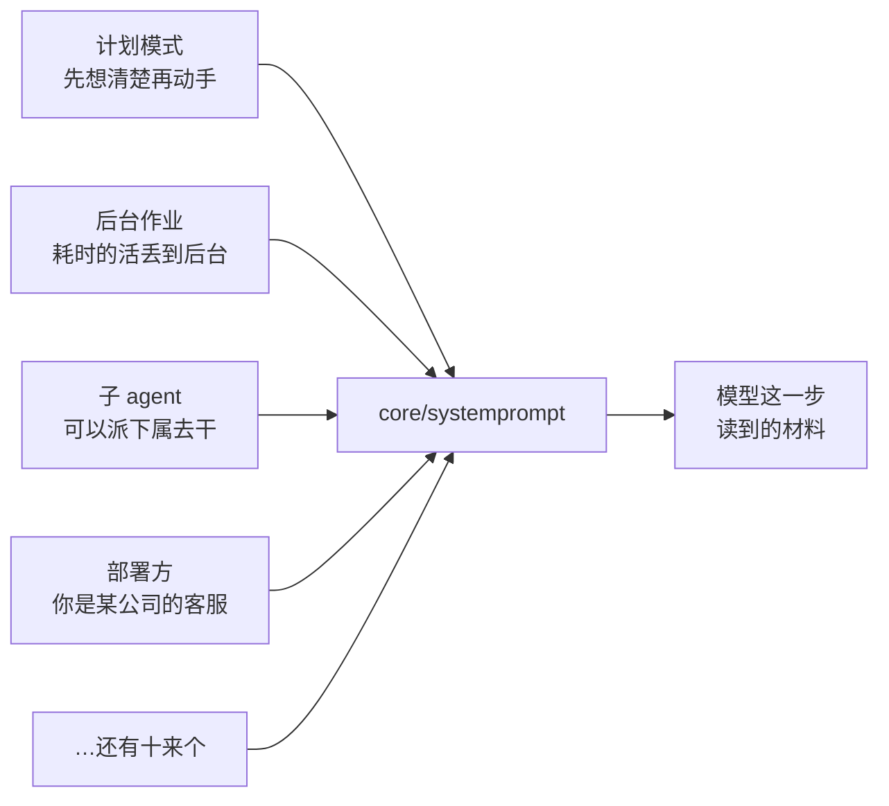

这些说明写在不同的包里，互相不知道对方存在。于是有四个问题必须有个地方统一回答：

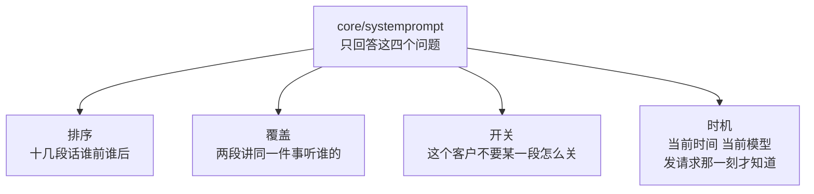

---

## 模型每一步收到什么

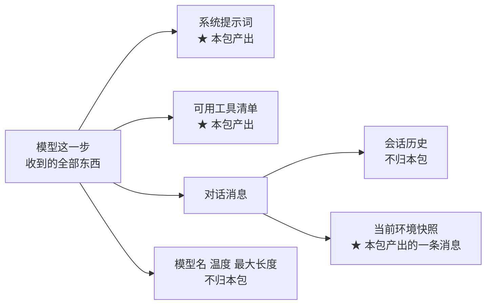

---

## 能往里塞的四样东西

| 塞什么 | 举例 |
|---|---|
| 一段提示词 | 「你现在处于计划模式，先给方案再执行。」 |
| 一段环境快照 | 「当前时间：2026-09-02 14:30，时区 UTC+8。」 |
| 一份工具清单 | 「这个 agent 这次能看见这 8 个工具。」 |
| 一个变量的值 | 正文里写 `{{model}}`，替换成这次实际用的模型名 |

后两样登记的**不是一张现成清单，而是一个待询问的函数**：

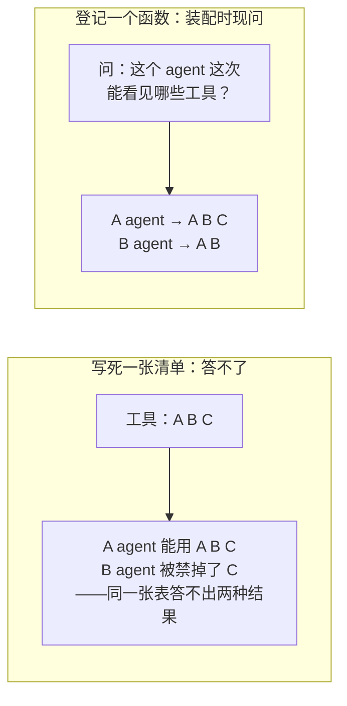

模型名同理：要等这次请求的参数定下来才知道。

---

## 一、排序

每段登记时自报一个整数，从小到大排。约定相邻留 100 的间隔，好让以后新增的段落有地方插。

目前实际占用的位置，从上到下就是最终提示词的样子：

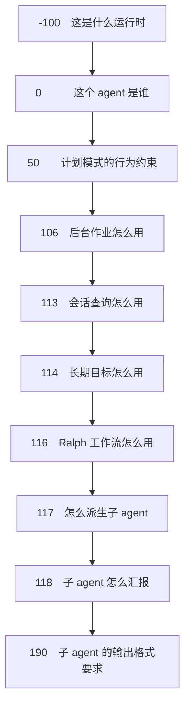

「这是什么运行时」排在「这个 agent 是谁」前面：先交代舞台，再交代角色。

---

## 二、覆盖

覆盖靠**同名**。两段用同一个名字登记，内层的生效，外层的被盖住。

这条规则撑起一个很实际的场景——**换人设**：

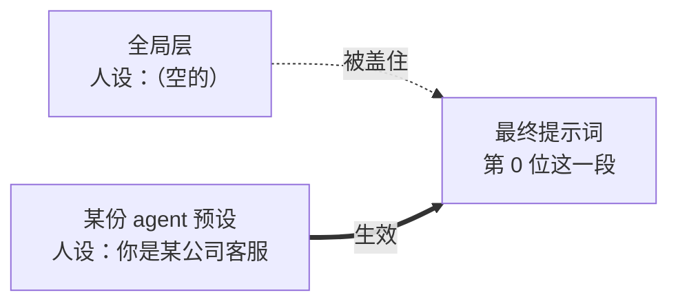

关键在于：运行时建注册表时，会**无条件**放一段叫「人设」的内容进去，**哪怕部署方一个字都没填**。空段落最后渲染时会被丢掉，留一个空的不花任何代价。

留它的理由是——

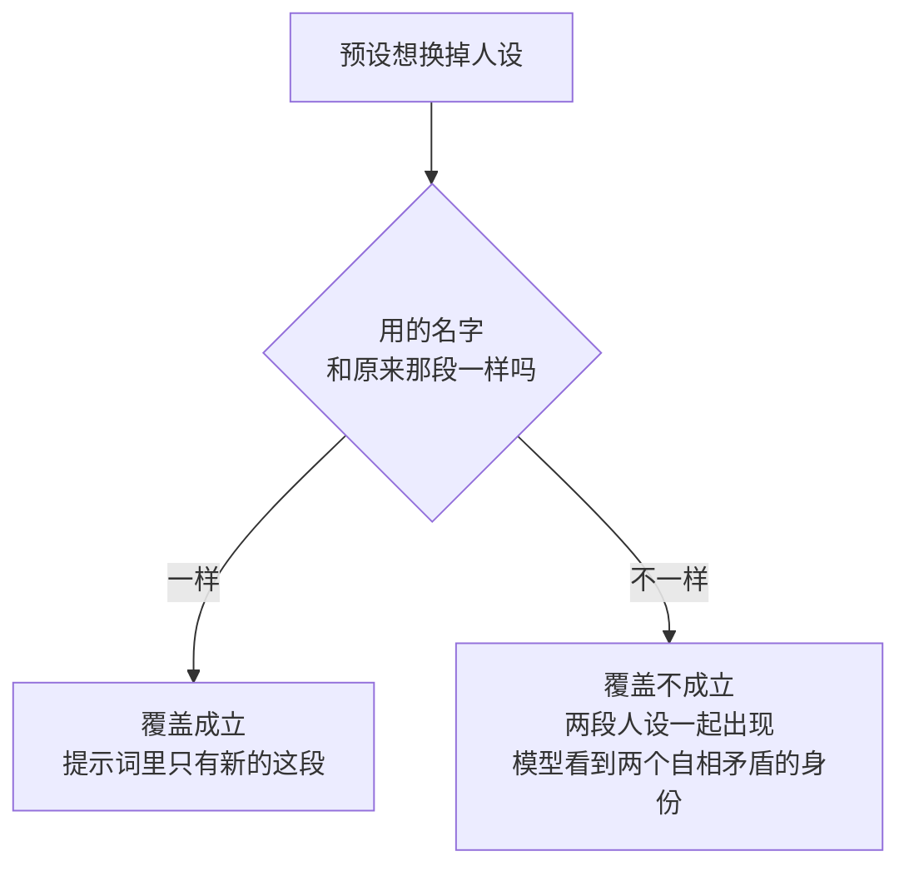

`preset/persona` 这个包存在的全部理由就是这一条。没有它，一份预设能换掉一个 agent 的工具，却永远换不掉这个 agent 的身份。

**覆盖只换内容，不改位置。** 重新登记的那段仍待在原来的次序上。否则一次局部改写会把这段悄悄挪到提示词末尾，改的人根本不会察觉。

---

## 三、开关

能整体关掉的只有一样：**环境快照**。

先说清它是什么——装配每次会产出一段随时在变的内容（当前时间、工作区的指令文件之类），做成一条消息发给模型。

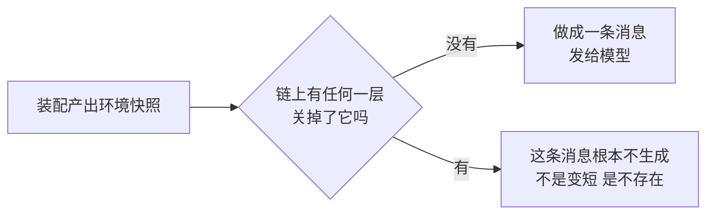

粒度和方向：

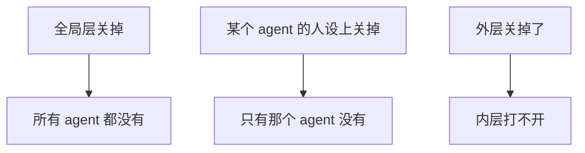

和「上下文压缩」没有任何关系。压缩是会话太长把旧消息缩写掉，那是 `core/agentloop` 的事。

---

## 四、整份替换

一段提示词可以声明「我就是整份系统提示词」。它一旦生效，其余段落全部作废。

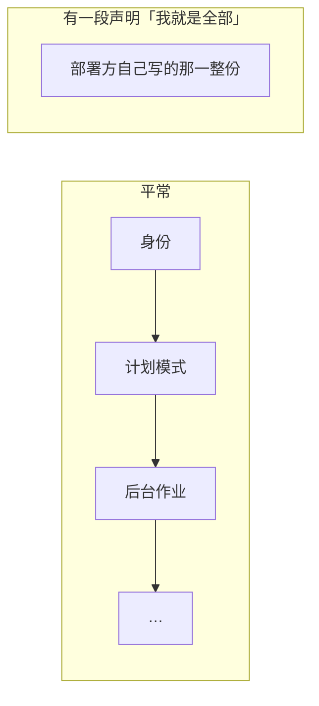

这是给**完全接管**的场景准备的：部署方要给模型一份从头到尾自己写的提示词，不接受运行时和各功能模块塞任何东西。

同时有两段这么声明，装配直接失败并报出这两段的名字——没有依据判断该听哪一段。

---

## 装配跑一遍是什么样

先看流程：

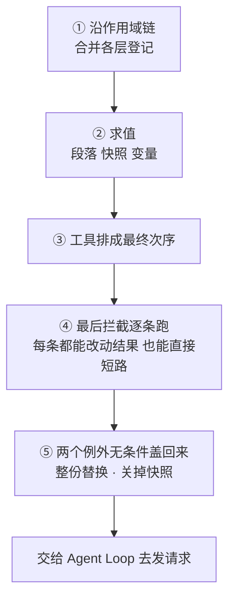

再看谁在什么时候和谁说话：

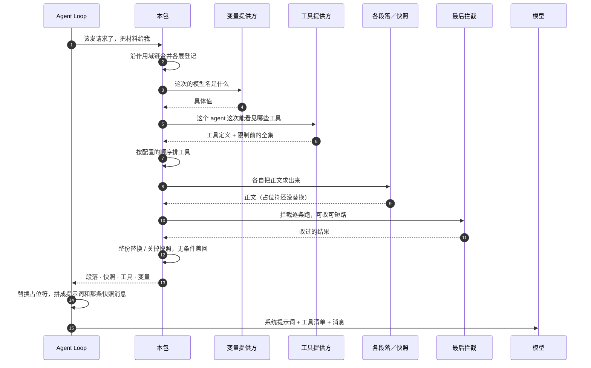

图里有两处值得单独看一眼：

- **变量和工具是「问出来」的**（第 3~6 步），不是从表里查出来的。
- **占位符替换发生在最后一步，不在装配里**。装配交出来的正文还带着 `{{model}}`，因为同一份内容有两个消费方要不同形状（模型要连好的一段文字，展示快照的界面要分块），拆开之后两者共用一次替换。

第④步的「最后拦截」是运行期挂上去的扩展，仓库里用了两处：选模型、预设的合法性检查。

第⑤步是这套设计的取向所在：

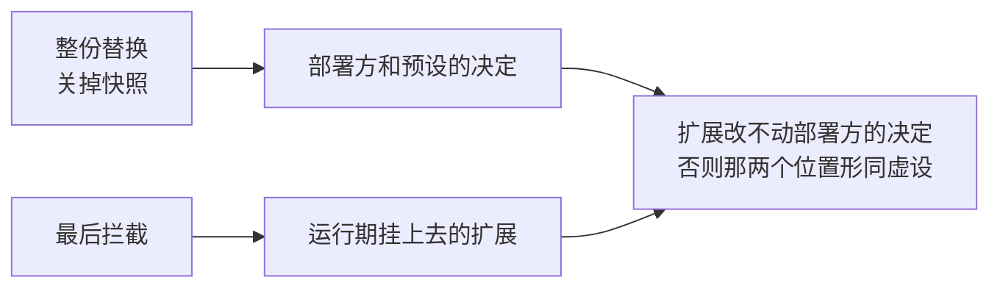

另外，挂拦截**不触发「配置变了」的回调**，其余四种登记都会。理由是拦截没有改变「登记了什么」，只改变这一次装配的结果长什么样。

---

## 变量替换

正文里写 `{{model}}` 这种占位符，装配时替换成实际值。

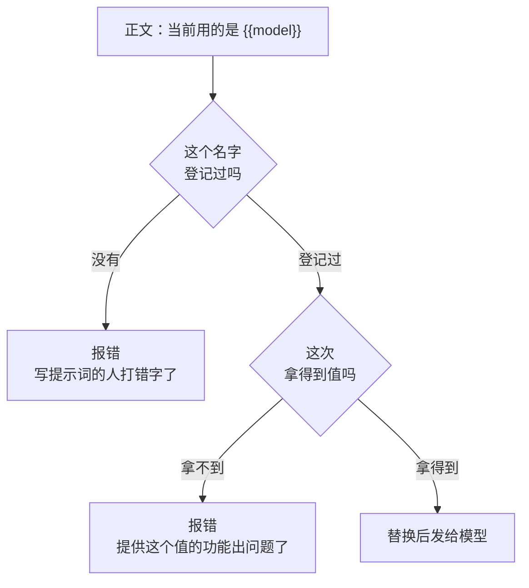

**写错了就报错，绝不放过去。** 一个没被替换掉的 `{{model}}` 留在提示词里，模型会把它当字面内容读，然后照着一个不存在的概念去推理——失败比这种结果好得多。

两种失败必须分开报，因为**能修的人不是同一个**：一个是写提示词的，一个是提供这个值的功能。

有一种情况放行：孤零零一个 `{{`，后面再没有配对的 `}}`。当普通文字原样留着——提示词正文里出现一对花括号本来就很正常。

报错时列出的「已登记的名字」按字母排过序。同一个错误每次打印顺序都不同的话，比顺序不对更难查。

目前非测试代码只用了两个变量：模型提供方、模型名。

`deepseek-harness-dsh-v0.1.2-alpha.3` 那边还有第三个——当前工作目录。本仓库明确不移植：这套运行时跑在服务端，没有工作目录这个东西。往提示词里写一个具体路径是一句谎话，模型会照着去拼相对路径，而那些路径在这套部署里指不到任何地方。

---

## 工具清单的次序

部署方可以指定一份工具顺序。这份顺序里必须留一个占位项，没被点名的工具按字母序插在那儿。

**没配** 和 **配了个空的**，含义不同：没配 = 不指定，全按字母序；配了个空的 = 明确写了一份顺序但忘了留占位项，判为配错。

校验分两次做：

分开的原因：读配置那会儿功能模块还没装完，这时候查名字必然全错。

两件容易踩的事：

**「被藏起来」不等于「不存在」。** 一个工具在某个 agent 的作用域里被限制掉了，它的名字仍然是登记过的。部署方配置里提到它，不该被判成写错名字。所以工具提供方除了报「这次给模型看哪些」，还可以另报一份「做限制之前一共有哪些」。

**同名工具不去重。** 两个功能各报了一个同名工具，全部保留。这个包没有依据判断哪份该赢，擅自丢一份比留两份危险。

---

## 分层

登记不是平铺的。全局一层，每个 agent 及其祖先各一层：

| 登记的东西 | 沿这条链怎么合 |
|---|---|
| 提示词段落、环境快照、变量 | 同名的，内层盖外层；位置仍按最初报的次序 |
| 工具提供方、最后拦截 | 不覆盖，全部生效，先全局再由远及近 |
| 关闭环境快照的标记 | 任何一层有，就是关 |

---

## 出错的时候

三类错，各对应一个不同的责任人：

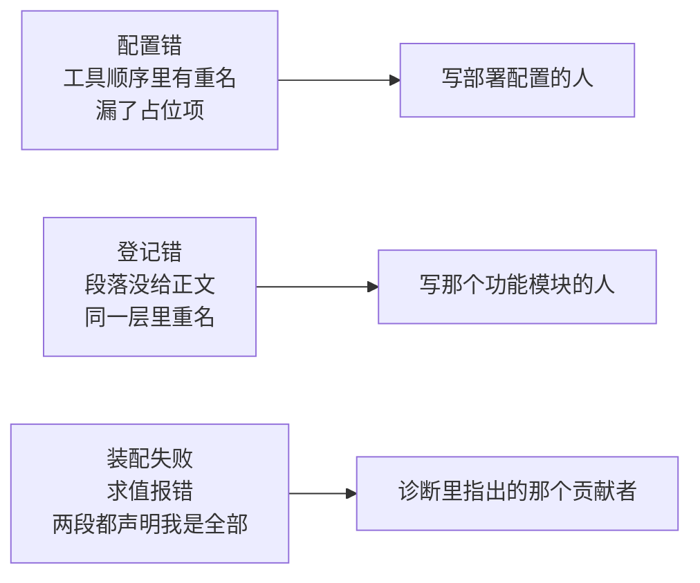

**求值失败一律指名到具体贡献者。** 一份提示词是十来个包各出一段拼起来的，光说一句「变量求值失败」，诊断里就没有任何线索指向该改哪个包。

---

## 这个包不做什么

- **不提供任何内容。** 一段提示词、一个工具、一个变量都不自带。
- **不知道工具是什么。** 只把功能模块报上来的定义排个序；定义、可见性、执行全在 `core/tools`。
- **不发请求。** 装配结果交给 `core/agentloop` 去拼模型请求。
- **不缓存。** 每次装配把每个提供方重新问一遍。
- **不读写存储，不起后台任务，不计时。**
- **不管快照什么时候进会话。** 只交出文本；什么时候插、插几次、旧的怎么办，是 `core/agentloop` 的事。

---

## 当前使用情况

18 个包在非测试代码里用到它。

| 用的是哪一面 | 用的功能 | 处数 |
|---|---|---|
| 加一段提示词 | 计划模式、后台作业、会话查询、长期目标、Ralph 工作流、子 agent（三处）、Persona | 10 |
| 挂最后拦截 | 选模型、预设合法性检查 | 2 |
| 加环境快照 | 子 agent 的委派说明 | 1 |
| 登记变量 | Agent Loop | 1 处，两个变量 |
| 关掉环境快照 | Persona | 1 |
| 触发装配、做渲染 | Agent Loop | 集中在一个文件里 |
| 建注册表 | 示例宿主 | 1 |

三件值得知道的事：

**加提示词段落是绝对主流。** 10 个包往里加段落，其余四种登记加起来只有 5 处。

**工具清单这条线目前是断的：**

两侧各自都没有非测试代码调用。

**运行时环境的三样东西不走这里：**

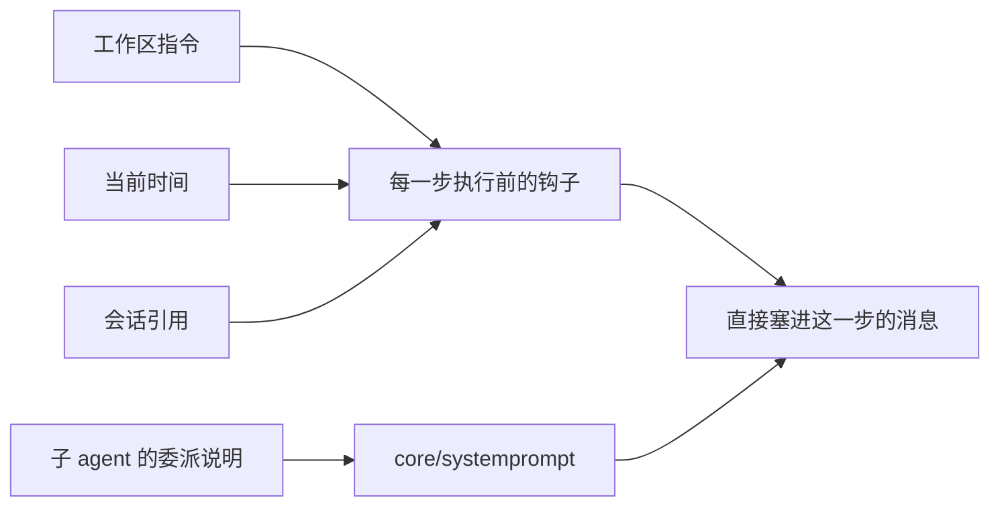

经过本包的环境快照，只有子 agent 的那一份委派说明。

---

## 相关源码

| 路径 | 内容 | 行数 |
|---|---|---|
| `core/systemprompt/registry.go` | 注册表、五个登记入口、装配流程 | 580 |
| `core/systemprompt/prompt.go` | 值类型、变量替换、工具排序、渲染 | 475 |
| `core/systemprompt/doc.go` | 包说明与移植决定 | 65 |

---

## 深入阅读

[作用域](core-scope.md) · [Tools](tools.md) · [Agent](agent.md) · [Skill、提示词与预设](skill.md) · [Agent 预设与 Persona](presets.md) · [运行时上下文](context.md)
