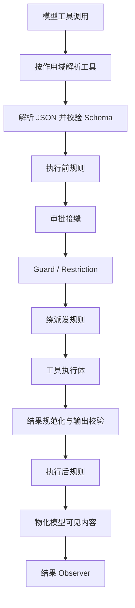

# Tools

覆盖工具定义、注册、执行管线、Schema 校验、Guard、人工介入、MCP 工具、Todo 和 Plan Mode。

## 定位

`core/tools` 负责模型工具从“声明”到“可记录结果”的完整运行时，但不提供具体业务工具。

它解决：

- 当前 Agent 能看到哪些工具。
- 模型参数是否合法。
- 调用前是否允许执行。
- 如何审批、超时、调度和收敛结果。
- 如何把成功、失败、取消和 panic 统一写入会话。

## 工具定义

`Definition` 描述一件工具：

- 稳定名称和模型可读说明。
- 输入 JSON Schema。
- 可选输出 Schema。
- 调用种类，例如读、写或其他副作用类别。
- 超时与并发提示。
- 执行函数。
- 结果呈现方式。

工具名称在有效作用域内唯一。同名近层工具覆盖祖先或全局实现，但不会改变原有排列位置。

## Schema

Schema 模块解析并校验运行时支持的 JSON Schema 子集：

- 工具输入顶层必须符合工具协议要求。
- 模型参数先解析为合法 JSON，再按 Schema 校验。
- 输出声明存在时，工具返回值也要校验。
- 不支持的 Schema 关键字明确返回 `UNSUPPORTED_SCHEMA`，不会假装支持。
- 校验错误包含数据路径，便于模型修正参数。

运行时 Schema 校验不是业务授权。即使参数结构合法，仍需宿主策略决定调用者是否允许执行。

## 执行管线

管线分为 Prepare、Dispatch、Finalize 三段，使多个调用能够并行执行，同时保持执行前和执行后策略的确定顺序。

## 失败都是工具结果

`Runtime.Execute` 不把工具自身失败作为 Go error 抛给 Agent Loop。以下情况都会转换成 `IsError=true` 的结构化工具结果：

- 工具不存在。
- 参数不是合法 JSON。
- 输入或输出不符合 Schema。
- 审批拒绝或不可用。
- Guard 拦截。
- 工具返回错误。
- 工具 panic。
- 超时或取消。

原因是模型协议要求每个 Tool Call 都有对应 Tool Result。缺失结果会破坏下一次模型请求和会话回放。

配置错误、注册错误和运行时自身无法维持不变量时仍返回 Go error。

## 扩展边界

工具运行时提供多类有序扩展：

| 扩展 | 用途 |
|---|---|
| 执行前规则 | 拒绝、改写准备决策或附加约束 |
| 审批 | 请求用户或策略服务允许一次调用 |
| Guard | 超时、重复调用提醒和部署限制 |
| 绕派发规则 | 包裹真正执行体，注入 Context 或观测耗时 |
| 执行后规则 | 外置大结果、追加上下文、阻止或改写展示结果 |
| 结果 Observer | 记录和监控最终结果 |

Waterfall 中先登记的规则在外层。规则必须调用 `next` 才会进入内层。

## 并行调用

- Agent Loop 决定一个步骤允许的最大并行数。
- 工具可以声明自身是否允许并行。
- Prepare 先有序完成，再并行 Dispatch，最后有序 Finalize。
- 每次调用拥有独立取消 Context、调用 ID 和结果。
- 取消后尚未开始的调用也会生成规范的“派发前取消”结果。
- panic 只影响当前调用，不终止其他会话或整个服务。

## 审批

`interaction/userapproval` 实现 `core/tools.Approval`：

1. 确认调用位于打开的回合内。
2. 应用会话审批策略；`never` 必然拒绝。
3. 依次请求已登记答复者。
4. 把审批问题和结果写入会话事件。
5. 无答复、答复错误或非法结果时默认不放行。

审批只决定是否允许本次工具调用，不替代宿主用户鉴权。

## Guard

### Timeout Policy

`guard/timeoutpolicy` 把带期限的 Context 传给工具，并在超时后返回稳定超时结果。它是协作式取消：忽略 Context 的工具仍会继续运行，Go 运行时无法从外部安全强杀它。

### Repeat Tool Reminder

`guard/repeattoolreminder` 识别同一工具和参数的连续调用，在达到阈值时向模型增加提醒。它不拦截调用，因为分页、轮询和批处理也可能合法重复。

## 人工介入

| 包 | 能力 |
|---|---|
| `interaction/userquestions` | 提问提供方接口和请求校验，不实现具体 UI |
| `interaction/askuser` | 面向模型的 `ask_user_question` 工具 |
| `interaction/userapproval` | 工具审批服务和审计事件 |
| `interaction/commands` | 不进入模型的用户斜杠命令注册表 |

命令、问题和审批都需要宿主提供实际交互通道。无 UI 或批处理部署可以不安装这些能力。

## MCP

`mcp` 把远端 MCP Server 的工具转换为 `core/tools.Definition`：

- 管理连接、发现和工具名称映射。
- 为不同 Server 生成稳定公开工具名。
- 转换文本、图片和结构化内容。
- 处理重连和调用超时。
- 通过附件服务准入图片。

MCP 是工具来源，不是新的 Agent Loop。远端 Server 的认证、网络访问和租户隔离仍由宿主配置。

## Todo 与 Plan Mode

`todo` 提供整表替换的 `todo_write` 工具。每次成功调用保存完整清单，最后一次有效写入决定当前 Todo 状态。

`plan/planmode` 为每个 Agent 保存计划模式：

- 开启时向模型请求增加计划指引。
- Exit 工具把计划交给用户评审。
- 用户选择在安全的步骤边界生效。
- 状态写入会话事件，可恢复和分叉。
- 计划模式不等于沙箱或审批策略。

## 安全要求

- 工具注册不是授权，入口仍需校验用户和租户。
- 工具不能信任模型传入的路径、URL、资源 ID 或会话 ID。
- 密钥不能进入工具 Schema、模型历史或普通结果。
- 所有 I/O 工具都应响应 Context。
- 写操作应使用版本或幂等键避免重复执行。
- 对外工具错误使用稳定错误码，不能要求模型解析内部堆栈。

## 边界

Tools 模块不负责：

- 任意 Shell、终端、子进程或代码沙箱。
- 自动生成业务工具。
- 用户身份认证。
- 保证第三方 MCP Server 安全。
- 强行终止不合作的 Go 函数。
- 决定 Agent 回合何时开始；由 Agent Loop 负责。

## 相关源码

| 路径 | 内容 |
|---|---|
| `core/tools/definition.go` | 工具定义、调用和结果词汇 |
| `core/tools/jsonschema.go` | Schema 解析和校验 |
| `core/tools/runtime.go` | 作用域注册表与扩展登记 |
| `core/tools/pipeline.go` | Prepare、Dispatch、Finalize 管线 |
| `core/tools/presentation.go` | 模型可见结果物化 |
| `guard/` | 超时和重复调用策略 |
| `interaction/` | 审批、提问和命令 |
| `mcp/` | MCP 工具桥接 |

## 深入阅读

[用户交互](interaction.md) · [运行时 Guard](guards.md) · [计划与待办](planning.md) · [MCP 客户端](mcp.md)
