# tools

对应包：`tools`

本文只讲这一个包。用它注册进去的那些工具——待办、目标、后台作业、MCP 桥接、子 agent 控制、技能调用——各有各的文档，不在这里；审批的实现方、超时与重复提醒也一样。

## 定位

一个 agent 要会用工具。最省事的做法是把工具做成一张全进程共用的函数清单：模型点个名，程序照着调。

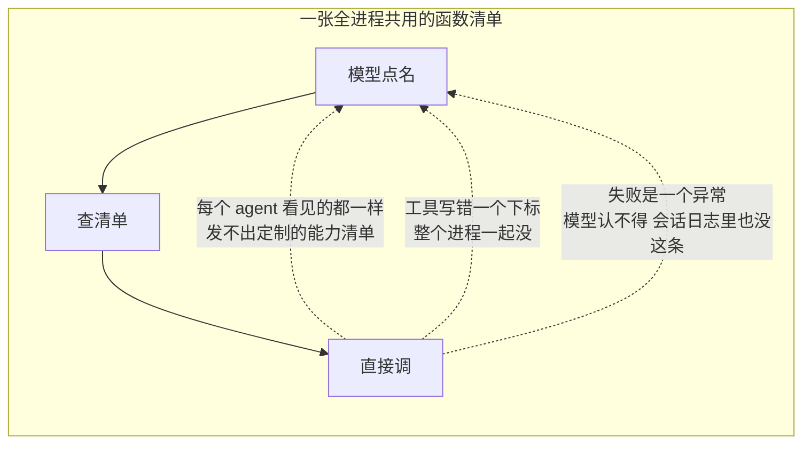

这个包做的是另一件事：

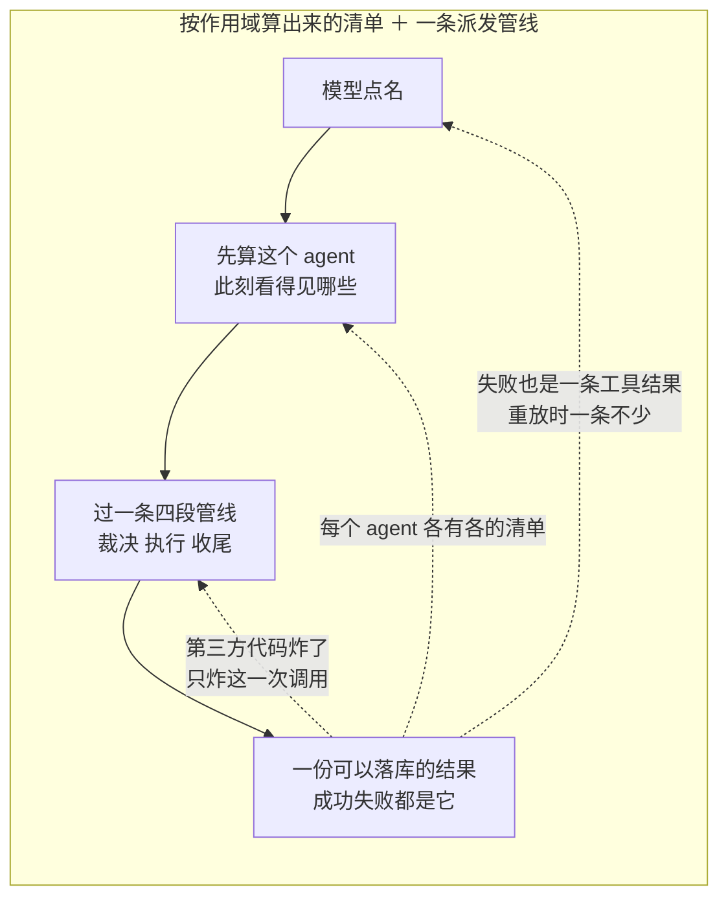

所以它只回答两个问题：

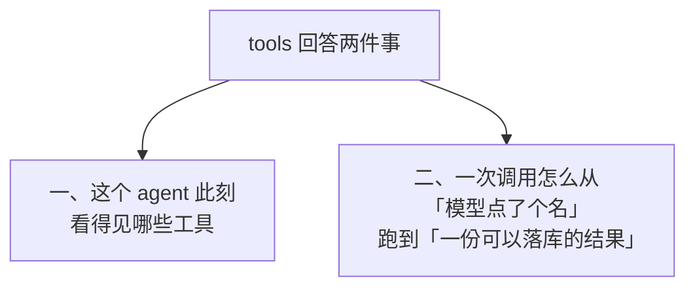

---

## 架构：六样东西，不会有第七样

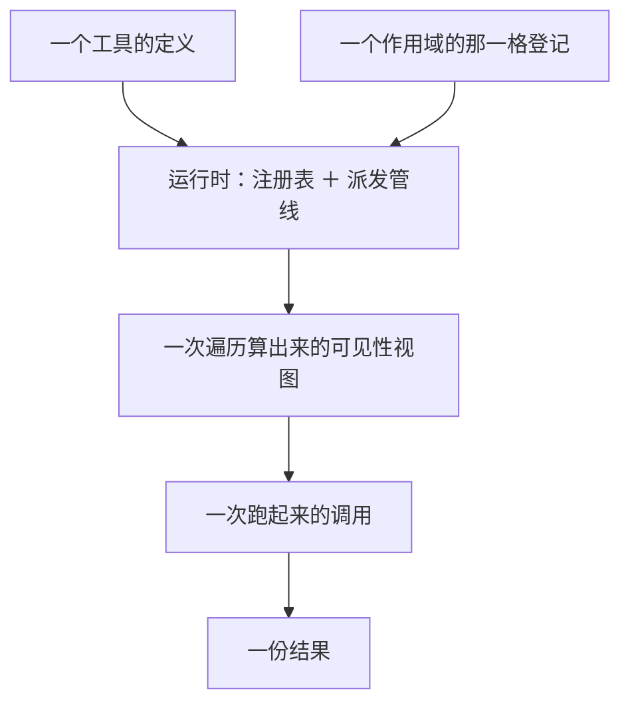

### 运行时手里握着什么

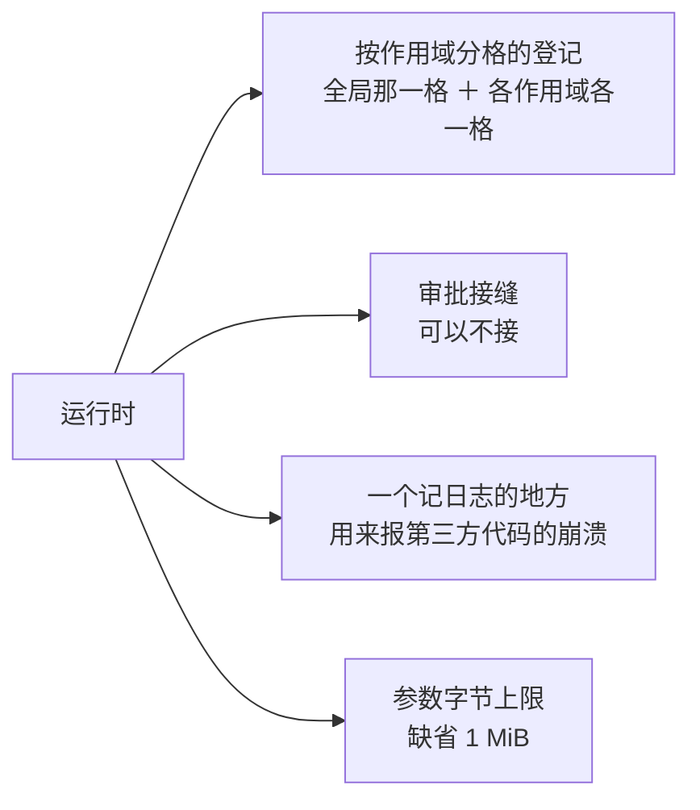

按作用域分格这件事不是本包发明的，是作用域那一层提供的现成能力，本包只是它十来个使用方之一。

### 一格登记里有七样东西

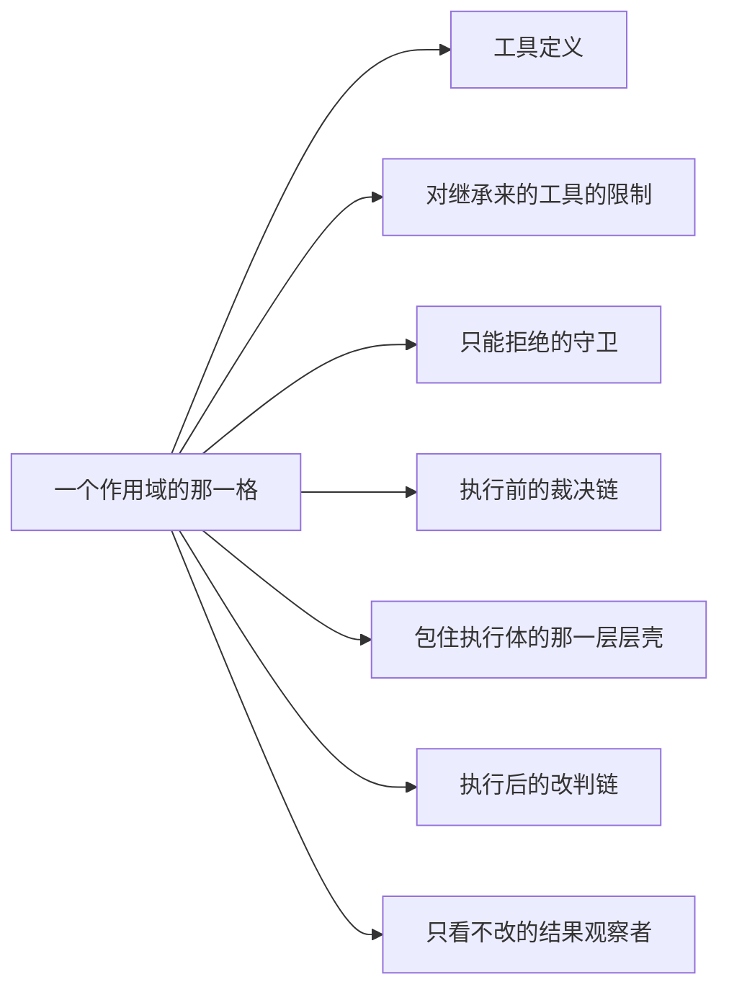

第一样是**具名的**，其余六样**不具名**：

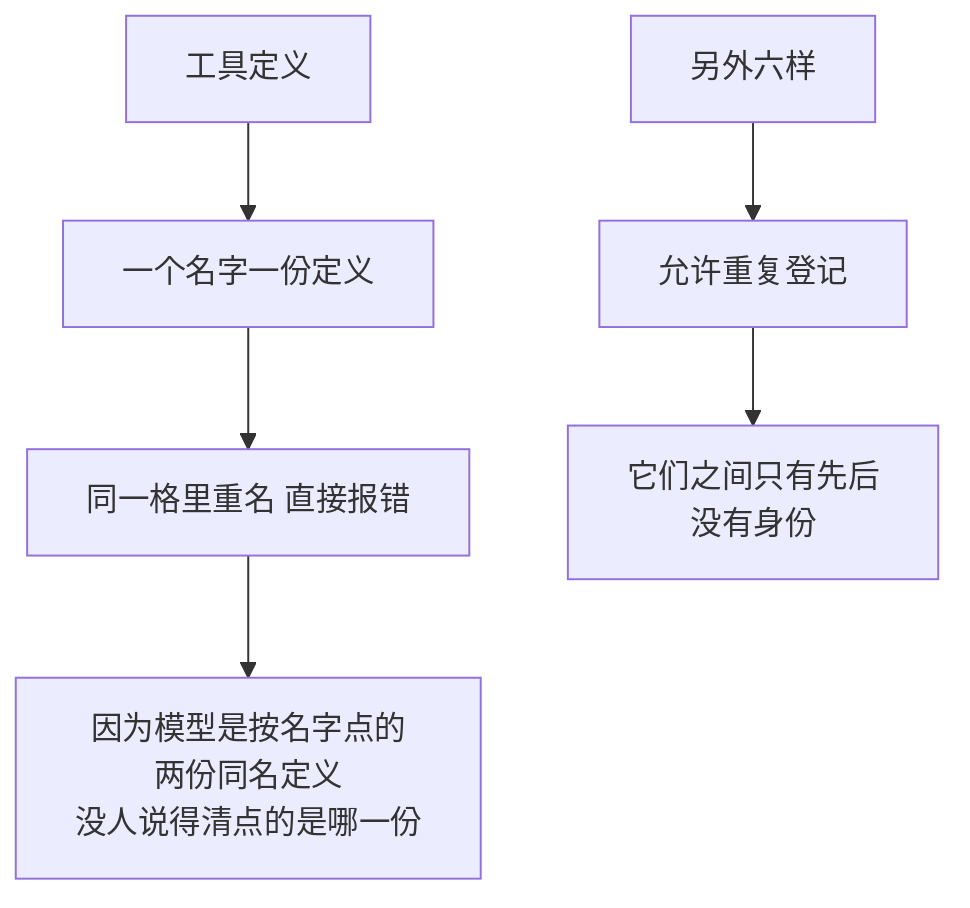

### 一个工具定义有十个字段，分三类

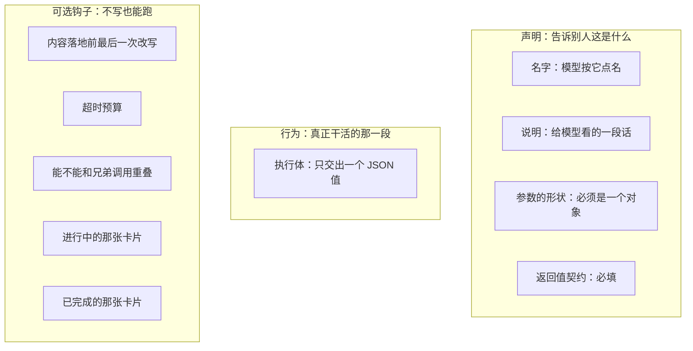

其中有四样**永远不会发给模型**：

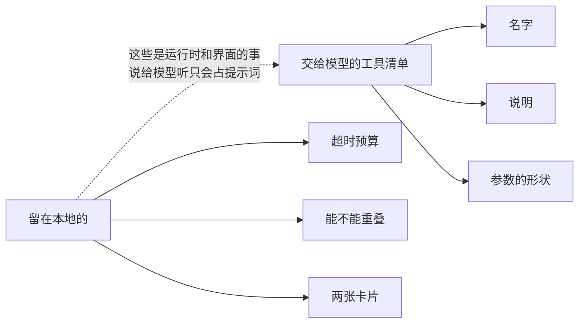

### 返回值契约为什么是必填的

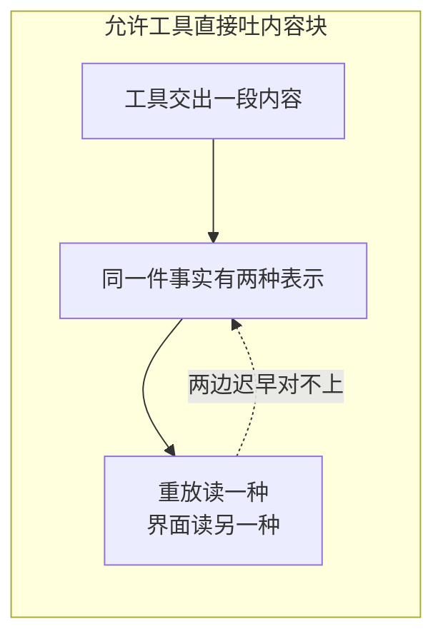

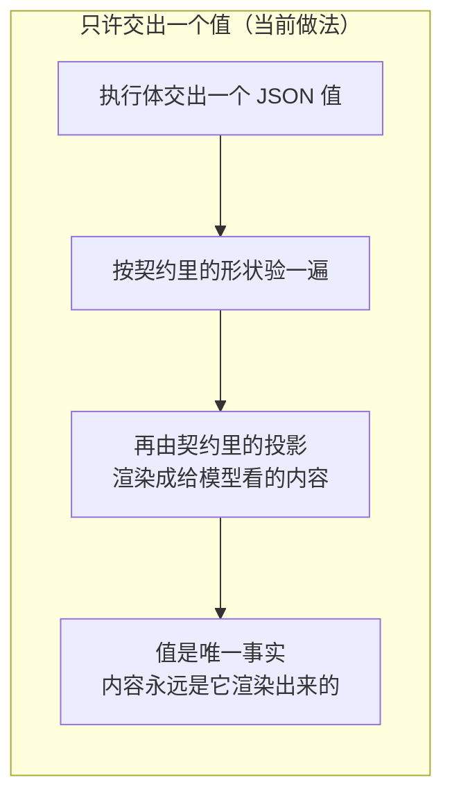

### 一次调用分四段


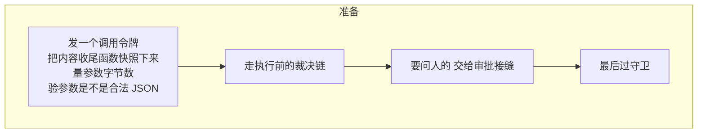

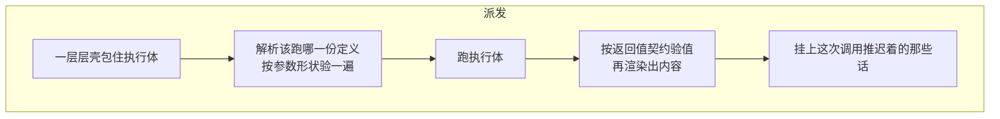

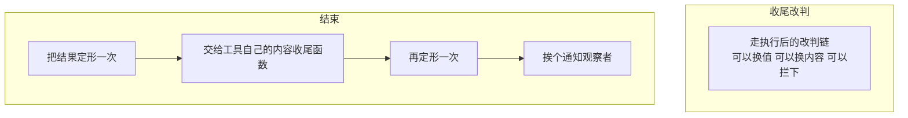

**为什么切成四段而不是一个函数**：


### 准备阶段有三个去向

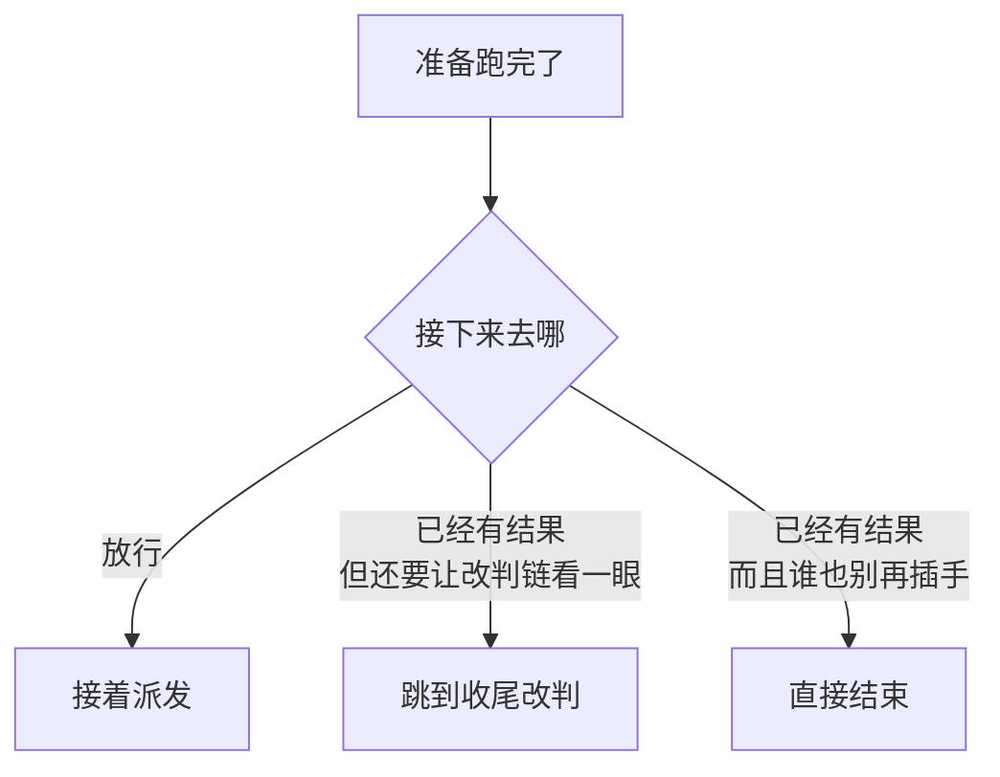

---

## 能力一：一个 agent 看得见哪些工具

一个进程里活着很多 agent，agent 挂在预设下面。工具、限制、守卫全都按这条链继承。

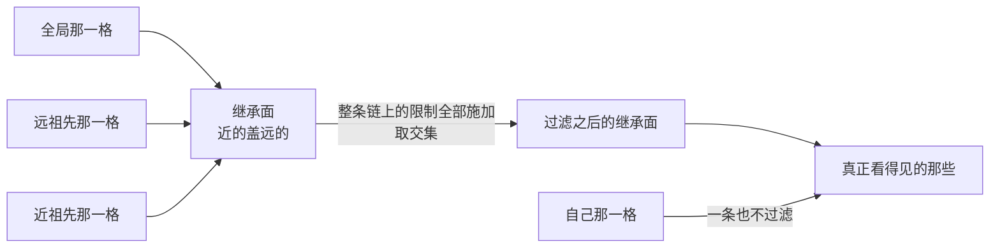

一次自下而上的遍历，同时算出四样东西：

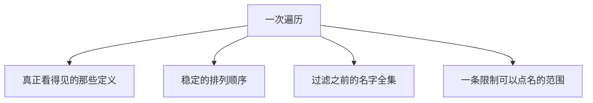

### 自己注册的不受限制影响

这条豁免是「按子 agent 发一份定制能力清单」能成立的前提：

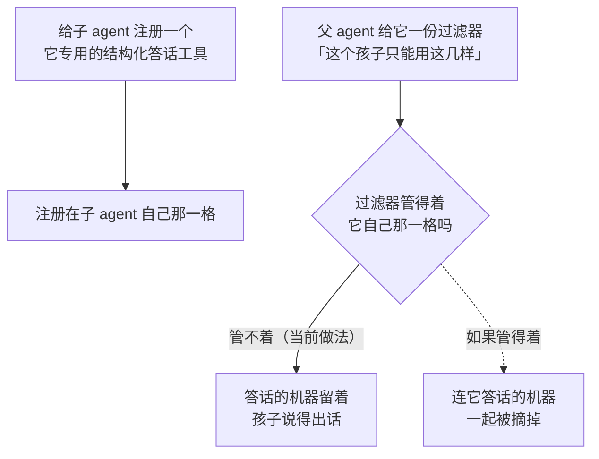

历史上有过一次读错：

```mermaid
flowchart LR
    subgraph WRONG["读成「全局那一格豁免」"]
        X1["工具都挂在宿主装配上时<br/>和「自己那一格豁免」看不出区别"] --> X2["等预设把工具搬到 agent 平面上"]
        X2 --> X3["它们变成了祖先的贡献"]
        X3 --> X4["于是子 agent 的过滤器<br/>悄悄地什么也不再约束"]
    end
```

```mermaid
flowchart LR
    subgraph RIGHT["读成「自己那一格豁免」（当前做法）"]
        Y1["不管工具挂在哪一层"] --> Y2["豁免的永远是<br/>这个作用域自己注册的那些"]
    end
```

### 顺序是对外可见的

```mermaid
flowchart LR
    subgraph BAD3["靠 map 的遍历顺序"]
        M1["每次装配排出来<br/>都是一个新顺序"] --> M2["工具清单进了提示词缓存的键"]
        M2 --> M3["每次都缓存未命中"]
    end
```

```mermaid
flowchart LR
    subgraph GOOD3["钉死一个顺序（当前做法）"]
        N1["继承面在前：<br/>远祖先到近祖先"] --> N2["自己注册的在后"]
        N2 --> N3["同名覆盖只改值 不挪位置"]
    end
```

### 同一个解析器喂三个出口

```mermaid
flowchart TD
    R["同一次遍历"] --> O1["按名字取一份定义"]
    R --> O2["交给模型的工具清单"]
    R --> O3["派发时解析该跑哪一份"]
    S1["如果分头算"] -.->|"提示词里写着有这个工具<br/>调过去说不认识"| S2["模型被骗一次"]
```

### 限制只能加在有身份的作用域上

```mermaid
flowchart TD
    A["要加一条限制"] --> B{"这个作用域有身份吗"}
    B -->|"有"| C["收下"]
    B -->|"没有"| D["拒绝"]
    D -.->|"一条没有身份的限制<br/>会盖住每一个 agent"| E["那件事该用<br/>「干脆不给它注册」来表达"]
```

### 空过滤器也被拒

```mermaid
flowchart LR
    A["一条什么都没点名的限制"] --> B["它什么也不做"]
    B --> C["而它出现的场合<br/>几乎总是一份配置<br/>化出来的空壳"]
    C --> D["与其静静地不生效<br/>不如当场报错"]
```

### 点名了不存在的全局工具，注册当场失败

```mermaid
flowchart TD
    A["一条限制点了几个名字"] --> B["拿「可以点名的范围」对一遍"]
    B --> C{"都对得上吗"}
    C -->|"是"| D["收下"]
    C -->|"否"| E["报错<br/>并把现有的名字列出来"]
    E -.->|"一个拼错的名字<br/>不该悄悄变成一条不生效的限制"| E
```

---

## 能力二：一切失败都是结果，不是错误

```mermaid
flowchart LR
    subgraph BAD4["失败走错误通道"]
        A1["工具炸了 / 参数不合法"] --> A2["返回一个错误"]
        A2 --> A3["会话日志里少了一条"]
        A3 --> A4["重放时那次调用悬在那儿<br/>没有配对的结果"]
    end
```

```mermaid
flowchart LR
    subgraph GOOD4["失败也是一份结果（当前做法）"]
        B1["工具炸了 / 参数不合法"] --> B2["一份标着「这是错误」的结果"]
        B2 --> B3["和成功那份在日志里<br/>是同一种东西"]
        B3 --> B4["重放一条不少"]
    end
```

理由只有一句：这条管线的出口是**模型**，而模型只认得工具结果，认不得 Go 的错误。

### 九种失败各自的分类码

```mermaid
flowchart TD
    F["一次调用失败了"] --> G{"哪一类"}
    G --> C1["点名了看不见的工具<br/>→ UNKNOWN_TOOL"]
    G --> C2["参数不是合法 JSON<br/>或不符合参数形状<br/>→ INVALID_ARGS"]
    G --> C3["参数超过字节上限<br/>→ INVALID_ARGS"]
    G --> C4["交出的值不符合返回值契约<br/>→ INVALID_TOOL_OUTPUT"]
    G --> C5["schema 自身超出支持的子集<br/>→ UNSUPPORTED_SCHEMA"]
    G --> C6["执行体已经起步 中途被取消<br/>→ ABORTED"]
    G --> C7["执行体还没起步就被取消<br/>→ ABORTED_BEFORE_DISPATCH"]
    G --> C8["执行前的裁决或守卫拒绝<br/>→ 不带分类码"]
    G --> C9["执行后的改判拦下<br/>→ 不带分类码"]
```

最后两种为什么不带分类码：

```mermaid
flowchart LR
    A["拒绝的理由是<br/>策略现写的一句话"] --> B["不是一个有身份的错误类"]
    B --> C["硬安一个分类码<br/>等于给它一个假身份"]
```

### 第三方代码的崩溃兜在六处

```mermaid
flowchart TD
    subgraph FATAL["兜住之后变成这次调用的失败"]
        P1["执行体"]
        P2["把值渲染成内容"]
        P3["把值渲染成附带说明"]
        P4["判断能不能并行"]
    end
    subgraph SIDE["兜住之后只记一条日志 不改结果"]
        P5["内容收尾函数"]
        P6["结果观察者"]
    end
    SIDE -.->|"它们是旁路<br/>不该让一次成功的调用失败"| SIDE
```

为什么要兜：

```mermaid
flowchart LR
    A["Go 的惯例是<br/>不跨越任意代码兜崩溃"] --> B["但这里跑的是<br/>第三方注册进来的工具"]
    B --> C["而这个进程同时服务多个会话"]
    C --> D["一个工具写错下标<br/>代价不该是所有会话一起死"]
```

---

## 能力三：五个扩展点

```mermaid
flowchart TD
    E1["执行前裁决"] --> E1a["放行 / 拒绝 / 问人"]
    E2["包住执行体的那一层壳"] --> E2a["超时、重试、埋点"]
    E3["执行后改判"] --> E3a["换值 或 换内容 或 拦下"]
    E4["结果观察者"] --> E4a["只看 改不了"]
    E5["守卫"] --> E5a["只能拒绝"]
```

### 顺序

```mermaid
flowchart LR
    A["先全局那一格"] --> B["再从最远的祖先<br/>一路到自己"]
    B --> C["同一格里 先登记的在外层"]
```

```mermaid
flowchart TD
    A["外层那一条"] --> B{"它调不调下一条"}
    B -->|"调了"| D["内层接着跑"]
    B -->|"没调"| F["短路：后面登记的<br/>一条都不跑"]
```

### 守卫是单调的

```mermaid
flowchart LR
    subgraph BAD5["如果守卫也能放行"]
        A1["先跑的守卫拒了"] --> A2["后跑的守卫改回允许"]
        A2 --> A3["结果取决于注册顺序"]
        A3 -.->|"而注册顺序是装配时<br/>不小心决定的"| A3
    end
```

```mermaid
flowchart LR
    subgraph GOOD5["守卫只能拒绝（当前做法）"]
        B1["谁拒了就是拒了"] --> B2["注册顺序影响不了结果"]
        B2 --> B3["会放行的那种表态<br/>在执行前裁决链上<br/>那条链本来就是可扩展的"]
    end
```

### 执行前裁决没有「改写入参」这一档

```mermaid
flowchart LR
    A["参数到这里之前"] --> B["已经落进会话日志"]
    A --> C["已经呈现给用户看了"]
    B --> D["此时再改"]
    C --> D
    D --> E["日志里记的<br/>和真正跑的<br/>就是两回事"]
```

### 执行后改判不能同时换值和换内容

```mermaid
flowchart TD
    A["一次改判"] --> B{"给了什么"}
    B -->|"只换值"| C["重新按契约验<br/>重新渲染出内容"]
    B -->|"只换内容"| D["值不动"]
    B -->|"两个都给"| E["当场变成这次调用的失败"]
    E -.->|"会有两份内容<br/>争同一个位置"| E
    B -->|"给一份失败结果<br/>还想换值"| G["也不行：失败本来就没有值"]
```

### 被拦下的调用不该把自己想说的话捎出去

```mermaid
flowchart LR
    A["工具执行时推迟着<br/>想附带说几句"] --> B{"这次调用被拦下了吗"}
    B -->|"拦下了"| C["那几句全丢掉<br/>只留裁决里显式给的"]
    B -->|"没拦"| D["照常带上"]
```

### 那层壳必须从拿到的那个取消链派生

```mermaid
flowchart LR
    subgraph BAD6["传一个不相干的取消链进去"]
        A1["壳自己造一个新的"] --> A2["调用方的取消传不进来"]
        A2 --> A3["外面按了取消<br/>里面照跑不误"]
    end
```

```mermaid
flowchart LR
    subgraph GOOD6["从拿到的那个派生（当前做法）"]
        B1["想缩短期限就派生一个"] --> B2["取消仍然一路传得到底"]
    end
```

这是这条规矩唯一挡不住、也唯一不许犯的错。

### 扩展点的登记不发变更通知

```mermaid
flowchart TD
    A["注册一个工具 / 加一条限制"] --> B["发变更通知<br/>系统提示要重算"]
    C["登记守卫和四条链"] --> D["不发"]
    D -.->|"它们不改变「看得见什么」<br/>只改变「能不能跑」"| D
```

---

## 能力四：把一份结果定形

### 判据是「值变没变」，不是「这份结果是不是本包造的」

```mermaid
flowchart TD
    A["壳交回来一份结果"] --> B{"里面的值<br/>和本包最近验过的那个<br/>一样吗"}
    B -->|"一样"| C["原样放行<br/>壳对内容的改写被保留"]
    B -->|"不一样"| D["按契约重新验、重新渲染<br/>壳自己写的内容在这里丢掉"]
    D -.->|"内容必须是「那个值」<br/>渲染出来的"| D
```

为什么不能按出身判：

```mermaid
flowchart LR
    subgraph BAD7["按出身判"]
        A1["记住哪些结果是原件"] --> A2["一个壳复制一份<br/>再改个字段"]
        A2 --> A3["复制件和原件<br/>在 Go 里完全一样"]
        A3 --> A4["认不出来"]
    end
```

原来那套 TypeScript 代码靠的是 JS 的对象身份，那条路在 Go 这边立不住——Go 的结构体是值。

### 定形做两遍

```mermaid
flowchart LR
    A["先定形一次"] --> B["交给工具的内容收尾函数"]
    B --> C["再定形一次"]
    A -.->|"收尾函数拿到的<br/>必须是一份已经定形的结果<br/>它据此决定改不改"| B
    C -.->|"它改完那份<br/>才是真正要落库的"| C
```

### 收尾函数在调用开始时就快照下来

```mermaid
flowchart TD
    subgraph BAD8["收尾时现取"]
        A1["调用跑到一半"] --> A2["别的代码把这个工具注销了<br/>换上另一份同名定义"]
        A2 --> A3["收尾时取到的是新那份"]
        A3 --> A4["这次调用的结尾<br/>归了另一个工具管"]
    end
```

```mermaid
flowchart LR
    subgraph GOOD8["开始时快照（当前做法）"]
        B1["调用一起步就把它取下来"] --> B2["中途注册表怎么变<br/>这次调用照开始那份走完"]
    end
```

### 每个观察者拿到自己那一份副本

```mermaid
flowchart TD
    A["一份结果里的<br/>内容树、值、卡片载荷、附带的话"] --> B["全是切片"]
    B --> C["Go 的结构体赋值复制不到它们"]
    C --> D{"如果只发同一份"}
    D --> E["第一个观察者改了<br/>会串到第二个"]
    C --> F["所以挨个复制一份再发"]
```

### 并发判定失败即独占

```mermaid
flowchart TD
    A["这次调用能和兄弟重叠吗"] --> B{"问得出答案吗"}
    B -->|"工具看不见"| C["独占"]
    B -->|"没声明能不能重叠"| C
    B -->|"判定自己崩了"| C
    B -->|"明确说了能重叠"| D["可以并行"]
```

```mermaid
flowchart LR
    A["错判成独占"] --> B["只是慢一点"]
    C["错判成并行"] --> E["两次调用同时改同一份状态"]
    E -.->|"两种错的代价不对称<br/>所以往安全那边倒"| B
```

并行是一项需要工具**明确认领**的能力，不是默认待遇。

---

## schema 是一个受限子集

```mermaid
flowchart TD
    N["一份 schema 能写的东西"] --> C8["八个约束关键字：<br/>类型、多选一、属性、必填、<br/>额外属性、元素、枚举、定值"]
    N --> A4["四个注解：<br/>说明、标题、缺省值、例子"]
```

子集是故意的：

```mermaid
flowchart LR
    A["这两份 schema<br/>会原样发给模型提供方"] --> B["各家支持的关键字并不一致"]
    B --> C["限制在这八个上<br/>是「每一家都认得」<br/>和「本包验得动」的交集"]
```

### 键序是语义，不是格式

```mermaid
flowchart LR
    subgraph BAD9["属性用 map 装"]
        A1["Go 的 map 没有顺序"] --> A2["同一份 schema<br/>每次排出来都不一样"]
        A2 --> A3["它进了提示词缓存的键"]
        A3 --> A4["缓存再也命不中"]
    end
```

```mermaid
flowchart LR
    subgraph GOOD9["属性用切片装 ＋ 钉死键顺序（当前做法）"]
        B1["同一份 schema"] --> B2["每次排出来一模一样"]
    end
```

### 定义在注册时就验完，不留到调用时

```mermaid
flowchart TD
    A["注册一个工具"] --> B["当场验六件事：<br/>名字非空、有执行体、<br/>参数形状是对象、<br/>给了渲染投影、<br/>返回值 schema 成立、<br/>超时预算非负"]
    B --> C{"都过了吗"}
    C -->|"是"| D["收下"]
    C -->|"否"| E["注册失败"]
```

```mermaid
flowchart LR
    subgraph BAD10["留到调用时才炸"]
        A1["一份写错的定义<br/>顺利注册进去"] --> A2["等模型真的调它<br/>甚至等装系统提示时才炸"]
        A2 --> A3["报错的位置<br/>离写错的地方隔了很远"]
    end
```

### 「没写这个关键字」和「写了但是空的」是两件事

```mermaid
flowchart LR
    A["零值"] --> A1["表示没写这个关键字"]
    B["一个非空指向的空集合"] --> B1["表示写了一个空的"]
    C["JSON Schema 里"] -.->|"属性缺席 和 属性写成空<br/>本来就是有区别的"| C
```

### 只验 Go 的类型系统兜不住的那几条

```mermaid
flowchart TD
    A["Go 编译期就挡掉的"] --> A1["拼错的关键字"]
    A --> A2["说明写成非字符串"]
    A --> A3["类型写成一个数组"]
    B["只能运行时验的九条"] --> B1["元素定义成了环"]
    B --> B2["类型和多选一同时给"]
    B --> B3["多选一不足两支<br/>或旁边还并排挂着别的约束"]
    B --> B4["类型取值越界"]
    B --> B5["关键字挂在了对不上的类型上"]
    B --> B6["必填点名了不存在的属性"]
    B --> B7["枚举或定值和类型对不上"]
    B --> B8["注解不是合法 JSON"]
    B --> B9["同一个属性名写了两遍"]
```

### 违规说明保持英文

```mermaid
flowchart LR
    A["参数不合法 / 返回值不合法"] --> B["拼成一句说明<br/>作为工具结果回给模型"]
    B --> C["读它的是模型 不是人"]
    C --> D["所以保持英文<br/>让模型自己改了重试"]
```

---

## 参数有字节上限

缺省 1 MiB，配成负数表示不设限。

```mermaid
flowchart TD
    A["一份参数可能来自哪儿"] --> A1["模型写的"]
    A --> A2["协议层递进来的"]
    A --> A3["子 agent 递进来的"]
    A --> A4["回放"]
    A --> A5["一个直接调派发的 HTTP 处理器"]
    A2 -.->|"没有哪一条路<br/>保证它是模型写的"| A1
```

```mermaid
flowchart LR
    A["一份没有上限的参数"] --> B["被完整拷进执行对象"]
    B --> C["写进会话事件"]
    C --> D["再进模型历史"]
    D -.->|"这一路上原本<br/>没有任何一处会拦它"| A
```

原来那套 TypeScript 代码没有这道上限——它的参数是模型响应解出来的对象，尺寸受制于模型自己的输出上限。本仓库是**服务端**运行时，那个前提不成立。

### 尺寸检查先于形状检查

```mermaid
flowchart LR
    A["一份几十兆的载荷"] --> B["先量字节数"]
    B --> C{"超了吗"}
    C -->|"超了"| D["当场拒绝"]
    C -->|"没超"| E["再走一遍 JSON 合法性"]
    D -.->|"不该先被整个解析一遍<br/>才被拒"| E
```

---

## 呈现只有词汇，没有逻辑

工具交出两张卡片的**意图**，界面照着渲染。这一块里一行判断都没有。

```mermaid
flowchart TD
    A["两族封闭的种类：<br/>进行中的卡片、已完成的卡片"] --> B["判别标签是接口上的方法"]
    B --> C["改不掉"]
    D["如果落成结构体字段"] -.->|"字段可写<br/>一个能被改掉的判别标签<br/>等于没有"| C
```

结果那一族走的是另一条路：

```mermaid
flowchart LR
    A["成功和失败<br/>共有一大堆字段"] --> B["落成两族接口的话<br/>每一支都得把共有字段再写一遍"]
    B --> C["所以它是一个结构体<br/>加一个判别字段"]
```

### 两张卡片必须是纯函数

```mermaid
flowchart LR
    A["界面会在两种场合调它们"] --> A1["实时流式"]
    A --> A2["会话重放"]
    A1 --> B["所以只能依赖参数<br/>不能依赖此刻的任何环境"]
    A2 --> B
```

### 卡片载荷只在顶层调用上算

```mermaid
flowchart TD
    A["一次调用"] --> B{"它是顶层的吗"}
    B -->|"是"| C["算出卡片载荷"]
    B -->|"否：嵌在一个复合工具下面"| D["不算"]
    D -.->|"它没有自己的卡片<br/>算出来的东西没地方显示"| D
```

---

## 生命周期与并发

### 注册表的寿命挂在作用域上

```mermaid
flowchart LR
    A["一个作用域释放"] --> B["它那一格里的七样东西<br/>一起消失"]
    B --> C["不需要谁去逐条注销"]
    D["每次登记都返回一个撤销动作"] --> E["预设换代之后<br/>不会留下上一代的工具"]
```

### 一次调用用的是快照，不是当前注册表

```mermaid
flowchart TD
    A["调用起步"] --> B["取一份可见性视图"]
    A --> C["把内容收尾函数快照下来"]
    B --> D["中途有人注销了这个工具"]
    C --> D
    D --> E["这次调用照开始那份走完"]
```

### 一批同时跑几个不归本包管

```mermaid
flowchart LR
    A["本包只答一句：<br/>这一次调用能不能<br/>和兄弟重叠"] --> B["一批能同时跑几个<br/>由 agent 循环定"]
```

### 取消的三条规矩

```mermaid
flowchart LR
    A["取消到了"] --> B{"执行体起步了吗"}
    B -->|"起步了"| C["等它自己收敛<br/>再把结果换成中止"]
    B -->|"没起步"| D["直接给一份中止结果"]
    C -.->|"本包杀不掉<br/>同进程里的代码"| C
```

```mermaid
flowchart TD
    A["报哪一种中止<br/>看执行体起没起步"] --> B["没起步：<br/>ABORTED_BEFORE_DISPATCH"]
    A --> C["起步了：<br/>ABORTED"]
    B -.->|"读日志的人<br/>要分得出这两件事"| C
```

```mermaid
flowchart LR
    A["一个复合工具<br/>已经派发出去的子调用<br/>捎回来几句话"] --> B["外层被取消了"]
    B --> C["那几句话跟着中止结果一起走"]
    C -.->|"它们是已经发生过的事实<br/>不会因为外层被取消<br/>就变得不曾说过"| C
```

### 「派发前中止」这份结果是导出的

```mermaid
flowchart LR
    subgraph BAD11["两处各手写一遍"]
        A1["本包写一份"] --> A2["agent 循环那边<br/>给根本没轮到的调用<br/>再手写一份"]
        A2 --> A3["两处一旦对不上"]
        A3 --> A4["日志里出现两种措辞的<br/>「派发前中止」"]
    end
```

```mermaid
flowchart LR
    subgraph GOOD11["本包导出一份 大家都用它（当前做法）"]
        B1["只有一处造它"] --> B2["日志里只有一种措辞"]
    end
```

---

## 失败语义

```mermaid
flowchart TD
    A["出岔子了"] --> B{"是装配期还是调用期"}
    B -->|"装配期：注册、加限制、登记扩展点"| C["返回错误<br/>这些都是编程错误<br/>就该在装配时炸"]
    B -->|"调用期：任何一种失败"| D["不返回错误<br/>返回一份标着「这是错误」的结果"]
```

| 什么时候 | 返回什么 | 调用方该做什么 |
|---|---|---|
| 定义不合法（名字、执行体、schema、超时预算） | 「定义不合法」这一类错误 | 改定义 |
| 限制点名了不存在的全局工具 | 「限制不合法」这一类错误 | 对照报错里列出的现有名字 |
| 在没有身份的作用域上加限制 | 「限制不合法」这一类错误 | 用那个 agent 自己的作用域 |
| 一条什么都没点名的限制 | 「限制不合法」这一类错误 | 至少点名一样 |
| 登记一条空的规则或守卫 | 普通错误 | 补上参数 |
| 同一格里重名注册 | 重名错误 | 换名字，或改用那个 agent 的作用域 |
| **一次调用的任何失败** | **不返回错误** | 读结果上的「是不是错误」和那份分类 |

---

## 能力边界

```mermaid
flowchart TD
    Y["这个包做的"] --> Y1["按作用域链算出<br/>「这个 agent 看得见哪些」<br/>含限制取交集与自有那一格豁免"]
    Y --> Y2["一份定义在注册时的完整性校验"]
    Y --> Y3["一个受限 JSON Schema 子集：<br/>解析、自检、按它验一个值"]
    Y --> Y4["四段派发管线、四条链、<br/>一道单调守卫、一道审批接缝"]
    Y --> Y5["把每一种失败规范成<br/>一份带机器可读分类码的结果"]
    Y --> Y6["兜住第三方工具代码的崩溃"]
    Y --> Y7["一套只有词汇没有逻辑的呈现意图"]
```

```mermaid
flowchart TD
    N["这个包不做的"] --> N1["不提供任何具体工具<br/>一个都没有"]
    N --> N2["不做鉴权<br/>注册不是授权<br/>审批只决定这一次放不放行"]
    N --> N3["不实现审批<br/>那是一个接缝 实现在别处"]
    N --> N4["不执行超时预算<br/>那由一条包住执行体的规则做"]
    N --> N5["不决定并行度<br/>一批同时跑几个由 agent 循环定"]
    N --> N6["不强杀不合作的执行体<br/>取消是协作式的"]
    N --> N7["不做 run_code<br/>那一整块有意不移"]
```

---

## 引用它的包

26 个包在非测试代码里引用它。

```mermaid
flowchart TD
    A["用哪一面"] --> A1["注册工具：13 处"]
    A --> A2["构造一份定义：14 个包"]
    A --> A3["包住执行体：2 处"]
    A --> A4["执行后改判：2 处"]
    A --> A5["结果观察：2 处"]
    A --> A6["执行前裁决：1 处"]
    A --> A7["加限制：1 处"]
    A --> A8["守卫：1 处"]
    A --> A9["四段管线：1 处"]
```

三处值得记的事实：

```mermaid
flowchart LR
    A["注册是最常见的用法"] --> B["13 个包注册工具"]
    C["扩展点是最少见的"] --> D["五个扩展点加起来<br/>只有 9 处登记<br/>分布在 8 个包里"]
```

```mermaid
flowchart LR
    A["四段管线只有一个消费方"] --> B["agent 循环<br/>用它做并行调度"]
    C["把四段串起来的<br/>那个便利入口"] --> D["非测试代码里<br/>一次都没用过"]
```

```mermaid
flowchart TD
    A["交给模型的工具清单投影"] --> B["目前没有调用方"]
    C["过滤之前的名字全集"] --> B
    B --> D["因为系统提示装配那边<br/>从它自己那份工具来源里拿清单"]
    D --> E["两侧之间的接线还不存在"]
```

---

## 对应的 DSH 能力

下表由 [`docs/packages.md`](../packages.md) 与 [能力覆盖表](../portmap/capability-coverage.tsv) 机器 join 得到：本篇覆盖的 Go 包，承接的是上游 DSH 的哪几条能力，以及各自还缺什么。落点列由源码里的 `// 源:` 注释反查，不是手写的。

| 上游能力 | DSH 包 | 裁决 | 落在哪个 Go 包 | 这里缺什么 |
|---|---|---|---|---|
| agent唯一具体实现和循环驱动器，驱动会话、轮次和步骤的生命周期 | `core/agent-loop` | 需要 | `tools` | — |
| 工具注册表与执行流水线，定义工具schema、执行和呈现方式 | `core/tools` | 需要 | `tools` | — |
| 与通道无关的一次性审批seam，request返回allowed-once/rejected/cancelled/unavailable | `interaction/user-approval` | 需要 | `tools` | — |

## 相关源码

| 路径 | 内容 | 行数 |
|---|---|---|
| `tools/definition.go` | 工具、调用、结果三样东西的形状，以及五个错误类型 | 466 |
| `tools/runtime.go` | 注册表：有什么工具、一个作用域看得见哪些 | 562 |
| `tools/pipeline.go` | 派发管线：四段、四条瀑布、审批接缝 | 962 |
| `tools/jsonschema.go` | 受限 JSON Schema 子集：能写什么、一份 schema 自己合法吗 | 732 |
| `tools/jsonvalue.go` | 拿一个值按 schema 验一遍，列出违规说明 | 243 |
| `tools/presentation.go` | 一次调用和一份结果在界面上的样子 | 384 |

---

## 深入阅读

[作用域](scope.md) · [Agent](agent.md) · [用户交互](interaction.md) · [运行时 Guard](guards.md) · [计划与待办](planning.md) · [MCP 客户端](mcp.md)
