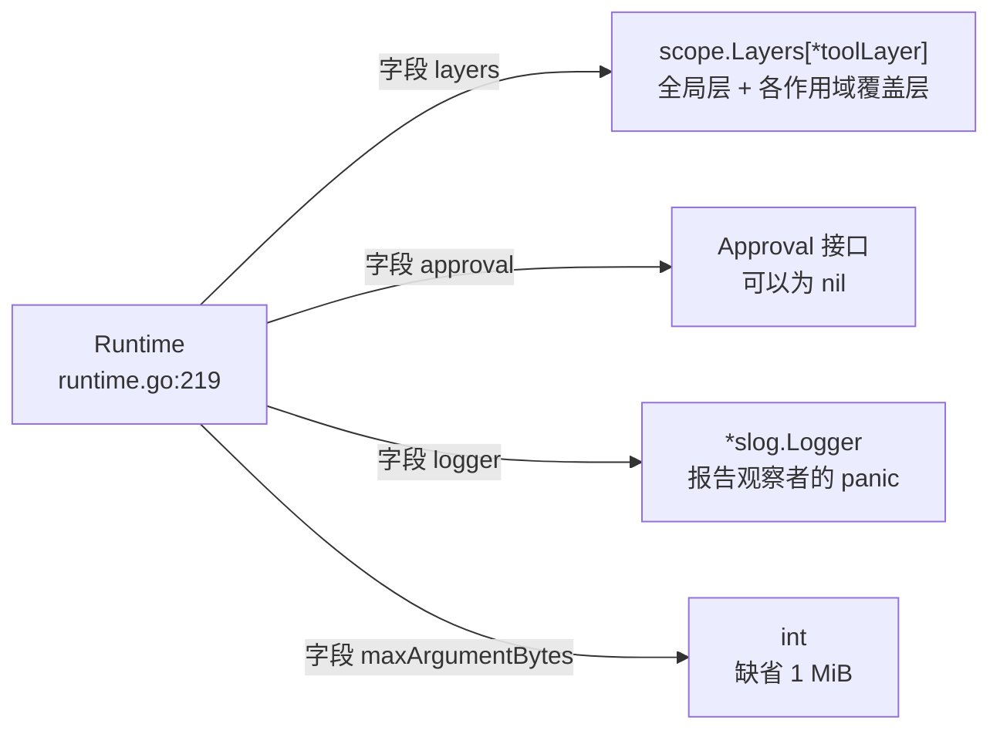
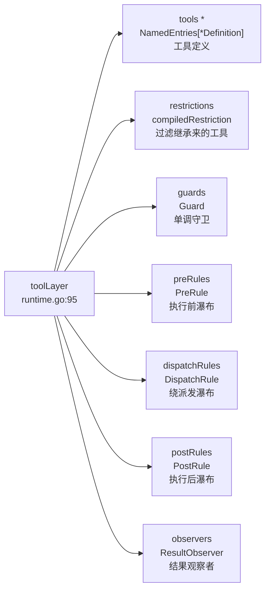
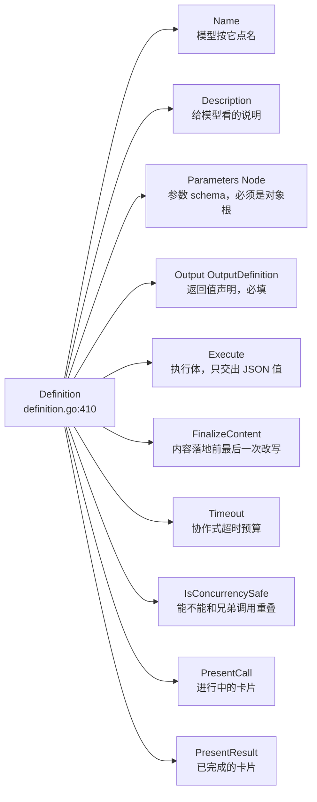
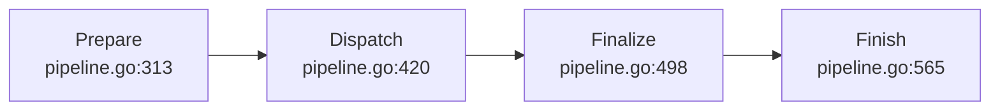
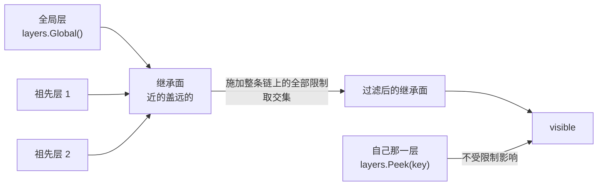

# tools

本文只讲 `tools` 一个包。用它注册进去的那些工具——todo、goal、schedule、MCP 桥接、子 agent 控制、技能调用——各有各的文档，不在这里。审批的实现方 `feature/interaction/userapproval`、超时和重复提醒 `guard/*` 同理。

---

## 它管什么

两件事，就这两件：

1. **一个 agent 能看见哪些工具。**
2. **一次调用怎么从「模型点了个名」跑到「一份可以落库的结果」。**

---

## 对象和关系

六个对象，后面不会再出现第七个。

| 对象 | 是什么 | 位置 |
|---|---|---|
| `Definition` | 一个工具的定义，10 个字段 | `definition.go:410` |
| `Runtime` | 注册表加派发管线，4 个字段 | `runtime.go:219` |
| `toolLayer` | 一个作用域在注册表里的全部贡献，7 张表 | `runtime.go:95` |
| `view` | 一次层遍历算出来的可见性视图，4 个字段 | `runtime.go:394` |
| `RunContext` | 一次调用跑起来之后的执行对象 | `definition.go:261` |
| `Result` | 一次调用的结果，成功失败都是它 | `definition.go:316` |

### 一、Runtime 持有什么

`layers` 就是 `scope` 提供的那张 `map[*scope.Key]*toolLayer`。`tools` 是它 10 个使用方之一。

### 二、toolLayer 的 7 张表

带 `*` 的 `tools` 是**具名表**——一个名字一份定义，同层重名报错。其余六张是**匿名表**，允许重复，只讲先后。

### 三、Definition 的 10 个字段

前四个是**声明**，第五个是**行为**，后五个是**可选钩子**。`Timeout`、`IsConcurrencySafe` 和两个 `Present*` 永远不会发给模型；`Schemas()` 只投影 `Name`、`Description`、`Parameters` 三样（`runtime.go:520`）。

`Output` 是必填的。「工具直接返回内容块」这条路本包不提供——那样一来同一件事实就有两种表示，重放和呈现各读一种。执行体交出的每一个值都按 `Output.Schema` 验一遍，再由 `Output.Render` 投影成给模型看的内容。

### 四、一次调用的四段

每一段内部：

```mermaid
graph TD
  subgraph S1["Prepare"]
    a1["createExecution<br/>发 token、快照 FinalizeContent、查参数字节数、验参数是合法 JSON"]
    a2["执行前瀑布 preRules"]
    a3["PreAsk 交给 Approval"]
    a4["守卫 guards"]
    a1 --> a2 --> a3 --> a4
  end
  subgraph S2["Dispatch"]
    b1["绕派发瀑布 dispatchRules"]
    b2["解析定义、按 Parameters 验参数"]
    b3["跑 Execute"]
    b4["按 Output.Schema 验值、Render 出内容"]
    b5["挂上 DeferContext 攒的上下文"]
    b1 --> b2 --> b3 --> b4 --> b5
  end
  subgraph S3["Finalize"]
    c1["执行后瀑布 postRules"]
  end
  subgraph S4["Finish"]
    d1["materialize 定形"]
    d2["FinalizeContent 改一次内容"]
    d3["再 materialize 一次"]
    d4["通知 observers"]
    d1 --> d2 --> d3 --> d4
  end
```

`Prepare` 交出的 `Preparation.Kind` 有三个去向（`pipeline.go:252-259`）：`StageDispatch` 继续派发、`StagePostResult` 已经有结果但还要过执行后瀑布、`StageFinalResult` 已经有结果且直接收尾。

### 五、可见性怎么算出来

`viewOf`（`runtime.go:423`）一次层遍历算出四样东西：`visible`（真正看得见的定义）、`order`（稳定顺序）、`knownNames`（过滤之前的名字全集）、`restrictableNames`（一条限制可以点名的全局工具名）。

---

## 能力一：算出一个作用域能看见哪些工具

一个进程里活着很多 agent，agent 挂在预设下面。工具、限制、守卫全都按这条链继承。

**自己注册的不受限制影响。** 继承面要过整条链上的全部限制，但这个作用域自己那一层注册的工具直接盖上去，一条也不过滤。这条豁免是「按子 agent 发能力清单」能成立的前提：`feature/subagent/inprocessdriver` 把子 agent 的结构化输出工具注册进子 agent 自己那一层（`structured.go:226`），而 `feature/subagent/childagent.go:248` 那份点名「这个孩子能用哪些能力」的过滤器绝不能把它答话用的机器一起摘掉。

`deepseek-harness-dsh-v0.1.2-alpha.3` 之前的版本把这条豁免读成「全局层豁免」而不是「自己那层豁免」。工具都挂在宿主装配里时两者等价；等预设把工具搬到 agent 平面上，它们就变成了**祖先**贡献，于是子 agent 的过滤器悄悄地什么也不再约束。本包按订正后的语义实现。

**顺序是对外可见的。** `view.order` 是一个切片而不是靠 map 的遍历顺序：给模型的工具清单顺序会进提示词缓存的键，每次装配换一个顺序等于每次都缓存未命中。继承面在前（远祖先到近祖先），自己注册的在后；同名覆盖只改值，不挪位置。

**同一个解析器喂三个出口。** `Get()`、`Schemas()`、以及派发时解析该跑哪一份定义，全走 `viewOf`。三者共用不是省事，是必须：模型看到的清单和真正能跑的清单一旦分头算，就会出现「提示词里写着有这个工具，调过去说不认识」。

**限制只能加在有身份的作用域上。** `Restrict` 拒绝没有身份的作用域（`runtime.go:328`）——一次全局的限制会盖住每一个 agent，那件事应该由「不给它注册」来表达。空过滤器也被拒绝：`Restriction{}` 什么也不做，而它出现的场合几乎总是一份配置化出来的空结构体。

**点名了不存在的全局工具，注册当场失败。** `Restrict` 拿 `restrictableNames` 对一遍 `Allow` 和 `Deny`，对不上就报错并列出现有的全局工具名（`runtime.go:341-352`）。

---

## 能力二：一切失败都是结果，不是错误

`Runtime.Execute` 不返回 error。下面每一种都变成 `IsError` 为真的一份 `Result`：

| 失败 | 代号 | 造它的地方 |
|---|---|---|
| 点名了看不见的工具 | `UNKNOWN_TOOL` | `NotFoundError`，`definition.go:64` |
| 参数不是合法 JSON、或不符合 `Parameters` | `INVALID_ARGS` | `ArgsError`，`definition.go:122` |
| 参数超过字节上限 | `INVALID_ARGS` | `ArgsTooLargeError`，`definition.go:154` |
| 执行体交出的值不符合 `Output.Schema` | `INVALID_TOOL_OUTPUT` | `OutputError`，`definition.go:95` |
| schema 自身超出支持的子集 | `UNSUPPORTED_SCHEMA` | `SchemaError`，`jsonschema.go:437` |
| 执行体已经起步，中途被取消 | `ABORTED` | `abortedResult`，`pipeline.go:926` |
| 执行体还没起步就被取消 | `ABORTED_BEFORE_DISPATCH` | `abortedBeforeDispatchResult`，`pipeline.go:933` |
| 执行前策略或守卫拒绝 | 不带代号 | `denialResult`，`pipeline.go:874` |
| 执行后策略改判 | 不带代号 | `blockedResult`，`pipeline.go:887` |

出口是**模型**，而模型只认得工具结果、认不得 Go 的 error。一次失败和一次成功在会话日志里必须是同一种东西，否则重放的时候就少了一条消息。

后两行不带 `ErrorInfo`，因为拒绝的理由是策略现写的一句话，不是一个有身份的错误类。

**panic 兜在四处。** 执行体（`invokeBody`，`pipeline.go:486`）、两个渲染投影（`renderContent`/`renderMeta`，`pipeline.go:696`/`710`）、并发判定（`concurrencySafe`，`pipeline.go:811`）、内容收尾（`callFinalizer`，`pipeline.go:591`）、结果观察者（`callObserver`，`pipeline.go:615`）。Go 的惯例是不跨越任意代码 recover，但这里的代码是**第三方注册进来的工具**，而这个进程同时服务多个会话：一个工具写错了下标，代价不该是所有会话一起死。

前四处兜住之后变成那一次调用的失败结果；后两处（内容收尾、结果观察者）兜住之后只记一条日志，不改变结果——它们是旁路，不该让一次成功的调用失败。

---

## 能力三：四条瀑布和一道守卫

| 扩展点 | 类型 | 能做什么 | 登记方法 |
|---|---|---|---|
| 执行前 | `PreRule` | allow / deny / ask | `PreExecute`，`pipeline.go:161` |
| 绕派发 | `DispatchRule` | 包住执行体：超时、重试、埋点 | `AroundDispatch`，`pipeline.go:173` |
| 执行后 | `PostRule` | accept（换值或换内容）/ block | `PostExecute`，`pipeline.go:185` |
| 结果观察 | `ResultObserver` | 只看，改不了 | `ObserveResult`，`pipeline.go:197` |
| 守卫 | `Guard` | 只能拒绝 | `Guard`，`runtime.go:364` |

**顺序是「先全局、再从最远的祖先到自己」，先登记的在外层**（`collectRules`，`pipeline.go:836`）。不调 `next` 就是短路，后面登记的一条都不跑。

**守卫是单调的：只能拒绝，不能放行。** 所以注册顺序影响不了结果——先跑的守卫拒了，后跑的没有任何办法把它改回允许。可以放行的那种表态在 `PreRule` 那条瀑布上，它是可扩展的；守卫是最后一道闸。

**执行前裁决没有「改写入参」这一档。** 参数在到这里之前就已经落进会话日志、也已经呈现给用户看了，此时再改，日志里记的和真正跑的就是两回事。

**执行后规则不能同时换值和换内容。** 换值会重新按 `Output.Schema` 验、重新 `Render`，两个都给就有两份内容在争同一个位置。同时给是一次编程错误，本包把它变成这次调用的失败结果（`pipeline.go:532`）。失败的结果也换不了值——失败本来就没有值。

**block 会丢掉工具自己推迟的上下文**，只留裁决里显式给的（`pipeline.go:527-530`）。一次被拦下的调用不该把它自己想说的话捎出去。

**绕派发规则必须从拿到的那个 ctx 派生。** 想换一个更短的期限就派生一个传给 `next`；传一个不相干的 ctx 进去等于把调用方的取消摘掉了。这是这条规矩唯一挡不住、也唯一不许犯的错。

**守卫和四条瀑布的登记都不发变更通知**（`EffectOptions{Silent: true}`）。它们不改变**看得见什么**，只改变能不能跑，系统提示不用因此重算。只有 `Register` 和 `Restrict` 会触发 `Options.OnChange`。

---

## 能力四：把结果定形

**规范化的判据是「值变没变」，不是「这份结果是不是本包造的」。** 绕派发瀑布交回来的结果，`Value` 和本包最近一次验过的那个一样就原样放行——顺带地，包装函数对 `Content` 的改写会被保留；`Value` 不一样就按 `Output.Schema` 重新验、重新渲染，包装函数自己写的内容在这里被丢掉，因为内容必须是**那个值**渲染出来的（`normalizeDispatchResult`，`pipeline.go:752`）。

`deepseek-harness-dsh-v0.1.2-alpha.3` 靠一张 `WeakMap` 认「这份结果是不是原件」，用的是 JS 的对象身份。Go 的结构体是值，一个包装函数复制一份再改个字段，复制件和原件在语言层面完全一样，那张表在这里立不住。

**物化做两遍。** `Finish` 先 `materialize` 一次，交给 `FinalizeContent`，改完再 `materialize` 一次。收尾函数拿到的必须是一份**已经定形**的结果（它据此决定改不改内容），而它改完之后那份才是真正要落库的。

**`FinalizeContent` 在调用开始时就快照下来**（`createExecution`，`pipeline.go:639`），不是收尾时现取。一次调用跑到一半，别的代码可能已经把这个工具注销、换成另一份定义了；用现取的那份，等于让这次调用的结尾归另一个工具管。

**每个观察者拿到自己那一份副本**（`notifyResult`，`pipeline.go:610`）。`Result.clone()` 复制内容树、值、呈现载荷和上下文列表——这几样都是切片，Go 的结构体赋值复制不到它们。

**并发判定失败即独占。** 看不见的工具、没声明 `IsConcurrencySafe` 的工具、判定 panic 的工具，全都独占（`ExecutionMode`，`pipeline.go:799`）。并行是一项需要工具明确认领的能力，不是默认待遇——错判成独占只是慢一点，错判成并行会让两次调用同时改同一份状态。

---

## Schema 是一个受限子集

`Node`（`jsonschema.go:74`）有 12 个字段：8 个约束关键字（`Type` `OneOf` `Properties` `Required` `AdditionalProperties` `Items` `Enum` `Const`）加 4 个注解（`Description` `Title` `Default` `Examples`）。

子集是故意的：这两份 schema 会被原样发给模型提供方，而各家支持的关键字并不一致。限制在这八个上，是「每一家都认得」和「本包验得动」的交集。

**键序是语义，不是格式。** `Properties` 是一个 `[]Property` 而不是 map，`Node.MarshalJSON`（`jsonschema.go:109`）也钉了固定的键顺序。同一份 `Node` 每次排出来必须一模一样，否则提示词缓存再也命不中。

**定义在注册时就验完，不留到调用时。** `Register` 先跑 `validateDefinition`（`runtime.go:290`）：名字非空、有执行体、参数 schema 是对象根、给了 `Output.Render`、输出 schema 成立、`Timeout` 非负。一份 schema 不合法的工具如果能注册进去，错误要等到模型真的调它、甚至等到装配系统提示时才炸，那时报错的位置离写错的地方已经隔了很远。

**「没写这个关键字」和「写了但是空的」是两件事。** 零值表示没写，非 nil 的空切片表示写了一个空的。JSON Schema 里 `properties` 缺席和 `properties: {}` 是有区别的。

**`AssertSupportedSchema` 只验 Go 的类型系统兜不住的那九条**（`jsonschema.go:462-472`）：`Items` 成环、`type` 和 `oneOf` 的互斥、`oneOf` 至少两支且不许有并排约束、`type` 越界、关键字挂错 type、`required` 点名了不存在的属性、`enum`/`const` 和 type 对不上、注解不是合法 JSON、以及 `Properties` 里同名写两遍。拼错的关键字、非字符串的 description、类型数组这些在 Go 这边是编译期就过不去的。

**违规说明是给模型看的，所以保持英文。** 参数不合法时拼进 `invalid arguments: …`，返回值不合法时拼进 `tool "X" returned invalid output: …`，两条都作为工具结果回给模型，让它自己改了重试。

---

## 参数有字节上限

`Options.MaxArgumentBytes` 缺省 1 MiB（`DefaultMaxArgumentBytes`，`runtime.go:209`），负数表示不设限。

`deepseek-harness-dsh-v0.1.2-alpha.3` 没有这道上限——它的参数是模型响应解出来的对象，尺寸受制于模型自己的输出上限。本仓库是**服务端**运行时：`ExecutionInput.Arguments` 是一段 `json.RawMessage`，宿主可以从协议层、子 agent、回放、或者一个直接调 `Dispatch` 的 HTTP 处理器递进来，没有哪一条路保证它是模型写的。一份没有上限的参数会被完整拷进执行对象、写进会话事件、再进模型历史，这一路上原本没有任何一处会拦它。

**尺寸检查先于形状检查**（`createExecution`，`pipeline.go:642`）：一份几十兆的载荷不该先被 `json.Valid` 整个走一遍才被拒。

---

## 呈现只有词汇，没有逻辑

`presentation.go` 一行判断都没有。`CallView` 和 `ResultView` 是两族封闭接口，各带一个不可实现的私有方法。工具用 `PresentCall` 和 `PresentResult` 交出这些值，界面照着渲染。

**判别标签是接口上的方法，不是结构体字段。** 字段可写，一个能被改掉的判别标签等于没有。`Result` 走的是另一条路——结构体加一个 `IsError` 判别字段——因为它的两支共有 `Content`、`ConcludesTurn` 这些字段，落成接口的话每一支都得把共有字段再写一遍。

**两个 `Present*` 必须是纯函数。** 界面会在实时流式和会话重放两种场合调它们，所以只能依赖 `args`。

**呈现载荷只在顶层调用上算**（`createSuccessResult`，`pipeline.go:682`）。一次嵌在复合工具下面的调用没有自己的卡片，算出来的东西没有任何地方能显示。

---

## 取消的三条规矩

**取消不丢下已经跑起来的活儿。** 执行体已经起步的，等它自己收敛，再把结果换成 `ABORTED`。本包杀不掉同进程里的代码。

**起没起步决定报哪一种中止**（`cancellationResult`，`definition.go:823` 的 `bodyInvoked` 字段）。没起步是 `ABORTED_BEFORE_DISPATCH`，起步了是 `ABORTED`。

**中止结果要带走前一份结果攒下的上下文**（`canonicalAbort`，`pipeline.go:952`）。那些是**已经发生过的事实**：一个复合工具已经派发出去的子调用捎回来的话，不会因为外层被取消就变得不曾说过。

`AbortedBeforeDispatchResult()`（`pipeline.go:946`）是导出的，给 `harness/agentloop` 替**根本没轮到**的那些模型调用补结果用。`deepseek-harness-dsh-v0.1.2-alpha.3` 在 agent-loop 那边把这份结果的形状又手写了一遍，两处一旦对不上，日志里就会出现两种措辞不同的「派发前中止」。

---

## 失败语义

| 什么时候 | 返回什么 | 调用方该做什么 |
|---|---|---|
| 定义不合法（名字、执行体、schema、Timeout） | `ErrInvalidDefinition` | 改定义，这是编程错误 |
| 限制点名了不存在的全局工具 | `ErrInvalidRestriction` | 对照报错里列出的现有名字 |
| 在没有身份的作用域上 `Restrict` | `ErrInvalidRestriction` | 用 agent 自己那个作用域 |
| 空过滤器 | `ErrInvalidRestriction` | `Allow` 和 `Deny` 至少给一个 |
| 规则或守卫是 nil | 普通 error | 补上参数 |
| 同层重名注册 | 具名表的重名错误 | 换名字，或改用那个 agent 的作用域 |
| **一次调用的任何失败** | **不返回 error** | 读 `Result.IsError` 和 `Result.Error.Info` |

---

## 能力边界

**这个包负责：**

- 按作用域链解析「这个 agent 看得见哪些工具」，含限制取交集与自有层豁免。
- 一份工具定义在注册时的完整性校验。
- 一个受限 JSON Schema 子集的解析、自检、以及按它验一个值。
- 四段派发管线、四条瀑布、一道单调守卫、一道审批接缝。
- 把每一种失败规范成一份带机器可读代号的工具结果。
- 兜住第三方工具代码的 panic。
- 一套只有词汇没有逻辑的呈现意图。

**这个包不负责：**

- **不提供任何具体工具。** 一个都没有。
- **不做鉴权。** 注册不是授权，审批只决定这一次调用放不放行。
- **不实现审批。** `Approval` 是接口，实现在 `feature/interaction/userapproval`。
- **不执行 `Definition.Timeout`。** 那由 `feature/guard/timeoutpolicy` 那条绕派发规则做。
- **不决定并行度。** `ExecutionMode` 只答一次调用能不能重叠，一批能同时跑几个由 `harness/agentloop` 定。
- **不强杀不合作的执行体。** 取消是协作式的。
- **不做 PTC（`run_code`）。** `deepseek-harness-dsh-v0.1.2-alpha.3` 那一整块整块不移，理由见 `docs/portmap/decisions.md`。

---

## 引用它的包

26 个包在非测试代码里引用它。

| 用的是哪一面 | 引用方 | 数量 |
|---|---|---|
| **注册工具** | goaltool、askuser、jobstool、mcp、planmode、schedule、querytool、skilltool、controltool、inprocessdriver、subagenttool、todo、toolralph | 13 处 `Register` |
| **构造 Definition** | 上面那些，加 `feature/subagent/reporttool` | 14 个包 |
| **绕派发** | `feature/guard/timeoutpolicy`、`feature/checkpointpolicy` | 2 处 |
| **执行后** | `feature/guard/repeattoolreminder`、`feature/spillpolicy` | 2 处 |
| **结果观察** | `feature/context/instructions`、`feature/subagent/inprocessdriver` | 2 处 |
| **执行前** | `feature/jobs/jobstool` | 1 处 |
| **限制** | `feature/subagent` | 1 处 |
| **守卫** | `feature/subagent/inprocessdriver` | 1 处 |
| **四段管线** | `harness/agentloop/toolcalls.go` | 唯一的一处 |
| **`Runtime.Execute`** | **没有调用方** | 0 |
| **`Runtime.Schemas`** | **没有调用方** | 0 |
| **`Runtime.KnownNames`** | **没有调用方** | 0 |

三处值得记的事实：

**注册是最常见的用法，扩展点是最少见的。** 13 个包注册工具，而五个扩展点加起来只有 9 处登记，分布在 8 个包里。

**四段管线只有一个消费方。** `harness/agentloop/toolcalls.go` 用 `Prepare` / `Dispatch` / `Finalize` / `Finish` 做并行调度；`Runtime.Execute` 是把这四段串起来的便利入口，非测试代码里一次都没用过。

**`Schemas` 和 `KnownNames` 目前是死的。** `harness/systemprompt` 从它自己那张 `toolProviders` 表拿工具清单（`registry.go:420`），而 `systemprompt.Registry.Tools` 在非测试代码里也没有调用方——这两侧之间的接线还不存在。

---

## 相关源码

| 路径 | 内容 | 行数 |
|---|---|---|
| `tools/definition.go` | 工具、调用、结果三样东西的形状，以及五个错误类型 | 466 |
| `tools/runtime.go` | 注册表：有什么工具、一个作用域看得见哪些 | 562 |
| `tools/pipeline.go` | 派发管线：四段、四条瀑布、审批接缝 | 962 |
| `tools/jsonschema.go` | 受限 JSON Schema 子集：能写什么、一份 schema 自己合法吗 | 732 |
| `tools/jsonvalue.go` | 拿一个值按 schema 验一遍，列出违规说明 | 243 |
| `tools/presentation.go` | 一次调用和一份结果在界面上的样子 | 384 |

---

## 深入阅读

[作用域](scope.md) · [Agent](agent.md) · [用户交互](interaction.md) · [运行时 Guard](guards.md) · [计划与待办](planning.md) · [MCP 客户端](mcp.md)
