# 通用运行时工具

对应包：`feature/outputretention`、`feature/timeout`

## 定位

这两个包解决的都是「一件事的量没有边」这个麻烦，只是量的单位不同：一个是**多少字**，一个是**多久**。

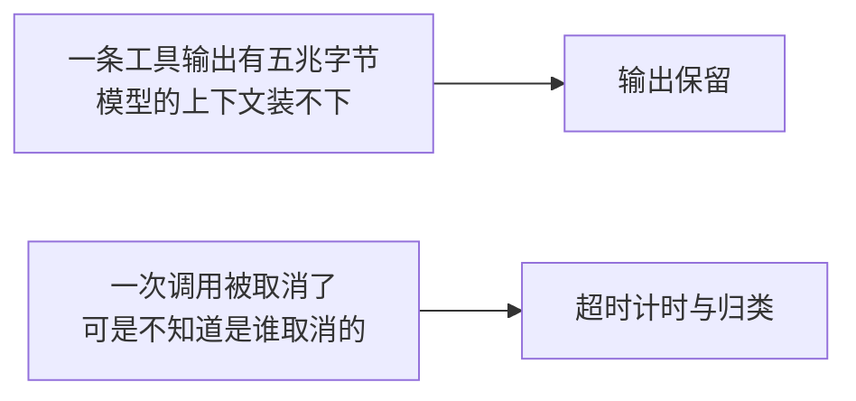
```mermaid
flowchart LR
    P1["一条工具输出有五兆字节<br/>模型的上下文装不下"] --> R1["输出保留"]
    P2["一次调用被取消了<br/>可是不知道是谁取消的"] --> R2["超时计时与归类"]
```

### 一条巨大的输出为什么不能直接给模型

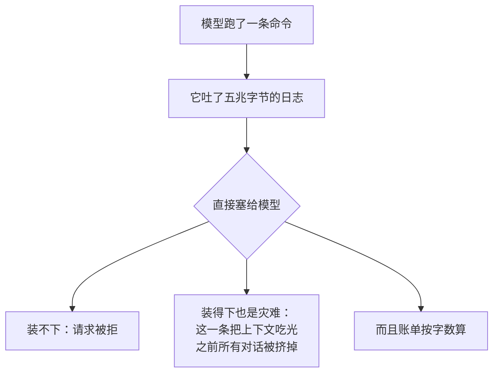
```mermaid
flowchart TD
    A["模型跑了一条命令"] --> B["它吐了五兆字节的日志"]
    B --> C{"直接塞给模型"}
    C --> D["装不下：请求被拒"]
    C --> E["装得下也是灾难：<br/>这一条把上下文吃光<br/>之前所有对话被挤掉"]
    C --> F["而且账单按字数算"]
```

### 为什么是留头尾，而不是留前面

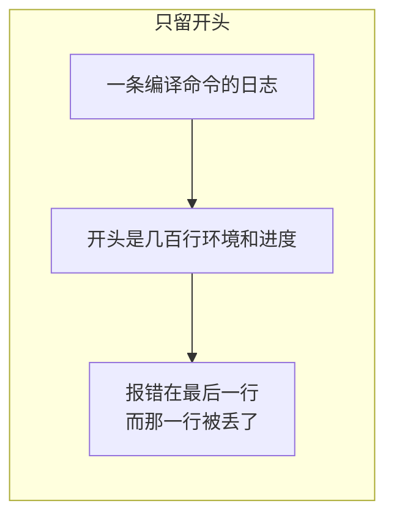
```mermaid
flowchart LR
    subgraph H["只留开头"]
        A1["一条编译命令的日志"] --> A2["开头是几百行环境和进度"] --> A3["报错在最后一行<br/>而那一行被丢了"]
    end
```

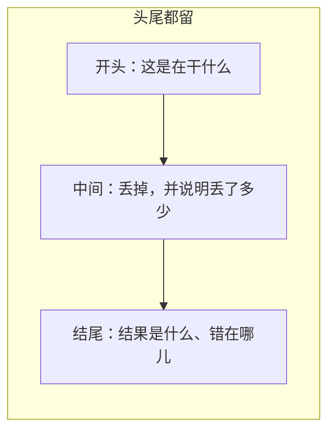
```mermaid
flowchart LR
    subgraph HT["头尾都留"]
        B1["开头：这是在干什么"] --> B2["中间：丢掉，并说明丢了多少"]
        B2 --> B3["结尾：结果是什么、错在哪儿"]
    end
```

哪种更合适由使用它的工具挑：列文件名这类结果留开头就够了，进程输出通常要头尾都留。

### 一个「已取消」的布尔值不够用

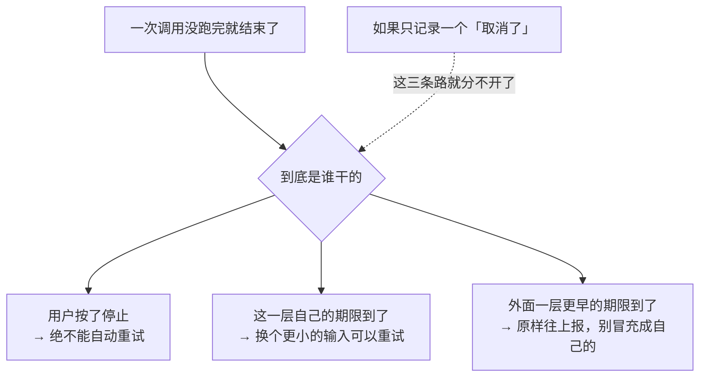
```mermaid
flowchart TD
    A["一次调用没跑完就结束了"] --> B{"到底是谁干的"}
    B --> C["用户按了停止<br/>→ 绝不能自动重试"]
    B --> D["这一层自己的期限到了<br/>→ 换个更小的输入可以重试"]
    B --> E["外面一层更早的期限到了<br/>→ 原样往上报，别冒充成自己的"]
    F["如果只记录一个「取消了」"] -.->|"这三条路就分不开了"| B
```

---

## 架构

两个包都是**纯库**：不收作用域、不登记任何东西、不发事件、不落盘。

```mermaid
flowchart TD
    subgraph OR["输出保留"]
        A1["把一条条结果 / 一块块字节喂进来"] --> A2["按预算留下一部分"]
        A2 --> A3["交回：留下的内容<br/>＋ 丢了多少的精确说法"]
    end
    subgraph TO["超时计时与归类"]
        B1["把一个可归因的超时挂到取消上"] --> B2["事后再把它认回来"]
    end
```

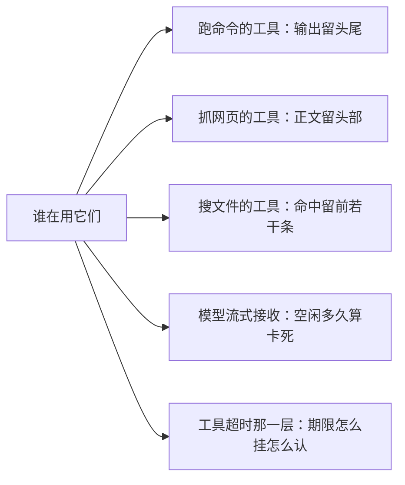
```mermaid
flowchart LR
    A["谁在用它们"] --> B["跑命令的工具：输出留头尾"]
    A --> C["抓网页的工具：正文留头部"]
    A --> D["搜文件的工具：命中留前若干条"]
    A --> E["模型流式接收：空闲多久算卡死"]
    A --> F["工具超时那一层：期限怎么挂怎么认"]
```

---

## 输出保留：留了什么，丢了什么

### 两个留存器，因为资源模型不同

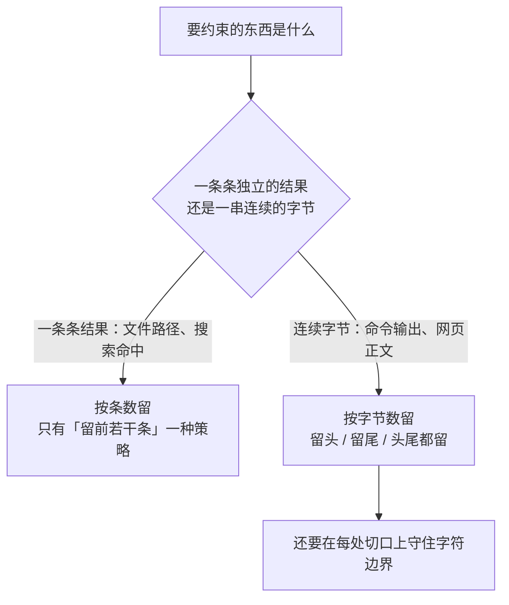
```mermaid
flowchart TD
    A["要约束的东西是什么"] --> B{"一条条独立的结果<br/>还是一串连续的字节"}
    B -->|"一条条结果：文件路径、搜索命中"| C["按条数留<br/>只有「留前若干条」一种策略"]
    B -->|"连续字节：命令输出、网页正文"| D["按字节数留<br/>留头 / 留尾 / 头尾都留"]
    D --> E["还要在每处切口上守住字符边界"]
```

按字节而不是按字符计，是因为进程输出和网页正文的安全边界本来就是字节。

### 丢弃说明只有三种形态，而且零值非法

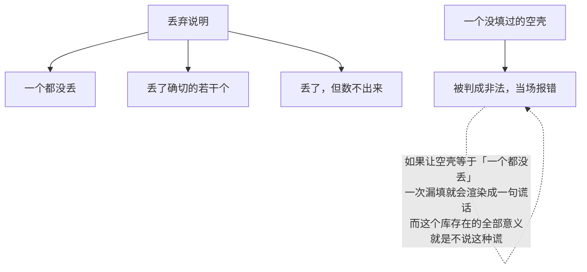
```mermaid
flowchart TD
    A["丢弃说明"] --> B["一个都没丢"]
    A --> C["丢了确切的若干个"]
    A --> D["丢了，但数不出来"]
    E["一个没填过的空壳"] --> F["被判成非法，当场报错"]
    F -.->|"如果让空壳等于「一个都没丢」<br/>一次漏填就会渲染成一句谎话<br/>而这个库存在的全部意义<br/>就是不说这种谎"| F
```

留存器自己交出来的永远是前两种——每一条、每一个字节都过它的手，数得清。「数不出来」那一种是留给调用方的：它可能从别处拿到一段已经残缺的内容。

### 「截断了」这三个字只表达一件事

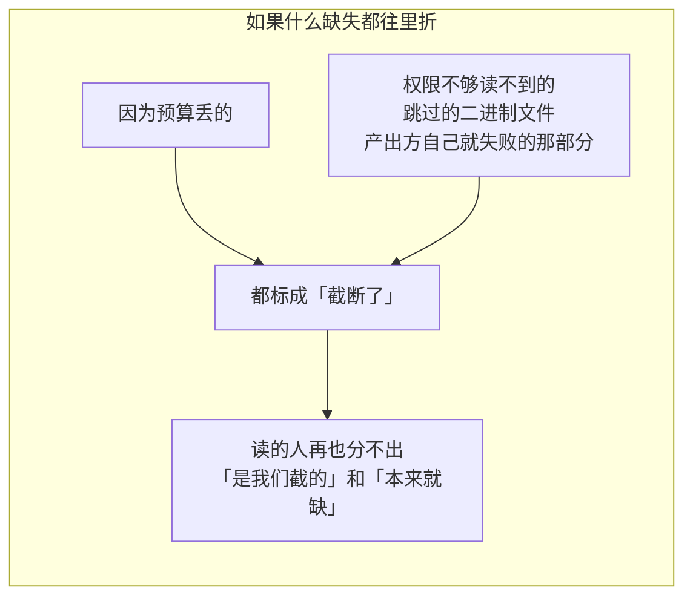
```mermaid
flowchart LR
    subgraph BAD["如果什么缺失都往里折"]
        A1["因为预算丢的"] --> A3["都标成「截断了」"]
        A2["权限不够读不到的<br/>跳过的二进制文件<br/>产出方自己就失败的那部分"] --> A3
        A3 --> A4["读的人再也分不出<br/>「是我们截的」和「本来就缺」"]
    end
```

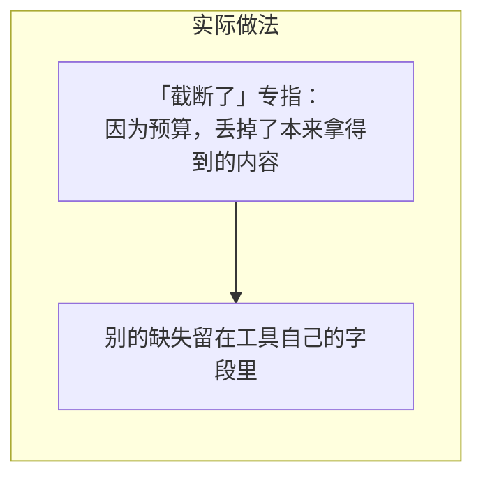
```mermaid
flowchart LR
    subgraph GOOD["实际做法"]
        B1["「截断了」专指：<br/>因为预算，丢掉了本来拿得到的内容"] --> B2["别的缺失留在工具自己的字段里"]
    end
```

### 字符边界：切口不能切开半个字

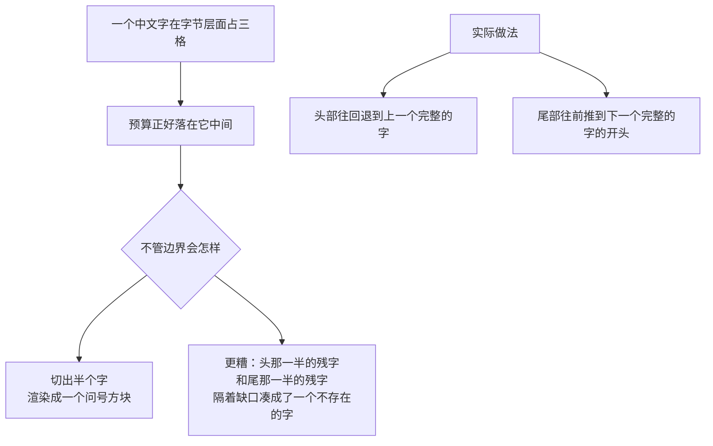
```mermaid
flowchart TD
    A["一个中文字在字节层面占三格"] --> B["预算正好落在它中间"]
    B --> C{"不管边界会怎样"}
    C --> D["切出半个字<br/>渲染成一个问号方块"]
    C --> E["更糟：头那一半的残字<br/>和尾那一半的残字<br/>隔着缺口凑成了一个不存在的字"]
    F["实际做法"] --> G["头部往回退到上一个完整的字"]
    F --> H["尾部往前推到下一个完整的字的开头"]
```

### 一个字节都没丢的时候，反而要合起来处理

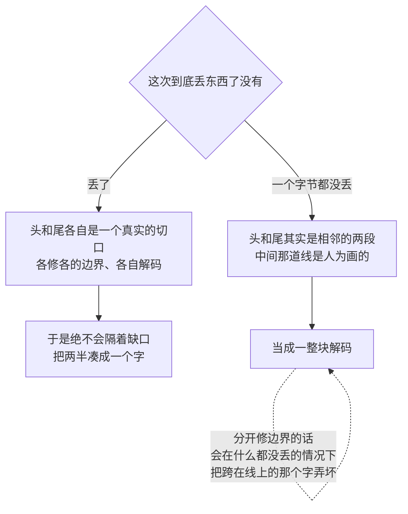
```mermaid
flowchart TD
    A{"这次到底丢东西了没有"} -->|"丢了"| B["头和尾各自是一个真实的切口<br/>各修各的边界、各自解码"]
    B --> C["于是绝不会隔着缺口<br/>把两半凑成一个字"]
    A -->|"一个字节都没丢"| D["头和尾其实是相邻的两段<br/>中间那道线是人为画的"]
    D --> E["当成一整块解码"]
    E -.->|"分开修边界的话<br/>会在什么都没丢的情况下<br/>把跨在线上的那个字弄坏"| E
```

### 丢弃数按**真正交出去的**字节算

```mermaid
flowchart LR
    A["预算说：丢了一千字节"] --> B["修边界又多丢了两个字节"]
    B --> C["报出去的必须是一千零二"]
    C -.->|"按预算报会高估留下的内容<br/>那么据此写出的每一句<br/>「丢了 N 字节」都是错的"| C
```

### 那行说明的两半：机械部分归库，恢复建议归工具

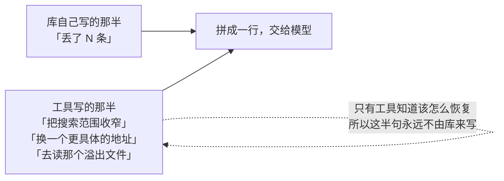
```mermaid
flowchart LR
    A["库自己写的那半<br/>「丢了 N 条」"] --> C["拼成一行，交给模型"]
    B["工具写的那半<br/>「把搜索范围收窄」<br/>「换一个更具体的地址」<br/>「去读那个溢出文件」"] --> C
    B -.->|"只有工具知道该怎么恢复<br/>所以这半句永远不由库来写"| B
```

同时校验策略名、单位、上限这几个会被渲染进文案的字段，因为空的单位会渲染出「丢了 3 个。」这种残句。

### 流式生产方可以提前收手

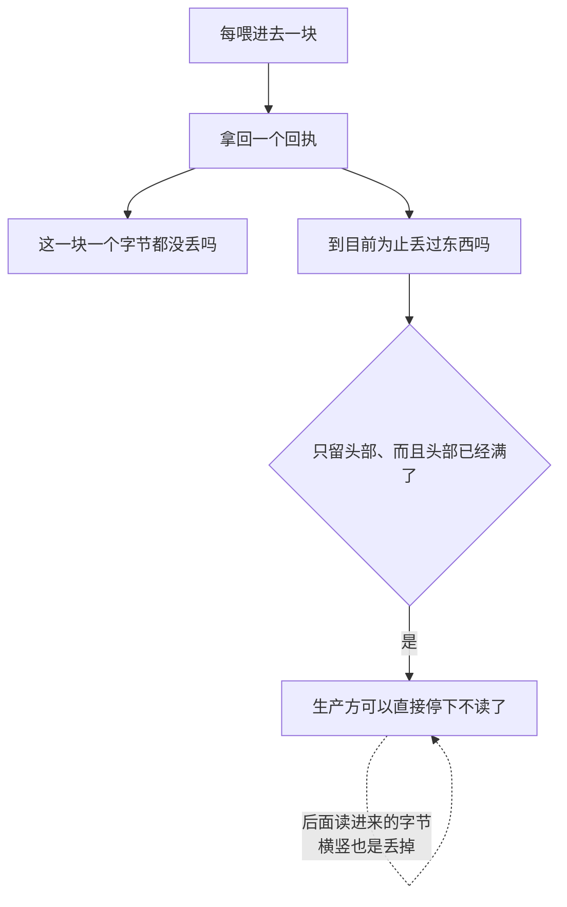
```mermaid
flowchart TD
    A["每喂进去一块"] --> B["拿回一个回执"]
    B --> C["这一块一个字节都没丢吗"]
    B --> D["到目前为止丢过东西吗"]
    D --> E{"只留头部、而且头部已经满了"}
    E -->|"是"| F["生产方可以直接停下不读了"]
    F -.->|"后面读进来的字节<br/>横竖也是丢掉"| F
```

### 一处必须拷贝的地方

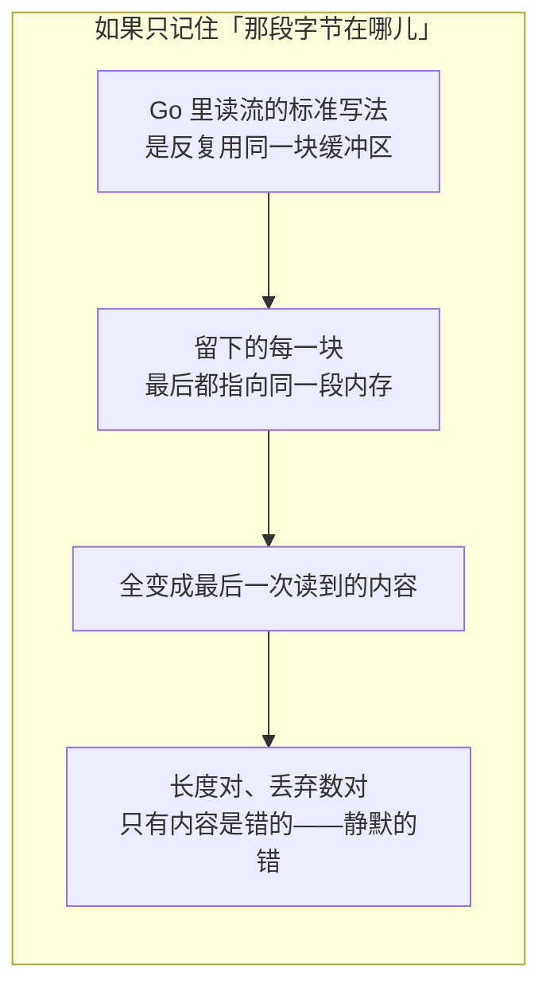
```mermaid
flowchart LR
    subgraph WRONG["如果只记住「那段字节在哪儿」"]
        A1["Go 里读流的标准写法<br/>是反复用同一块缓冲区"] --> A2["留下的每一块<br/>最后都指向同一段内存"]
        A2 --> A3["全变成最后一次读到的内容"]
        A3 --> A4["长度对、丢弃数对<br/>只有内容是错的——静默的错"]
    end
```

所以这里把字节**拷**下来。这个包最主要的使用场景恰好就是那种写法。

---

## 超时：只负责计时和归类

### 把期限夹进后端允许的范围

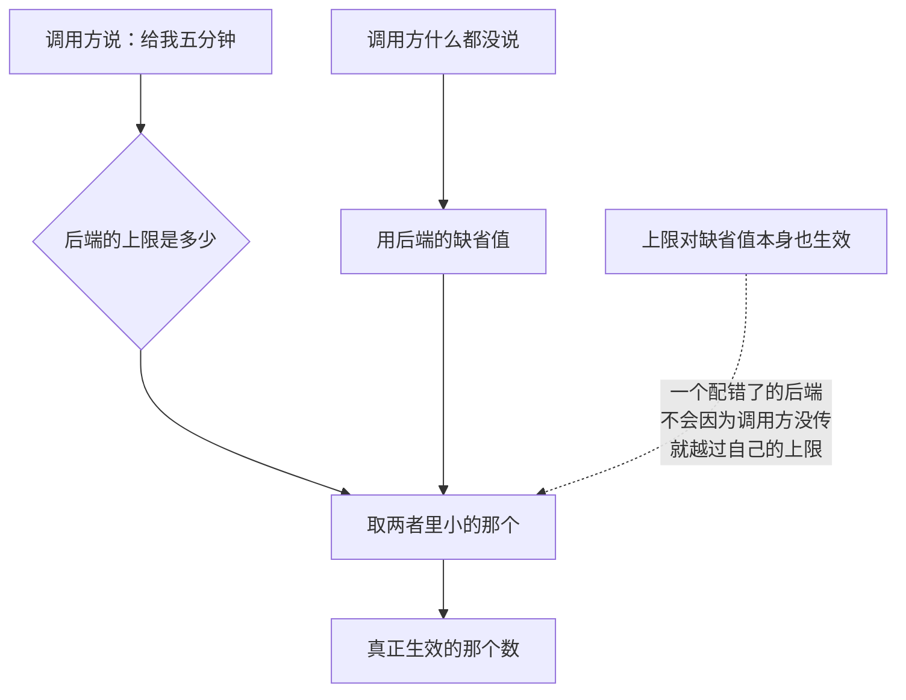
```mermaid
flowchart TD
    A["调用方说：给我五分钟"] --> B{"后端的上限是多少"}
    B --> C["取两者里小的那个"]
    D["调用方什么都没说"] --> E["用后端的缺省值"]
    E --> C
    C --> F["真正生效的那个数"]
    G["上限对缺省值本身也生效"] -.->|"一个配错了的后端<br/>不会因为调用方没传<br/>就越过自己的上限"| C
```

传一个零或者负数是错误，不是「关掉超时」——那个含义只在这个包内部用，不对外露，免得有人以为传 0 就能把超时关了。报错里带着字段名，看到的是「某某字段必须是正数」而不是一句不知道在说哪儿的「参数非法」。

### 挂上去，再认回来

```mermaid
flowchart LR
    A["挂：在调用方那条取消线之下<br/>再挂一条带代号的期限"] --> B["交给要被约束的那段代码"]
    B --> C["认：事后问一句<br/>「结束的原因是我这条期限吗」"]
    C --> D["是 → 按超时处理"]
    C --> E["不是 → 按别人的取消处理"]
```

### 代号是嵌套期限唯一能被分辨开的依据

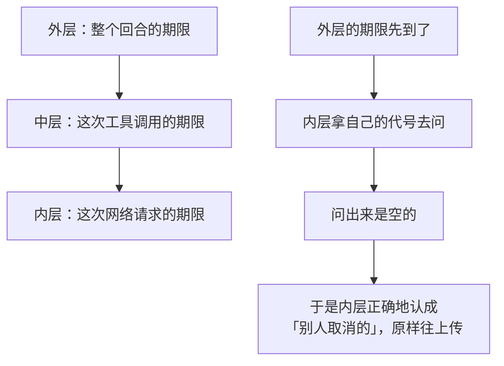
```mermaid
flowchart TD
    OUT["外层：整个回合的期限"] --> MID["中层：这次工具调用的期限"]
    MID --> IN["内层：这次网络请求的期限"]
    X["外层的期限先到了"] --> Y["内层拿自己的代号去问"]
    Y --> Z["问出来是空的"]
    Z --> W["于是内层正确地认成<br/>「别人取消的」，原样往上传"]
```

```mermaid
flowchart LR
    A["取消的原因会沿着<br/>父子关系自动传下来"] --> B["所以不需要手工把<br/>几条取消线融在一起"]
    C["谁先到谁定原因<br/>后到的不覆盖"] --> B
```

### 空闲看门狗：管的不是总时长

```mermaid
flowchart LR
    subgraph T["如果按总时长切"]
        A1["一次十分钟的正常长回答"] --> A2["被打断"]
        A2 --> A3["而它一直在正常吐字"]
    end
```

```mermaid
flowchart LR
    subgraph I["按空闲时长切"]
        B1["只在「等下一个值」的时候计时"] --> B2["一直在吐字的：永远不超时"]
        B1 --> B3["卡住不吐了的：到点就断"]
    end
```

### 计时器只在等待进行中开着

```mermaid
stateDiagram-v2
    [*] --> 闲置: 造出来
    闲置 --> 等待中: 开始等下一个值（计时器开）
    等待中 --> 闲置: 拿到值了（计时器关）
    等待中 --> 等待中: 收到心跳，重新计时
    等待中 --> 已判定超时: 空闲时长到了
    闲置 --> 已停止: 收工
    等待中 --> 已停止: 收工
    已停止 --> [*]
```

关键在「拿到值了就关掉」：**消费方拿到值之后自己慢慢处理的那段时间不算对方空闲**。

```mermaid
flowchart TD
    A["心跳：传输层有动静<br/>但还没凑出一个完整的值"] --> B{"此刻有等待在进行中吗"}
    B -->|"有"| C["重新计时"]
    B -->|"没有"| D["什么都不做"]
    D -.->|"那时候本来就没在计时<br/>凭空开一个等于给<br/>消费方的思考时间也设了上限"| D
```

### 等下一个值的那一下

```mermaid
sequenceDiagram
    participant C as 消费方
    participant W as 看门狗
    participant P as 产出方
    C->>W: 我要等下一个值
    W->>W: 开始计时
    alt 值来了
        P-->>C: 一个值
        W->>W: 停止计时
    else 对方正常收尾
        P-->>C: 流结束
    else 空闲时间到
        W-->>C: 一份带代号的超时
    end
```

这一下同时盯着两件事：值有没有来，以及守着的那条线是不是已经结束了。**只等值是不行的**——对方如果压根不理会取消，一个光等值的协程会永远挂在那儿。

### 两种误用当场报出来

```mermaid
flowchart LR
    A["已经收工了还拿它守新的等待"] --> C["报错，不静默放行"]
    B["上一次等待还没结束<br/>又发起了一次"] --> C
    C -.->|"做成可判定的错误<br/>调用方分得清是哪一种"| C
```

---

## 生命周期与并发

```mermaid
flowchart TD
    A["留存器是一次流的累加器"] --> B["状态只属于它自己那一次使用<br/>用完就完，绝不跨调用"]
    B --> C["不保证多个协程同时往里喂"]
    D["收尾之后交回的那批结果<br/>就是它内部那一段本身"] --> E["调用方可以原地排序或分组"]
    E --> F["代价是收尾之后不该再往里喂"]
```

```mermaid
flowchart LR
    A["每一个计时器都必须收掉"] --> B["否则长驻服务和测试里都会攒资源"]
    C["看门狗的收工可以调很多次"] --> D["重复调用是安全的"]
    E["这两个包都不起长期后台协程"] --> F["没有需要谁来关的东西"]
```

一处刻意和 DSH 不同的地方：

```mermaid
flowchart TD
    A["DSH 的清理只关计时器<br/>不触发取消"] --> B["一个再没人看的取消信号<br/>被垃圾回收掉就完了"]
    C["Go 不是这样"] --> D["一条派生出来的取消线不主动收掉<br/>会一直挂在父那一侧"]
    D --> E["所以这里的清理是：<br/>关计时器 ＋ 收掉这条线"]
    E --> F["归类行为没变：清理之后再问<br/>答案仍然是「不是超时」"]
```

---

## 失败语义

```mermaid
flowchart TD
    A["出了岔子"] --> B{"哪一类"}
    B -->|"预算是负数 / 策略没选 / 单位不认识"| C["造出来的那一刻就失败<br/>不等到渲染文案时才发现"]
    B -->|"丢弃说明是个没填过的空壳"| D["拒绝渲染<br/>绝不冒充成「什么都没丢」"]
    B -->|"按字节切开了半个字"| E["切口修到完整边界<br/>丢弃数按修完之后的实际值报"]
    B -->|"期限到了"| F["只说明期限到了<br/>不证明对方已经停下"]
    B -->|"看门狗被误用"| G["可判定的错误<br/>而不是一个含糊的失败"]
```

一条贯穿两个包的原则：**宁可当场报错，也不要产出一句读起来正常、实际上是假的话。**

```mermaid
flowchart LR
    subgraph Q["最坏的结局"]
        A1["一份看着完整的输出<br/>其实中间少了两千行"] --> A2["模型据此下了结论"]
        A2 --> A3["没有任何人会发现"]
    end
```

---

## 能力边界

```mermaid
flowchart TD
    Y["这两个包做的"] --> Y1["回答「留了多少、丢了多少」<br/>并把这件事说清楚"]
    Y --> Y2["回答「这次取消是谁干的」"]
    N["不做的"] --> N1["不做分组、排序、行号、退出码<br/>不做每行的预览截断，不写溢出文件"]
    N --> N2["不拥有恢复的措辞<br/>那半句由工具自己给"]
    N --> N3["不落盘、不压缩、不做日志采样"]
    N --> N4["不终止任何东西<br/>真正停下手上的活是各能力自己的事"]
    N --> N5["不决定期限是多少<br/>代号和时长都由调用方给"]
    N --> N6["不重试"]
    N --> N7["没有跨进程的期限协议<br/>一切都在同一棵取消树里"]
    N --> N8["没有可换掉的时钟<br/>计时走的是真实时间"]
```

## 对应的 DSH 能力

下表由 [`docs/packages.md`](../packages.md) 与 [能力覆盖表](../portmap/capability-coverage.tsv) 机器 join 得到：本篇覆盖的 Go 包，承接的是上游 DSH 的哪几条能力，以及各自还缺什么。落点列由源码里的 `// 源:` 注释反查，不是手写的。

| 上游能力 | DSH 包 | 裁决 | 落在哪个 Go 包 | 这里缺什么 |
|---|---|---|---|---|
| 轻依赖保留库，为工具提供有界面向模型输出 | `util/output-retention` | 需要 | `feature/outputretention` | — |
| 零依赖超时时序与分类纯函数库 | `util/timeout` | 需要 | `feature/timeout` | — |

## 相关源码

- `feature/outputretention/`
- `feature/timeout/`
