# Webhook 规则运行时

对应包：`feature/webhook`（规则运行时）、`feature/webhook/github`（GitHub 入口）

## 定位

GitHub 上有人开了个 issue。这件事发生在别人那台机器上，本运行时压根不知道。

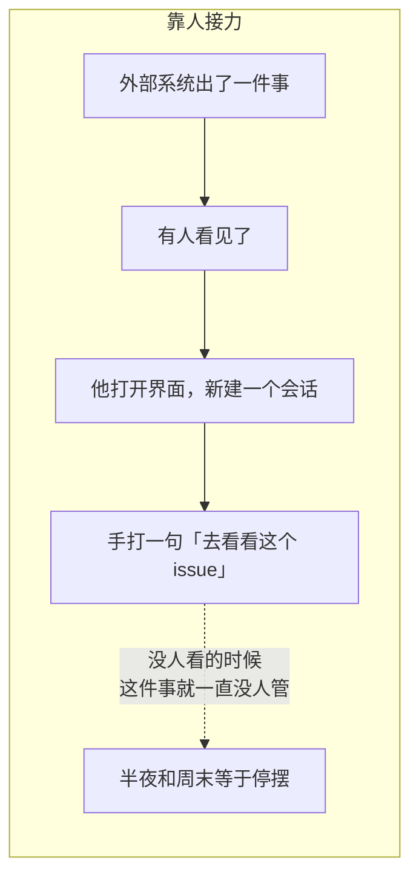

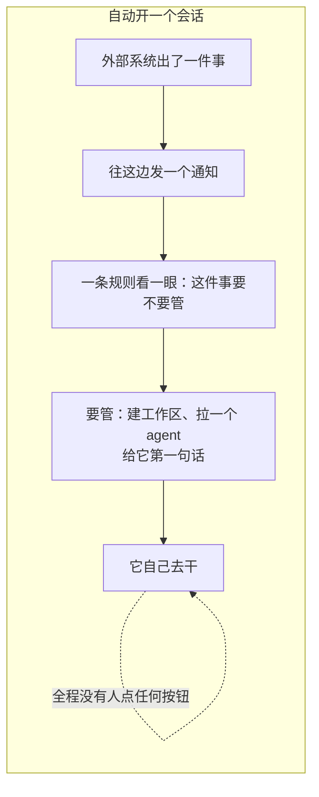

所以这两个包合起来只回答一件事：**外部系统发生了一件事，怎么变成本运行时里的一个会话。**

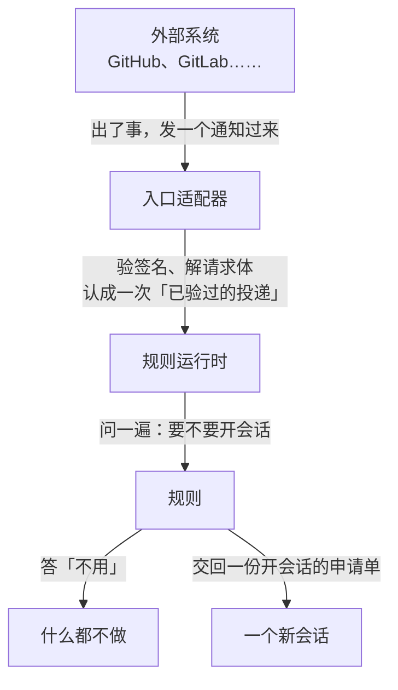

规则是**同进程里的受信任代码**，不是一份能被外面写进来的配置。

---

## 架构

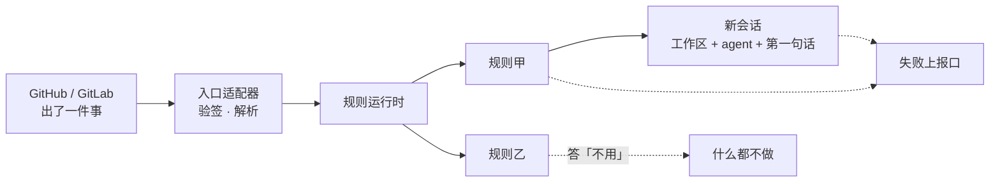

### 分界线画在哪儿

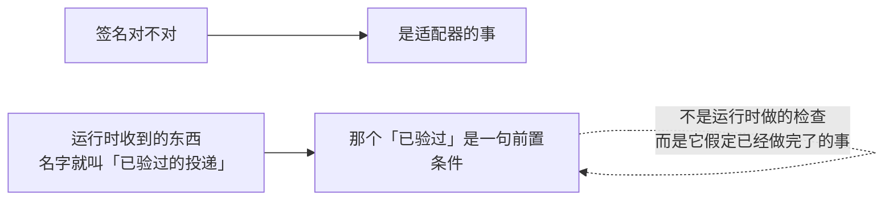

### HTTP 在这两个包之外

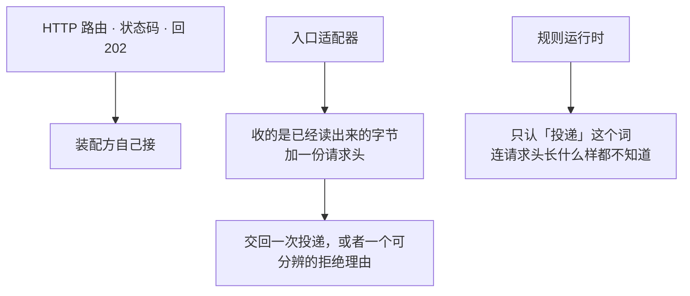

这么切换来两样东西：

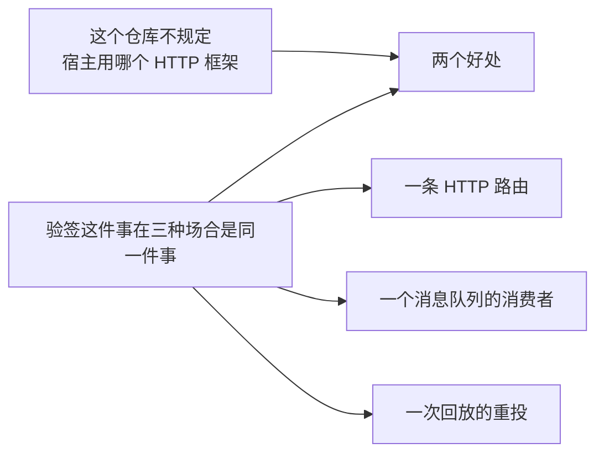

---

## GitHub 入口：只管认身份

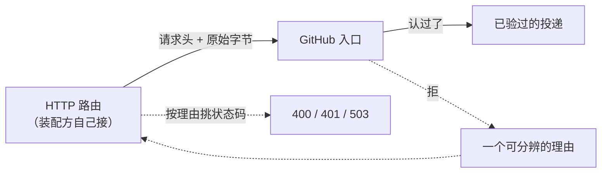

代价是状态码的挑选挪到了装配方手上，所以入口的每一种拒绝都是一个**可以判定的理由**，不是一句文案：

| 拒绝的理由 | 建议的状态码 |
|---|---|
| 缺一个身份头 / 某个头出现了不止一次 / 请求体不是 JSON 对象 | 400 |
| 签名对不上 | 401 |
| 共享密钥此刻拿不到 | 503 |

### 最后两行必须分得开

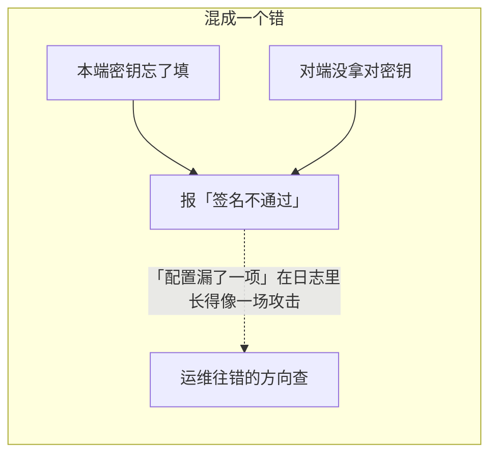

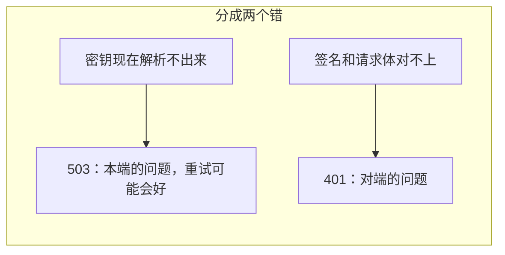

### 但另外两件事必须合成一个错

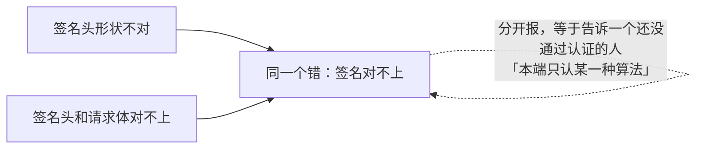

对发送方来说这两者本来就是同一件事：**它没有拿对密钥。**

### 一个头出现两次就是拒绝，不是取第一个

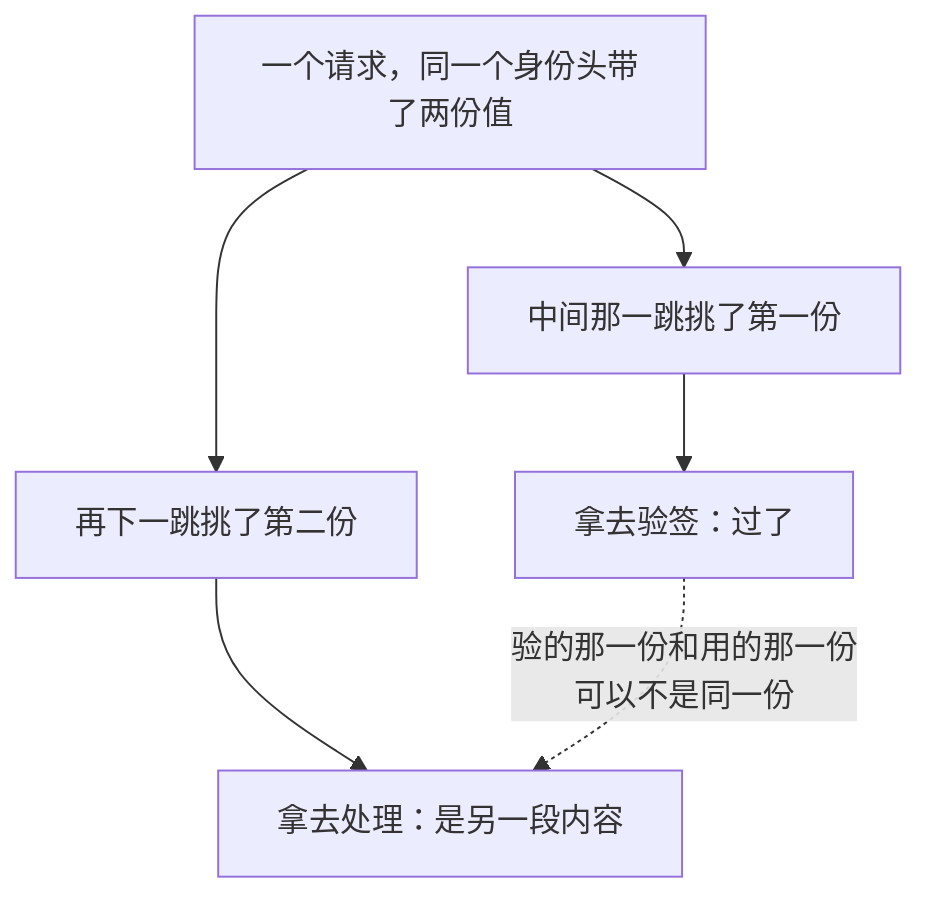

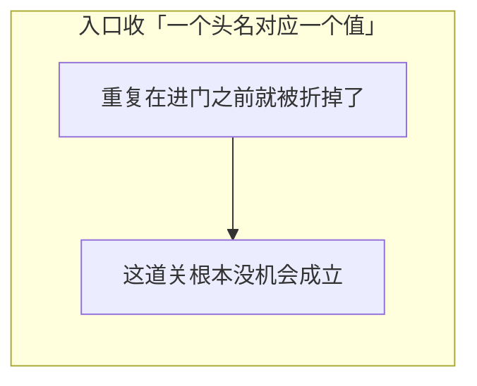

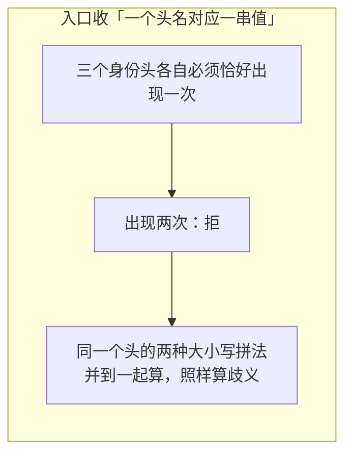

### 事件体一个字节都不重排

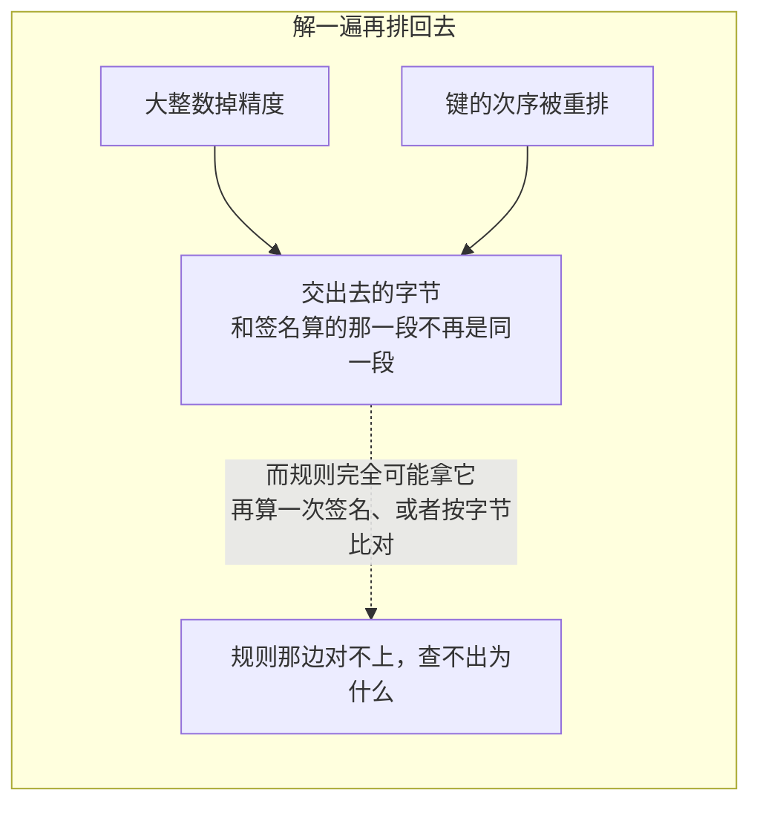

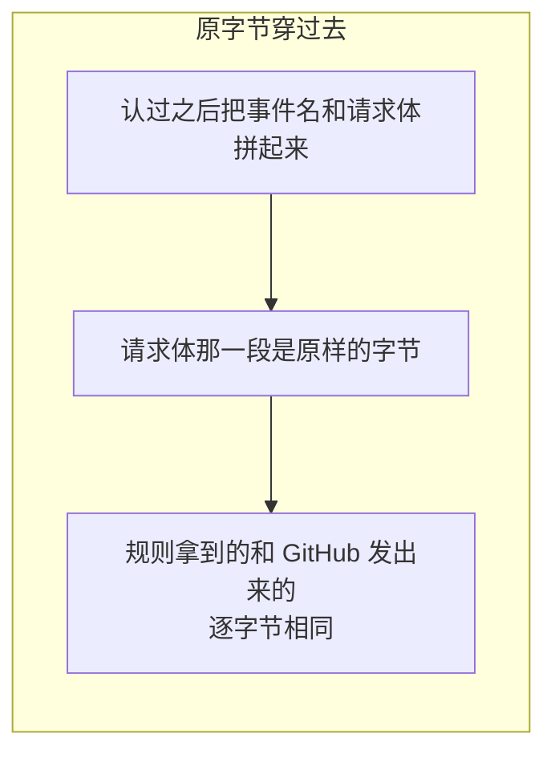

### 它明确不做的几件事

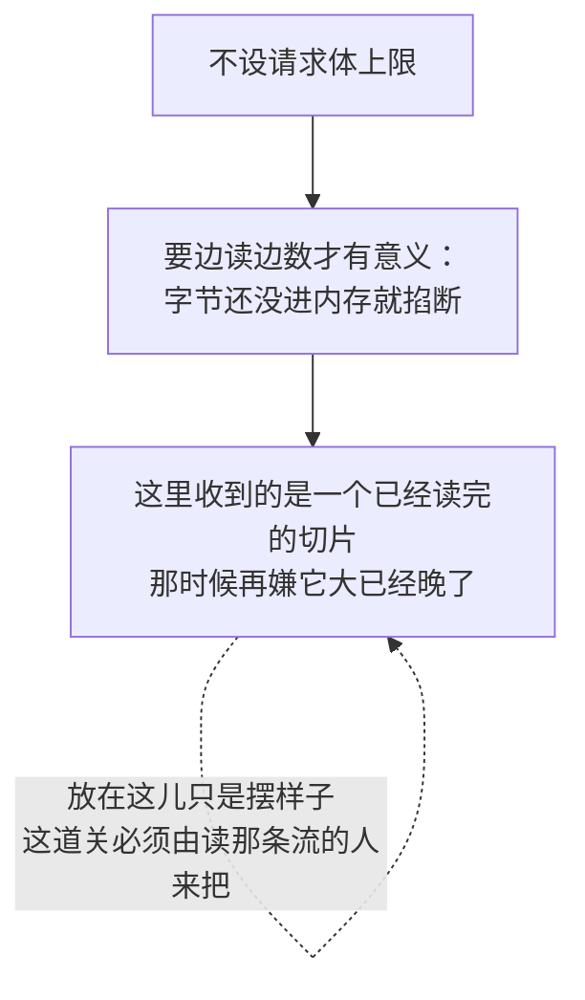

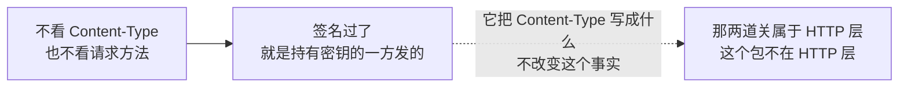

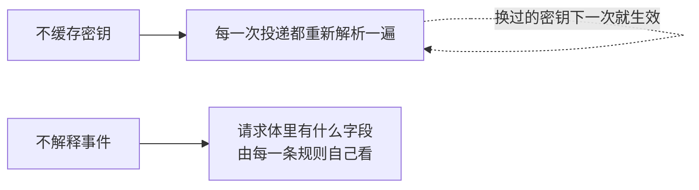

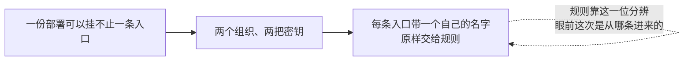

---

## 派出去就不管了

这是本包最要紧的一条性质，也是最容易被误解的一条。

```mermaid
sequenceDiagram
    participant G as GitHub
    participant A as 装配方的 HTTP 处理器
    participant I as GitHub 入口
    participant R as 规则运行时
    participant U as 规则
    participant S as 会话创建

    G->>A: 一次投递（请求头 + 字节）
    A->>I: 认一下这次投递
    I->>I: 取三个身份头 · 取密钥 · 算 HMAC
    I-->>A: 一次已验过的投递
    A->>R: 派出去
    R-->>A: 收到（立刻返回）
    A-->>G: 202
    R->>U: （另起一条线）你看看要不要开会话
    U-->>R: 开，申请单在这儿
    R->>S: 建工作区 → 造 agent → 挂会话 → 钉权限 → 起标题 → 放行第一句话
    S-->>R: 成了
```

```mermaid
flowchart LR
    A["「收到」这两个字返回的时候"] --> B["一件事都还没做完"]
    B --> C["叫它的那一位是个 HTTP 处理器"]
    C --> D["它欠对面的是一句「我收下了」<br/>不是一次会话创建的结果"]
    D -.->|"发通知的那一边不会等你把 agent 拉起来"| D
```

代价说清楚：

```mermaid
flowchart TD
    A["「这次投递到底怎么样了」"] --> B["本包答不了"]
    B --> C["规则跑砸了 · 会话开不出来"]
    C --> D["都只走失败上报那条路"]
    D --> E["不会回到叫它的那一位手里<br/>那时候它早就回复完了"]
    E -.->|"要答得了，得让规则自己<br/>把结果写到它认识的地方去"| E
```

---

## 开会话是一次有次序的事务

规则能让本包替它做的**只有一件事**：开一个会话。

```mermaid
flowchart LR
    subgraph BAD["让规则顺手调别的服务"]
        A1["再开一个能调这个的口子"] --> A2["再开一个能调那个的口子"]
        A2 -.->|"这个运行时会变成第二个装配层"| A3["而这个仓库里装配只有一个入口"]
    end
```

开会话分两段，中间那道线是「有没有动到留得下痕迹的东西」：

```mermaid
flowchart TB
    subgraph RO["只读段：都是问句，问错了什么都没发生"]
        P1["这个权限档位名认识吗"]
        P2["这份 agent 预设在不在"]
        P3["它的常驻组合装得起来吗"]
        P1 --> P2 --> P3
    end
    subgraph WR["介质段：从这儿开始留痕"]
        W1["建工作区"] --> W2["造 agent"] --> W3["把会话挂到工作区上"]
        W3 --> W4["钉权限档位"] --> W5["起个标题"] --> W6["放行第一句话"]
    end
    RO -->|"三问全过"| WR
    RO -.->|"任何一问不过"| STOP["停。一步介质都没动"]
```

```mermaid
flowchart LR
    subgraph BAD["边建边查"]
        A1["先建了工作区"] --> A2["才发现预设名写错了"]
        A2 --> A3["得回头收拾一个已经存在的工作区"]
        A3 -.->|"而收拾本身还可能失败"| A4["留下一个没人认领的空壳"]
    end
```

所有能提前问的问题都问完，介质才动第一下。介质段里出错就没这个便宜了，只能**按逆序退回去**：

```mermaid
flowchart LR
    F["第 N 步失败"] --> B1["摘掉会话<br/>（如果已经挂上）"] --> B2["处置 agent"] --> RPT["上报那个死因"]
    B1 -.->|"摘不掉"| E1["另报一条<br/>回滚失败"]
```

```mermaid
flowchart LR
    subgraph BAD["后一条盖住前一条"]
        A1["收拾现场的时候又出了问题"] --> A2["这条错顶掉了原来那条"]
        A2 -.->|"排查的人再也看不到根因"| A3["只看得见一次收拾失败"]
    end
```

两件事分两条上报：一条说「这次为什么开不成」，一条说「收拾现场的时候又出了什么问题」。

### 那份申请单要验什么

```mermaid
flowchart TD
    A["规则交回来的申请单"] --> B["五个必填字段非空<br/>工作区路径 · 标题 · 第一句话 · agent 预设 · 权限档位"]
    A --> C["输出额度不许是负数"]
    A --> D["没写模型路由的<br/>回落到这份部署的默认路由"]
    E["其余的形状"] -.->|"由类型本身定死<br/>不必在运行期再查一遍"| E
```

---

## 协作方以缝的形式交进来

DSH 那边这个类从一个服务容器里现取六个服务。本仓库没有那个容器，所以六件事都在构造的时候显式交进来：

```mermaid
flowchart LR
    ASM["装配层"] -->|"窄接口"| I["工作区登记<br/>agent 名册<br/>agent 预设<br/>部署默认模型<br/>权限档位"]
    ASM -->|"一个函数"| F["改标题"]
    I --> RT["运行时"]
    F --> RT
```

```mermaid
flowchart LR
    A["拿得到具体类型的"] --> B["做成窄接口<br/>每个只声明本包真正用到的那一两个方法"]
    C["接口两头对不上的"] --> D["做成一个函数"]
    B --> E["额外好处"]
    D --> E
    E --> F["本包的测试不必立起半个运行时<br/>五个假实现加一份记流水的账本就够了"]
```

```mermaid
flowchart LR
    subgraph BAD["从一个服务容器里现取"]
        A1["装没装、什么时候装<br/>都由容器决定"] --> A2["缺了哪一样，运行到那一步才知道"]
    end
```

```mermaid
flowchart LR
    subgraph GOOD["构造时一次交清"]
        B1["「在不在场」就是<br/>装配方手上有没有这个值"] --> B2["缺了哪一样，造的时候就报出来"]
    end
```

---

## 一条自查的关系

本包在不变量登记处挂了一条检查：**一条 webhook 放行进来的提示词落进日志的那一刻，它那个会话必须恰好归属在它会话头记的那一个工作区名下。**

```mermaid
flowchart TD
    A["数一数这条会话归属在几个工作区上"] --> B{"几个"}
    B -->|"零个"| C["没挂上：违例"]
    B -->|"两个及以上"| D["串台了：违例"]
    B -->|"恰好一个"| E{"就是会话头记的那一个吗"}
    E -->|"是"| F["过"]
    E -->|"不是"| G["违例"]
```

```mermaid
flowchart LR
    subgraph BAD["拿装载那一刻的快照去判后来的事件"]
        A1["装的时候拍一张归属快照"] --> A2["中途归属被改了"]
        A2 -.->|"这条关系不写进日志<br/>改动这边看不见"| A3["判的是一个过期的事实"]
    end
```

```mermaid
flowchart LR
    subgraph GOOD["每次判定现取一遍"]
        B1["每次要判，就现问一次归属"] --> B2["判的永远是此刻的事实"]
    end
```

```mermaid
flowchart LR
    A["归属事实取不到"] --> B["这本身就算一次违例"]
    B -.->|"判不了不等于判过了"| B
```

---

## 生命周期与并发

一条投递匹配上几条规则，就同时起几条线，互相之间没有任何协调。真正要讲清楚的是**怎么收摊**。

```mermaid
flowchart TB
    D["派发"] --> C1["这条规则的在跑计数 +1"]
    C1 --> G["起一条线去跑规则"]
    G --> C2["跑完，计数 -1"]
    R["撤这条规则的登记"] --> M["先把它标成正在撤"]
    M --> CN["给在跑的那些发取消"]
    CN --> W["等计数归零才返回"]
```

### 计数在哪儿加，是有讲究的

```mermaid
flowchart LR
    subgraph BAD["在新起的那条线里加"]
        A1["派发返回了"] --> A2["新线还没来得及报数"]
        A2 --> A3["这时候来一次撤销"]
        A3 --> A4["它看到计数是零，认为已经空了，返回"]
        A4 -.->|"留下一条没人等的线在背后跑"| A5["调用方以为干净了"]
    end
```

```mermaid
flowchart LR
    subgraph GOOD["在登记那把锁里加"]
        B1["派发这一刻计数就 +1"] --> B2["然后才起线"]
        B2 --> B3["撤销看到的计数<br/>一定覆盖了所有已经派出去的"]
    end
```

### 撤销会等

```mermaid
flowchart LR
    A["撤销不是「发个信号就走」"] --> B["它等到在跑的那几次真的退出了才返回"]
    B -.->|"这样调用方拿回控制权的时候<br/>可以确信没有残留"| B
    C["关停就是把所有登记依次撤掉"] --> D["所以它同样等到全空才返回"]
```

### 取消要查两次

```mermaid
flowchart TD
    A["派发到一条规则头上"] --> B["第一次查：这条登记还在吗"]
    B -->|"不在"| X["不叫它"]
    B -->|"在"| C["叫这条规则"]
    C --> D["规则可能跑很久"]
    D --> E["第二次查：现在还在吗"]
    E -->|"不在"| Y["不建会话"]
    E -->|"在"| Z["按申请单开会话"]
    Y -.->|"否则就是在给一个<br/>已经宣布不干了的规则收尾"| Y
```

### 事件体在派发那一刻就拷了一份

```mermaid
flowchart LR
    A["调用方拿回「收到」之后"] --> B["接着复用那段字节"]
    B -.->|"改不到正在跑的规则手里那一份"| C["两边各拿各的"]
```

---

## 失败语义

```mermaid
flowchart TD
    A["出了岔子"] --> B{"在哪一段"}
    B -->|"进门那一刻"| C["投递身份字段缺一个 / 事件体不是完整 JSON<br/>规则 id 重了 / 运行时已经关了<br/>→ 当场拒，不派任何规则"]
    B -->|"规则自己"| D["抛错 → 上报一条「失败」"]
    B -->|"只读段"| E["三问任一不过 → 上报一条<br/>介质一步没动"]
    B -->|"介质段"| F["逆序退回 → 上报那个死因"]
    B -->|"退回本身"| G["另报一条，不顶掉原来那条"]
```

### 「失败」和「被停掉的」要分得开

```mermaid
flowchart LR
    A["真出了问题"] --> A1["标成「失败」"] --> A2["运维该去查代码"]
    B["这条登记被撤了<br/>正在跑的那次跟着收摊"] --> B1["标成「被停掉的」"] --> B2["运维不该去查代码"]
    B1 -.->|"混成一个，一次正常的下线<br/>会看起来像一场故障"| B1
```

上报的那一条是**结构化的字段**，不是一行拼好的文案——谁要把它拼成一句人话，自己拼。

---

## 能力边界

```mermaid
flowchart TD
    Y["这两个包负责"] --> Y1["认一次投递的身份，或者给一个可分辨的拒绝理由"]
    Y --> Y2["收一批规则登记，一个 id 一条，撤掉之后 id 腾出来"]
    Y --> Y3["把一次投递派给所有认领这个族的规则，各起一条线"]
    Y --> Y4["按那个次序把一份申请单变成一个会话，失败就逆序退回"]
    Y --> Y5["把失败原样交给上报口"]
```

```mermaid
flowchart TD
    N["这两个包不负责"] --> N1["不接 HTTP：路由、状态码、回 202 都在装配方"]
    N --> N2["不去重：同一个投递 id 投两次就跑两次"]
    N --> N3["不管会话之后的日子：第一句话放行之后就退场"]
    N --> N4["不做调度、限流、重试"]
    N --> N5["不定义规则怎么被配出来"]
```

```mermaid
flowchart LR
    A["为什么不去重"] --> B["投递 id 只是出处<br/>不是一份去重状态"]
    B -.->|"「重复」的判据是业务的，不是传输的"| C["要去重的规则自己记账"]
```

```mermaid
flowchart LR
    subgraph BAD["校验工作区路径的形状"]
        A1["断言它必须以 / 开头"] --> A2["而服务端没有硬盘"]
        A2 -.->|"路径背后可以是对象存储"| A3["这条断言只会把合法的后端挡在外面"]
    end
```

所以那条形状校验删掉了：认不认这条路径，由文件系统那一层的后端自己说了算。

---

## 对应的 DSH 能力

下表由 [`docs/packages.md`](../packages.md) 与 [能力覆盖表](../portmap/capability-coverage.tsv) 机器 join 得到：本篇覆盖的 Go 包，承接的是上游 DSH 的哪几条能力，以及各自还缺什么。落点列由源码里的 `// 源:` 注释反查，不是手写的。

| 上游能力 | DSH 包 | 裁决 | 落在哪个 Go 包 | 这里缺什么 |
|---|---|---|---|---|
| Host 侧 ctx.webhookRuntime：受信任程序化 webhook 规则的注册表，唯一内置动作是在 Web Workspace 中创建普通根 Session | `webhook/webhook` | 需要 | `feature/webhook` | 缺一角已补：provider 适配器落在 `feature/webhook/github`（HMAC-SHA256 验签、身份头守卫、事件体原样穿过）。HTTP 路由与回 202 仍在装配方，本包与适配器都不接 HTTP |
| 带签名验证的 GitHub webhook 适配器，在注入的 ctx.webServer 上注册一条精确 HTTP 路由，投影提供方无关的交付并立即返回 202 | `webhook/webhook-github` | 取形重写 | `feature/webhook/github` | 缺口已补：HMAC-SHA256 验签、身份头守卫、事件体原样穿过都落在 `feature/webhook/github`。绑 HTTP 那一半是有意不落——入口收字节与请求头，路由、状态码、回 202 归装配方；请求体上限也跟着走，因为它要边读边数才有意义 |

## 相关源码

| 路径 | 内容 |
|---|---|
| `feature/webhook/types.go` | 投递、规则、申请单，以及五个协作方窄接口和失败记录 |
| `feature/webhook/runtime.go` | 登记表、派发、撤销与关停 |
| `feature/webhook/session.go` | 申请单解析与那条有次序的开会话事务 |
| `feature/webhook/messagesource.go` | 放行进来的提示词带的出处标记 |
| `feature/webhook/invariant.go` | 会话与工作区那条归属关系的自查 |
| `feature/webhook/github/ingress.go` | GitHub 那条入口：验签、身份头守卫、事件体拼装 |

---

## 深入阅读

[Agent](agent.md) · [工作区](workspace.md) · [Agent 预设与 Persona](presets.md) · [用户交互与审批](interaction.md) · [不变量](invariants.md)
