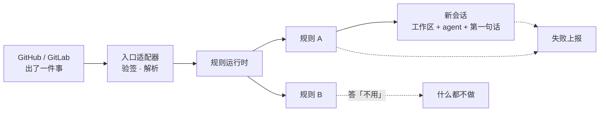
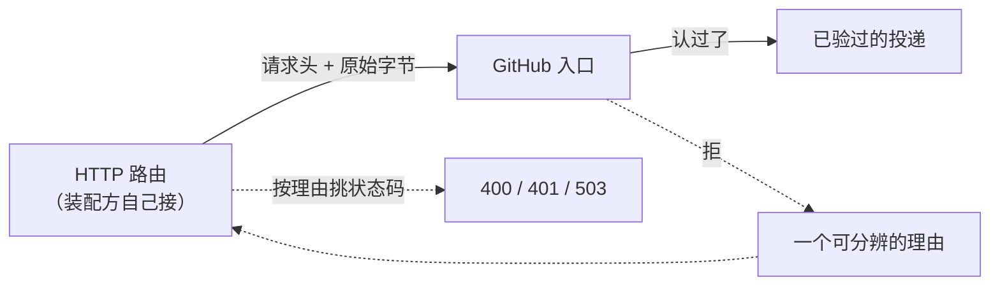
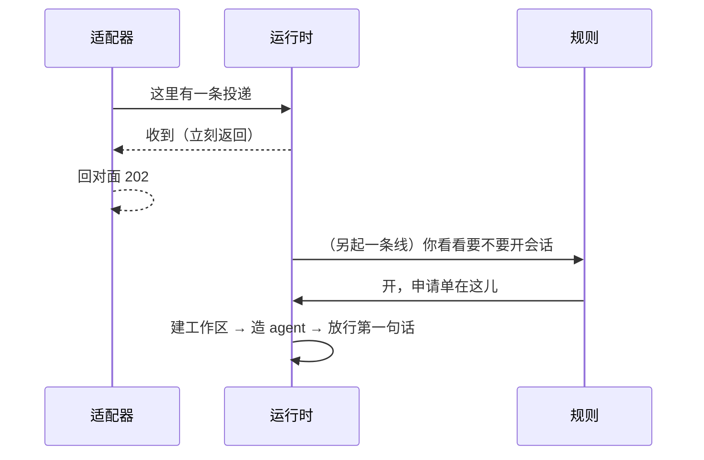
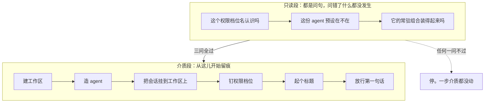
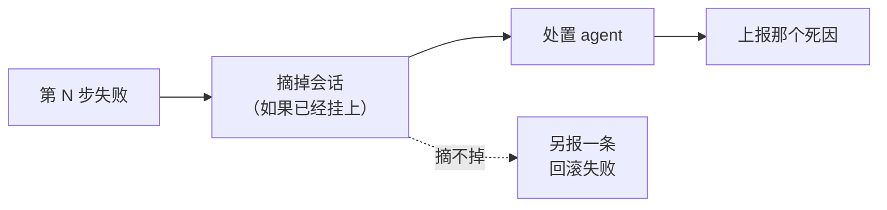
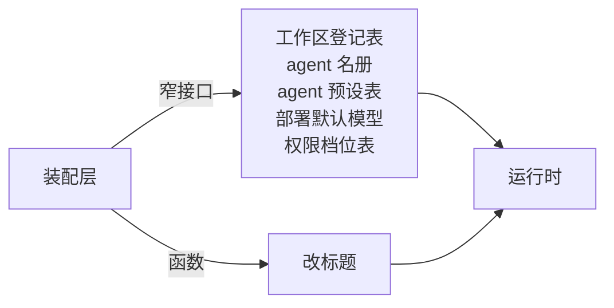
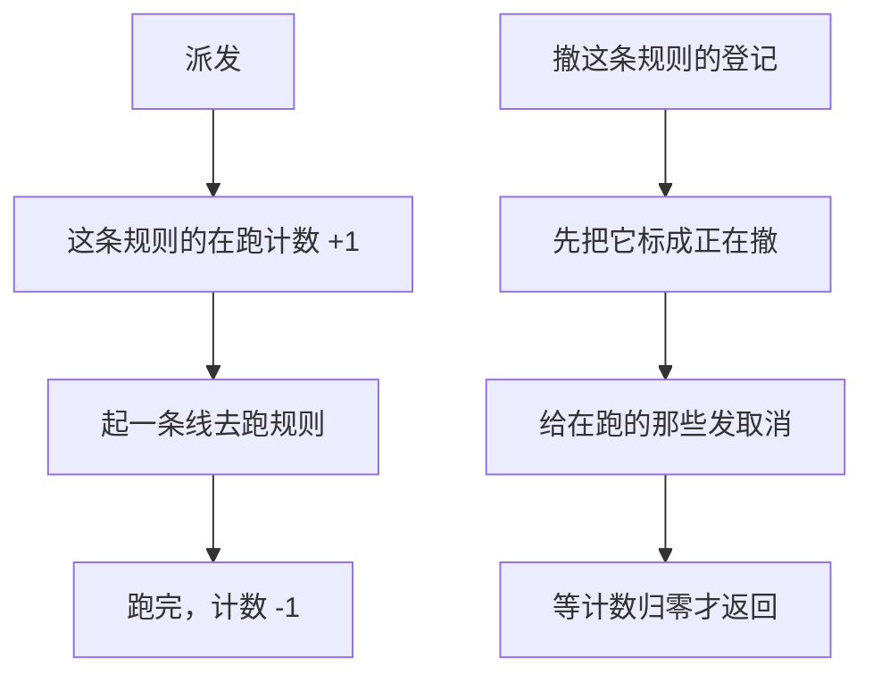

# Webhook 规则运行时

本文讲两个包：`feature/webhook`（规则运行时）和 `feature/webhook/github`（GitHub 入口）。合起来回答一件事——外部系统发生了一件事，怎么变成本运行时里的一个会话。

---

## 定位

一句话：**别人那边出了事，这边自动开一个 agent 去处理。**

比如 GitHub 上有人开了个 issue，这边就自动建一个工作区、拉一个 agent、给它一句「读一遍这个 issue 再动手」，然后它自己去干。整个过程没有人点任何按钮。

| 谁 | 干什么 |
|---|---|
| 外部系统（GitHub、GitLab……） | 出了事，往这边发一个通知 |
| **入口适配器**（`feature/webhook/github`） | 验签名、解析请求体，认成一次「已验过的投递」 |
| **规则运行时**（`feature/webhook`） | 拿着这条已经验过身份的通知，问一遍规则：要不要开会话？开的话开成什么样？ |
| **规则** | 受信任的一段代码，看一眼通知内容，答「不用」或者交回一份开会话的申请单 |

---

## 架构



分界线画在**入口适配器**和**规则运行时**之间：签名对不对是适配器的事；运行时收到的东西名字就叫「已验过的投递」——那个「已验过」是一句前置条件，不是运行时做的检查。

HTTP 本身在两个包之外。下一节说为什么。

---

## GitHub 入口：只管认身份，不接 HTTP

`feature/webhook/github` 兑现的就是「已验过」那三个字。它的入口不收一个 HTTP 请求，收的是**已经读出来的字节加一份请求头**：



这么切有两个好处：这个仓库不规定宿主用哪个 HTTP 框架；而验签这件事在一条 HTTP 路由、一个消息队列的消费者、一次回放的重投上是同一件事，切开之后三种场合共用一份实现。

代价是状态码那张对照表挪到了装配方手上，所以入口的每一种拒绝都是一个可以分辨的理由，而不是一句文案：

| 拒绝的理由 | 建议的状态码 |
|---|---|
| 缺一个身份头 / 某个头出现了不止一次 / 请求体不是 JSON 对象 | 400 |
| 签名对不上 | 401 |
| 共享密钥此刻拿不到 | 503 |

**最后两行必须分得开。** 一个是本端没配好，一个是对端没拿对密钥；混成一个，「密钥忘了填」在日志里会长得像一场攻击。

### 三处不肯将就的地方

**一个头出现两次就是拒绝，不是取第一个。**

```text
        代理 A 挑了这一份 ──> 用来验签  ✅ 过
请求 ──┤
        代理 B 挑了那一份 ──> 用来处理  ❌ 另一段内容

结论：验的那一份和用的那一份可以不是同一份
```

这就是入口收「一个头名对应一串值」而不是「一个头名对应一个值」的理由——后者在进门之前就把重复折掉了，这道关根本没机会成立。同一个头的两种大小写拼法会被并到一起，照样算歧义。

**只认 SHA-256 那一支。** GitHub 同时还发一个 SHA-1 的签名头，本包连读都不读。

**事件体一个字节都不重排。** 认过之后交出去的 payload 是原字节。解一遍再排回去会磨掉大整数的精度、也会重排键序，而规则完全可能拿它再算一次签名或者按字节比对。

### 它明确不做的几件事

- **不设请求体上限。** 上游那个 `maxBodyBytes` 是**边读边数**的，字节还没进内存就能掐断；这里收到的是一个已经读完的切片，那时候再嫌它大已经晚了。这道关必须由读那条流的人来把。
- **不看 Content-Type，也不看请求方法。** 签名过了就是持有密钥的一方发的，它把 Content-Type 写成什么不改变这个事实。
- **不解释事件。** payload 里有什么字段，由每一条规则自己看。
- **不缓存密钥。** 每次投递都重新解析一遍，轮换过的密钥下一次就生效。

---

## 派出去就不管了

这是本包最要紧的一条性质，也是最容易被误解的一条。



「收到」这两个字返回的时候，一件事都还没做完。这不是偷懒，是这条缝该有的样子——叫它的那一位是个 HTTP 处理器，它欠对面的是一个「我收下了」，不是一次会话创建的结果。GitHub 那边不会等你把 agent 拉起来。

**代价是「这次投递到底怎么样了」这个问题本包答不了。** 规则跑砸了、会话开不出来，都只会走失败上报那条路，不会回到调用方手里——那时候它早就回复完了。要答得了，得让规则自己把结果写到它认识的地方去。

---

## 开会话是一次有次序的事务

规则能让本包替它做的**只有一件事**：开一个会话。这条边界是刻意的——一个能顺手调别的服务的规则运行时，会变成第二个装配层。

开会话分两段，中间那道线是「有没有动到留得下痕迹的东西」：



**为什么要这么排？** 三个只读检查里任何一个不过，都说明这份申请单本身就不成立——如果先建了工作区再发现预设名写错了，就得回头收拾一个已经存在的工作区。把所有能提前问的问题都问完，介质才动第一下。

介质段里出错就没这个便宜了，只能**按逆序退回去**：



**退回本身再失败，不会顶掉原来那个错。** 两件事分两条上报：一条说「这次为什么开不成」，一条说「收拾现场的时候又出了什么问题」。把后者盖住前者，排查的人就再也看不到根因了。

---

## 协作方以缝的形式交进来

DSH 那边这个类从上下文里 `inject` 六个服务。本仓库没有那张服务表，所以六件事都在构造时显式交进来：



拿得到具体类型的做成**窄接口**（每个只声明本包真正用到的那一两个方法）；接口两头对不上的做成**函数**。额外好处是本包的测试不必立起半个运行时——五个假实现加一份记流水的账本就够了。

---

## 一条自查的关系

本包在不变量注册表上挂了一条检查：**一条 webhook 放行进来的提示词落进日志的那一刻，它那个会话必须恰好归属在它会话头记的那一个工作区名下。**

不多不少就一个——零个说明没挂上，两个说明串了台。这条关系不写进日志（一个会话被挂到别的工作区上是另一条路的事），所以每次判定都现取一遍归属事实，而不是拿装载那一刻的快照去判后来的事件。

取不到归属事实本身也算一次违例：**判不了不等于判过了。**

---

## 生命周期与并发

一条投递匹配上几条规则，就同时起几条线，互相之间没有任何协调。真正需要讲清楚的是**怎么收摊**：



- **计数是在登记表的锁里加的**，不是在新起的那条线里加的。否则「撤销」可能在那条线还没来得及报数的瞬间就认为已经空了，然后返回——留下一条没人等的线在背后跑。
- **撤销会等。** 它不是「发个信号就走」，是等到在跑的那几次真的退出了才返回。这样调用方拿回控制权的时候，可以确信没有残留。
- **取消要查两次**：叫规则之前查一次，规则返回之后再查一次。第二次是必需的——规则可能跑了很久，期间这条登记已经被撤了，这时候再去建会话就是在给一个已经宣布不干了的规则收尾。
- **被取消掉的那次算「被停掉的」，不算「失败」。** 见上面失败语义那张表。
- **事件体在派发那一刻就拷了一份。** 调用方拿回「收到」之后接着复用那段字节，改不到正在跑的规则手里那一份。
- **关停就是把所有登记依次撤掉**，所以它同样是等到全空才返回。

## 失败语义

| 什么时候 | 会发生什么 |
|---|---|
| 投递身份字段缺一个，或事件体不是完整 JSON | 当场拒，不派任何规则 |
| 规则登记表里已经有这个 id 了 | 当场拒 |
| 运行时已经关了 | 登记和派发都拒 |
| 规则自己抛错 | 上报一条「失败」 |
| 撤登记的时候规则还在跑 | 撤销**等**它退出，那次失败标成「被停掉的」而不是「失败的」 |
| 三个只读检查任一不过 | 上报一条，介质一步没动 |
| 介质段出错 | 逆序退回，上报那个死因 |
| 退回本身也失败 | 另报一条，不顶掉原来那条 |

「失败」和「被停掉的」要分得开：前者是真出了问题，后者只是这条规则被撤了、正在跑的那次跟着收摊——运维看到后者不该去查代码。

---

## 能力边界

**这个包负责：**

- 收一张规则登记表，一个 id 一条，撤掉之后 id 腾出来。
- 把一次投递派给所有认领这个 provider kind 的规则，各起一条线。
- 按上面那个次序把一份申请单变成一个会话，失败就逆序退回。
- 把失败原样交给上报口。

**这个包不负责：**

- **不验签，也不认 HTTP。** 签名校验和请求体解析在 `feature/webhook/github`；路由和回 202 在装配方。
- **不去重。** 投递 id 只是出处，不是去重状态。同一个 id 投两次就跑两次——「重复」的判据是业务的，不是传输的。
- **不管会话之后的日子。** 第一句话放行之后本包就退场了，那个 agent 归它的拥有者作用域管，和任何别的会话一样。
- **不做调度、限流、重试。** 一条投递匹配几条规则就同时起几条线。
- **不定义规则怎么被配出来。** 规则是同进程里的受信任代码，不是一份能被外部写入的配置。
- **不校验工作区路径的形状。** DSH 那边有一条「必须是绝对路径」的断言，本仓库删了：这里的路径交给文件系统那一层解析，而它背后可以是对象存储。服务端没有硬盘，一条「必须以 / 开头」只会把合法的后端挡在外面。

---

## 对应的 DSH 能力

下表由 [`docs/packages.md`](../packages.md) 与 [能力覆盖表](../portmap/capability-coverage.tsv) 机器 join 得到：本篇覆盖的 Go 包，承接的是上游 DSH 的哪几条能力，以及各自还缺什么。落点列由源码里的 `// 源:` 注释反查，不是手写的。

| 上游能力 | DSH 包 | 裁决 | 落在哪个 Go 包 | 这里缺什么 |
|---|---|---|---|---|
| Host 侧 ctx.webhookRuntime：受信任程序化 webhook 规则的注册表，唯一内置动作是在 Web Workspace 中创建普通根 Session | `webhook/webhook` | 需要 | `feature/webhook` | 缺一角已补：provider 适配器落在 `feature/webhook/github`（HMAC-SHA256 验签、身份头守卫、事件体原样穿过）。HTTP 路由与回 202 仍在装配方，本包与适配器都不接 HTTP |
| 带签名验证的 GitHub webhook 适配器，在注入的 ctx.webServer 上注册一条精确 HTTP 路由，投影提供方无关的交付并立即返回 202 | `webhook/webhook-github` | 取形重写 | `feature/webhook/github` | 缺口已补：HMAC-SHA256 验签、身份头守卫、事件体原样穿过都落在 `feature/webhook/github`。绑 HTTP 那一半是有意不落——入口收字节与请求头，路由、状态码、回 202 归装配方；请求体上限也跟着走，因为它要边读边数才有意义 |

## 相关源码

| 路径 | 内容 |
|---|---|
| `feature/webhook/types.go` | 投递、规则、申请单，以及五个协作方窄接口和失败记录 |
| `feature/webhook/runtime.go` | 登记表、派发、撤销与关停 |
| `feature/webhook/session.go` | 申请单解析与那条有次序的开会话事务 |
| `feature/webhook/messagesource.go` | 放行进来的提示词带的出处标记 |
| `feature/webhook/invariant.go` | 会话与工作区那条归属关系的自查 |
| `feature/webhook/github/ingress.go` | GitHub 那条入口：验签、身份头守卫、事件体拼装 |

---

## 深入阅读

[Agent](agent.md) · [工作区](workspace.md) · [Agent 预设与 Persona](presets.md) · [用户交互与审批](interaction.md) · [不变量](invariants.md)
