# 后台任务、目标与工作流

本篇是汇总：后台作业、长期目标、耐久提醒、固定的多轮子 Agent 工作流，四件事各自的详细文档在最后一节。

## 定位

一次 agent 回合有头有尾：人说一句，模型答一段，结束。可真正的活儿常常不是这个形状——

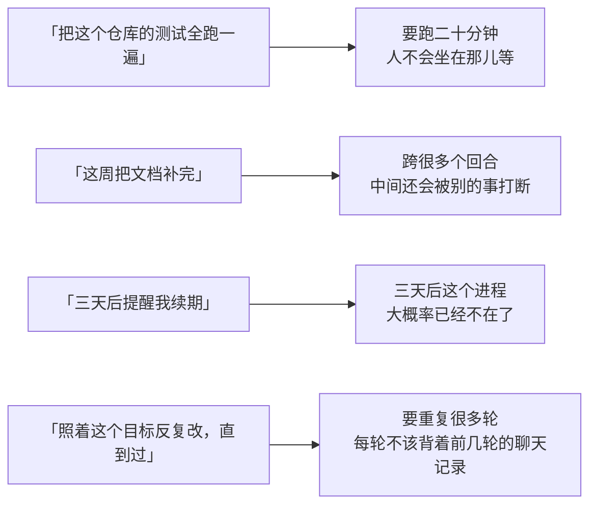

这四件事都超出了单次回合。本模块就是承接它们的地方。

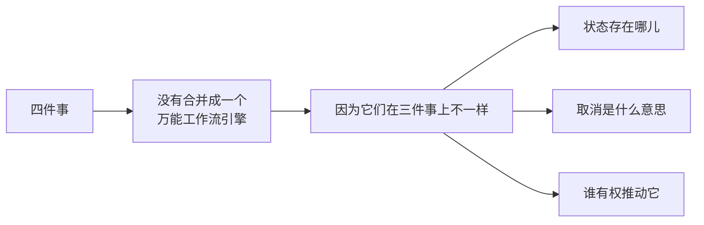

---

## 架构：分界线是「状态存在哪儿」

真正的分界不是「做什么」，是**状态存在哪儿**——这一条决定了进程重启之后它还在不在。

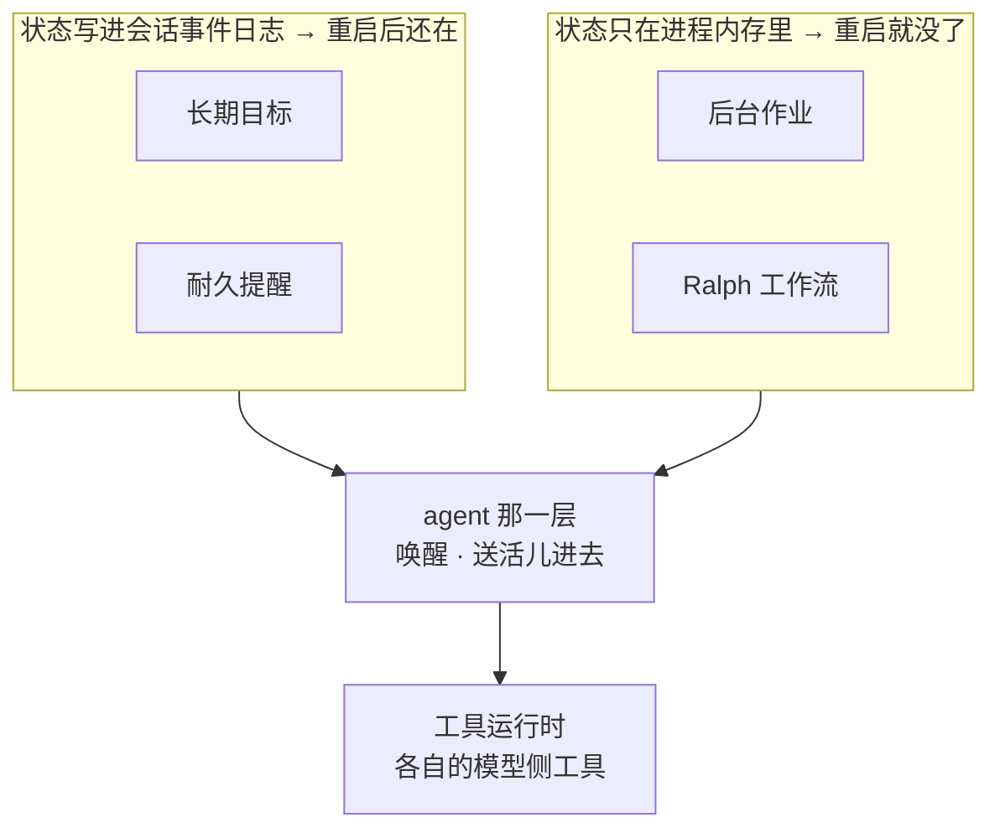

### 这不是完成度的差别

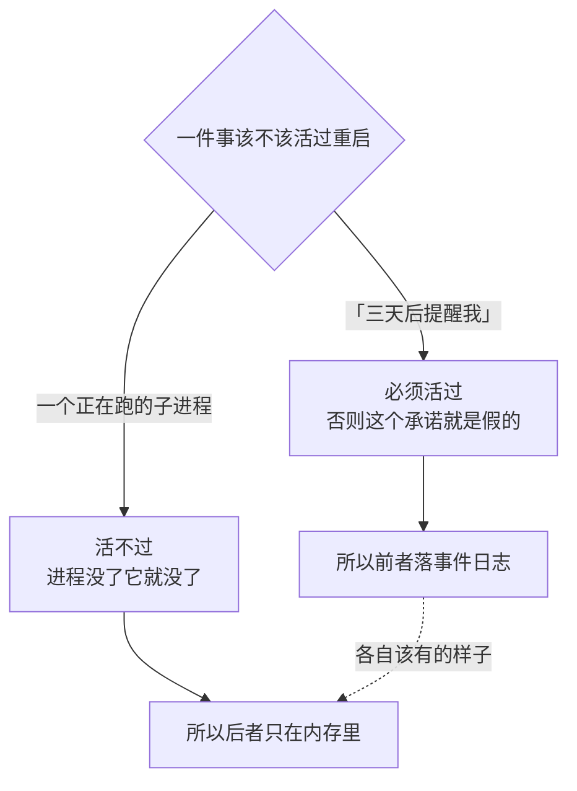

### 四件事都不自己开循环

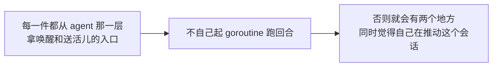

---

## 后台作业

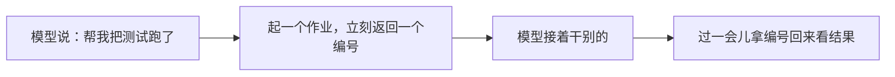

### 一个作业的一生

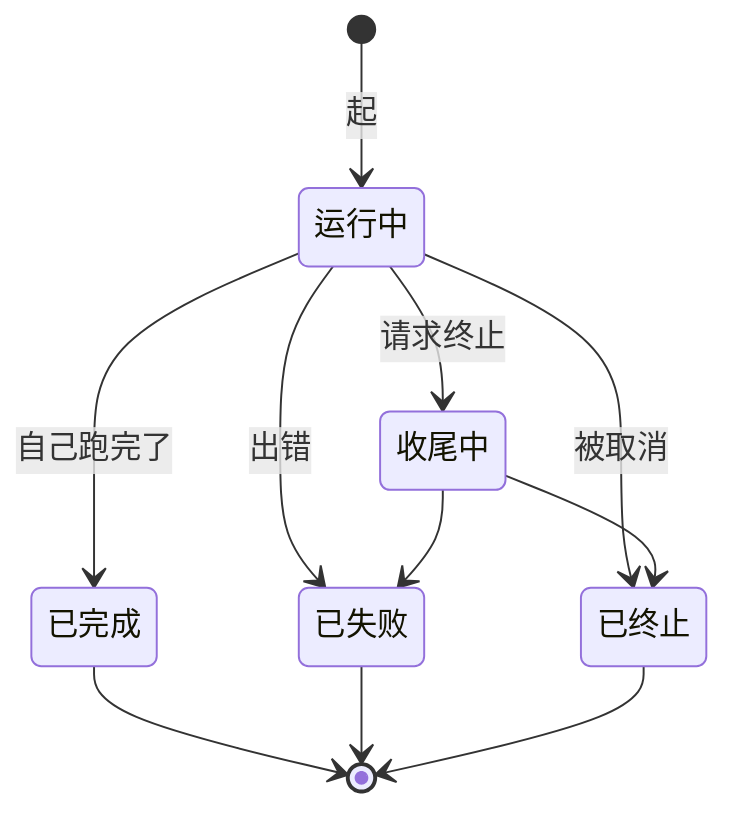

### 归属决定可见性

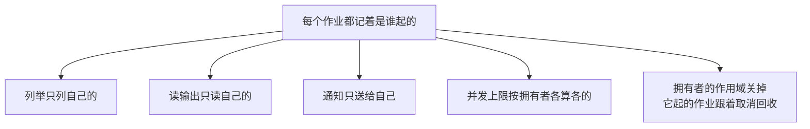

### 输出是可以边跑边读的

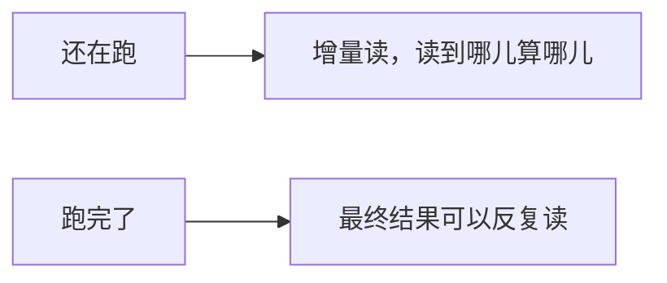

### 等待超时不是作业失败

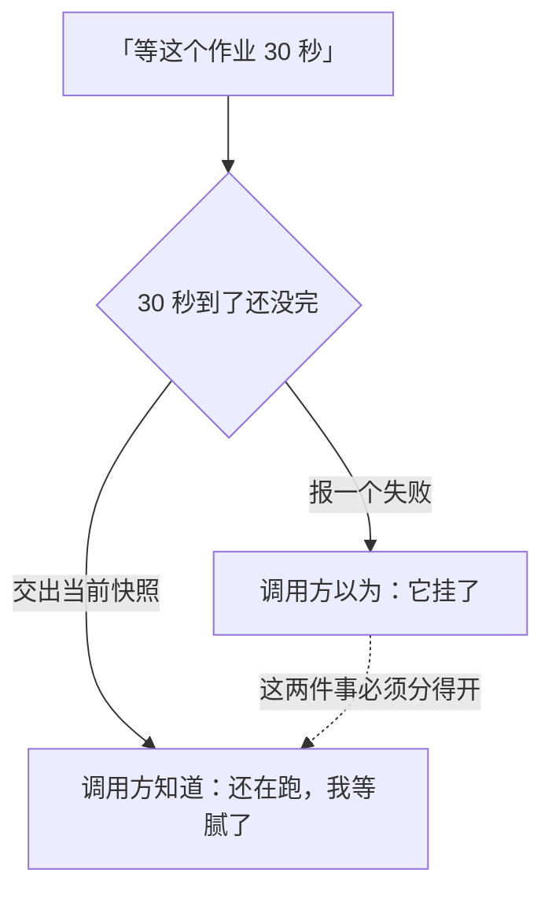

### 进程内实现的边界

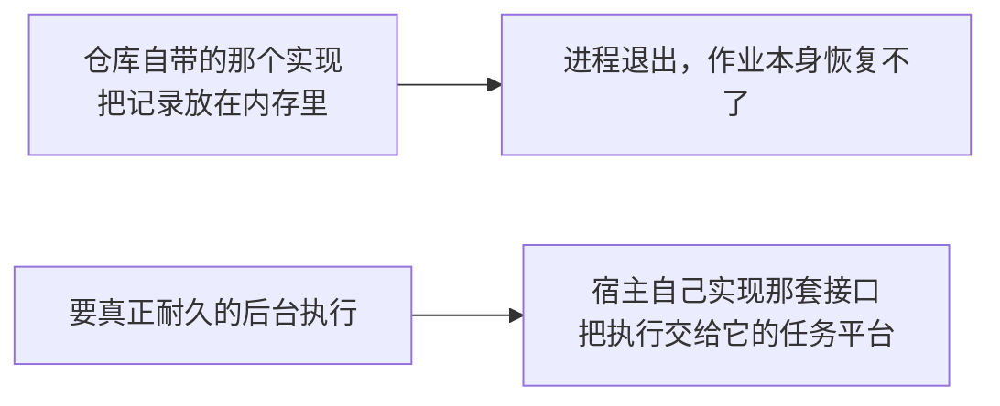

---

## 长期目标

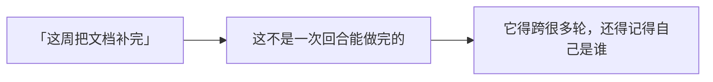

### 目标状态整个落在事件日志上

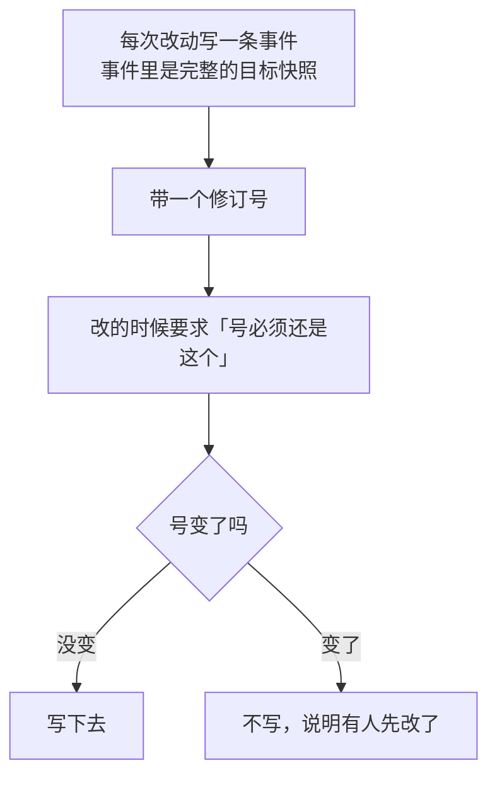

### 四个阶段

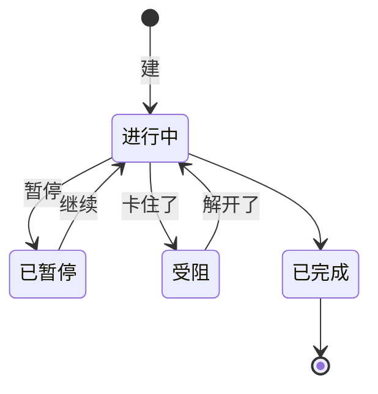

### 「自动往下推」这个授权不落盘

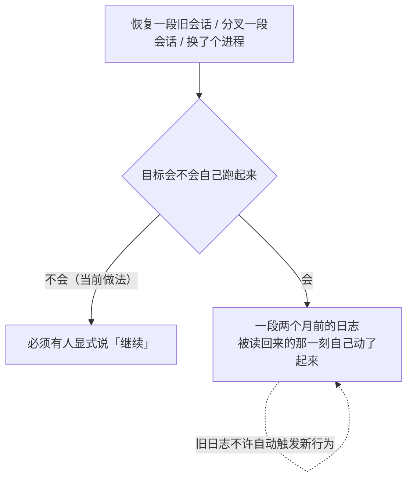

### 续推驱动：只在真正空闲的时候插一轮

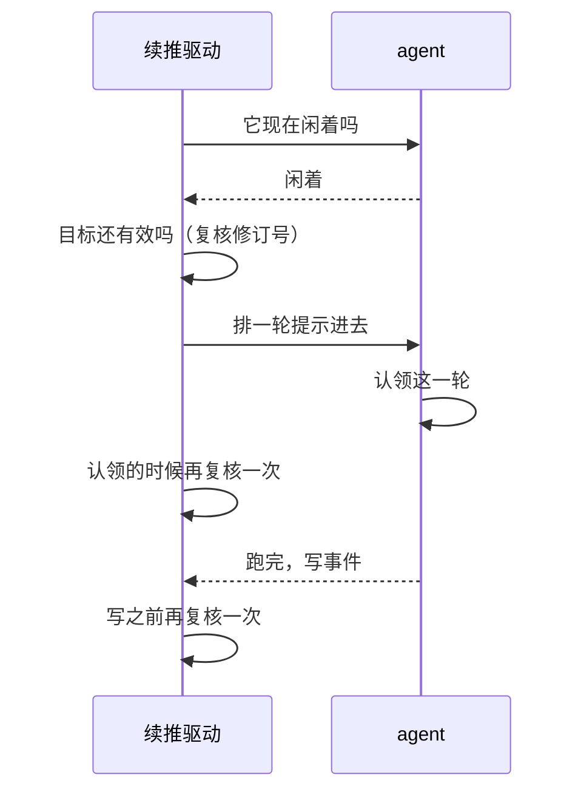

### 什么时候让步

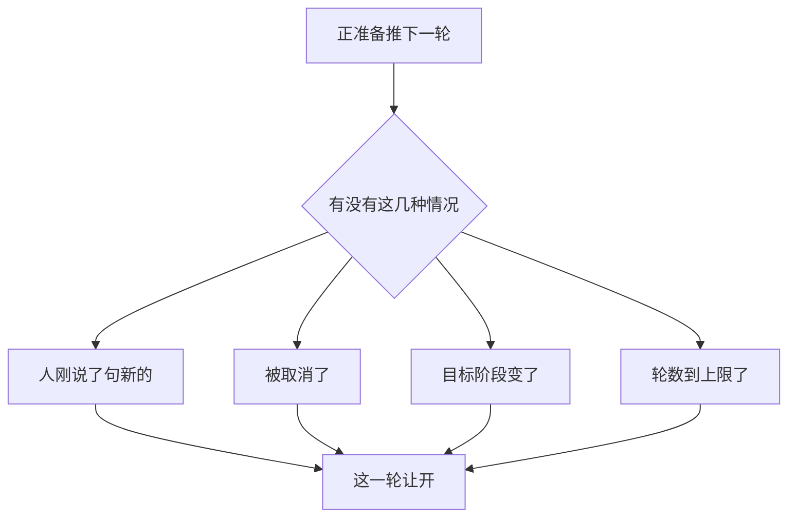

---

## 定时提醒

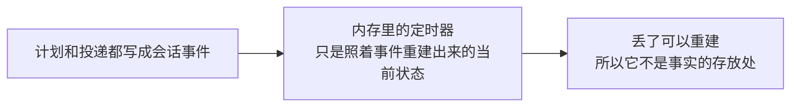

### 三种说法

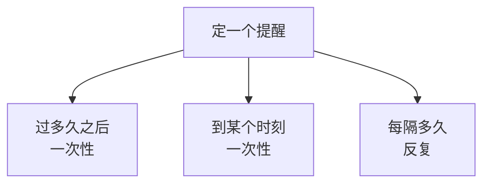

### 时间这件事上的三个决定

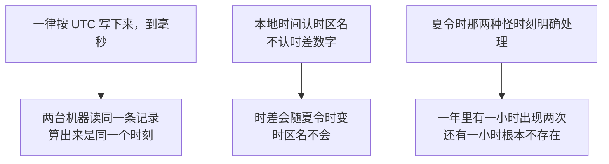

### 会话不在线的时候

```mermaid
flowchart TD
    A["到点了，可那个会话没开着"] --> B["这条提醒挂成「已过期未投递」"]
    B --> C["等那个会话回来了再投"]
    D["周期提醒睡了三天"] --> E["醒来只响最新的那一次"]
    E -.->|"不把错过的几十次<br/>一口气全补出来"| E
```

### 先写事件，再动定时器

```mermaid
flowchart LR
    subgraph BAD["反过来"]
        A1["先改定时器"] --> A2["再写事件"] --> A3["事件没写成"]
        A3 --> A4["于是有一个日志里根本不存在的提醒<br/>在到点的时候响了"]
    end
```

```mermaid
flowchart LR
    subgraph GOOD["当前做法"]
        B1["先提交事件"] --> B2["成了再更新定时器"]
        B2 --> B3["写不成 ＝ 这次计划压根没发生"]
    end
```

### 投递是原会话本地的

```mermaid
flowchart LR
    A["到点了往原来那个会话投"] --> B["不是一套跨集群、保证只投一次的调度服务"]
    B --> C["多实例部署要宿主自己解决<br/>「这个会话归哪台机器」"]
```

---

## Ralph 工作流

```mermaid
flowchart LR
    A["一个不变的目标"] --> B["每一轮开一个全新的子 agent"]
    B --> C["它只拿到：目标 ＋ 上一轮的一份有界报告"]
    C -.->|"不继承前几轮的聊天记录"| C
```

### 为什么每轮都换新的

```mermaid
flowchart TD
    subgraph BAD["一路带着历史往下滚"]
        A1["第 8 轮的上下文里<br/>塞着前 7 轮的全部弯路"]
        A1 --> A2["越滚越长，还越滚越偏<br/>早期那些错误的判断一直在场"]
    end
```

```mermaid
flowchart TD
    subgraph GOOD["每轮从零开始"]
        B1["长期事实放在共享工作区里"]
        B2["轮与轮之间只传一份结构化报告"]
        B1 --> B3["新一轮的上下文<br/>只有目标和刚才那一步的结论"]
        B2 --> B3
    end
```

### 一轮接一轮

```mermaid
sequenceDiagram
    participant T as Ralph 工具
    participant W1 as 子 agent 第 1 轮
    participant W2 as 子 agent 第 2 轮
    T->>W1: 目标（没有上一轮报告）
    W1-->>T: 结构化报告
    T->>T: 校验报告格式
    T->>W2: 目标 ＋ 第 1 轮的报告
    W2-->>T: 结构化报告
    T->>T: 继续 / 完成 / 受阻 / 到上限
```

### 「做完了」只被转述，不被采信

```mermaid
flowchart LR
    A["子 agent 报告说完成了"] --> B["本模块校验这份报告的格式"]
    B --> C["然后原样转述出去"]
    C -.->|"它证明不了<br/>工作区里的结果是对的"| C
```

### 它是个前台工具

```mermaid
flowchart LR
    A["Ralph 跑在一次工具调用里"] --> B["调用方在等它"]
    C["要在后台派活儿"] --> D["用后台作业，或者普通的子 agent 派发"]
```

```mermaid
flowchart LR
    A["实现是一个写死的 Go 循环"] --> B["不跑用户脚本"]
    B --> C["也不是一个通用的脚本工作流引擎"]
```

---

## 生命周期与并发

```mermaid
flowchart TD
    A["状态改动在写入点串起来"] --> A1["回调一律在内部锁外跑"]
    B["目标和提醒从事件日志重整"] --> B1["内存那份可以随时丢弃重建"]
    C["作业和 Ralph 的状态"] --> C1["丢了就是丢了"]
    D["拥有者的作用域关掉"] --> D1["挂在它上面的作业一并取消回收"]
```

### 每一个边界都要复核一次

```mermaid
flowchart LR
    A["排队的时候查一次"] --> B["认领的时候再查一次"] --> C["写事件之前又查一次"]
    C --> D["因为这三步之间隔着时间<br/>人可能在任何一处改了配置"]
    D -.->|"一个旧任务不许盖掉新配置"| D
```

---

## 失败语义

```mermaid
flowchart TD
    A["出了岔子"] --> B{"哪一类"}
    B -->|"取消"| C["取消是一个请求，不是一个结论"]
    C --> C1["最终状态以执行方实际结算为准<br/>中间那段照样可能跑完"]
    B -->|"等待超时"| D["交出当前快照<br/>不伪装成作业失败"]
    B -->|"定时落盘失败"| E["等于这次计划没有发生"]
    B -->|"清理某一项失败"| F["继续清其余的<br/>最后把多个失败汇总交出去"]
    B -->|"模型报告「完成」"| G["只校验格式并转述<br/>不采信"]
```

---

## 能力边界

```mermaid
flowchart TD
    Y["这一块做的"] --> Y1["把超出单次回合的活儿接住"]
    Y --> Y2["按「状态存在哪儿」给出四种不同的耐久性"]
    Y --> Y3["复用同一套 agent 与工具设施"]
    N["不做的"] --> N1["不提供通用的图形化 / 脚本工作流引擎"]
    N --> N2["不保证内存里的作业活过重启"]
    N --> N3["不当分布式定时器、队列或选主服务"]
    N --> N4["不自动认定模型说的「目标完成了」是真的"]
    N --> N5["不绕过 agent、工具和存储那几层的权限"]
```

## 对应的 DSH 能力

本篇是汇总文档，下表是它覆盖的各篇详细模块文档的并集，由 [`docs/packages.md`](../packages.md) 与 [能力覆盖表](../portmap/capability-coverage.tsv) join 得到。

| 上游能力 | DSH 包 | 裁决 | 落在哪个 Go 包 | 这里缺什么 |
|---|---|---|---|---|
| 面向用户的/goal控制，基于ctx.goals实现，提供状态展示和create/edit/pause/resume/clear命令 | `goal/command-goal` | 需要 | `feature/goal/goalcommand` | — |
| 事件溯源的同会话目标状态，维持当前待完成目标和续行权限 | `goal/goal` | 需要 | `feature/goal` `feature/goal/goaltool` | — |
| ctx.goals的同会话续行驱动器，把phase为active且已启用续行的目标转换为连续Goal Round | `goal/goal-round-driver` | 需要 | `feature/goal/goalrounddriver` | — |
| ctx.goals的面向模型控制API：get_goal、create_goal和update_goal | `goal/tool-goal` | 需要 | `feature/goal/goaltool` | — |
| 后台任务注册表约定，为长时间运行的生产方提供共享id、owner隔离、读取、取消、等待、通知和清理 | `jobs/jobs` | 需要 | `feature/jobs` | — |
| ctx.jobs注册表约定的进程本地实现，把每条记录保存在内存中并按kind签发id | `jobs/jobs-local` | 需要 | `adapter/domainjobs` `adapter/localjobs` | — |
| ctx.jobs的面向模型控制器，提供job_output、job_list和job_kill三个与kind无关的工具 | `jobs/tool-jobs` | 需要 | `feature/jobs/jobstool` | — |
| 为未来创建的live根agent提供三个会话范围内的工具管理持久提醒 | `schedule/schedule` | 需要 | `feature/schedule` | — |
| 基于已配置provider的面向模型委派工具，前台或后台执行subagent任务 | `subagent/tool-subagent` | 需要 | `feature/workflow/toolralph` | 缺一角：子 agent 的模型选择授权表。descriptor.go 的 AgentProvider／AgentModel 是装配期定死的，模型自己挑不了，也没有「许挑哪几条路由」的授权表。补的入口：工具 schema 加 provider／model／reasoning_effort，授权表以 subagent/model-selection-policy 事件进日志（只进日志不进模型历史），配一个投影单元读回来 |
| 面向模型的ralph工具，运行固定的前台工作流把目标依次交给多个全新子agent | `workflow/tool-ralph` | 需要 | `feature/workflow/toolralph` | — |
| 工作流seam定义脚本、运行、结果、错误和事件契约，worker-thread是当前引擎实现 | `workflow/workflow` | 需要 | `feature/workflow` | 缺一角：只有接缝没有引擎。脚本正文、meta 校验、组合子那套 API 都留给实现方兑现，本仓库不带产出方；Ralph 不经过这条接缝，它的编排写死在循环里 |

## 相关源码

| 路径 | 内容 |
|---|---|
| `feature/jobs/` | 作业契约、状态和 Registry |
| `adapter/localjobs/` | 进程内作业实现 |
| `feature/jobs/jobstool/` | 模型作业工具 |
| `feature/goal/` | 目标事件、状态、revision 和服务 |
| `feature/goal/goalrounddriver/` | 空闲续推驱动 |
| `feature/goal/goaltool/`、`feature/goal/goalcommand/` | 模型工具与宿主命令入口 |
| `feature/schedule/` | 耐久计划、时间解析和投递运行时 |
| `feature/workflow/` | 工作流能力接缝：开工请求、运行句柄、六条生命周期边 |
| `feature/workflow/toolralph/` | 固定多轮子 Agent 工作流 |

## 深入阅读

[后台作业](jobs.md) · [长期目标](goal.md) · [耐久提醒](schedule.md) · [工作流与 Ralph](ralph.md)
