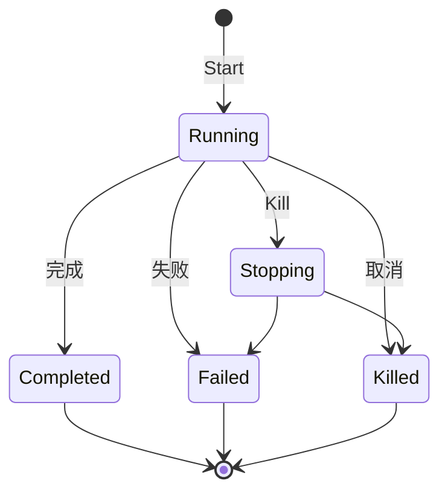

# 后台任务、目标与工作流

本模块承载超出单次 Agent 回合的工作：后台作业、耐久目标、定时提醒和固定的多轮子 Agent 工作流。

## 能力划分

| 能力 | 状态来源 | 执行方式 |
|---|---|---|
| 后台作业 `jobs/*` | 进程内 Registry | Producer 启动、流式读取、等待或取消 |
| 目标 `goal/*` | 会话事件日志 | Agent 空闲时按授权自动续推 |
| 定时任务 `feature/schedule` | 会话事件日志 | 进程内定时器到期后向原会话投递 |
| Ralph `feature/workflow/toolralph` | 当前工具调用 | 每轮创建全新子 Agent，传递有界报告 |

这些能力共享 Agent 和工具基础设施，但没有合并成一个万能工作流引擎。每种状态的耐久性、取消语义和权限边界不同。

## 后台作业

`feature/jobs` 定义作业状态、快照、输出和 Registry 接口；`adapter/localjobs` 提供进程内实现；`feature/jobs/jobstool` 暴露模型可用的查看、读取、等待和终止能力。

- 每个拥有者有独立并发上限。
- 列表、读取和通知按 Agent 所有权过滤。
- 输出流可以增量读取，最终结果可重复读取。
- 等待超时返回当前快照，不把超时伪装成作业失败。
- 拥有者作用域释放时取消并回收所属作业。

本地 Registry 不持久化，进程退出后不能恢复作业本身。需要耐久后台执行时，宿主应实现 `jobs.Registry` 并把实际执行交给任务平台。

## 长期目标

`feature/goal` 用 `goal/change` 事件保存完整目标快照，并以 revision 做 compare-and-set。目标阶段是耐久状态：`active`、`paused`、`blocked`、`complete`。

自动续推授权是进程内状态，不落盘。恢复、分叉或换进程后目标默认不自动运行，必须显式 Resume，避免旧日志自动触发新行为。

`feature/goal/goalrounddriver` 在 Agent 真正空闲时排入下一轮提示，并在排队、认领、写入事件等边界反复确认目标仍有效。用户新消息、取消、阶段变化或轮数上限都会使本轮让步。`goaltool` 提供模型工具，`goalcommand` 提供宿主命令接入。

## 定时任务

`feature/schedule` 把计划和投递写入会话事件，内存定时器只是可重建的当前状态。

- `after` 和 `at` 是一次性提醒；`every` 是固定频率提醒。
- 时间统一写为 UTC RFC 3339 毫秒格式。
- 本地时间支持 IANA 时区，明确处理夏令时重复和不存在的时刻。
- 会话不在线时提醒保持 overdue，恢复原会话后再投递。
- 周期提醒恢复时跳过错过的中间次数，不集中补发。
- 事件先提交，定时器后更新；落盘失败等于计划没有改变。

当前投递是原会话本地语义，不是跨集群保证一次的调度服务。多实例部署需要宿主提供会话归属或外部调度协调。

## Ralph 工作流

`feature/workflow/toolralph` 面向一个不可变目标循环创建全新子 Agent。每轮只接收目标和上一轮的有界结构化报告，不继承前几轮聊天记录；长期事实放在共享工作区中。

实现是固定 Go 循环，不执行用户脚本，也不包含通用脚本工作流引擎。完成和阻塞来自子 Agent 报告，本模块只校验和转述，不能证明工作区中的结果正确。Ralph 是前台工具调用；后台任务使用 jobs 或普通子 Agent 派发。

## 并发与失败处理

- 状态变化在写入或结算点串行化，回调在内部锁外运行。
- 取消是请求，最终状态以执行方实际结算为准。
- 目标和定时状态从事件日志重新整理，内存状态可以丢弃重建。
- 自动续推和定时投递都在每个边界复核当前 revision，旧任务不能覆盖新配置。
- 清理会继续处理其余任务，并汇总多个失败。

## 能力边界

本模块不负责：

- 提供 BPMN、DAG 或任意脚本工作流引擎。
- 保证进程内作业在重启后继续执行。
- 充当分布式定时器、队列或领导者选举服务。
- 自动认定模型报告的目标已经真实完成。
- 绕过 Agent、工具和存储层的租户权限。

## 相关源码

| 路径 | 内容 |
|---|---|
| `feature/jobs/` | 作业契约、状态和 Registry |
| `adapter/localjobs/` | 进程内作业实现 |
| `feature/jobs/jobstool/` | 模型作业工具 |
| `feature/goal/` | 目标事件、状态、revision 和服务 |
| `feature/goal/goalrounddriver/` | 空闲续推驱动 |
| `feature/goal/goaltool/`、`feature/goal/goalcommand/` | 模型工具与宿主命令入口 |
| `feature/schedule/` | 耐久计划、时间解析和投递运行时 |
| `feature/workflow/toolralph/` | 固定多轮子 Agent 工作流 |

## 深入阅读

[后台作业](jobs.md) · [长期目标](goal.md) · [耐久提醒](schedule.md) · [Ralph 工作流](ralph.md)
