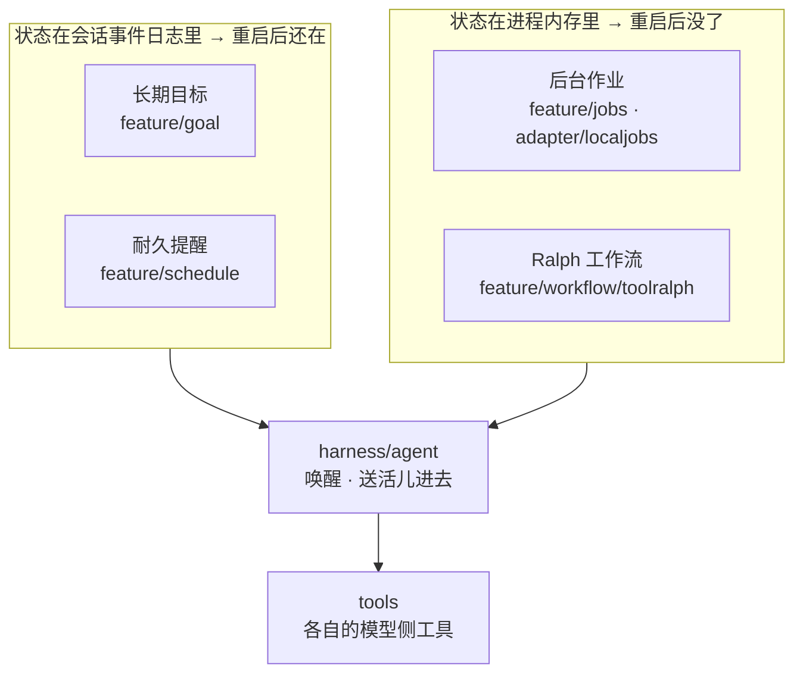
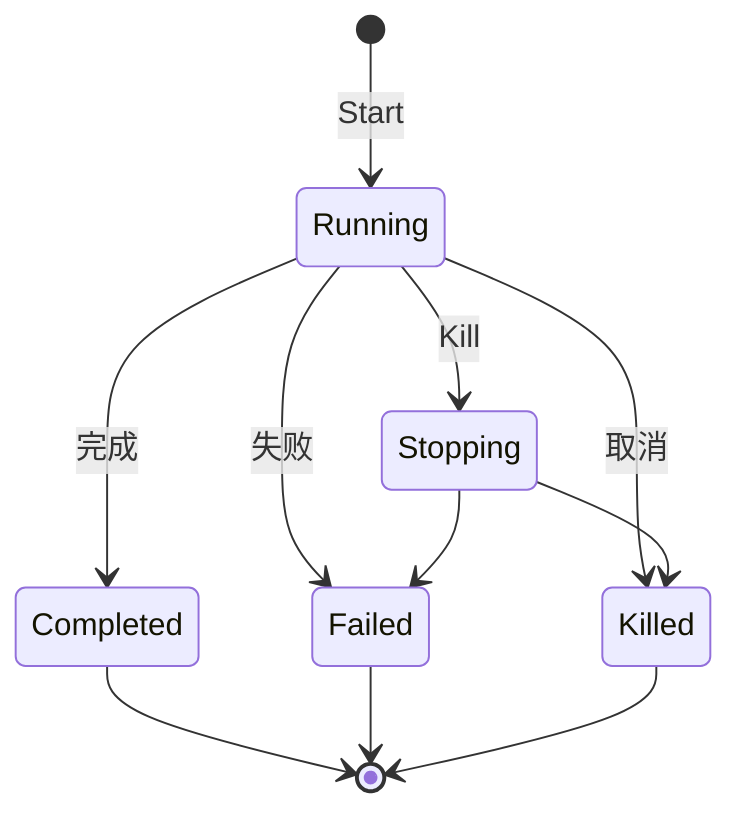

# 后台任务、目标与工作流

本模块承载超出单次 Agent 回合的工作：后台作业、耐久目标、定时提醒和固定的多轮子 Agent 工作流。

## 定位

| 能力 | 状态来源 | 执行方式 |
|---|---|---|
| 后台作业 `jobs/*` | 进程内 Registry | Producer 启动、流式读取、等待或取消 |
| 目标 `goal/*` | 会话事件日志 | Agent 空闲时按授权自动续推 |
| 定时任务 `feature/schedule` | 会话事件日志 | 进程内定时器到期后向原会话投递 |
| Ralph `feature/workflow/toolralph` | 当前工具调用 | 每轮创建全新子 Agent，传递有界报告 |

这些能力共享 Agent 和工具基础设施，但没有合并成一个万能工作流引擎。每种状态的耐久性、取消语义和权限边界不同。

## 架构

四种能力的真正分界不是「做什么」，是**状态存在哪儿**——这一条决定了进程重启之后它还在不在：

上面两个把事件写进日志、内存里那份只是可重建的当前状态；下面两个不写日志，重启就得重来。**这不是实现进度的差别，是各自该有的样子**：一个「三天后提醒我」必须活过重启，一个正在跑的子进程活不过。

四种能力都从 `harness/agent` 那一层拿唤醒和送活儿的入口，都不自己开循环。

## 后台作业

`feature/jobs` 定义作业状态、快照、输出和 Registry 接口；`adapter/localjobs` 提供进程内实现；`feature/jobs/jobstool` 暴露模型可用的查看、读取、等待和终止能力。

- 每个拥有者有独立并发上限。
- 列表、读取和通知按 Agent 所有权过滤。
- 输出流可以增量读取，最终结果可重复读取。
- 等待超时返回当前快照，不把超时伪装成作业失败。
- 拥有者作用域释放时取消并回收所属作业。

本地 Registry 不持久化，进程退出后不能恢复作业本身。需要耐久后台执行时，宿主应实现 `jobs.Registry` 并把实际执行交给任务平台。

## 长期目标

`feature/goal` 用 `goal/change` 事件保存完整目标快照，并以 revision 做 compare-and-set。目标阶段是耐久状态：`active`、`paused`、`blocked`、`complete`。

自动续推授权是进程内状态，不落盘。恢复、分叉或换进程后目标默认不自动运行，必须显式 Resume，避免旧日志自动触发新行为。

`feature/goal/goalrounddriver` 在 Agent 真正空闲时排入下一轮提示，并在排队、认领、写入事件等边界反复确认目标仍有效。用户新消息、取消、阶段变化或轮数上限都会使本轮让步。`goaltool` 提供模型工具，`goalcommand` 提供宿主命令接入。

## 定时任务

`feature/schedule` 把计划和投递写入会话事件，内存定时器只是可重建的当前状态。

- `after` 和 `at` 是一次性提醒；`every` 是固定频率提醒。
- 时间统一写为 UTC RFC 3339 毫秒格式。
- 本地时间支持 IANA 时区，明确处理夏令时重复和不存在的时刻。
- 会话不在线时提醒保持 overdue，恢复原会话后再投递。
- 周期提醒恢复时跳过错过的中间次数，不集中补发。
- 事件先提交，定时器后更新；落盘失败等于计划没有改变。

当前投递是原会话本地语义，不是跨集群保证一次的调度服务。多实例部署需要宿主提供会话归属或外部调度协调。

## Ralph 工作流

`feature/workflow/toolralph` 面向一个不可变目标循环创建全新子 Agent。每轮只接收目标和上一轮的有界结构化报告，不继承前几轮聊天记录；长期事实放在共享工作区中。

实现是固定 Go 循环，不执行用户脚本，也不包含通用脚本工作流引擎。完成和阻塞来自子 Agent 报告，本模块只校验和转述，不能证明工作区中的结果正确。Ralph 是前台工具调用；后台任务使用 jobs 或普通子 Agent 派发。

## 生命周期与并发

- 状态变化在写入或结算点串行化，回调在内部锁外运行。
- 目标和定时状态从事件日志重新整理，内存状态可以丢弃重建；作业和 Ralph 的状态丢了就是丢了。
- 自动续推和定时投递在**每个边界**复核当前 revision，旧任务不能覆盖新配置。
- 拥有者作用域释放时，挂在它上面的作业一并取消回收。
- 恢复、分叉或换进程之后目标默认不自动跑，必须显式 Resume——旧日志不许自动触发新行为。

## 失败语义

- **取消是请求，不是结论。** 最终状态以执行方实际结算为准，中间那段照样可能跑完。
- **等待超时交出当前快照，不伪装成作业失败。** 这两件事调用方要分得开。
- **落盘失败等于计划没有改变。** 定时是事件先提交、定时器后更新，反过来会出现一个日志里没有的提醒。
- **清理不中断。** 一个任务清理失败继续清其余的，最后汇总多个失败一起交出去。
- **模型报告的「完成」只被转述，不被采信。** Ralph 校验报告格式，但证明不了工作区里的结果是对的。

## 能力边界

本模块不负责：

- 提供 BPMN、DAG 或任意脚本工作流引擎。
- 保证进程内作业在重启后继续执行。
- 充当分布式定时器、队列或领导者选举服务。
- 自动认定模型报告的目标已经真实完成。
- 绕过 Agent、工具和存储层的租户权限。

## 对应的 DSH 能力

本篇是汇总文档，下表是它覆盖的各篇详细模块文档的并集，由 [`docs/packages.md`](../packages.md) 与 [能力覆盖表](../portmap/capability-coverage.tsv) join 得到。

| 上游能力 | DSH 包 | 裁决 | 落在哪个 Go 包 | 这里缺什么 |
|---|---|---|---|---|
| 面向用户的/goal控制，基于ctx.goals实现，提供状态展示和create/edit/pause/resume/clear命令 | `goal/command-goal` | 需要 | `feature/goal/goalcommand` | — |
| 事件溯源的同会话目标状态，维持当前待完成目标和续行权限 | `goal/goal` | 需要 | `feature/goal` `feature/goal/goaltool` | — |
| ctx.goals的同会话续行驱动器，把phase为active且已启用续行的目标转换为连续Goal Round | `goal/goal-round-driver` | 需要 | `feature/goal/goalrounddriver` | — |
| ctx.goals的面向模型控制API：get_goal、create_goal和update_goal | `goal/tool-goal` | 需要 | `feature/goal/goaltool` | — |
| 后台任务注册表约定，为长时间运行的生产方提供共享id、owner隔离、读取、取消、等待、通知和清理 | `jobs/jobs` | 需要 | `feature/jobs` | — |
| ctx.jobs注册表约定的进程本地实现，把每条记录保存在内存中并按kind签发id | `jobs/jobs-local` | 需要 | `adapter/domainjobs` `adapter/localjobs` | — |
| ctx.jobs的面向模型控制器，提供job_output、job_list和job_kill三个与kind无关的工具 | `jobs/tool-jobs` | 需要 | `feature/jobs/jobstool` | — |
| 为未来创建的live根agent提供三个会话范围内的工具管理持久提醒 | `schedule/schedule` | 需要 | `feature/schedule` | — |
| 基于已配置provider的面向模型委派工具，前台或后台执行subagent任务 | `subagent/tool-subagent` | 需要 | `feature/workflow/toolralph` | 缺一角：子 agent 的模型选择授权表。descriptor.go 的 AgentProvider／AgentModel 是装配期定死的，模型自己挑不了，也没有「许挑哪几条路由」的授权表。补的入口：工具 schema 加 provider／model／reasoning_effort，授权表以 subagent/model-selection-policy 事件进日志（只进日志不进模型历史），配一个投影单元读回来 |
| 面向模型的ralph工具，运行固定的前台工作流把目标依次交给多个全新子agent | `workflow/tool-ralph` | 需要 | `feature/workflow/toolralph` | — |
| 工作流seam定义脚本、运行、结果、错误和事件契约，worker-thread是当前引擎实现 | `workflow/workflow` | 需要 | `feature/workflow` | 缺一角：只有接缝没有引擎。脚本正文、meta 校验、组合子那套 API 都留给实现方兑现，本仓库不带产出方；Ralph 不经过这条接缝，它的编排写死在循环里 |

## 相关源码

| 路径 | 内容 |
|---|---|
| `feature/jobs/` | 作业契约、状态和 Registry |
| `adapter/localjobs/` | 进程内作业实现 |
| `feature/jobs/jobstool/` | 模型作业工具 |
| `feature/goal/` | 目标事件、状态、revision 和服务 |
| `feature/goal/goalrounddriver/` | 空闲续推驱动 |
| `feature/goal/goaltool/`、`feature/goal/goalcommand/` | 模型工具与宿主命令入口 |
| `feature/schedule/` | 耐久计划、时间解析和投递运行时 |
| `feature/workflow/` | 工作流能力接缝：开工请求、运行句柄、六条生命周期边 |
| `feature/workflow/toolralph/` | 固定多轮子 Agent 工作流 |

## 深入阅读

[后台作业](jobs.md) · [长期目标](goal.md) · [耐久提醒](schedule.md) · [工作流与 Ralph](ralph.md)
