# Workspace

对应包：`feature/workspace`

## 定位

会话攒到第三十条的时候，人就找不着东西了：

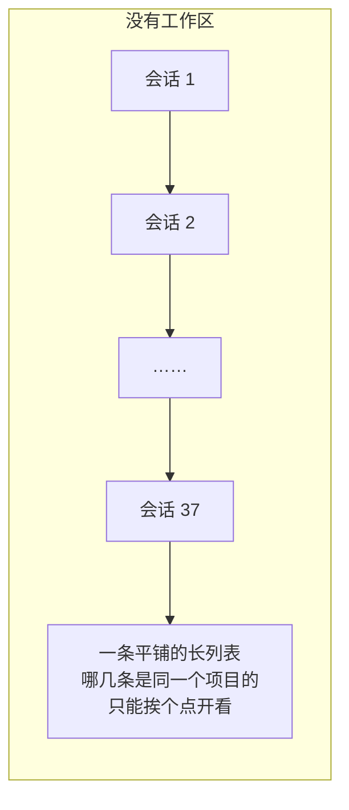

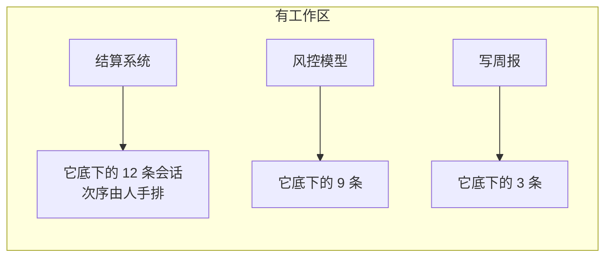

这个包就是那本**登记册**。一个工作区身上只有三样东西：

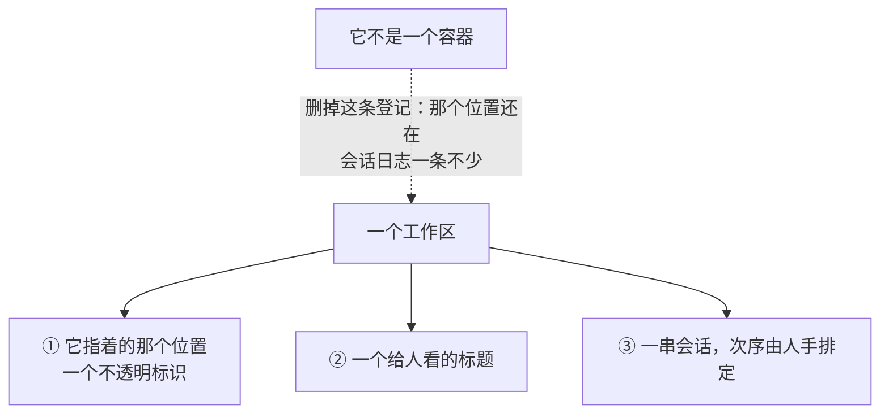

### 「工作区」不是你电脑上的一个文件夹

这是整篇里最容易想歪的一处，而想歪了会一路错到底：

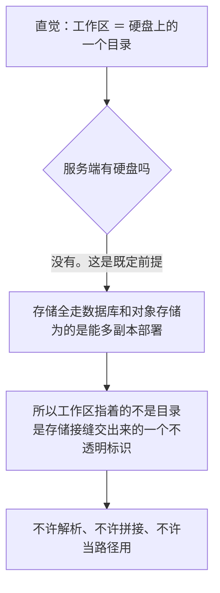

于是「身份」和「给人看的那条路径」被拆成两样，谁也不冒充谁：

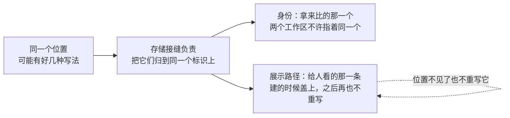

DSH 那份 TypeScript 代码里这两样是同一个字段，因为它的身份就是一条本机绝对路径：

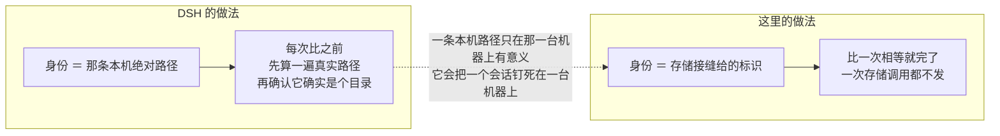

代价要写明白：这个标识是**存进介质**的，所以它对后端多了一条要求——同一个位置的标识必须跨进程重启保持不变。一个每次现分配的临时编号不满足；配上这样的后端，重启之后整册工作区会认不出自己指着哪儿。

---

## 架构

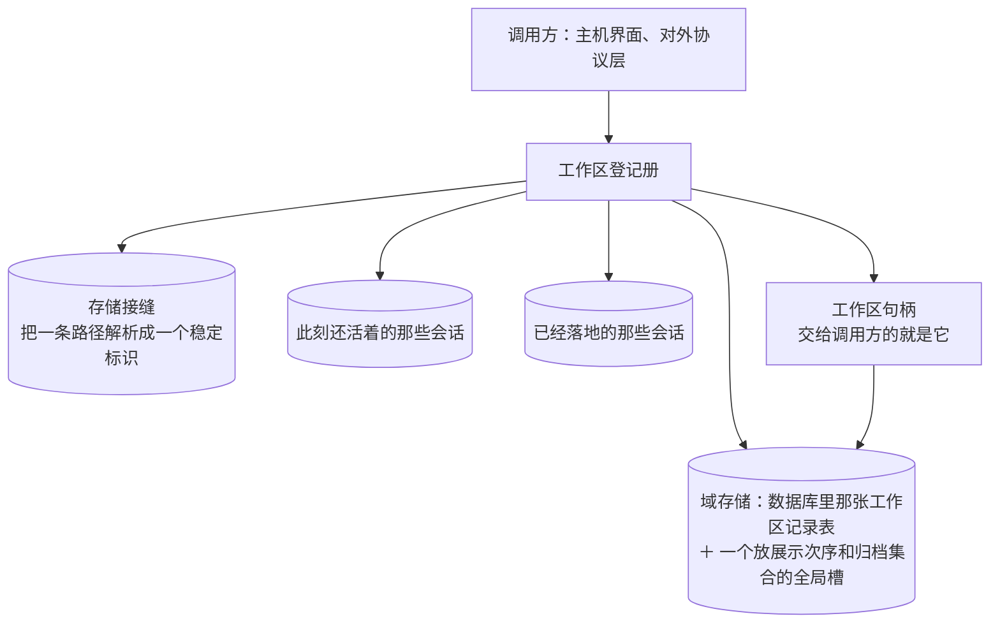

### 句柄只攥一把键，不攥记录

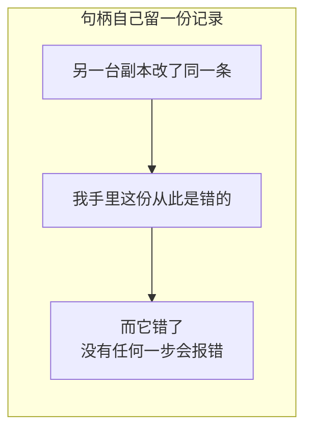

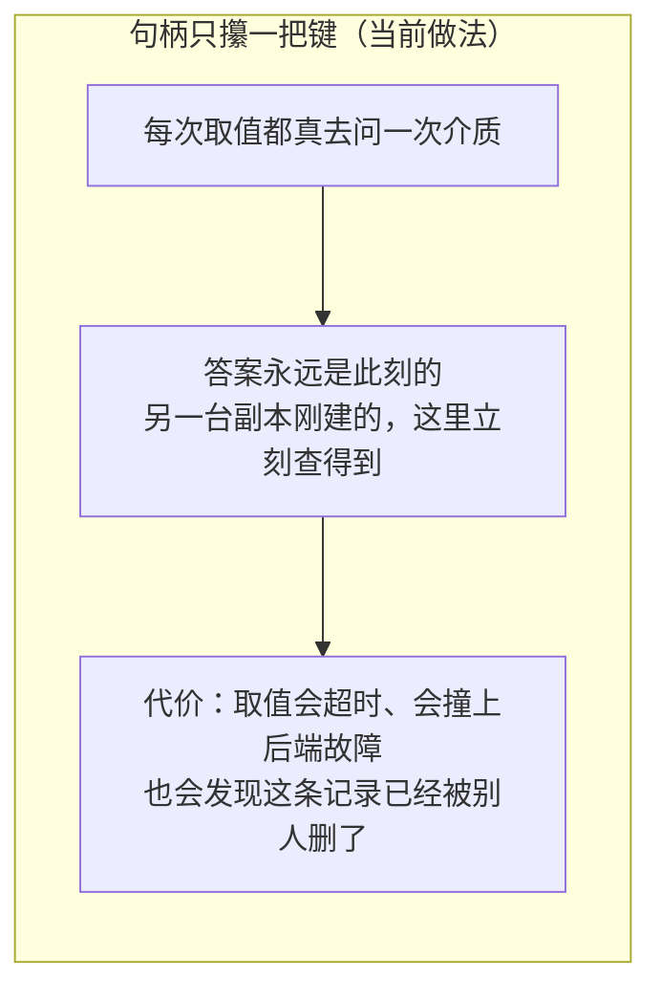

### 一个会话算不算这个工作区的

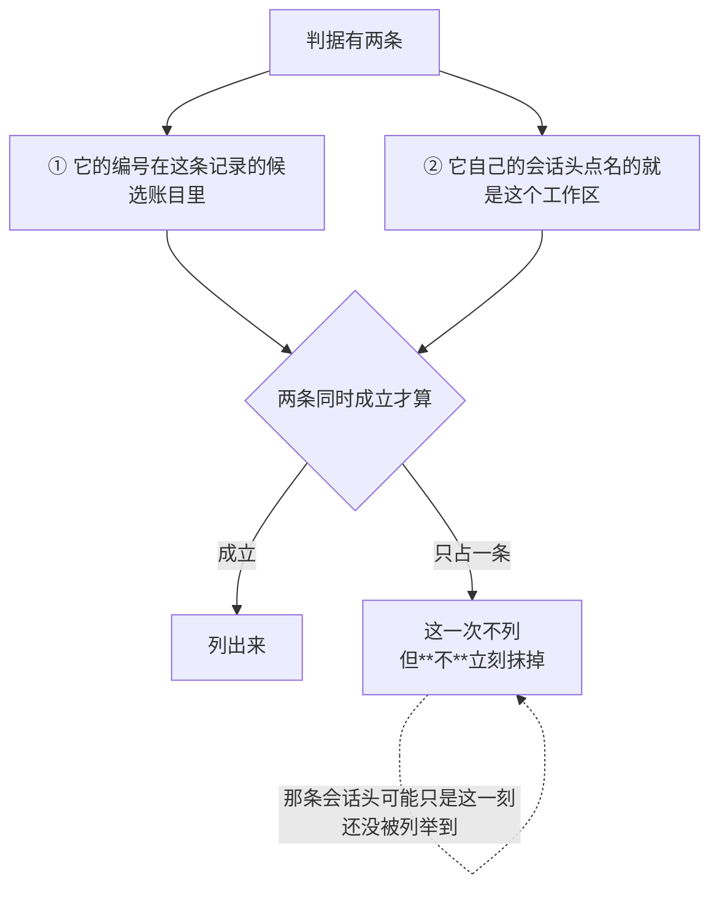

筛不出来的候选什么时候才真的删掉：

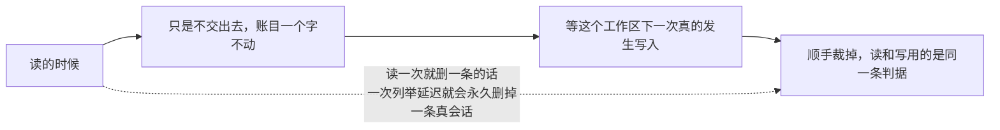

两处必须是同一条判据——否则读出来的和存下去的会慢慢分叉。

---

## 建一个工作区要改两处，中间可能断电

一次建工作区落两笔：表里那条记录，和全局槽里的次序。两笔之间机器没了，介质上就会出现「有记录没次序」或者反过来。

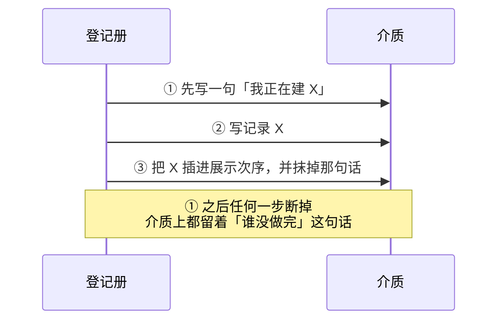

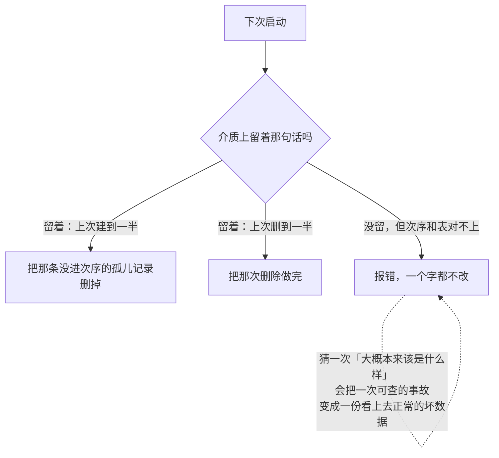

它**绝不**从一条记录的样子去倒推它当初是怎么来的。能被解释的分叉由那句话明确点名，剩下的一律大声报出来。

---

## 第一次打开：把历史会话收编回去

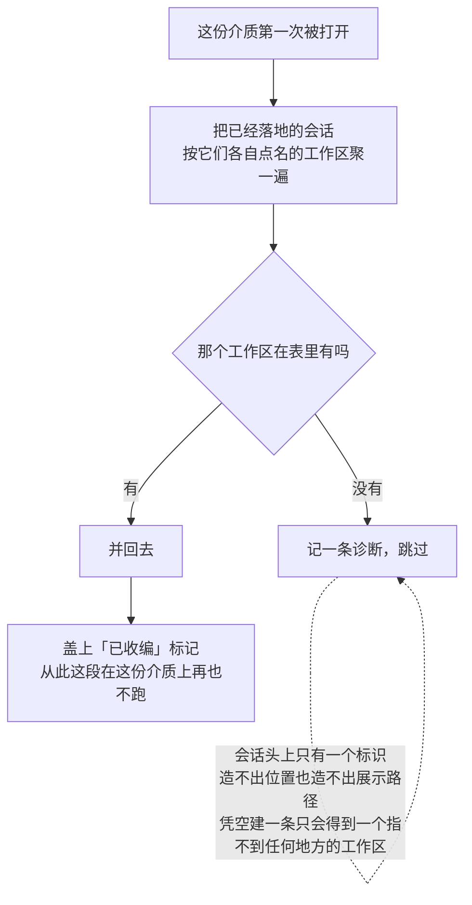

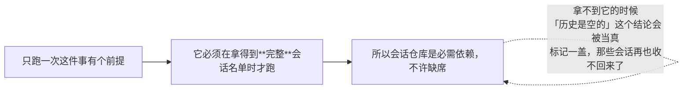

---

## 次序、归档：人手排的，机器不许动

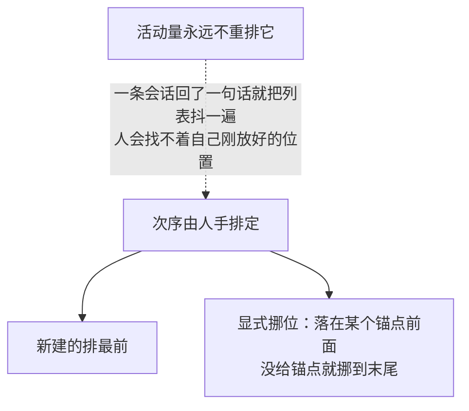

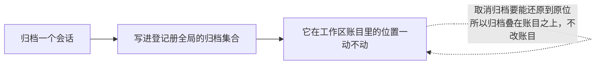

---

## 一次读回全部字段，还是分六次读

逐字段读之间**没有原子性**。别人的写可以夹在两次读中间：

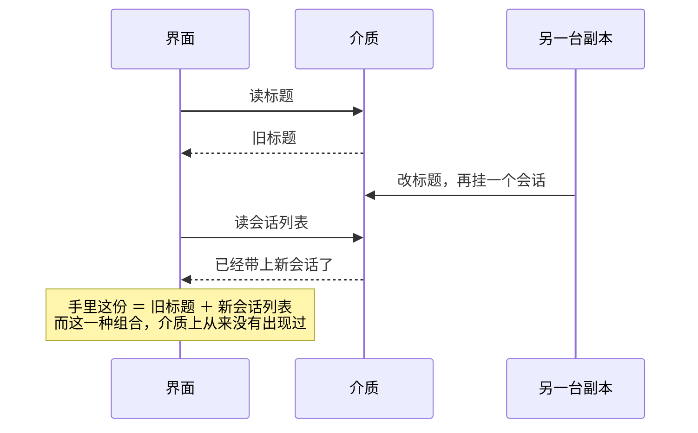

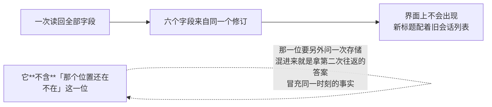

它只管**一个**工作区。连着读两个工作区仍然是两次读，中间照样可以夹着别人的写。

### 「那个位置还在不在」单独问

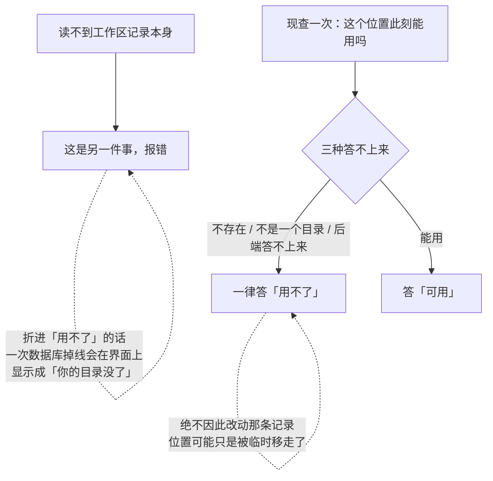

---

## 那条运行期不变量：有人绕过登记册直接写

```mermaid
flowchart TD
    A["有人绕过登记册<br/>直接往工作区记录表里写一条"] --> B["写进去的记录<br/>和展示次序、和归属账目各说各话"]
    B --> C["而没有任何一步会报错"]
    C --> D["所以它值得一条运行期不变量"]
```

判据是「记账」而不是「回头核对」：

```mermaid
flowchart LR
    subgraph BAD["变更一到就回头读一次介质核对"]
        A1["别的副本完全可以合法地<br/>插在这次提交和这次核对之间"] --> A2["读回来的和变更对不上"]
        A2 --> A3["误报"]
        A3 -.->|"一条会误报的检查比没有检查更糟<br/>它教会所有人忽略它"| A3
    end
```

```mermaid
flowchart LR
    subgraph GOOD["只认自己记的那一笔（当前做法）"]
        B1["每次登记册发起的写都记一笔<br/>变更是在写的过程里同步发的<br/>所以那笔账必然还举着"] --> B2["一条针对这张表、<br/>而账上查无此人的变更<br/>只可能来自一次绕过"]
        B2 --> B3["不碰介质，也不给每次写<br/>多加一趟数据库往返"]
        B3 --> B4["只抓得住本进程内的绕过<br/>漏报可以接受，误报不行"]
    end
```

---

## 生命周期与并发

```mermaid
stateDiagram-v2
    [*] --> 打开中: Open
    打开中 --> 可用: 收完上次没做完的那句话 → 校验介质 → 必要时收编一次历史
    打开中 --> [*]: 中途失败就把已经开出来的域关掉
    可用 --> 可用: 每次操作之前，先把上次遗留的那句话收掉
    可用 --> 已关闭: Close
    已关闭 --> 已关闭: 再关一次是空操作
```

```mermaid
flowchart TD
    A["两把锁，分工不同，**不许合并**"] --> B["一把：把建、删、挪位、归档串成一列"]
    A --> C["一把：只保会话头索引"]
    B -.->|"合并的话，一次写会等一把自己已经握着的锁——死锁"| C
    D["句柄没有任何可变状态"] --> E["多个协程同时用它没问题"]
    F["交出去的列表都是新的一份"] --> G["调用方拿去排序、追加，碰不到别处"]
```

```mermaid
flowchart LR
    A["写的时候另一台副本插了进来"] --> B["按修订号整轮重来"]
    B --> C["所以那段写函数可能被跑不止一次"]
    C -.->|"它因此不许有副作用"| C
    D["幂等判断看的是<br/>轮到它那一刻从介质上读回来的值"] --> E["不是调用方手上那份旧快照"]
```

---

## 失败语义

```mermaid
flowchart TD
    A["出了岔子"] --> B{"哪一类"}
    B -->|"路径解析不出来 / 不是一个目录"| C["这条路径不能拿来建工作区"]
    B -->|"要挂上来的会话过不了归属判据"| D["拒绝，且一个字不写"]
    B -->|"挪位点名了一个不在列表里的锚点"| E["拒绝，且一个字不写"]
    B -->|"这个句柄指着的记录已经被别人删了"| F["单独一种：「这个工作区没了」"]
    B -->|"介质自相矛盾，且没有那句话解释得了"| G["报错，绝不猜着修"]
    B -->|"数据库、存储、会话仓库自己出故障"| H["原样报出来"]
    F -.->|"折进上面那两类<br/>会让一次正当的删除读起来像一场事故"| F
    H -.->|"绝不塌成「这个会话不存在」<br/>否则一次掉线会变成一次拒绝归档"| H
```

```mermaid
flowchart LR
    A["落盘失败"] --> B["介质不改，变更也不发"]
    C["善后也失败了"] --> D["原本那条失败和善后那条一起交出去"]
    D -.->|"谁都不许被另一个盖掉"| D
```

---

## 能力边界

```mermaid
flowchart TD
    Y["这个包做的"] --> Y1["记「哪些会话属于哪个位置」"]
    Y --> Y2["记一份人手排定的次序，和一份归档集合"]
    Y --> Y3["断电之后把没做完的那次写收干净"]
    N["不做的"] --> N1["不建目录、不动代码仓库<br/>删掉一条登记，会话日志一条不少"]
    N --> N2["不做路径规范化<br/>「同一个位置的两种写法」由存储接缝回答"]
    N --> N3["不提供用户、团队或者权限模型<br/>谁能看、谁能改，不在这里回答"]
    N --> N4["不实现自己的存储<br/>会话仓库只用来确认归属，不是它的数据库"]
    N --> N5["不做断线重连的增量传输<br/>重连就重取整值"]
    N --> N6["不承诺跨工作区的一致读<br/>连着读两个仍然是两次读"]
```

## 对应的 DSH 能力

下表由 [`docs/packages.md`](../packages.md) 与 [能力覆盖表](../portmap/capability-coverage.tsv) 机器 join 得到：本篇覆盖的 Go 包，承接的是上游 DSH 的哪几条能力，以及各自还缺什么。落点列由源码里的 `// 源:` 注释反查，不是手写的。

| 上游能力 | DSH 包 | 裁决 | 落在哪个 Go 包 | 这里缺什么 |
|---|---|---|---|---|
| Host 的 ctx.workspaceController 与 Client workspace namespace，负责 Workspace 增删改序、Session 重排与归档、完整 Workspace 投影跟随，并拥有选目录 seam | `api/workspace-controller` | 取形重写 | `feature/workspace` | 缺口已补：一次读回全部字段的自洽快照落在 feature/workspace 的 Snapshot（多带 TargetKey、不带 Status）。baseline＋增量那一半是有意不落——Go 侧同一语义由 sessionlog/projection 的整值投影承担，重连重取整值 |
| Workspace实体注册表，持久化workspace记录、顺序、会话归属索引，支持创建/删除/排序/归档操作 | `workspace/workspace` | 需要 | `feature/workspace` | — |

## 相关源码

- `feature/workspace/registry.go`
- `feature/workspace/entity.go`
- `feature/workspace/spec.go`
- `feature/workspace/types.go`
- `feature/workspace/invariant.go`
