# 性能与压力基线

## 这份文档要回答什么

一个运行时跑得快不快，通常没法拿一个数说清。真正要防的是另一件事：**某次改动悄悄让一条本该恒定的路径变成了随规模增长的路径**，而这件事在小数据上完全看不出来。

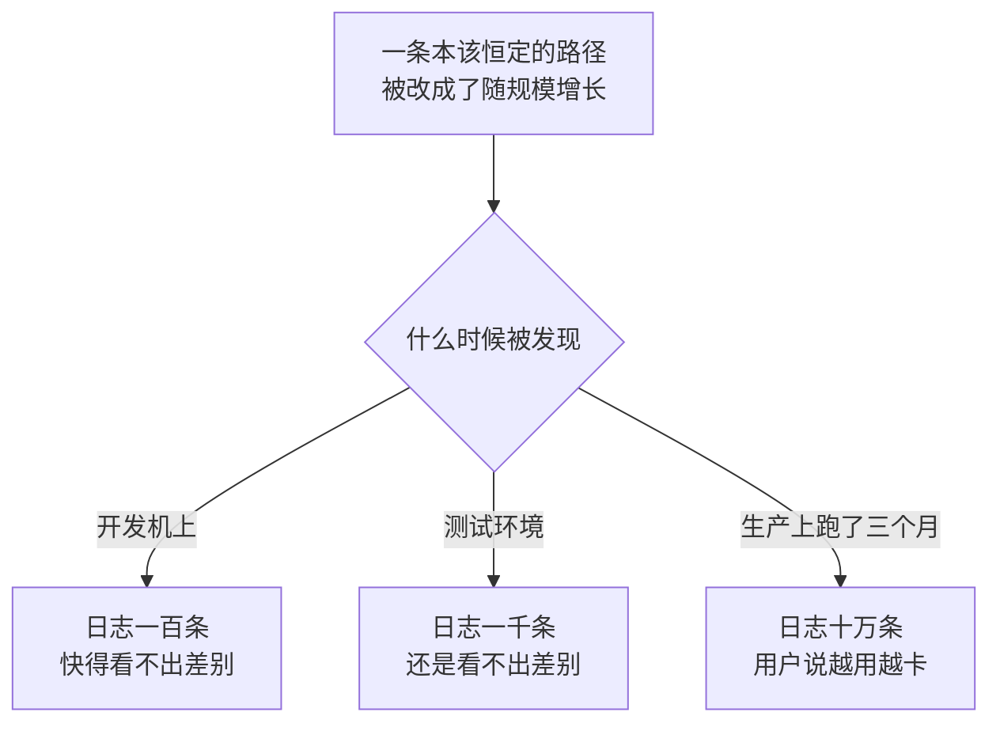

所以这份文档记的不是「快多少」，是**每条路径的曲线该长什么样**，以及实测出来它到底长什么样。

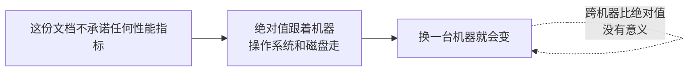

有意义的只有两件事：

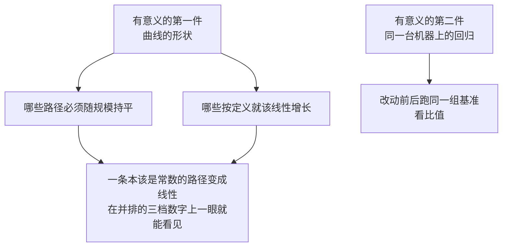


---

## 两种形状，只有一种是问题

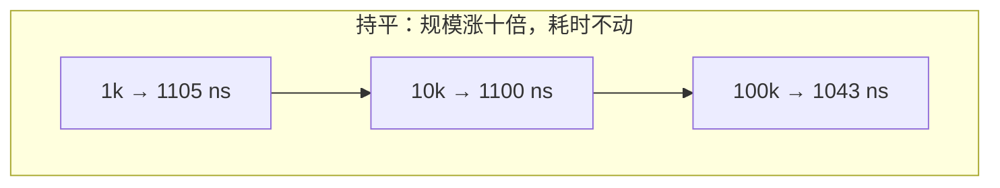

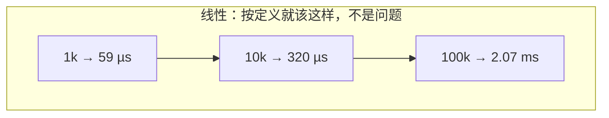

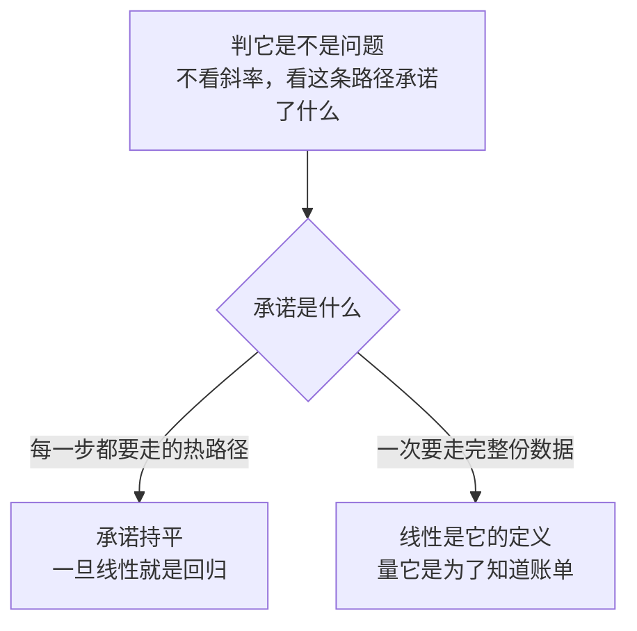

---

## 怎么复现

```
go test ./harness/session ./harness/agent ./scope \
        ./feature/persistence ./protocol/sdk/sdkprotocol \
        -run '^$' -bench . -benchmem -timeout 3600s
```

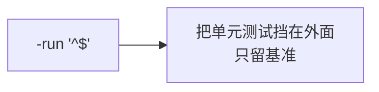

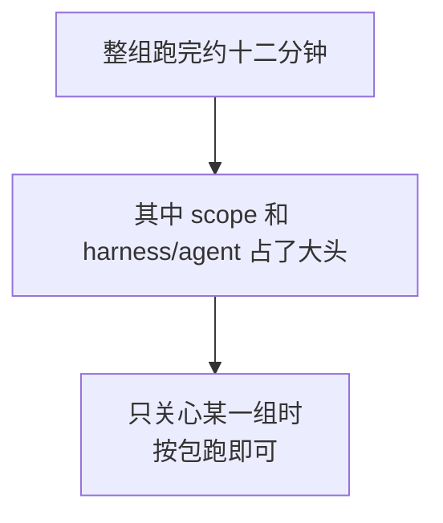


---

## 测量环境

| 项 | 值 |
|---|---|
| CPU | AMD Ryzen 9 7845HX（`-24`，即 GOMAXPROCS=24） |
| GOOS / GOARCH | windows / amd64 |
| 磁盘 | 本机 NVMe SSD，测试用临时目录下的真实文件，真的 fsync |
| 采样日期 | 2026-09-01 |

---

## 长会话

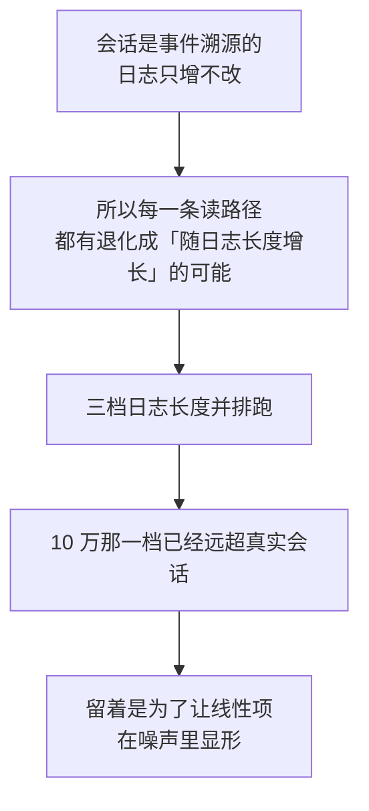

| Benchmark | 1k | 10k | 100k | 期望形状 |
|---|---|---|---|---|
| `SessionAppendOnLongLog` | 1105 ns | 1100 ns | 1043 ns | **持平** |
| `SessionDeriveMessagesIncremental` | 86.7 µs | 360 µs | 1.66 ms | 线性（见下） |
| `SessionEventsSnapshot` | 59.3 µs | 320 µs | 2.07 ms | 线性 |
| `SessionDeriveMessagesCold` | 7.28 ms | 68.2 ms | 562 ms | 线性 |
| `SessionRestoreFromSeed` | 7.75 ms | 70.9 ms | 737 ms | 线性 |

### 追加是常数的，这条是最该盯的回归线

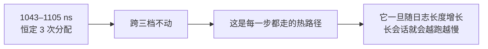

### 增量派生的线性来自那次防御性拷贝，不是折叠

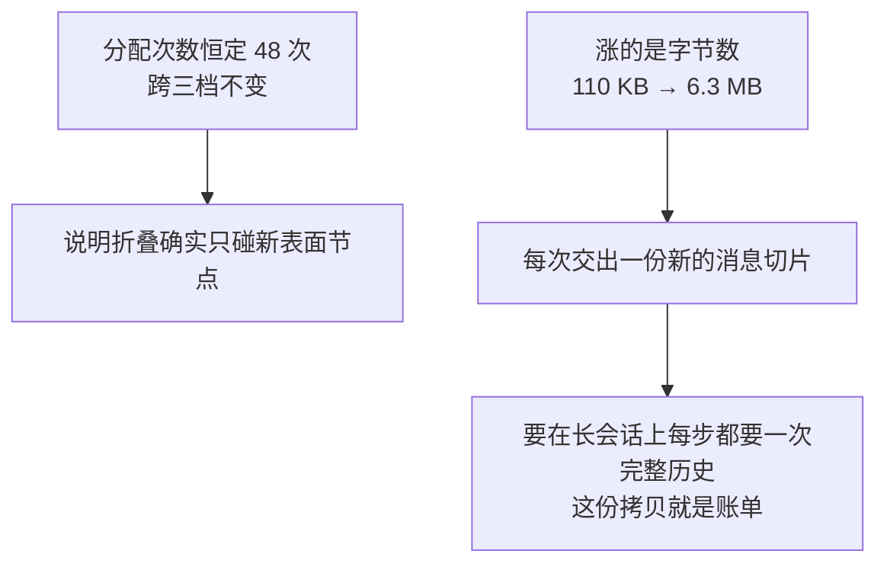

### 快照同理，但它是「失效之后」那一次

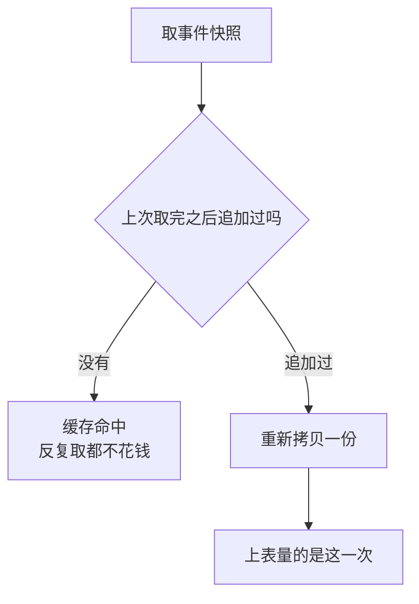


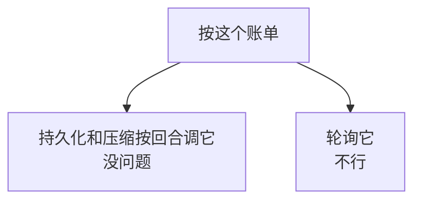

### 冷启动按定义线性，量它是为了给一个业务问题定数


---

## 并发 Agent

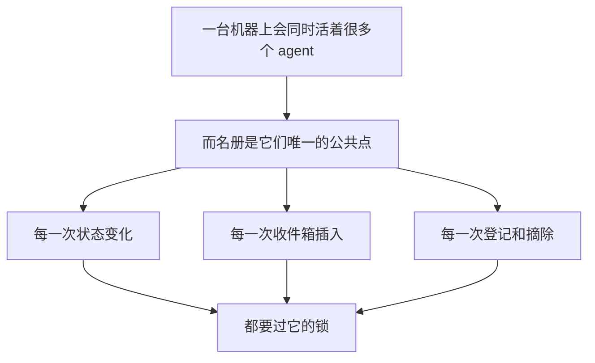


```mermaid
flowchart TD
    A["用的是假 agent<br/>不是真循环"] --> B{"为什么"}
    B --> C["真循环要连模型"]
    C --> D["那量出来的<br/>是 mock 服务的延迟"]
```

| Benchmark | 10 | 100 | 1000 | 期望形状 |
|---|---|---|---|---|
| `RegistryObserverFanoutConcurrent` | 203 ns | 218 ns | 223 ns | **持平** |
| `RegistryRegisterDetachConcurrent` | 180 ns | 236 ns | 608 ns | **持平**（未达标，见下） |
| `RegistryList` | 54.9 ns | 682 ns | 7.28 µs | 线性 |

| Benchmark | 1 | 10 | 100 |
|---|---|---|---|
| `InboxAppendClaim` | 5.65 µs | 49.5 µs | 847 µs |

| Benchmark | 100 | 1000 |
|---|---|---|
| `InboxReplayOnResume` | 1.19 µs | 9.59 µs |

### 观察者派发在 24 路并发下随并存数持平

```mermaid
flowchart LR
    A["203 → 223 ns，1 次分配"] --> B["这是最热的那条共享路径"]
    B --> C["收观察者那一步<br/>没有在扫全部登记"]
```

### 登记与摘除线性——这一组里唯一一条不该线性却线性的曲线

```mermaid
flowchart LR
    A["180 → 608 ns"] --> B["重跑一次 180 → 709 ns"]
    B --> C["可复现，不是噪声"]
```

```mermaid
flowchart TD
    A["原因已定位"] --> B["摘除时要把这份登记<br/>从那条保序的队列上摘下来"]
    B --> C["而这是一次线性查找<br/>加一次移位"]
    D["按名字查的那个 map<br/>是常数时间的"] --> E["线性项只在这条保序队列上"]
```

```mermaid
flowchart TD
    A["这不是当前用量下的问题"] --> B["真实并存数是十几个"]
    B --> C["那一档 180 ns<br/>占不到一次工具调用的万分之一"]
```

```mermaid
flowchart TD
    A["记在这里是因为"] --> B{"什么时候要回来看这个数"}
    B --> C["真的要跑几百个并存 agent"]
    B --> D["子 agent 委派变成<br/>每回合造销上百个"]
```

```mermaid
flowchart TD
    A["要修它的两条路"] --> B["把保序队列换成侵入式链表"]
    A --> C["改成标记加惰性压缩"]
    B --> D["两条都会碰到<br/>列举时的顺序契约"]
    C --> D
    D -.->|"不是顺手能做的改动"| D
```

### 列举每次整份拷贝，按定义线性

```mermaid
flowchart LR
    A["记在这里是为了<br/>让轮询它的调用方知道账单"] --> B["1000 个 agent<br/>一次 7.3 µs、16 KB"]
```

### 收件箱每条消息约 5.6 µs，贵是设计如此

```mermaid
flowchart TD
    A["每一次往收件箱放一条"] --> B["都要往会话日志里<br/>写一条「插入」事件"]
    B --> C["含一次 JSON 排布"]
    B --> D["含一次会话追加"]
    C --> E["所以它比「往切片上加一个元素」<br/>贵得多"]
    D --> E
    E --> F["耐久的事实永远在日志上"]
```

```mermaid
flowchart LR
    A["收件箱本身按设计不加锁"] --> B["只被自己那个 agent 的循环碰"]
    B --> C["这组数也是将来<br/>有人给它加锁时的对照"]
```

---

## 持久化

```mermaid
flowchart TD
    A["只量协调层"] --> B["它是纯内存的<br/>写入器是空实现"]
    B --> C{"为什么不接真后端"}
    C --> D["真的落盘会把这一层<br/>要量的协调成本整个盖住"]
```

| Benchmark | 结果 |
|---|---|
| `WriteBehindEnqueue` | 186 ns/op，1 次分配 |
| `WriteBehindFlushBatch/1` | 401 ns |
| `WriteBehindFlushBatch/10` | 2.16 µs |
| `WriteBehindFlushBatch/100` | 17.9 µs |

### 攒批的收益量不到，这里只有它的开销

```mermaid
flowchart LR
    A["这四个数<br/>只是攒批本身的开销"] --> B["摊掉的那笔在介质那一侧"]
    B --> C["协调层量不到它"]
    C --> D["所以这里给不出<br/>攒批的收益倍数"]
    D --> E["要那个数<br/>就得在一个真的后端上量"]
```

### 介质那一侧现在没有基线

```mermaid
flowchart TD
    A["原先这里有一组走真 I/O 的数"] --> B["它们出自那个<br/>一会话一文件的 JSONL 后端"]
    B --> C["那个包已经删掉了"]
    C --> D["现在唯一的第一方后端<br/>是 adapter/datastore/sessionstore"]
    D --> E["它要一个真的 Postgres 才跑得到"]
    E --> F["而基线机上没有"]
    F --> G["所以这一档留白"]
```

```mermaid
flowchart TD
    A["留白 vs 留一组量的是另一份介质的数"] --> B{"哪个更糟"}
    B -->|"留白"| C["有人在一台配得起库的机器上补"]
    B -->|"留旧数"| D["它会被当成<br/>现在这条路的参照"]
    D -.->|"所以选留白"| D
```

删这个后端的经过见[会话日志上限](session-log-limit.md)。

---

## SDK 洪泛

| Benchmark | 1 槽 | 8 槽 | 64 槽（默认） | 不限 |
|---|---|---|---|---|
| `TransportNotificationFlood` | 7.08 µs | 5.29 µs | 5.10 µs | 4.99 µs |

| Benchmark | 1 KiB | 64 KiB | 1 MiB |
|---|---|---|---|
| `TransportLargeFrame` | 26.0 µs / 41.8 MB/s | 1.28 ms / 51.3 MB/s | 20.0 ms / 52.5 MB/s |

| Benchmark | 结果 |
|---|---|
| `TransportRequestRoundTrip` | 22.3 µs/op |

### 背压这道限流基本是白给的保护

```mermaid
flowchart LR
    A["不限 → 默认 64 槽"] --> A1["4.99 → 5.10 µs<br/>掉 2%"]
    B["不限 → 1 槽（完全串行）"] --> B1["4.99 → 7.08 µs<br/>掉 42%"]
```

```mermaid
flowchart LR
    A["默认值处在曲线的平坦段上"] --> B["换句话说<br/>这道限流几乎不花钱"]
```

### 大帧吞吐在 50 MB/s 附近封顶

```mermaid
flowchart LR
    A["1 KiB 那一档只有 41.8 MB/s"] --> B["每帧固定开销<br/>还没被摊薄"]
```

```mermaid
flowchart TD
    A["分配字节随帧大小线性<br/>1 MiB 那一档 13.6 MB/op"] --> C["说明大帧走的是整块缓冲"]
    B["分配次数却几乎不变<br/>53 → 94"] --> C
    C --> D["没有按块碎分"]
```

---

## Shutdown

```mermaid
flowchart TD
    A["作用域是所有权边界"] --> B["释放时要把挂在上面的清理<br/>逐个跑完"]
    B --> C["关一个跑了很久的进程时<br/>这条路径上挂着的东西可能很多"]
```

| Benchmark | 100 | 1000 | 10000 | 期望形状 |
|---|---|---|---|---|
| `ScopeDispose` | 700 ns | 5.10 µs | 134 µs | 线性 |
| `ScopeDisposeAfterChurn` | 697 ns | 4.95 µs | 61.3 µs | 与上一行相当 |
| `ScopeDeferAndCancel` | 103 ns | 103 ns | 138 ns | **持平** |

### 登记一个清理再取消它必须是常数时间

```mermaid
flowchart LR
    A["100 与 1000 那两档一模一样<br/>都是 103 ns"] --> B["跟作用域上<br/>已经挂了多少东西无关"]
```

```mermaid
flowchart TD
    A["这条为什么必须持平"] --> B["短命资源在一个长命作用域上<br/>进进出出是常态"]
    B --> C["它一旦随已挂数量增长"]
    C --> D["长会话里每次工具调用<br/>都会越来越慢"]
```

### DisposeAfterChurn 是一个泄漏探针

```mermaid
flowchart TD
    S1["① 在作用域上挂满"] --> S2["② 取消掉一批"]
    S2 --> S3["③ 量释放耗时"]
    S3 --> Q{"和同规模的直接释放比"}
    Q -->|"明显更慢"| BAD["被取消的清理只是被打了个标记<br/>没有真的从链上摘下来"]
    Q -->|"相当"| GOOD["取消确实把节点摘走了"]
```

```mermaid
flowchart LR
    A["实测两者相当"] --> B["10000 那一档甚至更快"]
    B --> C["因为存活对象更少<br/>GC 压力更低"]
    C --> D["结论：走 GOOD 那一支"]
```

### 释放本身随挂载数线性是应该的

```mermaid
flowchart LR
    A["它就是要把每一个都跑一遍"] --> B["一万个清理 134 µs"]
    B --> C["关闭不会成为瓶颈"]
```

---

## 什么时候该重跑

```mermaid
flowchart TD
    C1["动了会话日志<br/>派生历史缓存或表面折叠"] --> R1["重跑 harness/session"]
    R1 --> W1["盯 SessionAppendOnLongLog<br/>有没有从常数变线性"]

    C2["动了名册的锁<br/>或观察者派发"] --> R2["重跑 harness/agent"]
    R2 --> W2["盯 RegistryObserverFanoutConcurrent<br/>的三档差"]

    C3["动了写回窗口或批大小"] --> R3["重跑 feature/persistence"]
    R3 --> W3["盯 WriteBehindFlushBatch<br/>三档的每事件成本还在不在同一量级"]

    C4["动了作用域的清理链表"] --> R4["重跑 scope"]
    R4 --> W4["盯 ScopeDeferAndCancel 还是不是常数<br/>DisposeAfterChurn 有没有相对 Dispose 变慢"]
```

```mermaid
flowchart LR
    A["动了存储格式或介质"] --> B["这里没有对照数可盯"]
    B --> C["因为介质那一侧的基线是留白的"]
```

---

## 相关文档

- [Session](modules/session.md)：事件日志、派生历史缓存和恢复。
- [Agent 控制面](modules/agent.md)：名册、收件箱和作用域的契约。
- [存储、文件与附件](modules/storage.md)：会话持久化的分层。
- [SDK 协议与服务端](modules/sdk.md)：帧上限与并发上限的语义。
- [会话日志上限](session-log-limit.md)：那个被删掉的 JSONL 后端的来龙去脉。
