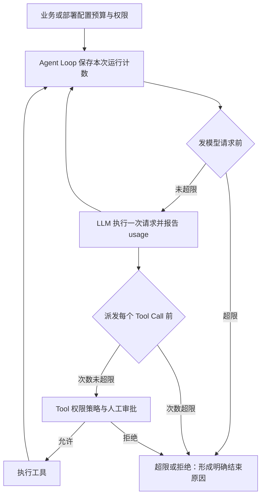
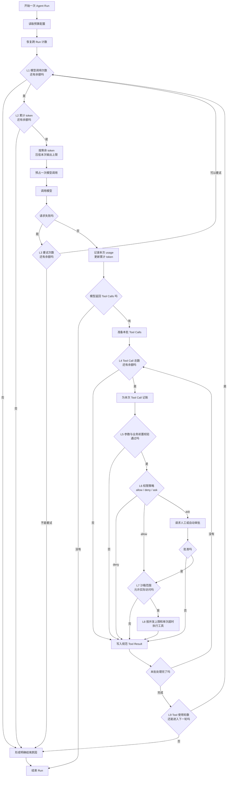
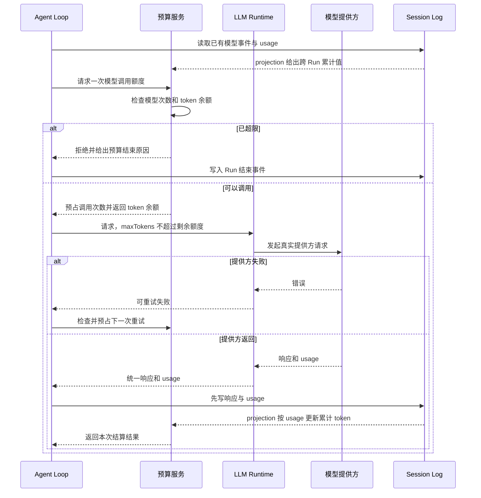
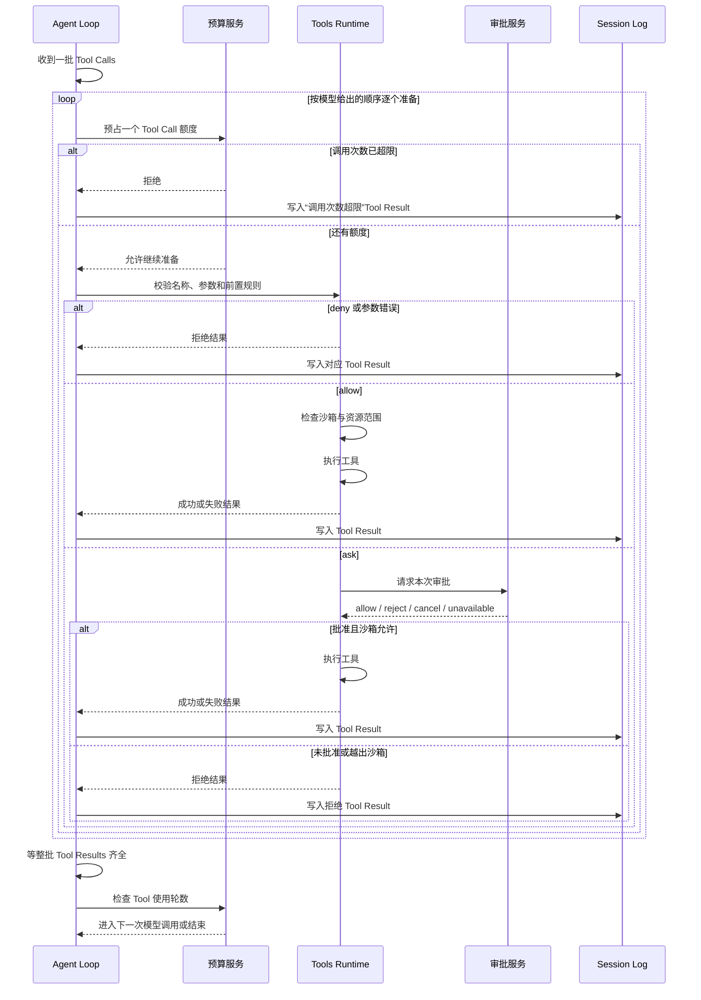

# 运行预算与权限：谁计数，谁放行

Token 预算、模型调用次数、工具调用次数和权限都在控制 Agent 能走多远，但它们不是同一个限制，也不该塞进同一个模块。

## 先把容易混淆的量分开

| 名称 | 实际限制的东西 | 到线时应在哪里处理 |
|---|---|---|
| 单次输出上限 | 一次模型回答最多生成多少 token | `llm` 把参数交给模型提供方 |
| 上下文窗口 | 一次请求的输入加输出能否装进模型窗口 | token 计量与压缩模块 |
| 累计 token 预算 | 一次 run、一个目标或一个会话累计能花多少 token | Agent Loop 在每次模型调用前后检查 |
| 模型调用次数 | Agent 最多能问模型几次 | Agent Loop 在发请求之前检查 |
| 工具调用次数 | 模型提出的每一个 Tool Call 最多累计多少次 | Tool 调度前检查，每个调用单独计数 |
| 工具轮数 | “问一次模型，再执行这一批工具”最多循环几轮 | Agent Loop 在进入下一轮之前检查 |
| 工具并发数 | 同一时刻最多跑几个工具 | Agent Loop 的调度池 |
| 重试次数 | 同一次失败的模型请求最多重发几次 | LLM 重试策略 |

`maxTokens = 4096` 只限制一次回答；`MaxParallelToolCalls = 10` 只表示最多同时跑十个工具。两者都不能阻止 Agent 连续调用模型或工具一百次。

## 谁应该负责



分工应当是：

- `llm` 负责单次请求参数和提供方返回的 token usage；它看不到整个 Agent 运行，不能独自执行跨调用预算。
- `tools` 负责一次工具调用的执行前闸门、审批接缝和单次超时；它不知道模型总共被调用了多少次。
- Agent Loop 或挂在它上面的中间件负责跨调用计数，因为只有这一层同时看见模型请求、Tool Calls 和运行结束。
- 业务层或部署层决定预算数值、哪些工具需要审批、允许访问什么资源；框架只执行这些规则。

权限还要继续拆开：工具是否可见、这一次是否需要审批、调用者是谁、进程能访问哪些文件和网络，是四件不同的事。一次人工同意不能替代身份认证，也不能替代操作系统沙箱。

## 完整流程：限制应该卡在哪里

下面画的是建议实现，不表示当前仓库已经具备全部限制。



图里九个限制点的含义：

| 点 | 检查时机 | 为什么必须在这里 |
|---|---|---|
| L1 模型调用次数 | 每次真正请求模型之前 | 超限后不再产生新的模型费用 |
| L2 累计 token | 请求模型之前 | 已经没有余额时不能再发请求 |
| L3 重试次数 | 一次请求失败、准备重发之前 | 重试不能绕过调用预算；每次真实提供方请求都应计数 |
| L4 Tool Call 总数 | 模型给出调用、本批尚未派发时 | 一次模型可能同时给出多个调用，必须逐个占额度 |
| L5 参数与业务前置校验 | 找到工具之后、权限审批之前 | 无效参数无需打扰审批者，更不能进入执行体 |
| L6 权限策略与审批 | 参数成立、工具尚未执行时 | 审批必须发生在副作用之前 |
| L7 沙箱范围 | 批准之后、启动进程或访问资源之前 | 人工批准不能自动扩大进程实际权限 |
| L8 并发与超时 | 真正执行工具时 | 并发限制资源占用，超时限制单次执行时长；两者都不是调用总数 |
| L9 Tool 使用轮数 | 一批 Tool Results 已经齐全、准备再次问模型时 | 阻止“模型 → 工具 → 模型”无限循环 |

有两个计数顺序需要定死：

- 模型调用应在请求发出前**预占**，失败和重试也算一次真实调用；否则失败请求可以无限绕过上限。
- Tool Call 应在权限审批前计入“模型请求的调用数”；否则模型可以无限重复一个必然被拒的调用。若还要统计实际副作用次数，再另设 `executed_tool_calls`，只在批准后增加。

## 模型调用时序：次数和 token 怎么一起卡



累计 token 无法在调用前精确知道，因为输出还没生成。调用前只能用余额限制 `maxTokens`，调用后再按提供方 usage 结算。若提供方不返回可靠 usage，应按失败关闭处理，或者明确降级为估算预算，不能悄悄当作零消耗。

## 工具调用时序：次数、审批和沙箱怎么排



即使某个调用超限、参数错误或审批被拒，也必须为它生成与 `call_id` 配对的 Tool Result。模型一次提出五个调用，而预算只剩两个时，前两个可以继续，后三个必须各有一份“预算超限”结果；不能直接丢掉后三个，否则日志和下一次模型请求里会出现悬空 Tool Calls。

## 计数存在哪里

| 计数 | 推荐存法 | 原因 |
|---|---|---|
| 本次 run 的模型、工具和轮数 | Agent Loop 内存状态 | run 结束就失效，不必污染长期状态 |
| 跨 run 的 thread / session 预算 | 写 sessionlog 事件，再由 projection 算当前累计值 | 崩溃恢复和重放后仍能得到同一结果 |
| Goal token 预算 | Goal 自己的耐久状态，并以提供方 usage 事件结算 | 生命周期可能跨多个 run |
| 单次工具超时和当前并发数 | Tool 调度器内存状态 | 它们只描述正在进行的调用 |
| 审批问答与策略变化 | sessionlog 审计事件 | 恢复后要解释某次调用为什么执行或没执行 |

预算配置和计数状态要分开保存。配置回答“最多允许多少”，计数回答“已经用了多少”；修改上限不能把历史用量清零。

## 五套源码的实际做法

| 能力 | DSH | LangChain / LangGraph | Codex | Grok | 当前 Go 仓库 |
|---|---|---|---|---|---|
| 单次模型输出上限 | Agent 的 `maxTokens` | 各模型 Adapter 的 `max_tokens` / `max_output_tokens` | 主循环未找到通用用户配置；另有工具结果截断上限 | 请求支持 `max_output_tokens`，子任务预算会进一步压低它 | `agent.Options.MaxTokens` → `llm.GenerateOptions.MaxTokens` |
| 上下文窗口控制 | TokenMeter 计量，压缩策略处理 | `recursion_limit` 不是窗口；summarization 中间件另管上下文 | `session/token_budget.rs` 计算剩余窗口、提醒并触发 compact | 会检测窗口压力并自动 compact | `feature/tokenmeter` 投影用量和压力，`feature/compaction` 处理压缩 |
| 累计 token 总预算 | 没有通用硬预算 | 没找到通用累计 token 硬预算中间件 | Goal 可设 `token_budget`；到线标记 `budget_limited` 并要求尽快收尾，当前 turn 可以继续并超过预算 | Goal 可设 `token_budget`；检查到线后停止 Goal；子 Agent 另有累计**输出** token 配额 | 没有；TokenMeter 只记账，不阻断 |
| 模型调用次数预算 | 没有 | `ModelCallLimitMiddleware` 同时支持本次 run 和跨 run 的 thread 上限 | 没有通用上限 | 没有通用上限 | 没有 |
| 工具调用总次数预算 | 没有；重复工具插件只提醒 | `ToolCallLimitMiddleware` 支持全部工具或指定工具，也支持 run / thread 上限 | 没有通用上限 | 没有按 Tool Call 条数计算的通用上限 | 没有；`repeattoolcap` 只拦同名工具的连续调用 |
| 工具轮数上限 | 没有 | 图的 `recursion_limit` 是通用图步数保险，不是精确工具轮数 | 没有通用上限 | `max_turns` 限制工具轮数；一轮里并行的多个调用仍只算一轮 | 没有 |
| 工具并发数 | `maxParallelToolCalls` | 图执行器与 ToolNode 的并发配置 | 有并行工具执行机制 | 一批 Tool Calls 可并行执行 | `MaxParallelToolCalls`，默认 10 |
| 模型请求重试 | 提供方路由拥有重试策略；`normal` 有 `maxRetries`，`always` 没有总上限 | 由模型 Adapter / Runnable 重试配置处理 | 提供方与错误类型自己的重试路径 | Sampler `RetryPolicy.max_retries`，默认 5 | `feature/llmretry`；语义跟 DSH 一致 |
| 工具权限 | `pre-execute` 返回 allow / deny / ask，审批策略为 ask / never；沙箱另行约束 | `HumanInTheLoopMiddleware` 按工具中断，可 approve / edit / reject / respond；本身不是 OS 沙箱 | permission profile、exec policy、permission hook、Guardian 或用户审批、sandbox 分层执行 | pre-tool hooks 先处理，PermissionManager 再按 Ask / Auto / AlwaysApprove 裁决，并结合 workspace policy | `PreExecute` 返回 allow / deny / ask，`userapproval` 处理 ask / never；本仓库没有沙箱 |

最明确的差别是：**LangChain 已经把模型调用次数和工具调用次数做成了可直接装配的通用中间件；另外四套没有这两项完整的通用实现。**

## LangChain / LangGraph 怎么卡次数

### 模型调用

`ModelCallLimitMiddleware` 保存两份计数：

- `run_model_call_count` 只活在本次 `invoke`；
- `thread_model_call_count` 进入图状态，可以通过 checkpointer 跨多次 `invoke` 保留。

它在 `before_model` 先判断下一次能不能发，在 `after_model` 把成功发生的调用加一。到线时可以直接跳到图的 `end`，也可以抛 `ModelCallLimitExceededError`。

### 工具调用

`ToolCallLimitMiddleware` 在模型已经返回 Tool Calls、工具尚未执行时检查。每个 Tool Call 单独计数，所以一次模型回答同时提出三个工具，就消耗三次，不是一轮。

超限有三种处理：

| 配置 | 结果 |
|---|---|
| `continue` | 给超限调用合成错误 `ToolMessage`，其余允许的工具继续 |
| `error` | 抛 `ToolCallLimitExceededError` |
| `end` | 给本批未执行调用补齐 `ToolMessage`，再结束 Agent |

它可以限制全部工具，也可以只限制一个名字，例如只允许 `web_search` 调五次。

### 图步数

LangGraph 自己还有 `recursion_limit`。它限制的是图的 superstep，节点、分支和子图都会影响这个数，所以只能当死循环保险，不能冒充“最多调用模型五次”或“最多调用工具十次”。本地 `langgraph-main` 的默认值来自 `LANGGRAPH_DEFAULT_RECURSION_LIMIT`，未设置时是 10007；`langchain-master` 内另一套 Runnable 默认值是 25。它们不是同一个精确调用预算。

人工审批由 `HumanInTheLoopMiddleware.after_model` 在 Tool Calls 产生之后触发。`interrupt()` 暂停图，`Command(resume=...)` 恢复；需要 checkpointer 才能跨暂停保存状态。它控制是否执行工具，不提供文件系统或网络沙箱。

## Codex 怎么处理

Codex 有两种名字相近但用途完全不同的 token budget：

1. `core/src/session/token_budget.rs` 管当前上下文窗口还剩多少，接近阈值时提醒，耗尽时换窗口或 compact。它不是累计花费上限。
2. Goal Extension 的 `token_budget` 管一个长期目标累计花多少 token。提供方 usage 被记到账上；达到预算后 Goal 变成 `budget_limited`，系统注入“不要开始新工作，尽快收尾”的指令。

第二种是软收尾，不是请求前的硬闸。源码测试明确允许 Goal 达到 25 token 后，当前 turn 最终记到 35 token。它保证后续不再自动开展实质工作，但不能保证最终账单绝不超过预算。

Codex 没有通用的模型调用次数或 Tool Call 总次数上限。权限比次数预算完整得多：

```text
本 turn 的 permission profile
-> 命令与 exec policy 判断是否安全、是否需要审批
-> permission request hooks 先裁决
-> Guardian 自动审查或用户审批
-> 在得到的 sandbox profile 中执行
-> 沙箱拒绝时，只在策略允许时申请升级或重试
```

这里的审批和沙箱是两道门。审批回答“这一次可不可以”，沙箱决定进程实际上能碰到什么。

## Grok 怎么处理

Grok 的 `max_turns` 是最容易被误读的一项。计数从第一轮开始；执行完一批工具、准备再次请求模型前加一，到达上限就返回 `MaxTurnsReached`。一批中有五个并行 Tool Calls，仍只增加一轮，所以它不能替代工具调用总次数预算。

Grok 还有两种累计 token 控制：

- Goal 的 `token_budget` 以目标创建时的 session token 为基准，累计后续增量；到线调用 `budget_limit()`，停止 Goal 的后续轮次。
- 子 Agent 的 `output_token_budget` 只累计模型输出 token。每次请求前把 `max_output_tokens` 压到剩余额度；usage 缺失或请求失败时按失败关闭，直接耗尽配额并标记结果不完整。

权限顺序是：先执行 `pre_tool_use` hooks，hook 可以直接拒绝或修改参数；然后 PermissionManager 按 Ask、Auto、AlwaysApprove 之一处理。Auto 会用分类器判断，Ask 交给用户，AlwaysApprove 走快速放行；计划模式的只读限制仍在它们之外单独执行。

## DSH 和当前 Go 仓库

DSH 的 Agent Loop 有单次 `maxTokens` 和工具并发数；TokenMeter 只负责测量。TokenMeter 的配置校验甚至拒绝所有配置键，因此它没有隐藏的总预算开关。`repeat-tool-reminder` 只在相同调用重复时提醒模型，也不会硬停。

当前 Go 仓库沿用了这些边界，并额外增加了 `feature/guard/repeattoolcap`。它按 Agent 记录“同一个工具连续出现了几次”，超过该工具配置值后在 `tools.PreExecute` 阶段拒绝。换一个工具会重置链，新的用户消息也会清零，所以它仍不是每 run 或每 session 的 Tool Call 总预算。

当前实际链路是：

```text
模型请求：Agent Loop -> llm.GenerateOptions.MaxTokens -> Adapter
token 记账：sessionlog usage 事件 -> feature/tokenmeter 投影
工具限制：tools.PreExecute -> repeattoolcap / 其他规则 -> guard
工具审批：PreAsk -> tools.Approval -> userapproval 的 ask / never -> 答复者
工具执行：通过以后才进入 Dispatch
```

当前缺口可以明确写成三条：

- 没有一次 run、一个 Goal 或一个 Session 的累计 token 硬预算；
- 没有模型调用总次数预算；
- 没有全部工具或指定工具的累计调用次数预算。

`ReasonMaxTokens` 只说明某一次模型输出撞上限，`MaxParallelToolCalls` 只控制并发，`repeattoolcap` 只控制连续同名调用。它们都没有补上这三条。

## 如果在当前仓库补齐

合理落点是增加一套运行预算服务，由 Agent Loop 持有本次 run 的计数，同时复用 sessionlog / projection 保存需要跨 run 恢复的计数。

| 检查点 | 检查什么 | 超限结果 |
|---|---|---|
| 模型请求发出之前 | 模型调用次数；剩余 token 是否还能发起请求 | 不再请求模型，写明确的预算结束原因 |
| 提供方 usage 返回之后 | 累计实际 token | 更新账本；到线后禁止下一次调用 |
| Tool Calls 产生之后、Dispatch 之前 | 本批每个调用是否还在总次数内 | 为被拦调用形成规范 Tool Result，不能留下悬空调用 |
| 权限裁决之后、执行之前 | 本次是否获批，资源是否在允许范围内 | 拒绝结果返回模型并写审计事件 |

累计 token 预算只能在提供方报告 usage 后得到准确数，因此普通实现最多保证“不再开始下一次调用”，仍可能被最后一次请求冲过线。若要把超支压得更小，请求前还要用“剩余预算”下调本次输出上限；输入 token 已经超过剩余额度时直接停止。

这套服务不应放进 `llm` 或 `tools` 单独承担。建议由 Agent Loop 统一协调，`llm` 提供 usage，`tools.PreExecute` 提供工具调用前的执行点，业务装配层提供预算数值和权限策略。

## 源码位置

当前 Go 仓库：

- `harness/agentloop/agent.go`
- `llm/generate.go`
- `feature/tokenmeter/`
- `feature/guard/repeattoolcap/cap.go`
- `tools/pipeline.go`
- `feature/interaction/userapproval/`

对照源码：

- `deepseek-harness-dsh-v0.1.2-alpha.3/packages/core/agent-loop/src/agent.ts`
- `deepseek-harness-dsh-v0.1.2-alpha.3/packages/llm/token-meter/src/index.ts`
- `deepseek-harness-dsh-v0.1.2-alpha.3/packages/core/tools/src/index.ts`
- `langchain-master/libs/langchain_v1/langchain/agents/middleware/model_call_limit.py`
- `langchain-master/libs/langchain_v1/langchain/agents/middleware/tool_call_limit.py`
- `langchain-master/libs/langchain_v1/langchain/agents/middleware/human_in_the_loop.py`
- `langgraph-main/libs/langgraph/langgraph/pregel/_loop.py`
- `codex-main/codex-rs/core/src/session/token_budget.rs`
- `codex-main/codex-rs/ext/goal/src/extension.rs`
- `codex-main/codex-rs/core/src/tools/approvals.rs`
- `grok-build/crates/codegen/xai-grok-shell/src/session/acp_session_impl/turn.rs`
- `grok-build/crates/codegen/xai-grok-shell/src/session/acp_session_impl/goal.rs`
- `grok-build/crates/codegen/xai-grok-shell/src/tools/tool_context.rs`
