# 会话日志上限

已定。2026-09-02。第 1–12 步全部已实现。

一个 agent 跑起来之后，会把发生过的每一件事记成一条**事件**：谁说了句什么、要调哪个工具、工具答了什么、这一轮开始了、这一轮结束了。这些事件连起来就是一份**会话日志**。

原先这份日志是**只追加、永不删除**的，而且一个会话一份本地文件。这一轮把它改成：**按条数封顶，满了从最老的一头先进先出地丢，存进数据库。**

统一说法：一份存档里第一条是**头**，之后每一条是一个 **event**。

---

## 为什么要改

### 一、只追加、永不删除，那份日志就没有上限

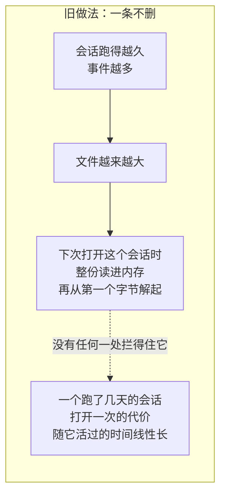

原先那个一会话一文件的后端，读一段前缀的做法是先把整个文件读完、再从头解析。也就是说「只读最近几条」这件事它做不到——每次都是整份。

### 二、这套东西跑在服务端，服务端没有硬盘

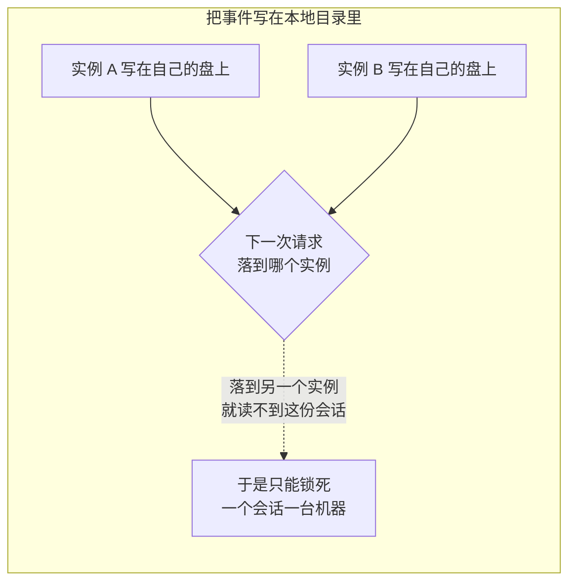

**没有硬盘可用，也没有目录这个概念**，所以「存下来」实际上只有一条路：进数据库。

### 三、有人会担心：删掉事件，模型不就失忆了吗

不会。这是这篇里最容易被误解的一条：

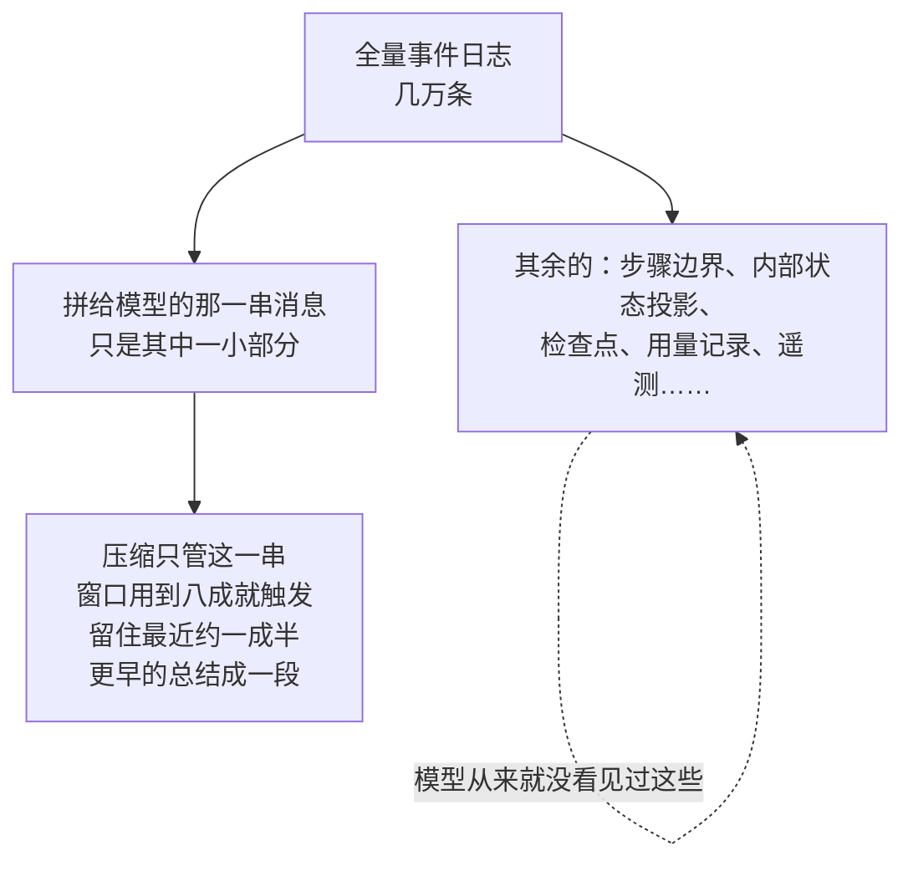


所以「丢掉最老的一段事件」损失的是**追溯能力的深度**，不是对话能力。

---

## 改成什么样

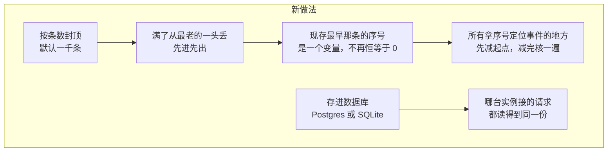

一句话：**日志的头部会被删，这是既成事实，不是可选项。**


---

## 定下来的

下面这十六条是这一轮的全部决定。源码里三十来处注释直接指着它们的编号。

### 上限与裁剪：第 1 到 5 条

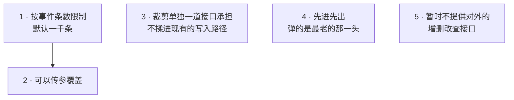

第 3 条为什么要单开一道缝：

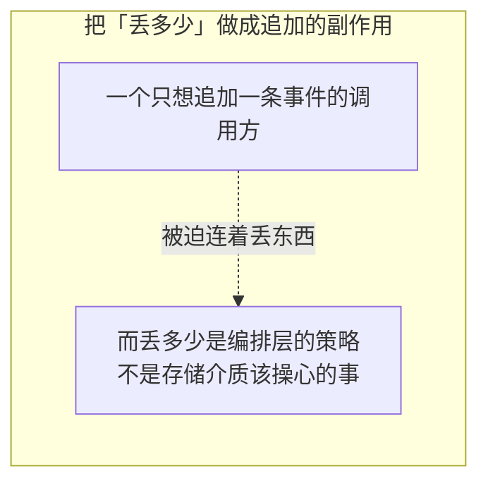

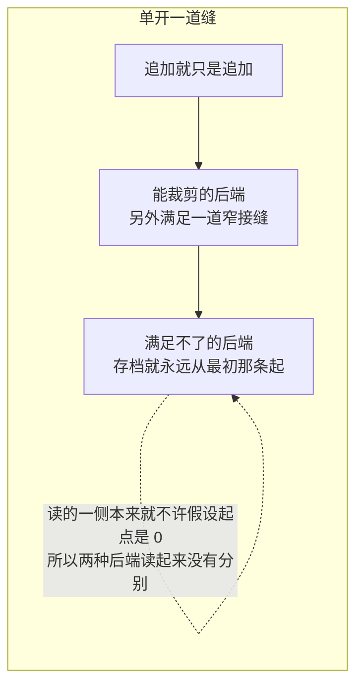

第 4 条为什么必须是先进先出，而不是「挑不重要的删」：

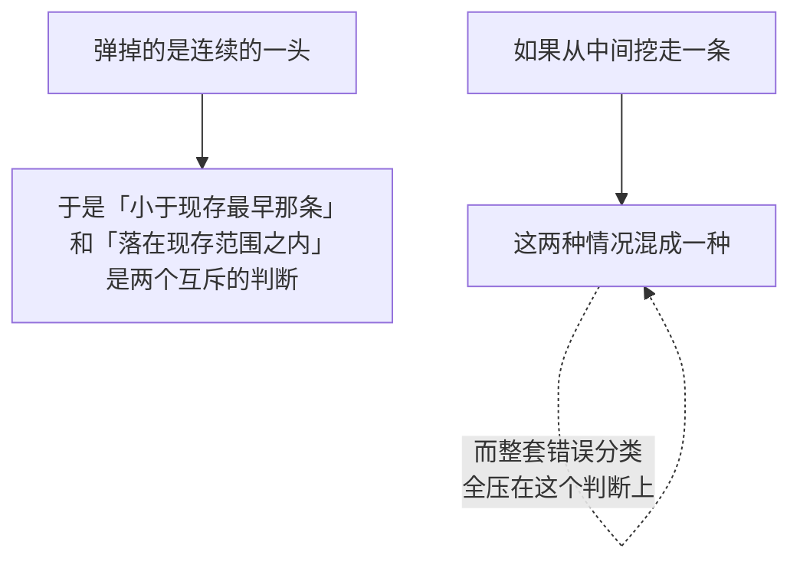

### 介质：第 6 到 10 条

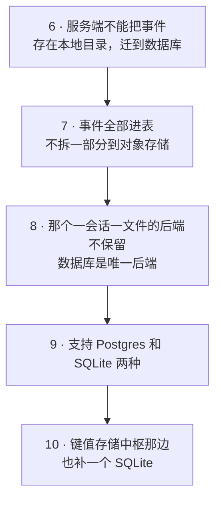

第 9、10 条的理由，是一句关于**谁做决定**的话：

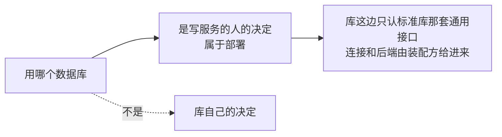

### 不加的东西：第 11、12 条

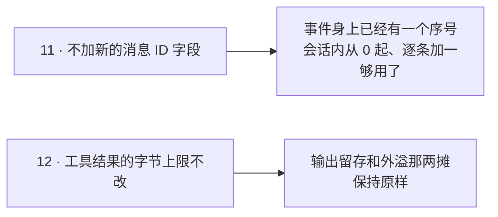

### 第 13 条：这是整篇里最要紧的一条

**「日志的头部会被删」是权威前提。代码里任何和它冲突的旧断言，全部改成服从它，没有例外。**

关键在于**不是逐处打补丁**：

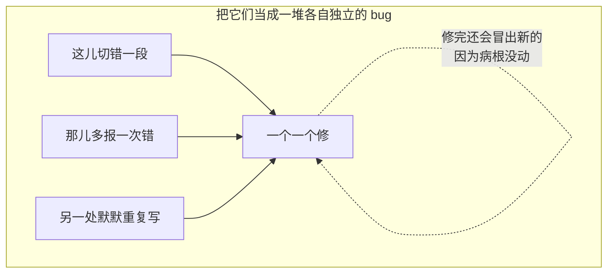

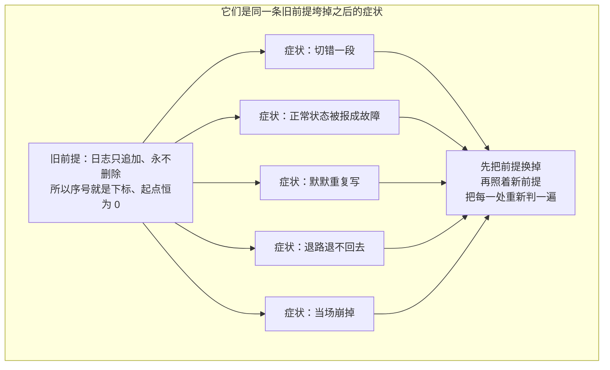

冲突的时候只往一个方向让：

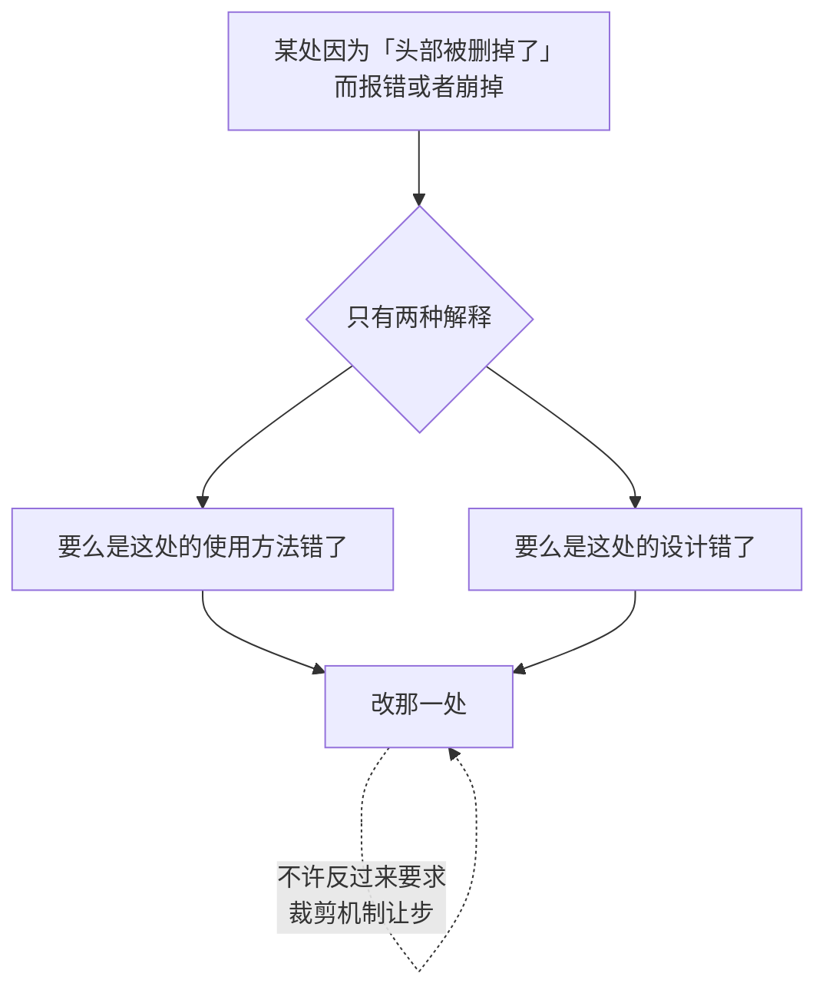

### 第 14 条：被弹掉的事件对应的状态，丢了就丢了

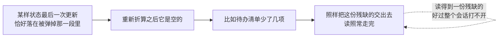

### 第 15 条：按序号找不到事件，不再一律当错误

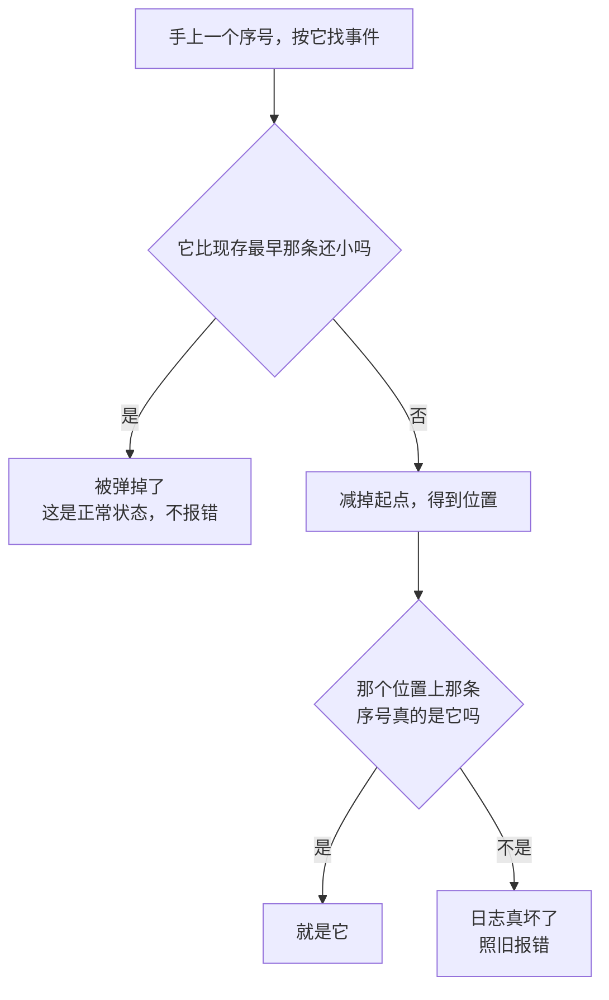

这两种分得开，靠的正是第 4 条的先进先出——弹掉的是连续的一头，所以被弹区间和现存区间之间没有交叠。

### 第 16 条：会话头上加一个「建这个会话那天，日志从第几条起」

这是第 11 条「不加新字段」的唯一例外。第 11 条说的是**事件身上**不加消息 ID，而这一条要存的东西，事件身上根本没有。

一个会话可以从另一个会话分叉出来，它继承了父会话的一段历史。**「继承到哪儿为止」这个边界，有三个长得很像但完全不同的数：**

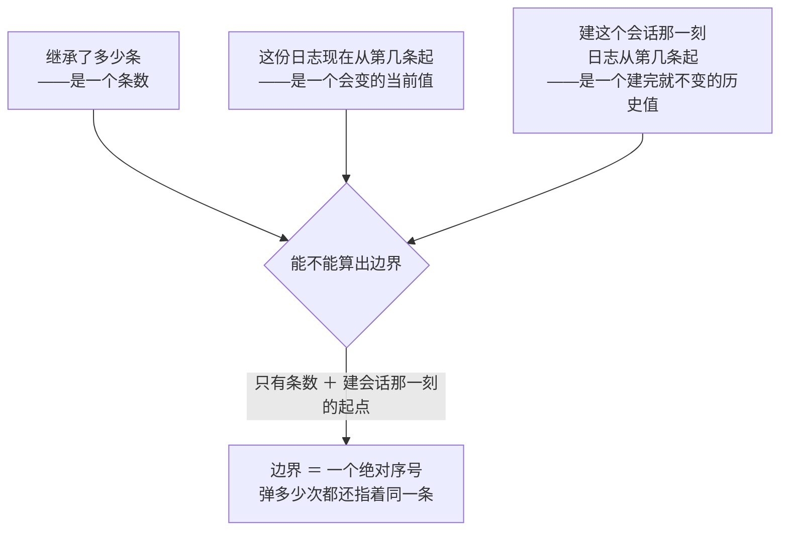

为什么反推不回来：

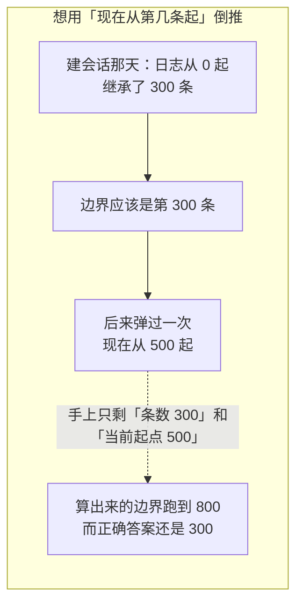

```mermaid
flowchart LR
    subgraph GOOD5["把建会话那一刻的起点存下来"]
        B1["建会话那天的起点：0"] --> B2["＋ 继承条数 300"]
        B2 --> B3["边界 ＝ 第 300 条"]
        B3 --> B4["弹几次都不影响这个答案"]
    end
```

字段是后加的，老存档里没有它，读回来是 0：

```mermaid
flowchart LR
    A["老存档读回来<br/>这个数是 0"] --> B["而那些老日志<br/>本来就从第 0 条起"]
    B --> C["0 正是对的<br/>不用写迁移"]
```

---

## 原则

这五条是把第 13 条落到每一处代码上的操作口径。

```mermaid
flowchart TD
    P1["1 · 起始序号是变量<br/>任何地方不许假设它是 0"]
    P2["2 · 位置一律用序号表达<br/>不用条数、不用下标"]
    P3["3 · 「空」不用 0 表示"]
    P4["4 · 按序号找不到<br/>先分两种再决定报不报错"]
    P5["5 · 状态残缺不阻断读"]
```

第 2 条的完整动作是三步，少一步都不行：

```mermaid
flowchart LR
    A["手上一个序号"] --> B["当场减去起始序号<br/>得到下标"]
    B --> C["拿到那一条之后<br/>核一遍它的序号真的是那个数"]
    C -.->|"不核这一下<br/>切错的时候是默默切错"| C
```

第 3 条为什么单列一条：

```mermaid
flowchart LR
    subgraph BAD6["拿 0 兼职表示「还什么都没落盘」"]
        A1["旧代码：进度等于 0<br/>就是还没写过"] --> A2["新前提下<br/>起始序号本身就可能不是 0"]
        A2 -.->|"于是「已经写到第 0 条」<br/>和「一条都没写过」<br/>长得一模一样"| A3["得单独说一句<br/>「还没落过盘」"]
    end
```

---

## 现状：那道缝本来就是为多后端留的

会话存档那一侧早就把「介质」抽成了一道接缝，数据库后端要填的位置都是现成的：

```mermaid
flowchart TD
    A["存档接缝"] --> A1["必需的五个动作<br/>→ 全部实现"]
    A --> A2["「从某个序号往后读」<br/>→ 实现得了，一句 WHERE 就是"]
    A --> A3["「把一份存档定位到某个坐标」<br/>→ 不实现"]
    A --> A4["「用完要关」<br/>→ 实现，关掉连接池"]
    A --> A5["「放不放得下原始产物」<br/>→ 答不放，已有现成的哨兵"]
    A --> A6["修复时交回的那截「撕裂的尾巴」<br/>→ 恒为空"]
```

后两条的理由：

```mermaid
flowchart LR
    A["「定位到某个坐标」这件事"] -.->|"接缝里原文就写着<br/>把所有会话装进一个数据库的后端<br/>不实现它"| B["一个库里放着所有会话<br/>没有「那份存档在哪儿」这回事"]
    C["「撕裂的尾巴」"] -.->|"一次写就是一个事务<br/>要么整批提交、要么一条都没有"| D["断尾是顺序追加的文件<br/>才有的现象"]
```

当时那个叫 `storage/postgres` 的包是**键值存储**后端，一张键到值的表，不是会话后端，不能直接拿来用。可复用的只有一个约定：驱动由装配方开好连接池再传进来。第 12 步之后这两摊收进了同一层，共用同一份介质。

---

## 计划

十三步。**顺序是有讲究的：**

```mermaid
flowchart LR
    A["第 1 到 6 步<br/>裁剪机制还没打开"] --> B["做完行为和改之前一模一样"]
    B --> C["现有测试全绿<br/>就说明没改坏"]
    C --> D["第 7 步之后才真正开始删"]
    E["反过来先打开删除"] -.->|"每一处口径问题<br/>都会表现成一个<br/>没有参照物的偶发 bug"| E
```

### 第 0 步：先改序号的产生点

```mermaid
flowchart LR
    A["会话记住自己的起始序号"] --> B["新事件的序号<br/>＝ 起始序号 ＋ 手上这份日志的长度"]
    C["起点由装配方显式给进来"] --> D["建会话、恢复会话<br/>各有一个参数"]
    C -.->|"不从「手上第一条事件的序号」倒推<br/>因为一份空日志答不出来"| D
```

不先做这一步，后面每一步都是在一个会撞号的地基上砌墙。同一处的分叉边界也在这条上：它是一个序号，得先减起点再当下标用。

### 第 1 步：让起始序号进得来

```mermaid
flowchart LR
    A["存储那一侧"] --> B["除了事件本身<br/>再交出一句<br/>「这份日志从第几条起」"]
    B --> C["读前缀、读尾巴<br/>两种返回值都带上它"]
    C --> D["这是后面五步的前提"]
```

### 第 2 步：把一个身兼二职的字段拆成两个

```mermaid
flowchart LR
    subgraph BAD7["一个字段两个身份"]
        A1["它同时是「已经落盘了多少条」<br/>和「下一条该写的序号」"] --> A2["十二处引用<br/>一半当序号用、一半当下标用"]
        A2 -.->|"只有日志从 0 起、一条不弹时<br/>这两件事才恰好相等"| A3["弹过一次之后<br/>一半的用法当场错"]
    end
```

拆成两个字段，各归各。顺手把那个「等于 0 就是还没写过」换成一句显式的「还没落过盘」，也就是原则第 3 条。

### 第 3 步：改掉两处拿序号当下标的地方

一处在存档编排里判边界和切片，一处是把整份日志折成当前表面时把起点写死成了 0——增量那条路本来就带着起点字段，只有整折这条写死了。两处都改成减去起始序号。

### 第 4 步：改状态检查点的地板和判据

这一步实现时和计划有出入，出入本身值得记下来：

```mermaid
sequenceDiagram
    participant C as 调用方
    participant F as 「从哪儿读起」这一问
    participant S as 存档
    participant R as 恢复检查点

    C->>F: 这个键要从第几条读起
    Note over F: 它跑在读之前<br/>问不出真实起点<br/>要问就得先整读一遍<br/>而它存在的全部理由<br/>就是不整读
    F-->>C: 交出 0
    Note over C,F: 这个 0 读作「从现存的最前面读起」<br/>不是「从第 0 条读起」——它是一个请求
    C->>S: 按这个请求读
    S-->>C: 事件 ＋ 一句「这份日志实际从第几条起」
    C->>R: 把实际起点当参数传进去
    Note over R: 判据从「起点大于 0」<br/>换成「这截尾巴是不是现存的全部」
```

判据换掉之后，一行检查点记录能不能用，量的是它的水位有没有落在现存这一段里，而不是拿 0 当参照。

### 第 5 步：改「按序号找不到」的两种情形

压缩会写一条「这几条被这一段替代了」的事件，里面带着被遮住那些事件的序号。折算时按序号定位，找不到就报「表面被破坏了」，整份会话打不开。而被遮住的正好是最老那批，也正好是先进先出最先弹的那批。改成按第 15 条分两种。

### 第 6 步：状态缓存的作废条件

```mermaid
flowchart TD
    A["一行缓存记着<br/>「算到第 N 条时是什么状态」"] --> B{"N 落在被弹掉那一段里吗"}
    B -->|"是"| C["这行作废"]
    C --> D["走它自己已有的回退路<br/>在现存这一段上从头折"]
    D -.->|"不报错，也不多读一次<br/>那次读本来就是整读"| D
```

这一步由第 4 步换掉的那个判据顺带办掉，不用另写一套作废逻辑。

### 第 7 步：写数据库后端

```mermaid
flowchart TB
    A["新包实现三样：<br/>必需的五个动作、按序号往后读、用完要关"] --> B["两张表：会话头一张、事件一张"]
    B --> C["事件表主键：会话身份 ＋ 序号"]
    A --> D["一批事件一个事务"]
    D --> E["这份存档头一回落盘时<br/>头和第一批事件一起提交"]
    E -.->|"接缝里要求这一下是原子的"| E
    A --> F["修订令牌要来源限定"]
    F --> G["同一份没变过的日志<br/>观察多少次都是同一个值"]
    F --> H["两个独立存储的令牌<br/>不许比出相等"]
    A --> I["第一版不做迁移<br/>没有旧表、没有旧数据，直接建"]
```

有两处是这份介质逼出来的，计划里没有：

```mermaid
flowchart LR
    A["头表上多一列<br/>「下一条写在哪儿」"] --> B["一份被弹空的存档<br/>问「现存最小的序号是多少」<br/>答案是空"]
    B -.->|"而恰恰是那时候<br/>调用方最需要这个答案"| B
```

```mermaid
sequenceDiagram
    participant C as 调用方
    participant DB as 数据库

    Note over C,DB: 读一次存档要问三句话
    C->>DB: 会话头
    C->>DB: 事件
    C->>DB: 修订令牌
    Note over DB: 缺省的隔离级别下<br/>这三句之间日志可能变过
    DB-->>C: 交出去的令牌<br/>配着的是另一份日志
    Note over C: 而令牌的契约是<br/>「标识恰好这些值」
    Note over C,DB: 所以读路一律开<br/>可重复读的只读事务
```

**这批用例要一个真的数据库才跑得到。** 这一步当时只有 Postgres，所以没配连接串就整批跳过，持续集成上用一个环境变量把跳过变成失败。第 11 步补上 SQLite 之后跳过没了：缺省跑 SQLite，配了连接串才改跑 Postgres。

### 第 8 步：把上限打开

单独一道接口，先进先出，默认一千条、可配。裁剪机制到这一步才真正开始删。

### 第 9 步：删掉那个一会话一文件的后端

连带删掉的还有它那套把会话坐标编码成目录名的东西：转义、长度上限、没有工作目录时的兜底目录名。

```mermaid
flowchart LR
    A["十八个文件、四千行"] --> B["一个 Go 使用方都没有"]
    B --> C["所以「删掉」这件事本身<br/>没有连带修改"]
    C --> D["真正要收的是它留下的那些指向"]
```

```mermaid
flowchart TD
    D["它留下的指向"] --> D1["裁决表上十八条已移植的落点落了空<br/>整包三十四行一并改成不落地<br/>理由记在裁决记录里"]
    D --> D2["持续集成上两个模糊测试目标<br/>随包消失"]
    D --> D3["性能基线里那组走真 I/O 的数<br/>出自这个包"]
    D3 --> D4["留白，而不是换一组"]
    D4 -.->|"换成另一份介质的数<br/>会被当成现在这条路的参照"| D4
```

理由和取舍分别记在[裁决记录](portmap/decisions.md)与[性能基线](performance-baseline.md)里。

### 第 10 步：会话查询那一侧对齐

计划里写的是「它现在读本地文件，要改走数据库后端」。**「读本地文件」说的是 DSH 那份 TypeScript 实现，不是这份移植：**

```mermaid
flowchart LR
    A["Go 这边一次文件系统调用都没有"] --> B["它早就只认一道两方法的窄接口<br/>列出来、看一眼"]
    B --> C["而存档那个门面满足它"]
    C --> D["换数据库后端这件事<br/>发生在装配那一侧<br/>本包一行不用改"]
```

真正要改的，是这一步之前**没人查过**的序号口径。前面那一遍全仓审查漏了这个包，它有三处，全是同一条旧前提（序号就是下标）：

```mermaid
flowchart TD
    A["三处"] --> A1["追溯一条事件时<br/>拿序号直接当下标取"]
    A --> A2["把一批事件按序号放进一个 map 之后<br/>又拿序号当下标去取"]
    A --> A3["读一个窗口：两端是序号<br/>却拿去当切片边界<br/>还用 0 和「长度减一」去夹"]
    A3 --> B["起始序号非零时<br/>它切出一个起点大于终点的区间"]
    B --> C["当场崩掉"]
```

三处都改成先减起点、减完核一遍，也就是原则第 2 条。连带纠正一条**从来就不成立**的注释：原先写着「前面已经验过序号连续」，而那个校验验的是**严格递增**，不是连续，这两件事不一样。

调用方那一侧不用分「被弹掉」和「日志坏了」两种错——**序号是谁给的，就决定了该答什么**：

```mermaid
flowchart TD
    A{"这个序号哪儿来的"}
    A -->|"用户点名的一条事件"| B["答「找不到」就完了"]
    B -.->|"是被弹掉了还是压根没有过<br/>对提问的人是同一件事"| B
    A -->|"从这一份日志上<br/>刚折出来的"| C["找不到就只可能是日志坏了<br/>照旧报错"]
```

### 第 11 步：补 SQLite

第 7 步没有顺手做掉，因为**选驱动是个独立的决定**，不该塞进「写数据库后端」里：

```mermaid
flowchart TD
    A{"两个 SQLite 驱动"}
    A -->|"要 cgo 的那个"| B["和本仓库「不带 cgo 交叉编译」<br/>的约定直接冲突"]
    A -->|"纯 Go 的那个"| C["不要 cgo<br/>但它是一份很大的依赖"]
    B --> D["先定驱动再动手"]
    C --> D
    D --> E["落下来选的是纯 Go 那个<br/>另一个没得选"]
```

排在最后是因为它不挡任何人：前面十步走完，Postgres 那条路已经整条通了。第 12 步之后这一步还小了一圈：

```mermaid
flowchart LR
    A["原计划：两个实现"] --> B["实际：加一个方言"]
    B --> C["会话存档和键值中枢<br/>共用同一份介质"]
    C --> D["方言背后就那么几处分歧：<br/>占位符、限定标识符、咨询锁、<br/>只读事务的隔离级别、取大的那个函数"]
```

有一处比计划里多出来的——SQLite 上的命名空间：

```mermaid
flowchart TD
    A["SQLite 没有建 schema 这回事"] --> B{"那「库名点表名」里的库名从哪来"}
    B --> C["只能是 ATTACH 挂上来的名字"]
    C --> D["而 ATTACH 是连接上的状态<br/>连接池里每条连接各带一份"]
    D --> E["靠它就等于让「这条语句落在哪儿」<br/>取决于这次抓到了哪条连接"]
    E -.->|"正是限定标识符那句话拒绝的东西"| F["所以命名空间折进表名<br/>「命名空间点表名」<br/>是一张真的这么叫的表"]
```

分隔符为什么取点而不是下划线：

```mermaid
flowchart LR
    subgraph BAD8["取下划线"]
        A1["下划线在合法名字里<br/>本来就出现得了"] --> A2["a ＋ _ ＋ x_y"]
        A1 --> A3["a_x ＋ _ ＋ y"]
        A2 --> A4["拼出同一个名字"]
        A3 --> A4
        A4 -.->|"两张本该互不相干的表<br/>塌成同一张"| A4
    end
```

还有两件事**留在这一层之外**：等锁超时和外键开关都是连接上的状态、不是语句里的东西，所以进不了方言，由装配方在连接串上设。

顺带堵了一个洞：

```mermaid
flowchart LR
    A["这一步之前<br/>数据库那几千行一行也没跑过"] --> B["整批用例只在配了连接串时执行<br/>而开发机上从来没配过"]
    B --> C["缺省改成落在一个临时库文件上<br/>常规测试就整批跑"]
    C --> D["配了连接串<br/>同一批用例体换到 Postgres 再跑一遍"]
    D -.->|"两种都要过<br/>因为一种方言自己跟自己<br/>是没有分歧的"| D
```

### 第 12 步：把数据库整个收进一层

第 7 步和第 10 步走完之后，仓库里有两处各自开连接池、各自建表、各自拼 SQL 的代码：

```mermaid
flowchart TD
    subgraph BAD9["两处形状互相照录"]
        A1["会话日志那一处"] -.->|"连注释里都写着<br/>「理由同另一个包里那个同名函数」"| A2["键值中枢那一处"]
    end
```

问题不是「重复」这么轻：

```mermaid
flowchart LR
    A["照着做出来的两份<br/>一定会分叉"] --> B["而分叉只在换后端、<br/>换数据库、换部署的时候露头"]
    B -.->|"那时候没人记得<br/>两边为什么不一样"| B
```

更要紧的是**调用方凭什么知道下面是个数据库**：

```mermaid
flowchart LR
    A["会话那棵树、存储那棵树的<br/>类型签名里出现了数据库句柄"] --> B["等于把「后面用的是哪家库」<br/>写进了业务代码"]
```

所以数据库整个收在一层底下，而且**依赖方向是反的**：

```mermaid
flowchart LR
    A["业务包只声明自己那道业务接口"] -.->|"不认识适配层"| B["适配层"]
    B -->|"认识并实现"| A
    C["那一层只认两种<br/>不带领域含义的形状"] --> C1["记录集"]
    C --> C2["日志集"]
```

原来那两个包删掉。**这件事光靠约定守不住：**

```mermaid
flowchart TD
    A["只要有一个人<br/>在业务包里引了数据库那套标准库"] --> B["那道墙就没了<br/>而且是悄悄没的"]
    B --> C["所以配一道跑得起来的门禁<br/>三条机械可判的规则"]
    C --> C1["SQL 语句文本<br/>只准出现在那一层底下"]
    C --> C2["数据库标准库和各家驱动<br/>只准出现在那一层和可执行文件底下"]
    C --> C3["那一层只准被自己、<br/>可执行文件和开发工具引用"]
```

细节见[持久化抽象层](modules/datastore.md)。

---

## 要改的地方

全仓审查过一遍，逐处读代码核过。下面按坏得多严重排。

```mermaid
stateDiagram-v2
    [*] --> 零: 序号的产生点会撞号
    零 --> 一: 退路失效，成了死路
    一 --> 二: 拿条数当写入进度，静默重复写
    二 --> 三: 拿序号当下标
    三 --> 四: 找不到就当日志坏了
    四 --> 五: 随那个文件后端一起消失
    五 --> 六: 只是文档措辞
    六 --> 七: 这一遍漏掉的血统边界
    七 --> [*]
```

### 零、序号的产生点就写着「序号 ＝ 日志长度」（会撞号）

新事件拿序号的地方，写的是「手上这份日志有多长，这一条的序号就是多少」。同一处还把这件事写进了注释当契约：「序号是下一条事件的序号，恒等于日志长度」。第一条活着的事件是哪条、头部折到哪儿、上下文折到哪儿，全建立在这条上。

```mermaid
sequenceDiagram
    participant L as 一份被弹过头部的日志
    participant S as 会话
    participant E as 新写的事件

    L->>S: 从第 500 条起，手上一千条
    S->>S: 序号 ＝ 长度 ＝ 1000
    S->>E: 这一条的序号是 1000
    Note over E: 而它应该是 1500
    E->>L: 写下去
    Note over L: 直接撞掉已有的 500 到 1499<br/>而且不报错
```

下面那几条下标假设全是从这一条长出来的，所以它得**最先**改：会话记一个起始序号，新事件的序号改成起点加长度。

同一个包里的分叉也在这条上：

```mermaid
flowchart TD
    A["分叉收到的边界是一个序号"] --> B["却直接拿去当下标取、当下标切<br/>还断言那个位置上的序号等于它自己"]
    B --> C["起点非零时它切错一段"]
    C -.->|"而且是默默切错"| C
    D["改成先减起点<br/>并按原则第 4 条把两种情况分开报"] --> E["分叉要的是那些事件本身<br/>不是从它们折出来的状态"]
    E --> F["所以这条路上<br/>没有「残缺着往下走」这个选项"]
```

### 一、「回退到从 0 重折」这条退路失效（死路）

```mermaid
flowchart TD
    A["检查点行缺失，或者版本对不上"] --> B["把地板拉到 0<br/>意思是「这个键必须重折整份日志」"]
    C["另一处的判据：<br/>只有起点大于 0 时才报「这行不可用」"] --> D["背后的假设是<br/>「起点等于 0 就是整读<br/>整读一定折得出来」"]
    B --> E{"新前提下"}
    D --> E
    E --> F["整读的起点就是起始序号<br/>而它恒大于 0"]
    F --> G["于是遇到一行不可用就必报错"]
    G --> H["而调用方照错误提示<br/>「从第 0 条重读」永远回不到 0"]
    H -.->|"一条读不出来、也退不回去的死路"| H
```

改：地板和判据都换成「起始序号」，不是 0。

### 二、拿条数当写入进度（静默重复写）

```mermaid
flowchart LR
    subgraph BAD10["用「存档里有多少条」当写入进度"]
        A1["进度 ＝ 存档里的条数"] --> A2["拿这个数去切<br/>活会话手上那份种子"]
        A2 --> A3["头部被弹掉之后条数变小"]
        A3 --> A4["已经落盘的那一段<br/>被当成「还没写」再追加一遍"]
        A4 -.->|"不报错"| A4
    end
```

改：进度按序号算，不按条数。

### 三、拿序号当下标

```mermaid
flowchart TD
    A["两处"] --> A1["存档编排里：<br/>拿「从第几条起」和日志长度比大小判越界<br/>再直接切片"]
    A --> A2["把整份日志折成当前表面时：<br/>起点写死成 0，连注释都写着<br/>「第一条的序号是 0」"]
    A2 --> B["增量那条路本来就带着起点字段<br/>只有整折这条写死了"]
    A1 --> C["都改成减去起始序号"]
    B --> C
```

### 四、按序号找不到就当日志坏了

```mermaid
flowchart LR
    A["压缩写下的替代事件<br/>带着被遮住那些事件的序号"] --> B["折算时按序号定位"]
    B --> C["找不到就报「表面被破坏了」<br/>整份会话打不开"]
    C -.->|"而被遮住的正好是最老那批<br/>也正好是最先被弹的那批"| C
```

改：按第 15 条分两种。

### 五、随那个文件后端一起消失，不用单独改

两处：一处注释声明交出的是「序号从零开始连续的那一段」，一处校验写着「事件的序号必须等于已有条数」。这个包整个删掉了。

### 六、只是文档措辞

存档接缝里写着「第一条事件的序号必须等于存档里的下一个序号」。这条契约本身在新前提下仍然成立，措辞里点明「下一个」是相对**存档现有的末尾**，不是相对 0。

### 七、这一遍审查漏掉的：血统边界（后补）

```mermaid
flowchart TD
    A["从「零」到「六」是照着<br/>「哪里拿序号当下标」找的"] --> B["找的是日志内部的换算"]
    B --> C["漏掉了另一族：<br/>「继承来的那一段到哪儿为止」"]
    C --> D["它们不按序号取事件<br/>查的是「继承了多少条」"]
    D -.->|"所以那一遍的检索词<br/>一个都没命中"| D
```

「继承了多少条」是**条数**，却被当成下标使了——只有在「日志从 0 起、一条没弹」时这两件事才重合。第 16 条那个「建会话那一刻的起点」就是为补上这个差额加的。七处：

| 哪里 | 拿边界干什么 | 切错了会怎样 |
| --- | --- | --- |
| 收件箱 | 挑出自己那些待办拼接 | 父会话的待办被当成自己的重跑一遍 |
| 子 agent 的进程内分叉 | 切「回合完整」的那段前缀 | 分叉带走半个回合，孩子重放出来的历史不合法 |
| 子 agent 的可续路径 | 同一段前缀 | 同上，而且多两场排演各拒一次 |
| 定时提醒的领域折算 | 折出这个会话自己的提醒 | 父会话那条创建被重放，撞身份 |
| 定时提醒的装载校验 | 装载时验整条流 | 同上，而且一旦判定出错是不可逆的 |
| 计量那一侧（两处） | 缓存判活、按序号找源块 | 起点挪过之后照着旧缓存接着算 |

换算全部收进三个函数，各处不再自己减：

```mermaid
flowchart TD
    F1["边界的绝对序号<br/>＝ 建会话那一刻的起点 ＋ 继承的条数"]
    F2["切掉继承来的那一段"] --> F2a["两头都夹住"]
    F2a --> F2b["边界落在日志起点之前<br/>——继承的那段已经被弹光了"]
    F2a --> F2c["边界落在末尾之后"]
    F2b --> F2d["都是正常状态，不报错"]
    F2c --> F2d
    F3["按序号取一条"] --> F3a["原则第 2 条那句话的唯一实现处<br/>减起点、减完核一遍<br/>对不上就答「没有」"]
```

---

## 核过但不受影响

```mermaid
flowchart TD
    A["表面折算里那处工具结果改写的断言"] --> A1["它已经是「序号减起点」<br/>而起点是个参数"]
    B["工具结果裁剪里取起点的那一处"] --> B1["取的是第一条事件的序号<br/>本来就是变量<br/>而且后面还有一道核对兜底"]
    C["状态折算的注册那一侧"] --> C1["日志那一侧只保证严格递增<br/>它早就按序号比、不按下标切"]
    D["状态缓存"] --> D1["缓存行记着「算到第 N 条的状态」<br/>N 落进被弹区间就作废<br/>走它自己已有的回退路"]
    D1 --> D2["作废之后的重折起点<br/>按原则第 1 条"]
```

---

## 深入阅读

[Session](modules/session.md) · [活 Session](modules/livesession.md) · [Session 查询](modules/sessionquery.md) · [持久化抽象层](modules/datastore.md) · [上下文压缩](modules/compaction.md)
