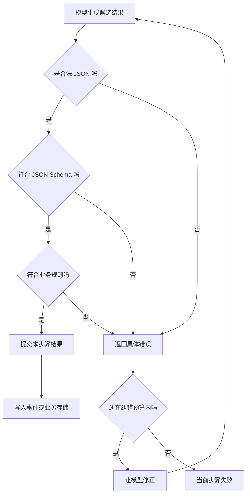

# 结构化输出：正确才提交，错误就阻断

模型不能被保证永远答对 JSON。运行时真正能保证的是：**不合法的输出不能进入权威状态**。



这里有三道不同的门，不能混成一句“校验 JSON”。

| 门 | 它能发现什么 | 它发现不了什么 |
|---|---|---|
| JSON 解析 | 少引号、多逗号、截断、夹带普通文本 | 缺字段、字段类型错误、业务事实错误 |
| JSON Schema | 缺必填字段、类型错误、非法枚举、多余字段 | 结束时间早于开始时间、商品不存在、金额超限 |
| 业务规则 | 字段之间的关系、数据库约束、权限和当前状态 | 模型原本想表达什么 |

只有三道门都通过，调用方才可以把结果当成成功。`json.Valid` 或 `json.Unmarshal` 只过了第一道门。

## 对了怎么办

通过校验的值应先解码成确定的程序类型，再作为当前步骤唯一的权威结果提交。需要持久化时，写入这份已校验的值对应的业务事件或业务表；不要再从模型的自然语言消息中提取第二份。

一次有副作用的工具调用还要把“结果合法”和“副作用成功”分开。推荐顺序是：

```text
生成候选值
-> 本地校验
-> 准备业务变更
-> 用幂等键提交
-> 记录成功事件
-> 推进流程
```

长流程的每一步只读取上一个已提交结果。后续步骤失败时，流程停在最后一个成功点；不能把未经校验的中间文本当作可恢复状态。

## 错了怎么办

错误输出不提交、不覆盖旧值，也不触发依赖这份值的业务动作。运行时应返回具体、机器可读的错误，例如：

```text
$.targetMarkets: expected array, got string
$.status: must be one of [confirmed, unknown]
$.endAt: must be later than $.startAt
```

模型只在有限预算内纠错，通常 2 到 3 次。每次纠错仍须重新经过全部三道门。预算耗尽后，本步骤明确失败，并保存原始候选、校验错误、Schema 版本和调用标识用于排查。

如果失败发生前已经调用外部系统，重试前先用幂等键查询结果或对账。直接重放可能重复扣款、重复发消息或重复创建记录。

## 格式不对时能不能自动修复

可以尝试，但修复结果必须被当成一份新的、不可信的候选值，再走 JSON 解析、Schema 校验和业务校验。原始输出不能因为“修过了”就直接提交。

修复分三类：

| 情况 | 处理 | 原因 |
|---|---|---|
| 外面包了 ` ```json ` 围栏，或 JSON 前后有明确的说明文字 | 可以确定性地取出唯一 JSON 块，然后重新校验 | 没有改 JSON 内部的数据 |
| 少逗号、少引号、多尾逗号、截断 | 优先把解析错误反馈给模型重新生成；也可以交给一次专用修复调用 | 程序补字符可能猜错原意 |
| 缺业务字段、类型错误、多余字段、枚举错误 | 不做通用自动改写，返回具体 Schema 错误让模型重试 | 填默认值、强转类型或删字段会掩盖模型违约 |
| 事实冲突、金额超限、状态不允许 | 直接按业务错误处理 | JSON 修复解决不了业务语义错误 |

以下操作不能作为通用修复策略：

- 缺字段时偷偷填 Go 零值；
- 把字符串 `"12"` 自动转成数字 `12`；
- 遇到未知字段直接删除；
- 重复键只保留最后一个；
- 截断的字符串或数组由程序猜结尾。

业务若明确规定了归一化规则，例如价格允许把整数元转换成分，可以执行；但它属于业务规则，不属于 JSON 修复，而且归一化后仍要重新校验。

推荐的恢复顺序是：

```text
原始输出
-> 严格解析
-> 只做不改变数据的外层提取
-> 再次严格解析
-> 失败则把具体错误交给模型
-> 最多纠错 2 到 3 次
-> 仍失败则当前步骤失败
```

### 现有 Harness 的实际做法

| 实现 | 会不会修 | 源码里的具体行为 |
|---|---|---|
| DSH | 不直接改 JSON | `structured_output` 参数校验失败后生成 `INVALID_ARGS` Tool Result，让原模型重新调用 Tool |
| LangChain / LangGraph | 不直接改 JSON | Tool 参数解析或类型校验失败后生成带具体错误的 `ToolMessage`，图重新进入模型节点 |
| Codex | 只做外层提取 | Guardian 先直接反序列化；失败后取第一个 `{` 到最后一个 `}` 再解析；仍失败则重跑整次 review，最多 3 次 |
| Grok | 外层提取加一次模型纠错 | Workflow 会尝试读取 ` ```json ` 围栏或完整文本；Schema 校验失败后续接一次纠错 Agent，再失败就让任务失败。普通结构化 Tool 路线则把错误返回模型，专用纠错计数上限为 3 |

所以确实有 Harness 做“修复”，但只包括确定性的外层提取，或者让模型根据错误重新生成一份候选。查到的四套源码都没有使用通用 JSON repair 库去自动补逗号、补引号、填字段，然后静默当成业务成功。

## 四套源码实际怎么做

下面的 DSH 指 TypeScript 上游实现；“本仓库”指 `ds-harness-go`。

| 实现 | 怎样约束生成 | 本地怎样验 | 错误怎样回去 | 何时算成功 |
|---|---|---|---|---|
| DSH | 给子 Agent 注册隐藏的 `structured_output` Tool，参数 Schema 就是最终 Schema；普通文本不算结果 | `validateJsonSchemaValue` 校验 Tool 参数 | 生成 `INVALID_ARGS` Tool Result，模型可在同一回合重新调用；这一层没有独立的次数上限 | 候选先暂存，完整 Tool 管线产生成功的 `tools/result` 后才提交；之后 Guard 阻止再次改写 |
| LangChain / LangGraph | 支持时用 Provider `json_schema`；否则把结果包装成人工 Tool | Provider 结果会重新解析；Pydantic、dataclass、TypedDict 会本地验证。`ToolStrategy` 传原始 JSON Schema `dict` 时源码明确不做本地 Schema 校验 | Tool 路线把具体错误放进 `ToolMessage`，图回到模型节点；Provider 路线解析失败直接抛异常 | 解析和类型验证成功后写入图状态的 `structured_response` |
| Codex | 把 `final_output_json_schema` 作为 Responses API 的严格 `json_schema` 发送，`strict` 默认开启 | 通用接收路径没有找到完整 JSON Schema 的本地复验。Guardian 场景会用 Rust 类型再次反序列化，但它不是通用 Schema 验证器 | Guardian 解析失败会重跑整次 review，最多 3 次；没有把逐字段 Schema 错误作为 Tool Result 反馈的通用机制 | 通用路径依赖提供方交出合规文本；Guardian 只有反序列化成功才形成审查结果 |
| Grok | 支持原生 Schema 的后端直接传 `json_schema`；否则注入合成 `StructuredOutput` Tool | 两条路线都用 Rust `jsonschema::Validator` 重新校验 | Tool 路线返回 `Fix the arguments...` 并限次重采样；Workflow 文本契约另有一次纠错 Agent | 本地验证成功才返回 `structured_output`；耗尽预算则返回最后一次验证错误 |

这四套实现的共同点不是“模型一定会听话”，而是都给结构化结果安排了独立通道。差别集中在本地复验、纠错上限和提交时机。

### DSH 的关键点

`structured_output` 的执行体只把参数放进暂存区。它监听最终的 `tools/result`：只有工具参数、执行结果和外层管线都成功，才把暂存值提升为 `captured`。这是一种两阶段提交，避免“Tool 函数返回过成功，后来又被管线判成失败”的值泄漏为最终结果。

源码：`deepseek-harness-dsh-v0.1.2-alpha.3/packages/subagent/subagent-in-process-driver/src/structured.ts`

### LangChain / LangGraph 的关键点

LangGraph 本身负责循环和状态迁移，具体 Schema 由业务传入。Tool 路线校验失败后返回 `ToolMessage`，下一条边重新进入模型节点。使用原始 `dict` Schema 时没有本地验证，因此需要严格结果时应使用 Pydantic、dataclass、TypedDict，或者在业务节点显式增加验证器。

源码：

- `langchain-master/libs/langchain_v1/langchain/agents/structured_output.py`
- `langchain-master/libs/langchain_v1/langchain/agents/factory.py`

### Codex 的关键点

Codex 的通用机制把 Schema 和 `strict=true` 交给 Responses API，源码没有显示一套通用的本地完整 Schema 复验。Guardian 是一个具体业务消费者：它把最终文本反序列化成 `GuardianAssessmentPayload`，解析失败才按最多 3 次重跑。这个局部兜底不能等同于“Codex 所有结构化输出都有本地 Schema 校验”。

源码：

- `codex-main/codex-rs/core/src/client_common.rs`
- `codex-main/codex-rs/core/src/client.rs`
- `codex-main/codex-rs/core/src/guardian/prompt.rs`
- `codex-main/codex-rs/core/src/guardian/review.rs`

### Grok 的关键点

Grok 不把提供方原生严格输出当作最终保证。无论原生路线还是合成 Tool 路线，都用同一份本地 Validator 复验。Tool 参数不合规时，错误会作为 Tool Result 回给模型；达到专用重试上限后，错误成为本回合的结构化输出错误。

源码：

- `grok-build/crates/codegen/xai-grok-shell/src/session/acp_session_impl/turn.rs`
- `grok-build/crates/codegen/xai-grok-shell/src/session/workflow/schema_contract.rs`
- `grok-build/crates/codegen/xai-grok-shell/src/session/workflow/host_service.rs`

## 本仓库目前保证到哪里

`tools` 管线已经实现了完整的工具边界：

```text
模型产生 Tool 参数
-> 参数字节上限
-> JSON 解析
-> 参数 Schema 校验
-> Execute
-> 返回值 JSON 校验
-> 返回值 Schema 校验
-> Render 给模型看的内容
```

所以，走 Tool 的业务数据会在执行前验证输入，在执行后验证输出。错误会形成失败的 Tool Result，不会伪装成成功结果。

但 `llm.GenerateOptions` 目前只有消息、工具、温度、token 上限等字段，没有“最终回答 Schema”。这意味着本仓库目前有可靠的 **Tool 参数和 Tool 返回值结构化边界**，还没有通用的 **模型最终回答结构化输出** 能力。

商品基础信息若通过业务 Tool 写入，应继续走 `tools` 管线并在 Tool 内做业务规则校验。若业务绕过 Tool，直接要求模型返回商品 JSON，则调用方必须自己补齐 Schema 复验、纠错上限和提交边界；普通 `json.Unmarshal` 不能代替这些步骤。

### 当前商品基础信息链路的实际缺口

相邻的 `aiboys-go` 项目现在确实有这个缺口，不是假设：

```text
analyze_product Tool
-> Tool 内部再调用 StructuredModel
-> 提供方 strict json_schema
-> StructuredModel 只做 json.Valid
-> product.go 用 json.Unmarshal 解进 Go struct
-> 合并卡片并写事件
```

`productBasicsSchema` 本身写得合理：根节点和内层对象都关闭了额外字段，七个业务字段全部必填，数组元素类型也明确。问题在接收端：`StructuredModel.Generate` 的 strict 路线只判断是不是合法 JSON，没有用 `productBasicsSchema` 本地复验；随后 `json.Unmarshal` 会忽略未知字段，缺失字段会落成 Go 零值。这样一份违反 Schema 的模型结果可能先被静默改形，再经过合并逻辑成为一份合法的 Tool 返回值。外层 `tools` 管线验证的是改形后的最终值，发现不了原始模型结果曾经违约。

因此这条链需要补的不是更多提示词，而是在 `StructuredModel` 返回之后、`json.Unmarshal` 进入业务结构之前做完整 Schema 校验。校验失败时不要写卡片事件，限次纠错后仍失败就让 `analyze_product` 明确失败。

对应源码：

- `aiboys-go/internal/adapters/agentruntime/structured.go`：strict 路线只调用 `json.Valid`
- `aiboys-go/internal/agent/conversation/application/product.go`：Schema、`json.Unmarshal`、合并和写卡片事件

相关源码：

- `tools/pipeline.go`：`createExecution`、`dispatchToolBody`、`createSuccessResult`
- `tools/jsonvalue.go`：`ValidateValue`
- `llm/generate.go`：`GenerateOptions`

## Schema 怎么写，模型最容易遵守

Schema 既是验证规则，也是模型生成时看到的操作说明。稳定性主要取决于歧义和分支数量。

先记一个总原则：**使用能够完整表达业务的最小 Schema**。在满足业务需要的前提下，层级越少、字段越少、可选分支越少，模型越容易稳定输出。减少结构不能以丢掉业务判断所需的数据为代价；对象确实很大时，应拆成多个步骤或多个 Tool 分别生成和校验。

1. **根节点固定为 object。** 不要让最终结果有时是字符串、有时是数组、有时是对象。
2. **关闭额外字段。** 每一层 object 都写 `additionalProperties: false`，避免模型自创键名。
3. **字段尽量都进入 `required`。** 真正可空的字段用明确的 `null` 分支；不要让“缺失”“空字符串”“unknown”同时表示同一件事。
4. **状态值使用短枚举。** `enum: ["confirmed", "unknown"]` 比让模型自由写“可能、未知、待确认”稳定。
5. **一种事实只保留一种表示。** 不要同时要求 `priceText`、`priceNumber` 和 `priceInCents`，除非业务确实需要并会校验它们的一致性。
6. **结构要浅，数组元素要单一。** 深层 `oneOf`、大量互斥分支和动态键会明显增加选错分支的概率。
7. **字段名表达业务含义。** 使用 `targetMarkets`，不要使用 `data2`；布尔字段用肯定语义，如 `isAvailable`。
8. **description 写判断标准。** 写“仅记录用户明确说出的市场；没有依据时为空数组”，不要重复“这是目标市场字段”。
9. **属性顺序保持稳定。** `properties`、`required` 和示例使用相同顺序，减少输出漂移，也避免破坏提示词缓存。
10. **格式交给 Schema，语义交给业务校验。** 日期格式可由 Schema 限定；“结束时间晚于开始时间”必须由程序判断。
11. **Schema 和 Go/Pydantic 类型只保留一个源头。** 自动生成另一份，并给 Schema 加版本；两份手写定义迟早漂移。

一个适合商品基础信息提取的形状如下：

```json
{
  "type": "object",
  "additionalProperties": false,
  "properties": {
    "productName": {
      "type": "string",
      "description": "用户明确提到的商品名称；无法确定时返回空字符串。"
    },
    "targetMarkets": {
      "type": "array",
      "description": "仅包含对话中有明确依据的目标市场；没有依据时返回空数组。",
      "items": {
        "type": "string"
      }
    },
    "evidenceStatus": {
      "type": "string",
      "enum": ["confirmed", "unknown"],
      "description": "confirmed 表示对话中有直接依据；unknown 表示不能确认。"
    }
  },
  "required": ["productName", "targetMarkets", "evidenceStatus"]
}
```

这个 Schema 仍不能保证商品名称是真的。它只能保证三个键都存在、类型正确、没有第四个键，且状态只能二选一。事实是否可信仍要靠证据规则和业务校验。

## 提示词与 Schema 各管什么

Schema 负责“能不能被程序接收”；Tool 描述或系统提示负责“什么时候产出、字段依据是什么”。两边不要各写一套相互矛盾的格式。

对于人工结构化 Tool，说明应明确：

```text
当商品基础信息已经足够明确时调用此工具。
只填入对话中有直接依据的事实；不推测缺失值。
调用参数必须符合 Schema。普通文本回答不会保存商品信息。
```

如果模型支持原生严格 Schema，优先使用；仍然保留本地复验。若不支持，就使用合成 Tool。仅在提示词里放一段 JSON 示例是最弱的路线，因为示例只能提高概率，不能形成拒绝错误输出的程序边界。

## 本仓库若补最终结构化输出

合理落点不是让每个业务调用方各写一套 `json.Unmarshal`，而是给运行时一条统一契约：

```text
GenerateOptions.OutputSchema
-> 适配器能力探测
-> 原生 strict Schema 或合成结果 Tool
-> 本地 ValidateValue
-> 有上限的纠错
-> 成功值或明确的 StructuredOutputError
```

这一层只负责 JSON 与 Schema。商品字段之间的关系、是否允许覆盖旧卡片、是否应该落库，仍由商品业务层负责。
