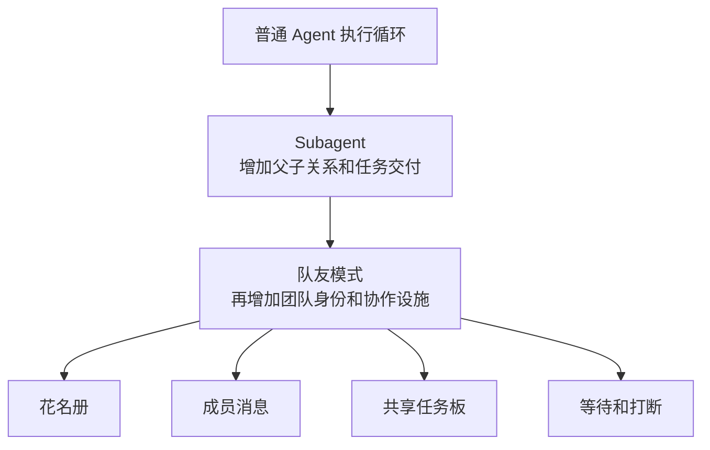
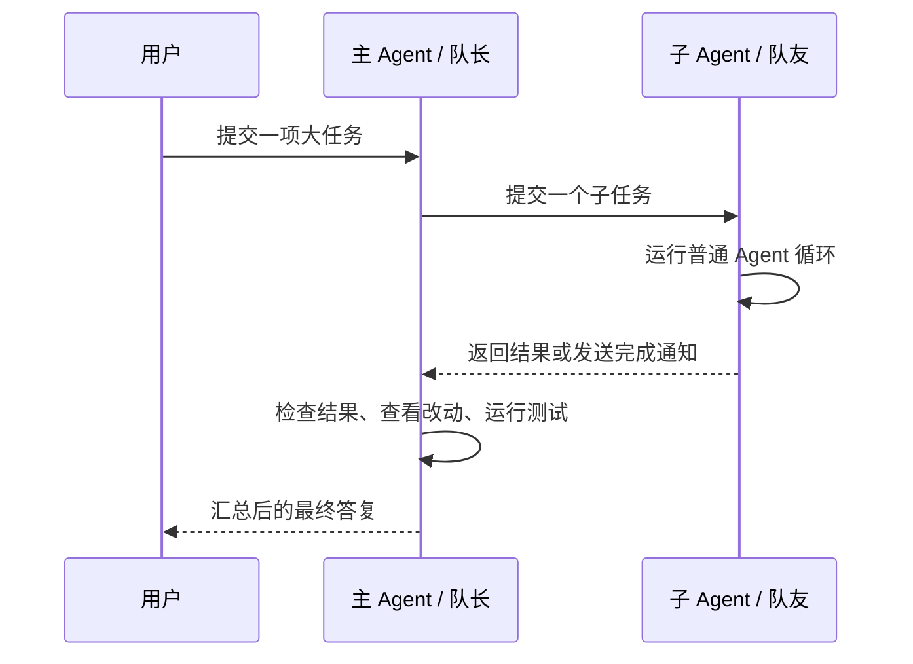
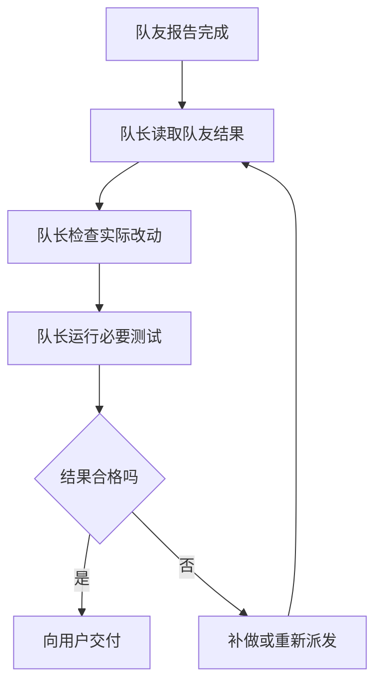

# Subagent 与队友模式

## 先说结论

Subagent 和队友模式不是两个不同的 Agent 执行引擎。

两者里面真正干活的，都是普通 Agent：接收提示词，调用模型，选择 Tool，再把结果写进自己的会话。

它们的区别在管理关系：



因此可以这样理解：

```text
Subagent = Agent + 父子关系 + 一次任务

队友 = 可续 Subagent
     + 稳定的团队身份
     + 成员间通信
     + 团队状态查询
     + 可选的共享任务板
```

队友模式能并发处理更多工作，但不会让模型天然更聪明，也不会自动保证工作正确。

---

## 单 Agent、Subagent 和队友模式分别解决什么问题

| 形态 | 谁安排工作 | 工作在哪里执行 | 中间过程在哪里 | 怎么返回结果 |
|---|---|---|---|---|
| 单 Agent | 当前 Agent 自己 | 当前 Agent 的循环 | 当前会话 | 直接回复用户 |
| Subagent | 父 Agent | 子 Agent 自己的循环 | 子 Agent 会话 | 返回父 Agent |
| 队友模式 | 队长或团队成员 | 每个队友自己的循环 | 各自会话 | 消息、完成通知或共享任务板 |

普通 Subagent 主要解决上下文隔离和任务委派。父 Agent 把一件边界明确的工作交出去，子 Agent 完成后把结果交还给父 Agent。

队友模式主要解决多个长时间存活的 Agent 如何协调。队友可以继续接任务、互相发消息、查询其他成员状态，并共同维护任务进度。



最后一步仍然属于主 Agent。框架只能记录成员状态和投递结果，无法理解业务结果是否正确。

---

## 本仓库的实现

### 队友建立在 Subagent 上

`feature/agentteam` 没有实现第二套 Agent 循环。创建队友的调用链是：

```text
spawn_teammate
  -> agentteamtool.Controller.spawn
  -> agentteam.Service.Spawn
  -> subagent.Runtime.StartContinuable
  -> spawn 或 fork Provider
  -> 创建普通子 Agent
```

直接证据在：

- `feature/agentteam/agentteamtool/roster.go`：把 `spawn_teammate` 参数交给团队服务。
- `feature/agentteam/roster.go:91`：团队服务调用 `StartContinuable`。
- `feature/subagent/continuationops.go:29`：可续子 Agent 的实际创建入口。

### 当前队友没有专门职业配置

团队服务创建队友时只传入：

```go
Request: subagent.StartRequest{
    Prompt: request.Prompt,
    Parent: parent,
}
```

它没有传入 `AgentOptions`、`Persona` 或 `ToolFilter`，也没有传入“作曲 Agent”“作词 Agent”这样的预设身份。

结果是：

- 模型、Provider、推理档位和 Token 上限默认从父 Agent 继承，见 `feature/subagent/childagent.go:105`。
- 父 Agent 当前组合出的 Preset 会写进孩子的创建信息，见 `feature/subagent/childagent.go:145`。
- 队友的主要差异来自队长交给它的任务提示词。
- `fresh` 创建空白对话；`fork` 复制父 Agent 已完成的会话前缀。

所以当前 Agent Team 适合让能力相近的 Agent 并发分担工作。它暂时不能通过 `spawn_teammate` 选择一个已经配置好专属提示词、Skill 和 Tool 的业务专家。

### 普通 Subagent 可以被专门配置

底层 Subagent 本身已经支持：

- `AgentOptions`：模型、Provider、推理档位和 Token 上限。
- `Persona`：只对该子 Agent 生效的人设。
- `ToolFilter`：限制该子 Agent 能看到和调用的 Tool。
- `OutputSchema`：要求一次性子 Agent 返回结构化结果。
- `MaxDepth`：限制递归派发深度。

这些能力定义在 `feature/subagent/types.go`，并由 `feature/subagent/childagent.go` 在孩子创建时装配。

因此“底层做不到专家 Agent”是不对的。准确情况是：底层 Subagent 支持专门配置，但当前 `spawn_teammate` 没有暴露这些选择。

### 团队增加了什么

`feature/agentteam` 在可续 Subagent 之上增加三组持久数据：

| 数据 | 作用 |
|---|---|
| 花名册 | 记录队长、队友名称、职责和当前状态 |
| 收件箱 | 在成员之间持久投递消息 |
| 共享任务板 | 记录任务、负责人、前置关系和完成声明 |

`feature/agentteam/agentteamtool` 再把这些能力包装成模型可调用的 Tool，包括 `spawn_teammate`、`send_message`、`followup_task`、`list_agents`、`wait_agent`、`interrupt_agent` 和四个任务板 Tool。

### 任务完成不等于任务正确

任务板允许负责人或队长把 `in_progress` 改成 `completed`。程序检查的是身份、版本号和状态迁移是否合法，不检查代码或业务结果。

源码在 `feature/agentteam/doc.go:67` 明确说明：

> `completed` 是一条被写下来的声明，不是一次验收。

所以完整过程应当是：



### 当前装配状态

仓库已经实现 `feature/agentteam` 和 `feature/agentteam/agentteamtool`，但正式装配代码目前没有调用 `agentteamtool.Install`，也没有正式注册 `spawn`、`fork` Provider。因此它现在是已经实现的可选能力，不是默认 Harness 启动后就能使用的能力。

---

## 其他 Harness 怎么处理

### DeepSeek Harness

DSH 对普通 Subagent 和 Agent Team 做了明确分层。

普通 Subagent 的模型侧入口是 `tool-subagent`。每个工具实例可以预先配置：

- `agentOptions`
- `persona`
- `toolFilter`
- `maxDepth`

源码：

`deepseek-harness-dsh-v0.1.2-alpha.3/packages/subagent/tool-subagent/src/index.ts:66`

Agent Team 创建成员时没有另造执行器，而是调用同一个 Subagent Runtime：

`deepseek-harness-dsh-v0.1.2-alpha.3/packages/experimental/agent-team/src/roster.ts:281`

团队层增加了 `spawn_teammate`、成员消息、等待机制和共享任务板：

`deepseek-harness-dsh-v0.1.2-alpha.3/packages/experimental/tool-agent-team/src/index.ts:174`

因此 DSH 的关系是：队友属于可续 Subagent，Agent Team 负责组织和协作。

### Codex

Codex Multi-Agent V2 同样把队友运行成独立 Agent 线程。它的默认提示明确告诉模型：所有成员能力相当，并拥有同一组 Tool。

源码：

`codex-main/codex-rs/core/src/session/multi_agents.rs:15`

Codex 在子 Agent 上增加：

- 树形任务名称。
- `send_message` 和 `followup_task`。
- `list_agents`、`wait_agent` 和 `interrupt_agent`。
- 子 Agent 完成后向父 Agent 投递最终消息。

源码：

`codex-main/codex-rs/core/src/tools/handlers/multi_agents_spec.rs:186`

Codex 没有 DSH 那套共享任务板。它用 Agent 树、邮箱消息和状态通知完成协调。

Codex 的源码还支持可选 `agent_type`。部署方暴露并配置该字段后，可以给子 Agent 选择预制角色；没有选择时，默认仍是与父 Agent 能力相近的通用 Agent。

`codex-main/codex-rs/core/src/tools/handlers/multi_agents_spec.rs:631`

### Grok

Grok Build 提供的是父 Agent 管理 Subagent 的模式，没有发现独立的 Agent Team 层。

它的 `TaskTool` 创建子 Agent，请求中明确携带 `subagent_type` 和运行期覆盖配置：

`grok-build/crates/codegen/xai-grok-tools/src/implementations/grok_build/task/types.rs:60`

不同 Subagent 类型可以拥有不同的：

- 模型。
- 推理档位。
- Persona。
- Role Prompt。
- Tool 能力范围。
- 隔离方式。

解析顺序写在：

`grok-build/crates/codegen/xai-grok-subagent-resolution/src/types.rs:20`

Grok 支持后台运行、等待结果、取消和恢复 Subagent，但没有找到团队花名册、成员之间直接发消息或共享任务板。因此它更接近“主管调用一组预制专家”，不是 DSH 的“队友协作”。

### LangChain 与 Deep Agents

LangChain Core 能识别由 Tool 调起的嵌套具名 Agent，并把运行过程作为 Subagent Stream 暴露：

`langchain-master/libs/langchain_v1/langchain/agents/_subagent_transformer.py:1`

它没有提供完整的队友组织。Agent 怎么创建、怎么互相调用，主要由应用组装。

Deep Agents 是 LangChain 和 LangGraph 之上的 Harness。它提供真正的 Subagent 配置，每个 Subagent 可以定义：

- `name`
- `description`
- `system_prompt`
- `tools`
- `model`
- `middleware`
- `skills`
- `permissions`

源码：

`deepagents-main/libs/deepagents/deepagents/middleware/subagents.py:38`

主 Agent 通过 `task` Tool 调用这些预制 Subagent。异步 Subagent 会返回任务 ID，并提供查询、追加指令、列举和取消能力。源码中没有 DSH 式团队花名册、队友之间直接发消息和共享任务板。

### LangGraph

LangGraph 更底层。它提供图节点、子图、共享状态、条件边和 `Send`，但不规定哪些节点算主 Agent、Subagent 或队友。

`StateGraph` 的节点通过读写共享状态通信：

`langgraph-main/libs/langgraph/langgraph/graph/state.py:131`

`Send` 可以把不同输入并发发送到指定节点：

`langgraph-main/libs/langgraph/langgraph/types.py:704`

开发者可以用这些机制实现主管与专家、并行工作者或完整团队，但角色、消息、任务板和验收规则都要由应用自己定义。

---

## 对比表

| 项目 | 普通 Subagent | 预制专家能力 | 队友直接通信 | 共享任务板 | 队友是否复用普通 Agent 执行机制 |
|---|---|---|---|---|---|
| 本仓库 | 有 | 底层支持，`spawn_teammate` 尚未暴露 | 有 | 有 | 是 |
| DSH | 有 | 普通 Subagent 支持；Team Spawn 默认不选择 | 有 | 有 | 是 |
| Codex | 有 | 可选 `agent_type` | 有 | 无 | 是 |
| Grok Build | 有 | 有，按 `subagent_type` 选择 | 无 | 无 | 是 |
| Deep Agents | 有 | 有，调用方预先定义 | 无 | 无 | 是 |
| LangChain Core | 只提供嵌套 Agent 的基础支持 | 由应用定义 | 无 | 无 | 由应用决定 |
| LangGraph | 没有固定的 Agent 抽象 | 由图节点定义 | 由应用定义 | 由应用定义 | 由应用决定 |

这里的“无”表示当前查看的源码没有提供该项目级能力，不表示应用不能在它上面自行实现。

---

## 应该怎样选择

一件任务只需要独立执行并返回一次结果时，用普通 Subagent。它结构简单，父子关系明确，也更容易限制 Tool 和 Token。

需要固定的研究员、审核员、作词或作曲能力时，用预制 Subagent。每种类型应明确配置系统提示词、模型、Tool、Skill 和权限。

多个 Agent 需要持续协作、互相补充信息、反复接任务时，再使用队友模式。团队设施解决的是协调问题，不能代替专业能力配置和最终验收。
