# 验证记录：用本运行时复刻 agent-lab

## 这份文档是什么

它**不是**设计文档，也不是接入指南。它是一份验证记录，回答一个问题：

> 把一个真实的、已经在跑的对话式 Agent 产品完整重做一遍，这套运行时够不够用？

被验对象是 `C:\codestudy\agent-lab`——一个用 LangChain + LangGraph 写的商品带货视频创作 Agent，有十个工具、一个九人创意讨论群、事件溯源的会话日志、一套完整界面。复刻落在两个既有仓库里：后端 `C:\code\aiboys-go`，前端 `C:\code\aiboy`。

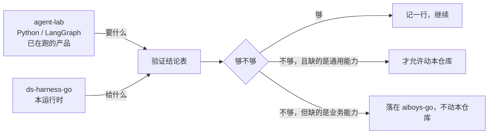

**这条判定线是这次验证的全部纪律**：本运行时是通用的，不为 agent-lab 定制。判一件事该不该进来，问「换一个完全不相干的业务，这个东西还需要吗」——需要才考虑，不需要就是宿主侧的事。

## 三个仓库各自担什么

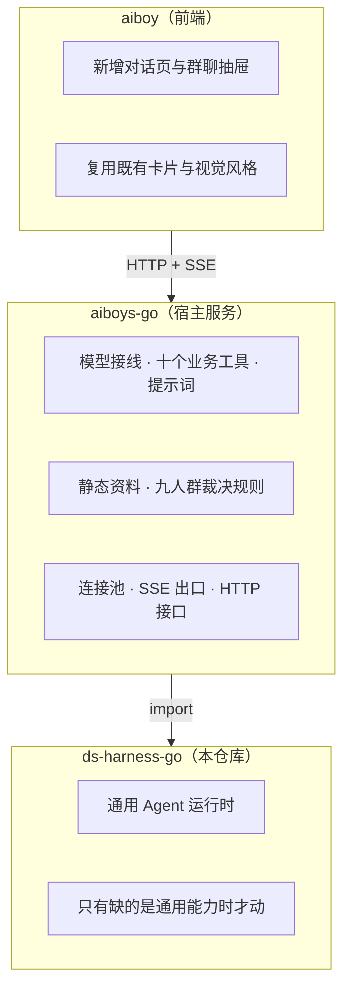

## 验证结论表

「够不够」这一列是这份文档的产出。每做完一个阶段回来补一行；最后整张表填满，就是这次验证的答案。

| # | agent-lab 要什么 | 本运行时里对应什么 | 够不够 | 缺的是通用能力吗 |
|---|---|---|---|---|
| 1 | 模型流里多出一路思考内容（llama.cpp 的 `reasoning_content`） | `adapter/openaicompat` 的流解析本来就认这个字段名，从增量的额外字段里取 | 够，**已对真服务端实测** | — |
| 2 | 请求体要带两个非标准顶层字段（`chat_template_kwargs`、`thinking_budget_tokens`） | `adapter/openaicompat` 的扩展字段归属表：宿主登记贡献方与它认领的字段名，每次请求现算取值 | 够，**已对真服务端实测** | — |
| 3 | 推理服务的鉴权可有可无 | 适配器解算凭据的那个钩子：交空串就是这条路由不认证，交字面值就挂到请求头上 | 够，**两种都已实测** | — |
| 4 | 换模型期间服务端一律回 503「Loading model」，客户端得自己等 | 状态码归类把 5xx 归成「服务端错」，而这一类本来就在默认可重试集合里 | 够，**已实测**；宿主一行等待逻辑都不用写 | — |
| 5 | 界面要实时看到助手输出与工具进展 | `harness/session` 的事件观察者：会话每落一条日志事件就回调一次，宿主据此扇出 SSE | 够，**已接出一条真 SSE 出口**；但回调的时机有一条硬约束，见下 | — |
| 6 | 会话日志是唯一权威事实，界面状态由它推出来 | `sessionlog` 的追加日志 + 状态缓存，本来就是这个形状 | 够 | — |
| 7 | 会话要落到 SQLite，进程崩溃后能修复 | `adapter/datastore/sessionstore`——一个成品的生产后端，四个接缝全填，方言里 SQLite 和 Postgres 都在 | 够，**而且宿主的存储代码是零行**：只递一个连接池进去。**跨重启已实测** | — |
| 8 | 一个九人讨论群，成员与顺序建群时固定 | — | **不适用**：这三行原先答的是一个 agent-lab 没问过的问题，见下 | 不适用 |
| 9 | 同一时刻只允许一名成员发言，严格串行 | — | **不适用**，同上 | 不适用 |
| 10 | 群成员是能中断、能续、重开会话还在的子 Agent | — | **不适用**，同上 | 不适用 |
| 11 | 十个工具里有六个完全无参，全部从会话权威数据取值 | `tools` 运行时把上下文交给工具，不经模型参数 | **不够→已补**：装上去的工具从来没报给模型 | 是，已补进本仓库 |
| 11b | 每一轮按会话当下的状态决定模型看得见哪几件工具 | `harness/systemprompt` 的装配瀑布钩子，每装配一次跑一次 | 够，**运行时零改动** | — |
| 12 | 商品图作为多模态输入进对话 | 适配器在请求那一刻解算附件服务；没挂附件服务时历史里出现图会被明确拒掉 | **不够→已补两处**：接缝要一整台文件系统才挂得上；挂上之后带图的每一轮都当场报错 | 是，两处都已补进本仓库 |
| 13 | 群聊上下文超长时要压缩，且压缩失败要有明确失败态 | `feature/compaction`，但它是**按会话**压缩的 | **不适用**：群聊记录从头到尾不是一段 harness 会话 | 不适用，见下 |
| 14 | 界面上的工具卡要有「调用中」和「已完成」两种样子，且刷新后一模一样 | `tools` 的工具定义上就有这两个钩子，且要求它们是纯函数 | 够 | — |
| 15 | 会话事件日志只追加，永不删除任何一条 | `feature/persistence` 的每会话事件上限没有关闭开关，而自带的那个后端**实现了**可修剪接口——所以这个数在这条路上是真会生效的 | 够，但要**有意识地给一个足够大的值**：实测一段 11 回合的会话就用掉 2399 条，缺省的 1000 在第 5 个回合撞上 | 是（一档显式的「不修剪」），已记录未补，见下 |
| 16 | 分镜提示词、导演档案、观众库这些静态资料 | — | 不适用 | 不适用：业务资料，按路径读普通文件落在宿主侧 |
| 17 | 每轮裁决、三个按钮、临时分镜替换当前讨论对象 | — | 不适用 | 不适用：agent-lab 特有规则，落在宿主侧的状态机 |
| 18 | 用户能删掉一段历史会话，连同它的消息、图片与运行状态 | 原来**什么都没有**：会话能建、能读、能续，唯独没有一条路把它从存储里去掉 | **不够→已补**：见下 | 是，已补进本仓库 |
| 19 | 会话列表上显示的是第一句用户消息，不是会话标识 | `Session.Inspect` / `Coordinator.LoadStored` 能读回整份日志，标题由宿主现推 | 够，**运行时零改动**；但读路径没有「头 N 条事件」这一档，见下 | — |

## 已经定下来的几条，证据在哪

### 第 1–4 行：接本地推理服务，运行时一行不改（**已实测**）

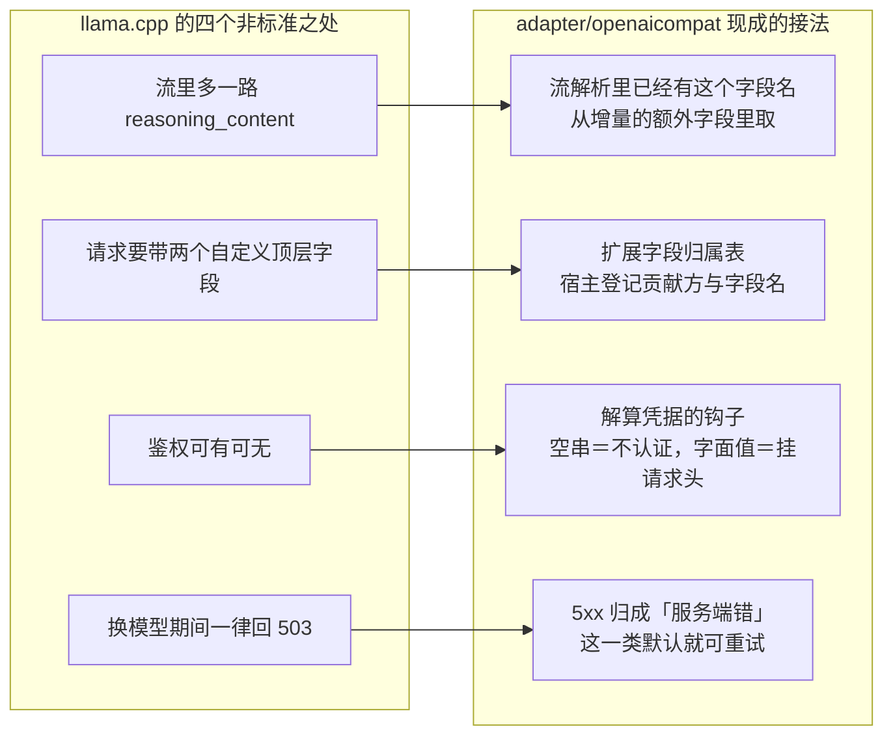

两个自定义字段名都不在适配器自己保留的那批顶层字段里，所以登记不会撞车。归属表是整条登记要么全成要么全不成，不会留下半登记的贡献方。

第 3 行有一处容易踩空：那个模块的路由配置上只有一个凭据位，而它描述的是一个**引用**（去别处按这个名字取）。宿主如果凭据就在手上、没有那个「别处」，这个位可以整个不填——解算凭据的钩子是**每次请求都问**的，不看引用填没填。

**验证方式是两层，不是一层：**

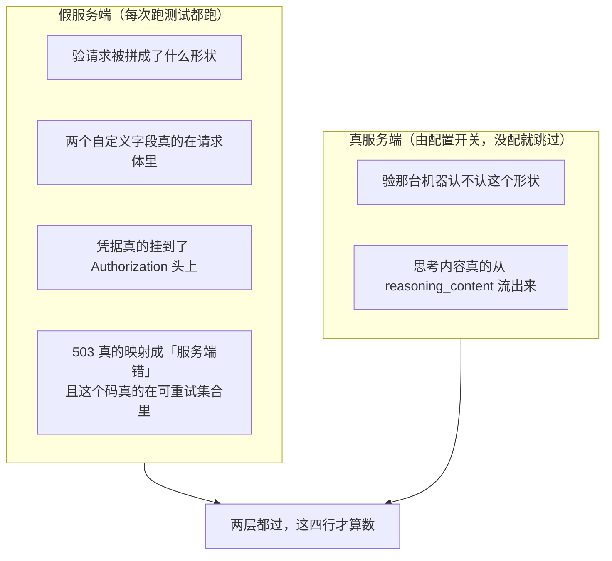

真服务端那一轮的实测结果：一次不带工具的对话，思考 3369 字、正文 49 字，两路都出来了。

**这是本次验证的第一个正面结果**：接一个非标准的本地推理服务，运行时一行不改。

### 第 5 行：SSE 的取数口（**已接出一条真的**）

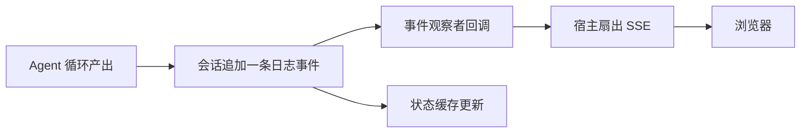

取数口本身够用，一行都不用改。但接的过程量出了三件事，都值得记下来。

#### 一、观察者跑在写日志那条协程上，而且在会话存储的锁里面

这不是一句实现细节，它直接决定了宿主的扇出**不许阻塞**。在那个回调里等一条慢的 HTTP 连接，等的是整台服务——那把锁没放，别的会话一条事件也落不下去。

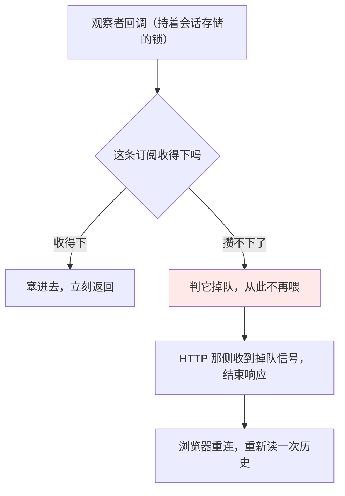

掉队时**唯一正确的处置是断开**，不是少送几条。悄悄变薄的话，界面上拼出来的是一段缺了句子的对话，而那种错在下游没有任何办法被发现。

#### 二、思考过程**是**落日志的——原先这份文档写反了

这里原先写着「思考过程只走 SSE，不入库」。**那是错的。** `sessionlog` 的存储行词汇里有一条 `reasoning-chunks`，专门用来把一串连续的推理增量压成一行存起来。也就是说推理内容和正文一样是耐久的。

于是「刷新之后思考不再出现」这条验收，**是宿主的重放策略，不是运行时的行为**。宿主要自己在重放时把增量类事件挡掉，实时流则照送。两条路走同一份数据、用两套可见性规则——这件事必须由宿主明写出来，指望运行时替它忘掉是指望不上的。

**后来这一段又被改了一次**：第八个缺口（见下文「逐字的增量被当成日志内容存了下来」）把带内容的增量整个移出了日志。所以今天这句话的准确说法是——推理内容**不再**耐久，宿主那条重放规则挡的只剩日志里那几条不带内容的分块。上面这两段留着，因为它记录的是「一句错的陈述句能盖住什么」：正是「推理内容是耐久的」这个事实，让「它耐久得对不对」这个问题晚了很久才被问出口。

#### 三、先订阅还是先读历史，只有一个答案

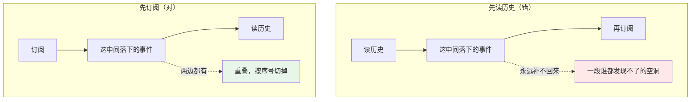

重叠好办，空洞没救——所以次序只能是先订阅。**但切重叠的那个数有一个坑**：它必须是「这次历史读到的最后一条的序号」，而不是「重放真正送出去的最大序号」。两者在末尾恰好是一条被挡掉的增量时会差开，差开的后果是那条增量被当成没送过、再走实时路送一遍，界面上同一段文字打两遍。

这条不是推理出来的：接入方那侧把切点改成错的那个数之后，测试当场变红。

**这三条都是接入方要知道的事，不是运行时的缺口。** 记在这里是因为取数口的文档只说了「会回调」，没说回调在锁里面，也没说推理内容是耐久的——而这两件事任何一个接入方都会撞上。

### 第 8 / 9 / 10 行：这三行原先答错了题（**把它们从「够」改成「不适用」**）

这三行原先记着「`feature/agentteam` 够、`feature/subagent` 够」。**把九人群真的照 agent-lab 落地一遍之后，发现这三行答的是一个 agent-lab 从来没问过的问题。**

它不是一个多 Agent 团队，是**一台确定性状态机**：

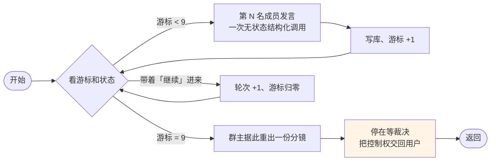

图里有一处是**本服务有意和 agent-lab 走岔的**：agent-lab 在第九个人说完就停下（`graph/creative_group.py` 那个 `interrupt()`），群主要等用户点了「继续讨论」才出分镜。本服务把群主并进这一轮——一轮的产出是一份新分镜，不是九条意见；让用户对着九段议论决定要不要继续，等于让他替群主先判断这些意见值不值一次生成。除此之外这张图和 agent-lab 那张一致。

差别在哪：

| | 一个多 Agent 团队 | agent-lab 的九人群 |
|---|---|---|
| 谁下一个说话 | 调度器决定 | `next_member_index` 这个整数决定 |
| 成员有没有自己的会话 | 有 | **没有**，九名成员是九次一次性调用 |
| 成员之间收发消息吗 | 收发 | **不收发**，各自只看同一份群聊记录文本 |
| 成员记不记得上一轮 | 记得 | **不记得**，人设和记录每次重新拼进提示词 |
| 「可续」靠什么 | 孩子会话还在 | **一张表**：群的状态、轮次、游标落库 |

所以「成员数上限默认八」「可续孩子」「收件箱串行」这些答案在这里一个都用不上——**没有队友，也就没有队友数上限**。串行是天然的：状态机一次只走一步。「关闭抽屉不中断运行」靠的是那两张表，不是靠孩子会话活着。

**这不是运行时的失败。** `feature/agentteam` 和 `feature/subagent` 本身没问题，只是这个业务用不到它们。记成「不适用」而不是「不够」：一个通用运行时带着本次用不上的能力，是正常的。

**教训写在这里，因为它是这次验证方法本身的一个洞**：前三行是**照着 agent-lab 的界面**（「群里有九个人依次发言」）推出来的，不是照着 agent-lab 的**代码**（`graph/nodes.py` 那张 LangGraph 图）。界面长得像一个团队，实现是一台状态机。**后面每一行都要顶到实现再判。**

### 第 13 行：压缩是按会话的，而群聊记录不是一段会话

`feature/compaction` 压的是**一段 harness 会话**的历史。群里那份越滚越长的群聊记录从头到尾没有变成一段会话——它是宿主自己那张 `creative_group_messages` 表拼出来的一段文本，每一轮重新拼进提示词。

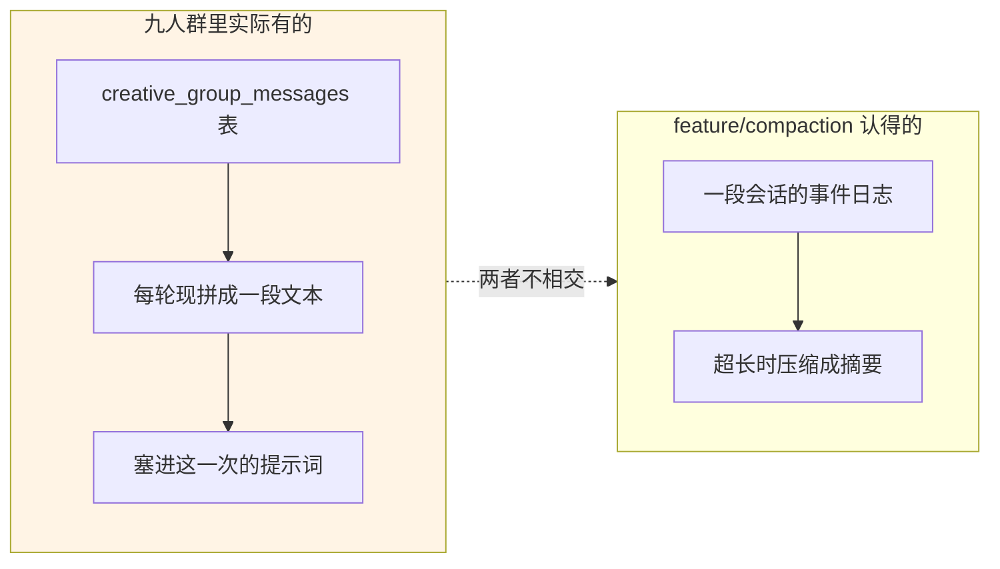

所以这一行也是**不适用**，不是「不够」。真要给它一个通用答案，那个能力得是「压缩任意一段消息列表」而不是「压缩一段会话」——但 agent-lab 自己也没做这件事（它靠的是每轮只带最近的记录），所以本工程给不出一条真实需求来支撑那个改动。**不提缺口。**

### 第 14 行：工具卡不需要新造一套协议

工具定义上的那两个钩子，一个说这次调用在界面上长什么样，一个说结果长什么样。运行时要求**它们必须是纯函数**——只能依赖参数，不能读外部状态。

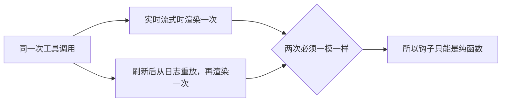

这条约束正好对上验收里那句「刷新页面后卡片要一模一样」。不是巧合：两边解决的是同一个问题。

### 第 7 行：会话持久化整块，宿主不写实现（**本次验证的第二个正面结果**）

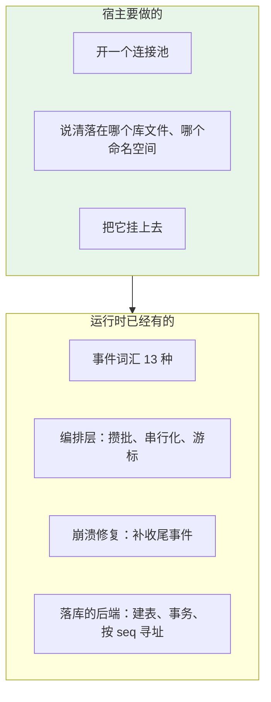

`adapter/datastore/sessionstore` 把 `Backend`、`SeekableBackend`、`ClosableBackend`、`TrimmingBackend` 四个都填了，`adapter/datastore` 的方言里 SQLite 和 Postgres 都在，`sessionstore` 自己的测试默认就跑在 SQLite 上。宿主侧写的是十几行装配。

**这一条已经由能跑的代码坐实，不再是读源码得出的判断。** 接入方那侧落了一个包内测试：装配一次、建会话、追加一回合、拆掉整套装配（连接池随之关闭），再在同一个库文件上装第二次，读回来的事件一条不少——中间没有任何内存残留能解释这个结果。同一个测试文件里还验了业务表和会话表共用一个库文件互不打架：会话侧收摊之后业务那个池子照常读写，会话那批表全部带着命名空间前缀。

**装配顺序原先要宿主自己当心，现在不用了。** 这里原先写着「会话存储要挂在重试之前，否则重试还在制造写入而会话侧已经收摊了」。那条提醒在装配钩子进来之后失效了——持久化现在装在 `harness.New` 里面，宿主之后挂在同一个作用域上的任何东西（重试就是其中之一）都排在它后面，也就先于它被摘掉。**顺序从一条要记住的规矩变成了一个装不错的结构。** 这个改动的来由见下一节。

**崩溃修复也不用宿主接。** 它整块在协调器的装载路径里（`feature/persistence/coordinator_prepare.go` 里调 `sessionlog.InterruptedTurnClosers` 补收尾事件、调 `Backend.CommitRepair` 落盘）。同理，`session.Store` 上那四个观察点（创建、事件、刷盘、销毁）由 `Coordinator.Install` 自己挂，宿主一个都不用管。

**两件事必须由宿主在连接串上设，`adapter/datastore` 管不了：** 写锁等待时间（不设的话两条写事务撞上时后到的当场失败，而不是等一等再来）和外键约束（不设的话事件表那道外键不生效）。

**还有一件事宿主必须知道：`datastore.Medium` 拥有并负责关闭交给它的连接池。** 所以会话那份介质要用**自己的**池子——和业务共用一个的话，会话一收摊，整个服务的数据库就没了。同一个库文件没问题，两套表靠命名空间隔开（SQLite 上是表名前缀）。

#### 顺带记一处文档事实错误

`docs/embedding.md:436` 写着运行时「没有内置的生产会话持久化后端」。**这句话是错的**，`adapter/datastore/sessionstore` 就在仓库里。这句话让接入方走了一段弯路：本次复刻的计划一度定为「把宿主仓库里那三千多行预备代码改造成运行时的存储后端」，前提就是它。

### 第一个真的缺口：持久化在外面挂不上（**已补，补的是通用能力**）

这是本次验证到目前为止唯一一处「不够，而且缺的是通用能力」——也就是这份记录真正想找的那种结果。

**症状**：会话日志能写、能落库、崩了能修，但**续跑接不上**。宿主照文档把持久化挂在装配外面之后，得到的是一台能写日志、却永远 `Resume` 不了的循环。

**原因是一个先有鸡还是先有蛋**：


后端要活会话存储和事件词汇才造得出来，而循环工厂要后端才接得上续跑；这两头都在 `harness.New` 内部。往前挪拿不到那两样，往后挪循环工厂已经定型了——**中间那个唯一可行的时刻，外面够不着。**

**补法是一个钩子**（`harness.Options.Persistence`）：`New` 在两样都在场、循环工厂还没造的那一刻回调宿主一次，把作用域、活会话存储、并好的事件词汇递出去，收回一个持久化实现。撤销不走返回值而走作用域，所以宿主之后挂上的东西自然排在它后面——上一节那条拆除顺序的提醒就是因此作废的。

**为什么判它是通用能力，而不是 agent-lab 的需求**：换任何一个不相干的业务，只要它想让一段会话在进程重启后续着跑，撞上的是同一个死结。这里没有一个字与带货视频有关。补进来的也只是一个时机钩子，运行时不因此认识任何一种业务。

**这条同时暴露了一个更钝的问题**：`harness.New` 的文档原先写着这份装配「不接持久化，所以 `Resume` 会报错」——读起来像一句设计取舍，实际上是「这条路当时走不通」。缺口被一句陈述句盖住了，所以它是靠真接一遍才露出来的，不是靠读源码。

### 第二个真的缺口：装上去的工具，模型不知道有（**已补，补的是通用能力**）

**症状比第一个缺口更难发现**：装配不报错、工具登记得上、手动派发也跑得通，只是模型从头到尾一次都不调。看起来像模型不听话。

原因是这两件事分头取值，中间那根线断了：

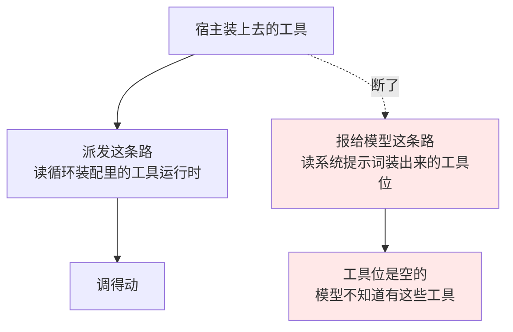

**这是一处移植时掉的行**：DSH 那边在工具运行时的构造函数里就把自己接到了系统提示词服务上（`packages/core/tools/src/index.ts:825`，装的是 `wireSchemas` 的 native 那一支，`:972-978`）。本仓库移植时这一句没落地，于是工具位一直是空的。

**补在哪，是被分层逼出来的**：Go 这边 `tools` 是契约层的包，门禁不许它 import `harness/systemprompt`；而 `harness/agentloop` 的构造函数是全仓库唯一同时握着工具运行时和系统提示词注册表的地方。所以这一句落在那里，不在 `tools` 的构造函数里。回归测试守着它。

**为什么判它是通用能力**：这不是补一项新功能，是修一个 bug——任何一个宿主装任何一件工具都撞得上，和带货视频没有一个字的关系。

#### 逐轮变化的工具集：够，运行时零改动

agent-lab 的工具是一道四级阶梯，每一轮重算：没有商品数据时只给三件，有了商品给四件，有了洞察再给三件分镜工具，候选分镜够两份才给观众评选。


钩子拿到的是**整份装配结果**（正文小节、上下文、工具位），交回去的那份是权威的。所以「这一轮只露这几件」写起来就是滤一遍工具位，运行时一行不用改。

**有一条要写清楚，否则接入方会走弯路**：`tools` 运行时上那个限制器**做不了这件事**。它滤的是一个作用域**从上层继承来的**全局工具，对这个作用域自己登记的那几件明确不起作用——而按会话装的工具全都登记在会话自己的作用域上。另外它是「登记一次、给一个撤销函数」的静态形状，也不是逐轮的。执行守卫同样不行：它在调用发生**之后**拒绝，不会让工具从模型眼前消失。

一步之内工具集变了会让循环写一条请求头变更事件。那是记录，不是异常。

#### 工具这一层其余的摩擦，都不是缺口

| 撞上的 | 实情 | 宿主怎么办 |
|---|---|---|
| 工具入参 schema | 收普通 JSON Schema，但**不认 `$ref` / `$defs`** | 把 schema 摊平，别用引用 |
| 工具执行时拿不到会话标识 | 执行入参里没有这一项 | 按会话装工具时用闭包把标识带进去 |
| 工具结果块上没有工具名 | 只有调用标识 | 自己留一张调用标识到工具名的表，回读时反查 |
| 工具在装配时就被消费掉 | 一件要往会话日志里写东西的工具，装配那一刻还没有会话 | 宿主侧晚绑：先装壳，运行时就位后再填 |
| 结构化输出 | `llm` 这一层**没有**这个概念，请求上没有对应字段 | 走适配器的扩展字段归属表，把 schema 逐次挂到请求体上 |

前四条都是形状上的别扭，不是能力缺失，宿主几行代码就绕开了。**第五条不一样**：让模型按一份 schema 出 JSON 是今天所有主流推理服务都提供的能力，而这一层完全没有它的位置。九人群那一段跑完之后已经判了，**它是第三个真的缺口**——见下面「结构化输出」那一节。

### 第 12 行：真传一张图之后，撞出第四、第五个缺口（**都已补，补的都是通用能力**）

原先这一节记的是「挂得上但没有东西可挂，形状待定，等前端真传一张图之后再定」。传完了。传的过程中撞出**两件事**，前一件是原先猜到的那个，后一件比它严重得多。

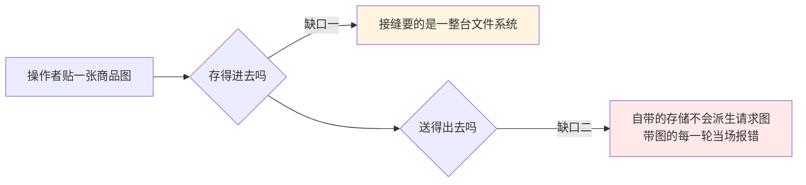

#### 缺口一：存进去这一侧，要的东西比用到的多

图片存储那条依赖链最底下写的是「一台文件系统」——十六个方法，列目录、改文本、删子树都在里面。而这台内容寻址的存储实际只用四个：解路径、建目录、读字节、写字节。差出来的十二个是它永远不会做的事。

于是一个**没有盘**的部署（本仓库的硬前提正是这一条）为了挂上它，得先把十二个用不着的方法补出来。按「接口定义在使用方」把它收窄成使用方自己声明的四个方法之后，一个只有一个对象桶或者一张数据库表的宿主实现四个方法就能接上；已经在递文件系统的调用方一个字都不用改，因为任何文件系统本来就满足这四条。

**这是把本来就为真的一句话写进类型里**，不是放宽语义。宿主侧的收益是实打实的：一张已有的附件表 + 一个已有的对象存储，直接就是这台图片存储的介质。

#### 缺口二：挂上了也发不出去——这是个真的阻断

模型适配器在组请求体的那一刻，会把历史里**每一张**图都拿去现派生一份「按这条路由的预算重编过的版本」（像素上限、字节上限各一条，缺省是 2048×2048 与 1 MiB）。这件事是必做的，不是可选优化。

而派生这项能力在附件接缝上是**可选的**：存储实现了就能派生，没实现就报「挂着的这台附件服务派生不出模型请求图」。本仓库自带的那台存储恰恰没实现——包注释里当初还专门写了两遍「不实现」，当成一条有意画下的边界。

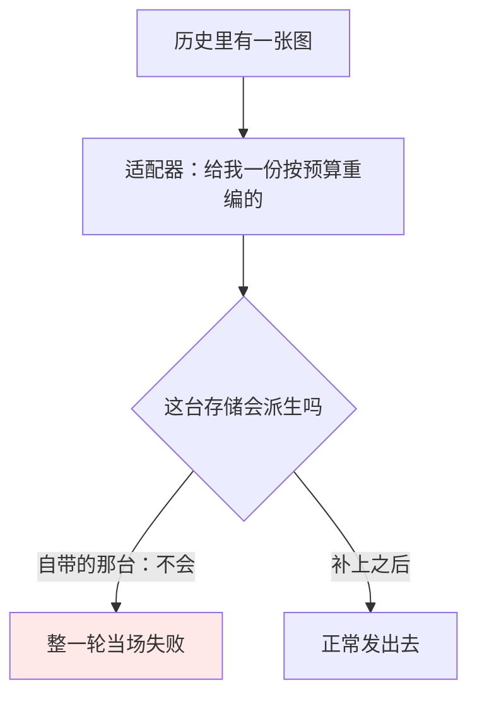

两条边界拼在一起的**净效果**是：本仓库自带的唯一一台图片存储，配上本仓库自带的唯一一条模型出口，**任何一轮只要历史里有图就必然失败**。开箱状态下多模态是走不通的——不是「挂不上后端」，是挂上了、图也存进去了、发的时候死。

补法是照被复刻那份实现的形状把派生这件事实现在自带存储上，三段：

| 这一段 | 做什么 | 为什么 |
|---|---|---|
| 快路 | 按预算算出来的尺寸就是原尺寸、字节数又在预算内，就把存下来的字节原样交出去 | 重编只会掉画质，而绝大多数截图和商品图本来就在预算里 |
| 阶梯 | 超了才重编。不带透明通道的走一组由高到低的质量档，带透明通道的保持无损、把像素预算依次砍半。第一个落进预算的就是结果，全都超了就交最小的那一份 | 全都超预算时报错的话，一张大图会让整轮谈话卡死 |
| 缓存 | 结果按一个覆盖「哪张图 + 哪条路由的预算 + 实际用的那套编码参数」的标识存下来 | 没有它，历史里每张图在**每一轮**都要重编一次 |

**一处必须写明的分歧**：被复刻的那份实现给带透明通道的图选的编码格式，Go 这边只有解码器、没有编码器。换成有损格式会给一张抠好底的商品图垫上一块黑。所以这里换成无损格式，也因此那组质量档对它没有意义，改成砍像素预算——**同一句话（在预算内尽量保住这张图），换一种说法**。

**证据**（同一条真会话，同一台真服务端，补之前与补之后）：

| | 一轮结束时日志里记的 |
|---|---|
| 补之前 | `error`：挂着的这台附件服务派生不出模型请求图 |
| 补之后 | `completed`，两轮都是（一张小图、一张超预算的大图） |

超预算那一张是 3000×2000。缓存里落下来的那份变体，用文件类型识别工具认出来是一张 2508×1672 的有损图，十万零八千字节——尺寸压进了四百万像素的预算、格式选对了（不带透明通道走有损）、字节数落在第一档就够、缓存也确实写下来了。四件事在一份产物上同时被证实。

**通用性检验**：换一个完全不相干的业务，只要它让用户传图给模型看，这两件事一个都躲不开。而且后一件不是「补一项新能力」——接缝上早就声明了派生这回事，自带的存储不实现它，等于那条声明是空的。**判两处都是通用缺口，都已补进本仓库。**

**一条部署观察，不是缺口**：这台部署上配的本地模型是纯文本的，图确实发到了它面前，它回答「我当前没有图像分析工具」。适配器这一侧是尽了责的——模型清单里若声明这台模型不收图，历史里出现图时它会明确拒掉；清单里声明了收图，它就照实发。换一台看得懂图的模型是部署选择，不是代码缺陷。

### 第 15 行：第七个真的缺口——事件上限**会**生效，只能靠猜一个大数（**已记录，未补**）

agent-lab 的日志是只追加的，一条都不删。运行时的持久化协调器上有一个每会话事件上限，而且**没有关闭开关**：填零走默认值（1000），填负数直接报错。

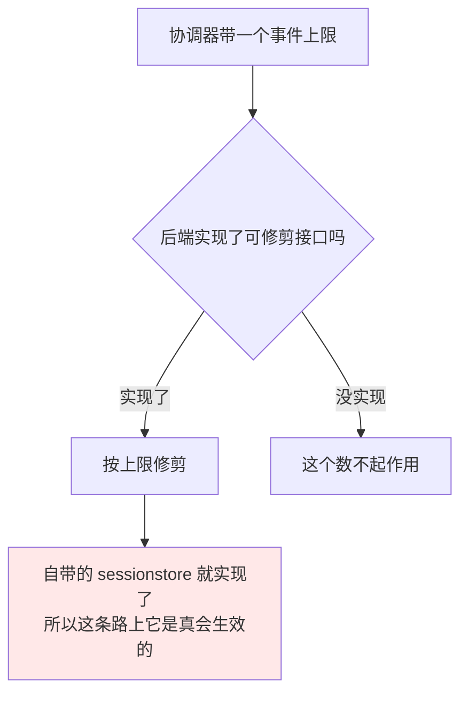

原先记的是「宿主的后端不实现这个接口即可」——那是在以为宿主要自己写后端的时候写的。**改用自带后端之后这条不再成立**：修剪会真的发生，靠的只能是把上限给得足够大。

原先这里挂着一句「等真跑一条完整创作流、量出一次会话用掉多少条事件之后再判」。**量出来了**——下面这四段是这台部署上真实存在的会话，直接数的落库行数：

| 会话 | 事件数 | 回合数 | 每回合 |
|---|---|---|---|
| 最长的那段 | **2399** | 11 | ≈ 218 |
| 第二段 | 1858 | — | — |
| 第三段（带图那段） | 1665 | — | — |
| 最短的那段 | 791 | — | — |

**四段里有三段超过 1000，最长那段是它的 2.4 倍。而这四段没有一段跑完了完整创作流**——它们只是聊了几轮。

数大得这么快是因为**流式增量是一等事件**：最长那段的 2399 条里，`assistant/chunk` 占 **2306** 条（96%），剩下 93 条才是回合、步骤、消息、工具、请求头那些。也就是说上限的分母不是「说了几句话」，是「模型吐了多少个字」。


**结论**：缺省值在这条路上不是一个保守的安全网，是一颗**在第五个回合就引爆的雷**——而它削掉的是最老那截，也就是这段对话开头那几句，刷新之后再也读不回来。

**判它是第七个真的缺口，但这一轮没补。** 一个「只追加、永不修剪」的诉求今天只能靠「给一个大到不会触发的数」来表达，不能显式声明——而「大到不会触发」是一个要靠猜的数，上面这组数字正说明它有多难猜。真要给它一个形状，那是在上限上加一档「不修剪」的显式取值（而不是把零重载成它——零现在是「走缺省」，改掉它会让所有现存装配的含义当场翻转）。**记在这里。**

接入方那侧的处置是**把这个数变成必填项**：留空当场拒绝装配，错误消息里说明留空会走缺省的 1000 条而那个数真会削日志。这是宿主自己的选择，不是运行时的行为——记在这里是因为它说明了这个缺省值的危险程度：一个接入方读懂它之后的第一反应是禁止部署方沿用它，**而事后量出来的数字证明这个反应是对的**。

### 第 7 行的另一面：两条更严的保证，运行时后端没有

宿主仓库里那批预备表比 `sessionstore` 严的地方有两处，记在这里作为「缺的是不是通用能力」的候选：

| 保证 | 那批预备表怎么做的 | `sessionstore` 有没有 |
|---|---|---|
| 事件行不可改 | 数据库触发器直接禁 UPDATE | 没有，靠调用方自律 |
| 删除要授权 | 另一张表里放一枚随机令牌，删完在同一事务里销毁 | 没有 |

原先这里挂着「等整条链路跑通再回头决定」。跑通了，**两条都判不补**，理由各不相同：

**事件行不可改：不补，但理由不是「不通用」。** 「事件日志是唯一权威事实」确实是这套运行时的硬前提，在存储层焊死它听起来正对。挡它的是另一件事：触发器是**方言私货**。`adapter/datastore` 同时支持 SQLite 和 Postgres，一道 `BEFORE UPDATE ... RAISE` 在两边的写法不一样，往后再多一种方言就再写一遍——而这道防线挡的是「本仓库自己写出一句 UPDATE」，那是一条测试就能挡住的事，不值得让方言层背上一笔按库分叉的负担。**记成一条部署方可以自己加的加固**：宿主在自己的迁移里建这道触发器，运行时不会因此有任何异样。

**删除要授权：不补，而且判它压根不该在这一层。** 那批预备表的做法是另一张表里放一枚随机令牌、删完在同一事务里销毁——那表达的是「谁有权删」，是一个**授权**问题。而 `Coordinator.Erase` 上那三道拦（后端能不能删、身份上有没有活会话、预留池里有没有人占着）表达的是「现在删安不安全」，是一个**一致性**问题。两者放在同一层会让存储去回答一个它没有信息回答的问题：这次请求是谁发的、他凭什么。**授权属于调用方**——本工程里它就落在 aiboys-go 的认证闸门上，运行时对此一个意见都没有，和它对整个传输层的态度一致。

### 传输层那一段：**运行时零改动，也零参与**

把这十一条 HTTP 路由接出来，运行时一行没改，也一行没用上——这是一个**正面**结论，不是一句「没什么可说的」。

两条出口，走的是两条完全不同的路：

| 出口 | 数据从哪来 | 运行时参与了吗 |
|---|---|---|
| `GET /v1/conversations/{id}/events` | `harness/session` 的事件观察者，会话每落一条日志事件回调一次 | 参与，就是第 5 行那条 |
| `POST /v1/conversations/{id}/creative-groups/{gid}/drive` | 宿主自己那个状态机的进展回调 | **完全不参与** |

第二条正是第 13 行和第 8/9/10 行判「不适用」的具体后果：九人群从头到尾不是一段 harness 会话，所以它的进展流也接不到运行时的观察者上，只能由宿主自己流。**这不是缺口**——一个通用运行时本来就不该知道「九个人轮流发言」这件事，更不该为它开一路事件。反过来说，如果这一段被迫要动运行时才接得出来，那才是它管太宽的证据。

同样的道理适用于整个传输层：状态码怎么分、SSE 帧长什么样、哪条路由该答 503、认证闸门放不放 GET，运行时对这些一个意见都没有，也不该有。**一个不介入传输层的运行时，接入方才有可能把它装进一台已经有自己 HTTP 约定的服务里**——本工程正是这种情况（aiboys-go 有既有的 problem+json、既有的认证闸门、既有的路由树）。

### 第 18 行：第六个真的缺口——会话建得起来，删不掉（**已补，补的是通用能力**）

原先这一行记的是「等九人群跑通、看清子 Agent 的归属关系之后再定形状」。跑通了，形状也清楚了，**已补**。

**症状是一句话：整套存储上没有「删」这个动作。**

| 那一层 | 有的写操作 | 有没有删一段会话 |
|---|---|---|
| `sessionstore.Store` | 建、追加、装载、勘察、按位置读、列举、准备 | 没有 |
| `persistence.Backend` | 批量追加、提交修复、按序号之前修剪 | 没有 |

**为什么修剪顶不上删除**：`TrimBefore` 弹掉的是一段会话**里面**最老那截事件，弹完那份存档还在、还答得出「下一条写在哪儿」，读的一侧靠 `StoredPrefix.BaseSeq` 认出前面没了。拿「弹到末尾」冒充删除，造出来的是一份**空存档**——而一份空存档在 `Backend.LoadStored` 眼里是一个合法的、还能接着写的会话。两件事共用一句 DELETE，「弹空了」和「不存在」就再也分不出来。

于是宿主只剩一条路：自己去动那两张表。而那意味着宿主要认识运行时的表结构和命名空间前缀——正是走这个成品后端本来要免掉的事。

**通用性检验**：换一个完全不相干的业务，只要它把会话存下来给人看，就一定会有人要删。删除是会话生命周期里和「建」对称的那一半，而「建」在这里是一等公民。**判它是通用缺口。**

补的是三层各一刀，都不认识任何业务：

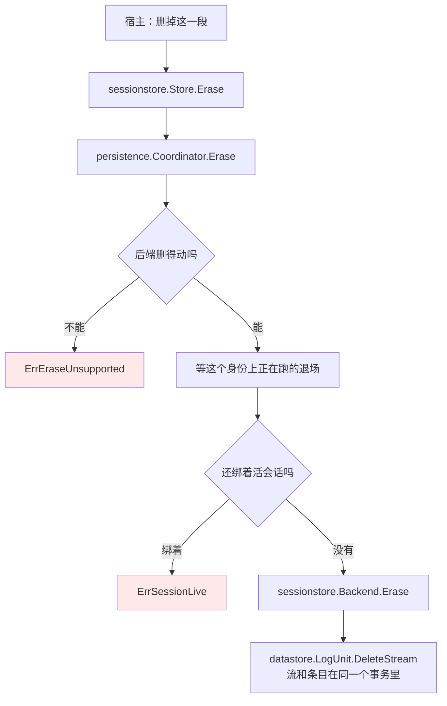

**这刀砍在哪，是被两条既有规矩逼出来的：**

- **删除是可选能力，不是服务面上的必修课。** 它落在 `persistence.ErasingBackend` 这道可选接口上（配套 `persistence.Erasable` 断言函数），和 `Seekable` / `Closable` / `Trimming` 一个形状。塞进人人都要实现的 `Backend`，等于逼一个只能追加的顺序介质写一个只会报错的方法。所以 `Store.Erase` 也**不在** `persistence.Store` 上。
- **「本来就没有」不当成幂等成功。** 三层一路返回 `ErrSessionNotFound`：调用方要靠它把「删掉了一份」和「本来就没有」分开，这两件事在使用方那一侧对应的是两句不同的话。（宿主可以自己把两者合并成一个 204——aiboys-go 就是这么答的，那是它的 HTTP 语义，不是运行时的。）

**三道拦的次序是要紧的**，这不是防御性编程，每一条都对应一种真会发生的写入：

1. 后端删不删得动——删不动**当场**报，不假装删过。
2. 这个身份上正在跑的退场先等完。退场自己也要占那把串行锁；赶在它前面删掉存档，那趟退场最后一次刷盘会把事件写回一个刚被删掉的身份上。
3. 准备池里有人独占着这一份就拒。那份预留手上攥着一个还没发布的会话，它一发布就照着自己的游标往下写。

删完这个身份就是全新的：同一个 `id` 重新建得起来。

**`DeleteStream` 那一刀有一处不肯偷懒**：外键上挂着 `ON DELETE CASCADE`，但那句级联在各方言上的开关不一样（SQLite 上默认关着）。所以条目自己再删一遍，不把正确性押在一个由连接串决定的设置上。

**证据**：`feature/persistence/coordinator_erase_test.go` 守着三道拦和「不实现就不许被断言成删得动」；`sessionstore` 侧守着 `ErasingBackend` 的满足关系与流不在时的错。接入方那侧另有一组表级用例（七张业务读模型表 + 一段旁观会话），验的是宿主自己那一半。

### 第 19 行：标题由宿主现推，够——但读路径只有「整份」和「后缀」两档

agent-lab 的会话列表上写的是**这段对话的第一句人话**，截到 30 个字。这个标题**从来不存**，每次列举现推。运行时这边够用，一行没改：`Coordinator.List` 拿头、`Session.Inspect` / `Coordinator.LoadStored` 拿整份日志，标题从日志里第一条用户消息现算。

**但头里没有它。** `sessionlog.SessionHeader` 上是版本、标识、建立时刻、分叉血统、seed 边界——第一句话和最后活跃时刻一个都不在。所以列一次表就要把每段会话的日志整份读一遍，只为了取头几条和末一条。


读路径上只有两档：整份（`Load` / `Inspect`）或一段后缀（`ReadFrom` / `LoadStoredFrom`）。**没有「头 N 条」这一档**，也没有「末 1 条」。

**判它不是缺口，是一笔认下的开销。** 理由有二：一是被复刻的那份实现自己也是每段会话跑一次关联子查询，量级相同；二是这条路上的会话数是单人单机的量级，真正的代价要到成千上万段才显出来。**记下来而不补**——补它要在读路径上再开一档接口，而现在没有一条真实需求能定死那一档该长什么样（是「头 N 条」还是「按类型找第一条」，这两个形状差很远）。

### 工具的失败语义：够，四态全在日志里

原先这一条挂在「待验的」上：工具报错时事件日志里留下什么，界面据此能不能还原出「执行中／正在停止／已停止／失败」四态。**查完了，够。**

前提是 `tools` 那条「**一切失败都是结果**」的规矩：工具炸了不往外抛，一律折成一份 `IsError` 为真的结果。所以**永远不会出现一条只有 `tool/call`、等不到 `tool/result` 的悬空调用**——那正是界面上最难处理的一种状态。

落库的 `tool/result` 上除了给模型看的那段文本，另有一份机器可读的身份：

```mermaid
flowchart TB
    A["tool/call 落了"] --> B{"tool/result 落了吗"}
    B -->|"没有"| S1["执行中"]
    B -->|"落了"| C{"IsError"}
    C -->|"假"| S2["已完成"]
    C -->|"真"| D{"Error.Code"}
    D -->|"ABORTED_BEFORE_DISPATCH"| S3["已停止：没派发出去"]
    D -->|"ABORTED"| S4["已停止：派发之后被打断"]
    D -->|"别的码，或没有码"| S5["失败"]
    style S3 fill:#fff4e5
    style S4 fill:#fff4e5
    style S5 fill:#ffe8e8
```

| 界面上的态 | 日志里靠什么认出来 |
|---|---|
| 执行中 | 有 `tool/call`，配对的 `tool/result` 还没落（按 `CallID` 配） |
| 正在停止 | **日志里没有** —— 它是「人按了停」到 `ABORTED` 落库之间的那一段，界面自己的瞬态 |
| 已停止 | `tool/result` 上 `Error.Code` 是 `ABORTED_BEFORE_DISPATCH`（还没派发就撤了）或 `ABORTED`（跑到一半被打断） |
| 失败 | `IsError` 为真而码是别的（`UNKNOWN_TOOL` / `INVALID_ARGS` / `INVALID_TOOL_OUTPUT`），或者**根本没有码** |

**「根本没有码」是有意的，不是漏了**：被执行前策略或守卫拦下的那一类，理由是策略现写的一句话，不是一个有身份的错误类，所以它只带一句 `Message`。界面这边把「有码的」和「没码的」都归到失败即可，两者对人的意思是一样的。

**「正在停止」在日志里没有对应事件，这不是缺口。** 那一段时间里运行时正在做的事就是「还没停下来」，它没有新东西可记；界面自己知道它发过停止请求，那个知识在界面那侧最完整。

**唯一的摩擦已经在前面记过**：`tool/result` 的内容块上没有工具名，只有调用标识，所以重放时要靠自己那张调用标识到工具名的表反查。这是形状上的别扭，不是能力缺失。

### 结构化输出：**第三个真的缺口**，形状已经清楚了

原先记的是「待定，等九人群那一段跑完再判」。跑完了，判为**缺口**。

数据：整个工程里走结构化输出的调用一共 **11 处**——八个主工具里的两个抽取工具、三个分镜生成工具，加上九人群里的成员发言和群主出分镜。**没有一处是靠模型自觉输出 JSON 的**，全部要 `strict: true` 的 schema 约束。

而 `llm` 这一层完全没有它的位置：

```mermaid
flowchart TB
    subgraph W["想表达的"]
        W1["这一次调用<br/>必须回一份符合这份 schema 的 JSON"]
    end
    subgraph H["llm 这一层有的字段"]
        H1["消息"]
        H2["工具清单"]
        H3["采样参数"]
        H4["……没有 schema 的位置"]
    end
    W1 -.->|"放不进去"| H
    W1 --> X["只好绕：<br/>适配器扩展字段归属表<br/>+ 把 schema 逐次挂在请求上下文上"]
    style X fill:#ffe8e8
```

**绕过去的代价**，三条都真实付过：

1. **schema 走的是上下文，不是参数。** 一次调用的 schema 挂在 `context.Context` 上，由归属表在组请求体那一刻取回来。这意味着**类型系统一点忙都帮不上**：忘了挂，调用照样发得出去，只是模型回一段散文，然后在解析那一步炸。
2. **每个宿主都要重写一遍这段绕法。** 归属表本身是通用机制（第 2 行那条，为 `chat_template_kwargs` 准备的），但「怎么用它来表达 response_format」是每个接入方各自发明的。两个接入方发明出来的形状不会一样。
3. **它是 OpenAI 兼容协议里的一等字段。** 不是某个服务端的私货——`response_format` 在协议文本里，和 `tools` 是同一级别的东西。工具在 `llm` 层有位置，它没有，这个不对称没有理由。

**通用性检验**：换一个完全不相干的业务，只要它想从模型手里拿一份结构化数据，就撞上同一件事。**判它是通用缺口**，形状是在 `llm` 的请求上开一个可选的输出 schema 字段，由各适配器决定怎么投影（OpenAI 兼容投成 `response_format`，不支持的服务端投成提示词约束或直接报不支持）。

**这一轮没有补。** 理由是补它要动 `llm` 这个契约包，而契约包一改，下游全部适配器和现有接入方都要跟着改。第七个缺口（事件上限）动的也是契约面。**两项攒到一处一次做完**，比在链路中途各插一刀安全——形状都已经定死，剩下的是动手。

### 第八个真的缺口：逐字的增量被当成日志内容存了下来（**已补，补的是通用能力**）

这一条不在表里的任何一行上，它是**量出来的**：把一段真实会话的日志按事件类型算字节，结果是

| 事件类型 | 条数 | 字节 | 占比 |
|---|---|---|---|
| `assistant/chunk` | 2306 | 324,692 | **89.1%** |
| `assistant/message`（拼好的整条） | 10 | 19,277 | 5.3% |
| 其余全部类型 | — | 20,574 | 5.6% |

2306 条分块里 **2245 条是纯增量**（文本 1513、推理 732），结构性的只有 61 条。也就是说：**日志的九成字节，是把同一批文字拆成一两个字一条又存了一遍**——那批文字在同一步骤的 `assistant/message` 里已经完整地存着。

流式的意义是让人看见过程，而不是让存储照着过程的粒度记账。**这两件事在原实现里没有分开**：每一个增量都走 `Session.Append`，于是「推给正看着的那一方」和「写进耐久日志」是同一个动作。

**为什么不能在落盘那一侧过滤。** 试过，走不通，理由在两处：

```mermaid
flowchart TB
    A["Session.commit()<br/>event.Seq = baseSeq + len(log)"] --> B["seq 是数组下标，不是流水号"]
    B --> C["存下来的日志有洞<br/>→ 续跑时重新发号<br/>→ 和已存在的 seq 撞车"]
    D["persistence.splitAt()<br/>index := at - events[0].Seq"] --> E["批次必须 seq 连续<br/>否则报「事件不连续」"]
    C --> F["结论：过滤只能放在追加口<br/>不进日志，也不占 seq"]
    E --> F
    style F fill:#e8f5e9
```

**补法是开第二条广播**，不是在事件广播上加一个标志位：挂在 `EventObserver` 上的是持久化、遥测、状态缓存这些「日志说什么就是什么」的消费方，混一条不进日志的事件进去，等于让它们各自记得判一次——漏判一处就是一份和重放对不上的状态。所以

- `harness/session.StreamObserver` + `Session.PublishLive` + `Store.OnStream`：只给现场的一条路，事件的 `Seq` 恒为 `session.LiveSeq`（-1），调用方靠它当场认出「这条不能当续传游标」；
- 判据用的是已有的 `llm.IsTokenDelta`，不新造一套。

**留在日志里的三样，逐条都有唯一的读者**，不是保守：

| 留什么 | 谁在读 | 为什么别处没有 |
|---|---|---|
| 每个步骤的**第一条**内容增量 | `feature/sessionstats/stats.go:220`、`feature/telemetry/coordinator.go:380` | 它是「这个步骤开始出字了」这个时刻的唯一载体 |
| `usage` / `finish` 分块 | `feature/tokenmeter/turnusage.go:276` | 一次失败或被中止的尝试照样计费，而它永远不会产出 `assistant/message` |
| 块的起止 | 表面投影 | 不带内容，本来就不是浪费的那一部分 |

`assistant/message` 因此不再回指分块（`SourceEventSeqs` 传 nil）。这是一条**本来就支持**的路，不是降级：`feature/tokenmeter/meter.go:499` 明写「没有来源清单就退回落进日志的那条消息的估价」，`sessionlog/surface.go:175` 也明许这个类型的来源清单为空。

**接入方那一侧要跟着改三处**，而且都是 Go 的编译期查不出来的：

1. 观察者要**两条都挂**，否则界面上不再逐字出字；
2. SSE 帧对现场那条**不发 `id:`**——SSE 规定没有 id 的帧不动 last-event-id，发了会让断线重连从一个不存在的位置接上；
3. 浏览器那一侧不能再按 seq 去重和排序——所有现场事件都是 -1，按 seq 去重会只留下第一条，按 seq 排序会把它们全扫到对话最前面。

**通用性检验**：换一个完全不相干的业务，只要它把模型的输出流给人看，就会遇到同一件事——而且它多半和这次一样，是在存储涨起来之后才发现的。**判它是通用缺口，已补。** 顺带说清一件事：`sessionlog/chunkrow.go` 那条按游程压缩分块的路径没有动，它现在面向的是外部录下来的、每一块都在的日志。

### 第九个真的缺口：一个打转的模型没有任何东西能让它停下来（**已补，补的是通用能力**）

这一条也不在表里的任何一行上，它是**撞出来的**：一轮对话里 `analyze_product` 被连着调了三次，每次都把整张商品卡重写一遍，而卡片从第一次之后就没再变过。

顺着往下看，发现拦它的东西一个都不存在：

```mermaid
flowchart TB
    A["agentturn.go 那条循环<br/>for { ... }"] --> B{"什么时候出去？"}
    B -->|"唯一的出口"| C["模型这一步不再要工具"]
    B -.->|"没有"| D["步数上限"]
    B -.->|"没有"| E["工具调用次数上限"]
    C --> F["也就是说：**停不停由模型说了算**"]
    F --> G["模型打转时的实际边界<br/>= 上下文撑爆 / max_tokens 用完"]
    style D fill:#ffe8e8
    style E fill:#ffe8e8
    style G fill:#ffe8e8
```

**「靠上下文撑爆停下来」不是一道边界，是一次事故。** 它停下来的方式是报错，不是收场；停下来之前那些调用已经全部发出去、全部计过费了。

**agent-lab 那边有两道，都不在这个位置上。**

| 它有什么 | 挡的是什么 | 谁写的 |
|---|---|---|
| `recursion_limit = 25` | 整张图跑多少步 | LangGraph 的框架默认值，agent-lab 一行都没配 |
| `graph/search_budget.py` 的 `MAX_SEARCH_PER_TURN = 3` | **只有 `web_search`** 一件工具，每轮总量 | agent-lab 自己写的 |

第一道是框架白送的，第二道是**为一件工具手写的一段业务代码**——它连拦下来之后要回一条 `status="error"` 的 `ToolMessage`（模型才知道「不是没搜到，是不让搜了」）都得自己想。换一件工具要拦，这段得再写一遍。

**这一侧原先有半件东西，而那半件没接上。** `feature/guard/repeattoolreminder` 早就移植过来了，它数连续调用、到第 3/5/8 次往结果后面缀一句提醒。两个问题：

1. **它只是劝**，PostRule，调用照发不误；
2. **它那条断链线一次都没被挂上过**——`grep -rn "InstallStepNotice"` 在整个仓库里除了它自己和它的测试之外，一个调用方都没有。也就是说，用户插了话它也不清零，那句提醒只会越攒越拧巴。

补的是两件事：

```mermaid
flowchart LR
    subgraph B["补之前"]
        B1["repeattoolreminder<br/>（劝告，PostRule）"] --> B2["调用照发"]
        B3["断链线<br/>InstallStepNotice"] -.->|"没人挂"| B4["用户插话也不清零"]
    end
    subgraph A["补之后"]
        A1["repeattoolreminder<br/>（劝，第 3/5/8 次）"] --> A2["repeattoolcap<br/>（拦，PreRule）"]
        A2 -->|"到顶"| A3["PreDeny，执行体一行不跑"]
        A4["两条断链线都挂上了"]
    end
    style B2 fill:#ffe8e8
    style B4 fill:#ffe8e8
    style A3 fill:#e8f5e9
```

新的那一层是 `feature/guard/repeattoolcap`，形状上刻意做窄：

- **只认工具名，不认参数。** 没有通配符，没有前缀匹配。一件工具的上限是接入方一次明确的决定，不是从一条规则里继承来的。
- **默认什么都不限。** 空配置等于这一层不存在。同一件工具连着调很多次经常是对的——分页、轮询、按顺序写十个文件——所以给一个默认上限等于默认误伤。
- **拒绝那句话要说三件事**：撞了什么上限、再调还是会被拦、现在该干什么（用手上的结果回答 / 换一件工具 / 说清还缺什么）。只说「被拒绝了」的话，模型下一步多半是原样再调一次。
- **没配上限的工具是透明的**，既不计数也不清零。这是有意的：否则模型中间插一次 `todo_write` 就能把闸门甩掉，而一道能被这么便宜绕过去的闸门等于没有。代价是这里数的「连续」比字面意思宽。
- **没有「结果不一样就清零」。** 一次成功和一次失败在这一层眼里没有区别——判断这次结果算不算进展是模型的事。

**劝和拦为什么都要留着。** 劝那一层管的是绝大多数情况：模型自己收手，一次调用都没被浪费掉，而且它不需要接入方事先猜一个数。拦那一层管的是劝不动的那种，它的存在本身让「上限」这个词有意义。去掉任何一层，剩下的那层都得兼职它不擅长的事。

**为什么不放在提示词里。** 试过——`analyze_product` 的工具说明里当时明写着「没有次数限制，可以重复使用」，改掉它之后行为是好了一些，但那只是把一句话换成另一句话：说明里写什么都是**建议**，模型采不采纳这一层管不着。而且写了字面上的限制而运行时不执行，比不写更糟：模型学到的是这里的数字可以不当真。所以两边都动了——说明里那句自相矛盾的话删掉，同时让运行时真的拦得住。

**通用性检验**：换一个完全不相干的业务，只要它让模型自己决定调什么工具，就撞得上同一件事；而且它撞上的形态多半和这次一样——不是崩，是账单和延迟悄悄涨上去，等有人去数调用次数的时候才发现。**判它是通用缺口，已补。**

## 这次验证的答案

**表填满了。** 二十行（十九个编号，第 11 行分成两半），每一行的「够不够」都有答案。

```mermaid
flowchart LR
    T["20 行"] --> A["够：11 行"]
    T --> B["不适用：6 行"]
    T --> C["不够：3 行"]
    style A fill:#e8f5e9
    style C fill:#fff4e5
```

「不够」只有三行，但缺口不止三个：第 1 个（持久化挂不上）撞在第 7 行的**路上**而不是结论里，第 3 个（结构化输出）和第 7 个（事件上限）也各自在别处露头，第 8 个（逐字增量落盘）和第 9 个（没有步数上限）**根本不在表上**——一个是量存储字节量出来的，一个是被一次连调三遍撞出来的。逐个列在下面。

### 九个缺口

| # | 缺口 | 补了吗 | 补在哪 |
|---|---|---|---|
| 1 | 持久化在装配外面挂不上，会话写得下去却永远 `Resume` 不了 | **已补** | `harness.Options.Persistence` 时机钩子 |
| 2 | 装上去的工具从来没报给模型 | **已补**（这是个 bug） | `harness/agentloop` 构造函数里把工具运行时接到系统提示词注册表上 |
| 3 | `llm` 这一层没有输出 schema 的位置 | 未补 | 形状已定：请求上开一个可选字段，各适配器自己投影 |
| 4 | 图片存储的接缝要一整台文件系统，实际只用四个方法 | **已补** | 按「接口定义在使用方」收窄成四个方法 |
| 5 | 自带的图片存储不会派生模型请求图，历史里有图就必然失败 | **已补** | 快路 + 阶梯 + 缓存三段 |
| 6 | 会话建得起来，删不掉 | **已补** | `datastore.LogUnit.DeleteStream` / `persistence.ErasingBackend` + `Coordinator.Erase` / `sessionstore` 两层 `Erase` |
| 7 | 事件上限没有「不修剪」这一档，只能靠给一个猜出来的大数 | 未补 | 形状已定：上限上加一档显式取值 |
| 8 | 逐字的流式增量当成日志内容存下来，占掉 89% 的字节 | **已补** | `harness/session.StreamObserver` / `Session.PublishLive` / `Store.OnStream` 这条只给现场的广播 |
| 9 | agent 循环没有步数上限，一个打转的模型只能靠撑爆上下文停下 | **已补** | `feature/guard/repeattoolcap`（闸门）＋ `repeattoolreminder.InstallStepNotice`（那条一直没接的断链线） |

两项未补都是同一个理由：**动的是契约面，改一次全部下游跟着改**，该攒到一处一次做完，不该在中途插刀。

### 有没有为了让表变绿而塞私货

**没有。** 九个缺口逐条过一遍那条判定线（换一个完全不相干的业务，这个东西还需要吗）：

- 「让会话在进程重启后续着跑」「装上的工具要报给模型」「删掉一段会话」「让用户传图给模型看」「别把同一句话拆成一两个字存两遍」「别让一个打转的模型无限调下去」——**没有一条与带货视频有关**，任何一个宿主做任何一件事都撞得上。
- 补进来的东西也没有让运行时认识任何一种业务：一个时机钩子、一句接线、一次接口收窄、一段图像重编、一条删除路径、一条只给现场看的广播、一层按工具名计数的闸门。**运行时里搜不到一个 agent-lab 的名词。**
- 第 9 个最容易塞私货，因为它是从一件具体工具（`analyze_product` 连调三次）上撞出来的。所以那一层刻意不认参数、不认结果、不带任何默认值：**上限全部由接入方在配置文件里逐条写明**，运行时不知道也不猜哪件工具该限几次。真正与业务有关的那两个数字（`analyze_product: 2` 之类）落在 `aiboys-go` 的配置里，一个都没进运行时。

反过来最有说服力的是那 6 行**不适用**：九人讨论群（第 8/9/10 行）、群聊压缩（第 13 行）、静态资料与裁决规则（第 16/17 行）——它们全都落在宿主侧，一行都没往运行时里塞。其中第 8/9/10 行原先答的是「`feature/agentteam` 够」，**顶到实现之后发现那是照界面推的，不是照代码推的**，改判不适用。这是这次验证方法本身的一个教训，也写在那一节里。

### 顺带修掉的两处文档事实错误

| 在哪 | 原先写着 | 实情 |
|---|---|---|
| `docs/embedding.md:436` | 运行时「没有内置的生产会话持久化后端」 | `adapter/datastore/sessionstore` 就在仓库里，四个接缝全填 |
| 本文第 5 行那一节 | 「思考过程只走 SSE，不入库」 | 当时：`sessionlog` 里有 `reasoning-chunks`，推理内容和正文一样耐久。**改完第 8 个缺口之后又反了回去**——现在它确实只走现场，但那是被改成这样的，不是本来就这样 |

两处都不是笔误：第一处让接入方一度打算把宿主仓库里三千多行预备代码改造成存储后端；第二处会让接入方把「刷新后思考不再出现」当成运行时的行为，而它其实是宿主的重放策略。**一句错的陈述句盖住一个缺口，比没有文档更难发现**——第 1 个缺口是这么被盖住的，第 8 个也是：正因为文档一度声称增量不入库，「它入库入得对不对」这个问题就没人问。
